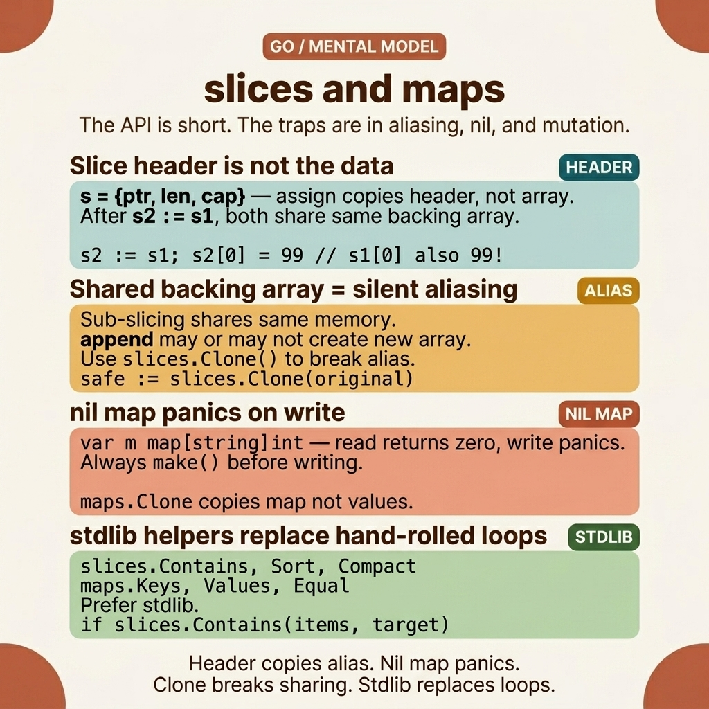

<!-- tags: golang, packages, data-structures --> # 📦 Slices & Maps — Hàm tích hợp & Package `slices` / `maps` > Hướng dẫn toàn diện về các hàm tích hợp cho slices và maps : `append` , `copy` , `delete` , `clear` , cùng với Go 1.21+ packages `slices` và `maps` .

📅 Đã tạo: 23-03-2026 · 🔄 Đã cập nhật: 19-04-2026 · ⏱️ 18 phút đọc

| Khía cạnh | Chi tiết |
| ------------ | ------------------------------------------------------------------ |
| **Tích hợp** | `append` , `copy` , `delete` , `clear` , `len` , `cap` , `make` |
| ** Packages ** | `slices` ( Go 1.21+), `maps` ( Go 1.21+) |
| **Trường hợp sử dụng** | Các thao tác CRUD, sắp xếp, tìm kiếm, chuyển đổi |
| **Quy tắc chính** | `append` có thể tạo slice mới — luôn gán lại |

---

## 1. ĐỊNH NGHĨA Go 1.21 đã giới thiệu `slices.Contains()` , `slices.Sort()` , `maps.Keys()` — cuối cùng đã loại bỏ nhu cầu cuộn thủ công các chức năng tiện ích cho các thao tác cơ bản. Nhưng bề mặt API rộng hơn không có nghĩa là tính chính xác dễ dàng hơn: `slices.Delete()` sửa đổi slice tại chỗ nhưng trả về một slice mới và `maps.Keys()` không đảm bảo về thứ tự.

> *Bạn vừa triển khai một API mới. Nhật ký sản xuất đọc: `index out of range [5] with length 3` . Máy chủ gặp sự cố, trả lại 500 cho mọi khách hàng. Bạn mở mã và tìm thấy `data := users[2:5]` — một phụ- slice tham chiếu đến một array cơ bản mà `append` trong goroutine khác đã bị thu nhỏ. Hai dòng mã trông hoàn toàn vô hại đang âm thầm chia sẻ bộ nhớ mà bạn chưa từng biết đến.*
>
> *A slice trong Go không phải là array — nó là **chế độ xem** vào array bên dưới. `append` có thể phân bổ một array hoàn toàn mới hoặc ghi đè lên cái hiện có tùy theo dung lượng. Trong khi đó, Maps cố tình ngẫu nhiên hóa thứ tự lặp lại - không phải là lỗi, mà là cách Go buộc bạn không bao giờ phụ thuộc vào trình tự truyền tải. Hiểu nhầm hai cấu trúc dữ liệu này là nguồn lỗi sản xuất phổ biến nhất trong Go .*

### Các hàm tích hợp cho Slices | Chức năng | Signature | Mô tả |
| -------- | ------------------------------- | --------------------------------- |
| `make` | `make([]T, len, cap)` | Tạo slice với len và dung lượng |
| `append` | `append(s []T, elems ...T) []T` | Thêm phần tử, có thể phân bổ lại |
| `copy` | `copy(dst, src []T) int` | Sao chép phần tử, trả về số lượng đã sao chép |
| `len` | `len(s []T) int` | Số phần tử hiện tại |
| `cap` | `cap(s []T) int` | Dung lượng (bộ nhớ được cấp phát) |
| `clear` | `clear(s []T)` ( Go 1.21+) | Đặt tất cả các phần tử về giá trị 0 |

### Các hàm tích hợp cho Maps | Chức năng | Signature | Mô tả |
| -------- | ----------------------------- | --------------------------------- |
| `make` | `make(map[K]V, hint)` | Tạo map , gợi ý = kích thước dự kiến ​​|
| `delete` | `delete(m map[K]V, key K)` | Xóa chìa khóa; không hoạt động nếu thiếu chìa khóa |
| `len` | `len(m map[K]V) int` | Số cặp khóa-giá trị |
| `clear` | `clear(m map[K]V)` ( Go 1.21+) | Xóa tất cả các mục |

### Package `slices` ( Go 1.21+)

| Chức năng | Mô tả |
| ----------------- | ------------------------------ |
| `slices.Sort` | Sắp xếp slice tại chỗ |
| `slices.SortFunc` | Sắp xếp bằng bộ so sánh tùy chỉnh |
| `slices.Contains` | Kiểm tra xem phần tử có tồn tại không |
| `slices.Index` | Tìm chỉ số của phần tử |
| `slices.Delete` | Xóa các phần tử theo phạm vi |
| `slices.Insert` | Chèn phần tử vào vị trí |
| `slices.Compact` | Xóa các bản sao liên tiếp |
| `slices.Reverse` | Đảo ngược slice tại chỗ |
| `slices.Clip` | Giảm dung lượng theo chiều dài |

---

Các thao tác trên trông có vẻ đơn giản trên giấy tờ. Phần có nhiều khả năng đánh lừa bạn nhất là cách trạng thái thực sự biến đổi tại runtime . Hình ảnh bên dưới đưa những cơ chế ẩn đó vào một mô hình tinh thần mà bạn nên ghi nhớ mỗi time khi gỡ lỗi một vấn đề về bộ nhớ.

## 2. HÌNH ẢNH

Chủ đề này rất dễ bị đánh giá sai vì bề mặt API quá nhỏ. Nó trông giống như một số thao tác cơ bản, nhưng các lỗi thực sự lại bùng phát ở điểm giao nhau của bí danh, ngữ nghĩa nil và ranh giới đột biến. Hình ảnh bên dưới hiển thị chính xác ba điểm áp lực đó.  *Hình: Thẻ mô hình trí tuệ kết hợp bốn thứ bạn cần ghi nhớ đồng thời trong đầu khi làm việc với slices và maps : tiêu đề slice , hỗ trợ chia sẻ array , nil - map ngữ nghĩa và vai trò thực tế của `slices` / `maps` packages .*

Với những ranh giới đó hiện đã hiển thị, mã bên dưới sẽ đọc rất khác: bạn sẽ không chỉ xem từng chức năng làm gì mà còn xem liệu thao tác đó có âm thầm giữ bí danh hay mở đường dẫn cho người gọi làm hỏng dữ liệu hay không.

## 3. MÃ

Với map của các hoạt động thu thập được trình bày trong ** Slices & Maps **, time là đưa nó xuống mã - để xem mỗi lựa chọn ( `append` so với `slices.Concat` , thủ công `delete` so với `slices.Delete` , raw map lặp so với [[[C7]] ) thực sự làm thay đổi độ rõ ràng và an toàn của API.

### Ví dụ 1: Cơ bản — Các thao tác Slice & Map tích hợp

Bạn có một danh sách người dùng và cần: thêm người dùng mới ( `append` ), xóa người dùng theo chỉ mục và sao chép danh sách để sao lưu. Slices và maps là hai cấu trúc dữ liệu bạn sử dụng nhiều nhất trong Go — nhưng chúng có kèm theo lỗi: `append` không thể sửa đổi bản gốc slice và `delete` trên map không panic nếu thiếu khóa.

Hiểu các hoạt động tích hợp ( `make` , `append` , `copy` , `delete` , `len` , `cap` ) là nền tảng cho mọi việc bạn làm với dữ liệu trong Go .

Đầu vào: `append([]int{1,2}, 3)` · Đầu ra: `[1, 2, 3]````go
package main

import "fmt"

func main() {
	// ━━━━━ Slice basics ━━━━━
	s := make([]int, 0, 5)
	fmt.Printf("len=%d cap=%d %v\n", len(s), cap(s), s) // len=0 cap=5 []

	// ✅ Append — always reassign because append may create a new slice
	s = append(s, 1, 2, 3)
	fmt.Println(s) // [1 2 3]

	// Append another slice
	more := []int{4, 5, 6}
	s = append(s, more...) // ✅ Spread operator
	fmt.Println(s)          // [1 2 3 4 5 6]

	// ━━━━━ Copy ━━━━━
	src := []int{10, 20, 30}
	dst := make([]int, len(src))
	n := copy(dst, src)
	fmt.Printf("Copied %d items: %v\n", n, dst) // Copied 3 items: [10 20 30]

	// ⚠️ Copy only copies min(len(dst), len(src)) items
	small := make([]int, 2)
	copy(small, src)
	fmt.Println(small) // [10 20] — only 2 items

	// ━━━━━ Slice expressions ━━━━━
	a := []int{0, 1, 2, 3, 4, 5}
	fmt.Println(a[2:4])   // [2 3]     — from index 2 to 3
	fmt.Println(a[:3])    // [0 1 2]   — first 3
	fmt.Println(a[3:])    // [3 4 5]   — from index 3

	// ━━━━━ Map basics ━━━━━
	m := map[string]int{
		"go":     1,
		"python": 2,
		"rust":   3,
	}

	// Access
	fmt.Println(m["go"])            // 1

	// ✅ Comma-ok pattern — check whether key exists
	val, ok := m["java"]
	fmt.Printf("val=%d, exists=%v\n", val, ok) // val=0, exists=false

	// Delete
	delete(m, "python")
	fmt.Println(len(m)) // 2

	// ✅ Clear (Go 1.21+) — remove all entries, keep map
	clear(m)
	fmt.Println(len(m)) // 0
}
```> Khi `len == cap` , không còn chỗ trống trong array bên dưới. `append` phân bổ array mới (thường có dung lượng 2×), sao chép dữ liệu cũ và thêm phần tử mới. Giá trị trả về là tiêu đề slice mới trỏ đến array mới - nếu bạn không gán lại ( `s = append(s, v)` ), bạn sẽ mất tham chiếu.

> **Takeaway**: Luôn luôn `s = append(s, v)` . Sử dụng thành ngữ dấu phẩy-ok `val, ok := m[key]` để kiểm tra sự tồn tại của khóa một cách an toàn. `clear()` ( Go 1.21+) đặt lại bộ sưu tập trong khi vẫn giữ lại bộ nhớ được phân bổ. `copy` chỉ chuyển `min(len(dst), len(src))` mục.

Những thao tác cơ bản đó là đủ cho logic đơn giản. Nhưng các vòng lặp viết tay để tìm kiếm, sắp xếp hoặc xóa phạm vi rất dễ bị hỏng ở các cạnh - đó chính xác là lý do tại sao Go 1.21 đã kéo generic `slices` và `maps` packages vào thư viện chuẩn.

### Ví dụ 2: Trung cấp — Package `slices` ( Go 1.21+)

Trước Go 1.21, việc sắp xếp slice bắt buộc `sort.Slice(s, func(i, j int) bool {...})` — dài dòng và không dài generic . Tìm một phần tử có nghĩa là viết một vòng lặp. So sánh hai slices có nghĩa là lặp lại từng phần tử. Package `slices` ( Go 1.21+) cung cấp các hàm generic : `slices.Sort` , `slices.Contains` , `slices.Equal` , `slices.Compact` — an toàn kiểu, ngắn gọn và thường nhanh hơn mã viết tay.

Đầu vào: `slices.Contains([]string{"a","b","c"}, "b")` · Đầu ra: `true````go
package main

import (
	"cmp"
	"fmt"
	"slices"
)

func main() {
	// ━━━━━ Sort ━━━━━
	nums := []int{5, 3, 8, 1, 9, 2}
	slices.Sort(nums)
	fmt.Println(nums) // [1 2 3 5 8 9]

	// SortFunc — custom comparator
	type User struct {
		Name string
		Age  int
	}
	users := []User{
		{"Charlie", 30},
		{"Alice", 25},
		{"Bob", 28},
	}
	slices.SortFunc(users, func(a, b User) int {
		return cmp.Compare(a.Age, b.Age) // ✅ cmp.Compare for type-safe comparison
	})
	fmt.Println(users)
	// [{Alice 25} {Bob 28} {Charlie 30}]

	// ━━━━━ Search ━━━━━
	names := []string{"Alice", "Bob", "Charlie", "David"}
	fmt.Println(slices.Contains(names, "Bob"))    // true
	fmt.Println(slices.Contains(names, "Eve"))    // false
	fmt.Println(slices.Index(names, "Charlie"))   // 2
	fmt.Println(slices.Index(names, "Eve"))       // -1

	// ━━━━━ Insert / Delete ━━━━━
	s := []int{1, 2, 5, 6}

	// Insert at index 2
	s = slices.Insert(s, 2, 3, 4)
	fmt.Println(s) // [1 2 3 4 5 6]

	// Delete range [1, 3) — removes indices 1 and 2
	s = slices.Delete(s, 1, 3)
	fmt.Println(s) // [1 4 5 6]

	// ━━━━━ Compact — remove consecutive duplicates ━━━━━
	dup := []int{1, 1, 2, 2, 2, 3, 3, 1}
	dup = slices.Compact(dup)
	fmt.Println(dup) // [1 2 3 1] — only consecutive dups removed

	// ✅ For unique values: sort first, then compact
	all := []int{3, 1, 4, 1, 5, 9, 2, 6, 5, 3}
	slices.Sort(all)
	all = slices.Compact(all)
	fmt.Println(all) // [1 2 3 4 5 6 9]

	// ━━━━━ Other utilities ━━━━━
	r := []int{1, 2, 3, 4, 5}
	slices.Reverse(r)
	fmt.Println(r) // [5 4 3 2 1]

	fmt.Println(slices.Min([]int{5, 2, 8, 1})) // 1
	fmt.Println(slices.Max([]int{5, 2, 8, 1})) // 8
}
```> `sort.Slice` sử dụng `interface{}` + phản chiếu — chậm hơn. `slices.Sort` sử dụng generics — loại an toàn, không phản xạ, nhanh hơn ~30%. `slices.SortFunc` + `cmp.Compare` cung cấp một bộ so sánh tùy chỉnh an toàn hơn so với thủ công `if a < b return -1` .

> **Bài học rút ra**: Sử dụng `slices.Contains` / `Index` để tìm kiếm, `slices.Delete` để xóa phạm vi, Sắp xếp + Thu gọn để có các giá trị duy nhất. `slices.Reverse` hoạt động tại chỗ. `slices.Min` / `Max` bao gồm các loại comparable . `slices` package xử lý tốt thế giới array một chiều. Nhưng vấn đề gai góc nhất nằm ở lãnh thổ map - nơi các hệ thống yêu cầu hợp nhất cấu hình, sao chép dữ liệu bị cô lập và tổng hợp theo nhóm cũng như nơi các bản sao nông bất cẩn tạo ra các lỗi thầm lặng. Đó là mục đích mà `maps` package được tạo ra.

### Ví dụ 3: Nâng cao — Package `maps` & Mẫu trong thế giới thực

Bạn có cấu hình map và cần: hợp nhất các giá trị mặc định với phần ghi đè của người dùng, sao chép map để tránh trạng thái chia sẻ và thu thập tất cả các khóa cho đầu ra được sắp xếp. Trước Go 1.21, mỗi thao tác này đều yêu cầu các hàm tiện ích viết tay. Package `maps` ( Go 1.21+) cung cấp `maps.Clone` , `maps.Copy` , `maps.Keys` , `maps.Values` , `maps.Equal` — loại bỏ bản mẫu và tránh các lỗi phổ biến như sao chép nông và nhầm lẫn bản sao sâu.

Đầu vào: `maps.Clone(map[string]int{"a": 1})` · Đầu ra: bản sao độc lập; sửa đổi nó không ảnh hưởng đến bản gốc```go
package main

import (
	"fmt"
	"maps"
	"slices"
)

func main() {
	// ━━━━━ maps.Keys / maps.Values ━━━━━
	inventory := map[string]int{
		"laptop":   5,
		"mouse":    50,
		"keyboard": 30,
	}

	// ✅ Get sorted keys
	keys := slices.Sorted(maps.Keys(inventory))
	fmt.Println("Products:", keys) // [keyboard laptop mouse]

	values := slices.Collect(maps.Values(inventory))
	fmt.Println("Counts:", values)

	// ━━━━━ maps.Clone — shallow copy ━━━━━
	clone := maps.Clone(inventory)
	clone["laptop"] = 10 // ✅ Does not affect original
	fmt.Println("Original:", inventory["laptop"]) // 5
	fmt.Println("Clone:", clone["laptop"])         // 10

	// ━━━━━ maps.Equal — compare maps ━━━━━
	m1 := map[string]int{"a": 1, "b": 2}
	m2 := map[string]int{"a": 1, "b": 2}
	m3 := map[string]int{"a": 1, "b": 3}
	fmt.Println(maps.Equal(m1, m2)) // true
	fmt.Println(maps.Equal(m1, m3)) // false

	// ━━━━━ maps.Copy — merge maps ━━━━━
	defaults := map[string]string{
		"host":    "localhost",
		"port":    "8080",
		"mode":    "debug",
	}
	overrides := map[string]string{
		"port":    "3000",
		"mode":    "production",
	}
	// ✅ Copy overrides into defaults — overrides win
	maps.Copy(defaults, overrides)
	fmt.Println(defaults)
	// map[host:localhost mode:production port:3000]

	// ━━━━━ Pattern: Group by ━━━━━
	type Item struct {
		Name     string
		Category string
	}
	items := []Item{
		{"Go", "language"},
		{"Python", "language"},
		{"Docker", "tool"},
		{"Rust", "language"},
		{"K8s", "tool"},
	}

	grouped := make(map[string][]Item)
	for _, item := range items {
		grouped[item.Category] = append(grouped[item.Category], item)
	}
	for cat, group := range grouped {
		fmt.Printf("%s: %d items\n", cat, len(group))
	}

	// ━━━━━ Pattern: Frequency counter ━━━━━
	text := "go is great and go is fast"
	freq := make(map[string]int)
	for _, word := range []string{"go", "is", "great", "and", "go", "is", "fast"} {
		freq[word]++
	}
	fmt.Println(freq)
	// map[and:1 fast:1 go:2 great:1 is:2]
	_ = text
}
```> **Tại sao `maps.Copy` ghi đè lên khóa?**
> `maps.Copy(dst, src)` sao chép tất cả các cặp khóa-giá trị từ `src` vào `dst` . Nếu một phím va chạm, src sẽ thắng. Đây là mẫu hợp nhất: mặc định + ghi đè. `maps.Clone` tạo ra một bản sao nông — maps / slices lồng nhau vẫn chia sẻ các tham chiếu. `maps.Equal` thực hiện đẳng thức sâu O(n) trên các giá trị map .

> **Takeaway**: `maps.Clone` cho bản sao nông, `maps.Copy` để hợp nhất/ghi đè. Mẫu theo nhóm: `map[key][]Item` + `append` . Bộ đếm tần số: `map[key]int` + `++` .

---

## 4. Cạm bẫy

Các cơ chế chính xác đã có trong tay. Điều còn lại là nhận ra những điểm mà mã trông _gần như đúng_ nhưng âm thầm tạo ra lỗi đột biến slice hoặc vấn đề đặt hàng map ngay trong quá trình sản xuất.

| # | Mức độ nghiêm trọng | Lỗi | Hậu quả | Sửa chữa |
|---|----------|------|-------------|------|
| 1 | 🔴 Gây tử vong | Không gán lại `append` — `append(s, v)` làm mất dữ liệu | Mất dữ liệu | Luôn `s = append(s, v)` |
| 2 | 🔴 Gây tử vong | Đồng thời map đọc+ghi → panic | Runtime sự cố | `sync.RWMutex` hoặc `sync.Map` |
| 3 | 🔴 Gây tử vong | Nil map viết → panic | Runtime sự cố | `make(map[K]V)` hoặc theo nghĩa đen `map[K]V{}` |
| 4 | 🟡 Chung | Slice cổ phiếu cơ bản array | Sửa đổi phụ slice ảnh hưởng đến bản gốc | `slices.Clone()` hoặc `copy()` |
| 5 | 🟡 Chung | Lặp lại + xóa slice → bỏ qua các phần tử | Lỗi logic | Lặp lại ngược lại hoặc sử dụng `slices.DeleteFunc` |

### 🔴 Cạm bẫy #1 — Nối thêm dữ liệu đang âm thầm nuốt chửng

Mã này biên dịch, chạy và trông hoàn toàn chính xác:```go
func addItem(items []int, val int) {
    append(items, val) // ← looks reasonable, but data is lost
}
````append` trả về **mới** slice (có khả năng trỏ đến array mới nếu dung lượng đã đầy). Nếu bạn không gán lại `items = append(items, val)` , giá trị mới sẽ bị loại bỏ. Trình biên dịch Go không đưa ra cảnh báo - đây là lỗi logic thuần túy. Tồi tệ hơn: nếu dung lượng vẫn còn, `append` ghi vào array ban đầu nhưng slice của tiêu đề `len` không được cập nhật - dữ liệu tồn tại nhưng vô hình.

**Khắc phục**: Luôn `s = append(s, v)` . Nếu bạn cần sửa đổi slice bên trong một hàm: trả về slice mới hoặc sử dụng `*[]T` .

### 🔴 Cạm bẫy #2 — Map sự cố đồng thời mà bạn không thể tái tạo Maps trong Go **không phải là thread -safe**. Hai goroutines đọc và ghi cùng một map kích hoạt một runtime panic (không phải một cuộc chạy đua dữ liệu — Go runtime **cố ý gặp sự cố** thông qua phát hiện [[E19]]] đồng thời):```go
m := map[string]int{}
go func() { m["a"] = 1 }()
go func() { _ = m["a"] }()
// fatal error: concurrent map read and map write
```Lỗi này không ổn định — nó chỉ xuất hiện khi bộ lập lịch xen kẽ vào đúng thời điểm. Vượt qua các bài kiểm tra, vượt qua giai đoạn, sự cố trong quá trình sản xuất. Sử dụng `sync.RWMutex` để truy cập đồng thời hoặc `sync.Map` cho khối lượng công việc đọc nhiều.

### 🔴 Cạm bẫy #3 — Nil map : im lặng khi đọc, gây chết người khi ghi

Dòng này sẽ không bao giờ tồn tại sau một yêu cầu duy nhất:```go
var config map[string]string // nil map — points to nothing
config["host"] = "localhost" // panic: assignment to entry in nil map
```Đây là một lỗi thô sơ nhưng kinh điển khi việc chèn cấu hình hoặc phân tích cú pháp JSON bỏ qua quá trình khởi tạo. A nil map cho phép đọc an toàn (nó hoạt động như một map trống và trả về giá trị 0 mà không gặp sự cố), nhưng any ghi gây ra panic ngay lập tức. Luôn sử dụng `make(map[K]V)` — và chuyển gợi ý kích thước nếu bạn biết số lượng mục nhập dự kiến.

### 🟡 Cạm bẫy #4 — Slice bộ nhớ chung

Ví dụ bên dưới minh họa cách một sub- slice (một khung nhìn) đi qua ranh giới và sửa đổi array ban đầu:```go
package main

import "fmt"

func main() {
	original := []int{1, 2, 3, 4, 5}
	sub := original[1:3] // [2 3] — shares underlying array!

	sub[0] = 99
	fmt.Println(original) // [1 99 3 4 5] — ⚠️ original was modified!

	// ✅ Fix: clone before modifying
	safe := make([]int, len(original[1:3]))
	copy(safe, original[1:3])
	safe[0] = 42
	fmt.Println(original) // [1 99 3 4 5] — unaffected
}
```### 🟡 Cạm bẫy #5 — Lặp lại và xóa: bước nhảy vọt của chỉ số

Thói quen xóa các phần tử trong khi lặp về phía trước là một cái bẫy - array co lại dưới chân bạn:```go
users := []string{"Bob", "Alice", "Alice", "Eve"}
for i, u := range users {
	if u == "Alice" {
		users = append(users[:i], users[i+1:]...) // ⚠ Index shifts, skipping adjacent element
	}
}
```Quét slice từ trước ra sau trong khi loại bỏ các phần tử gây ra sự dịch chuyển chỉ mục khiến âm thầm bỏ qua các mục lân cận. Giải pháp dứt khoát là `slices.DeleteFunc` , xử lý quá trình quét toàn bộ mà không có nguy cơ any bỏ qua lần lặp tiếp theo.

---

Bạn đã xem qua slices & maps từ cơ bản đến các mẫu đồng thời. Các tài nguyên dưới đây sẽ đưa bạn sâu hơn.

## 5. GIỚI THIỆU

| Tài nguyên | Loại | Liên kết | Ghi chú |
| ------------------------- | -------- | ------------------------------------------------------------ | ----- |
| `slices` package | Chính thức | [pkg.go.dev/slices](https://pkg.go.dev/slices) | Go 1.21+ generic slices |
| `maps` package | Chính thức | [pkg.go.dev/maps](https://pkg.go.dev/maps) | Go 1.21+ generic maps |
| Go Blog — Slices giới thiệu | Blog | [go.dev/blog/slices-intro](https://go.dev/blog/slices-intro) | Cơ khí nội bộ |
| Go Blog — Go Slices cách sử dụng | Blog | [go.dev/blog/slices](https://go.dev/blog/slices) | Thực tiễn tốt nhất |
| Go Wiki — SliceTricks | Wiki | [go.dev/wiki/SliceTricks](https://go.dev/wiki/SliceTricks) | Mẫu cổ điển |

---

## 6. KHUYẾN NGHỊ

Bạn vừa thành thạo các thao tác slice và map trong thế giới thoải mái của việc thực thi tuần tự đơn goroutine . Mã chạy có thể dự đoán được — nhưng khối lượng công việc sản xuất thực tế hiếm khi hoạt động tách biệt.

Khi hàng nghìn yêu cầu đồng thời tấn công dịch vụ của bạn và goroutines bắt đầu tranh giành cấu hình dùng chung map , mọi bài học về maps đơn giản từ bài viết này đột nhiên sụp đổ. Đó là khi `sync.Map` đi vào hình ảnh. Và khi bạn cần một cấu trúc dữ liệu có thể yield phần tử có mức độ ưu tiên cao nhất một cách hiệu quả thay vì quét toàn bộ slice , `container/heap` là cánh cửa tiếp theo sẽ mở ra.

| Gia hạn | Khi nào | Tại sao | Tệp/Liên kết |
| ---------------------- | --------------------- | ------------------------------- | --------- |
| `sync.Map` | Truy cập đồng thời map | Thread -safe map tích hợp | [pkg.go.dev/sync#Map](https://pkg.go.dev/sync#Map) |
| `container/heap` | Hàng đợi ưu tiên | Heap interface cho các loại tùy chỉnh | [pkg.go.dev/container/heap](https://pkg.go.dev/container/heap) |
| `container/list` | Danh sách liên kết đôi | O(1) chèn/xóa giữa | [pkg.go.dev/container/list](https://pkg.go.dev/container/list) |
| `container/ring` | Bộ đệm tròn | Bộ đệm xoay có kích thước cố định | [pkg.go.dev/container/ring](https://pkg.go.dev/container/ring) |
| Generics bộ sưu tập | Tiện ích loại an toàn | Thư viện `lo` , `samber/lo` | [github.com/samber/lo](https://github.com/samber/lo) |

---

**Điều hướng**: [← math](./05-math.md) · [→ Functions README](./README.md)