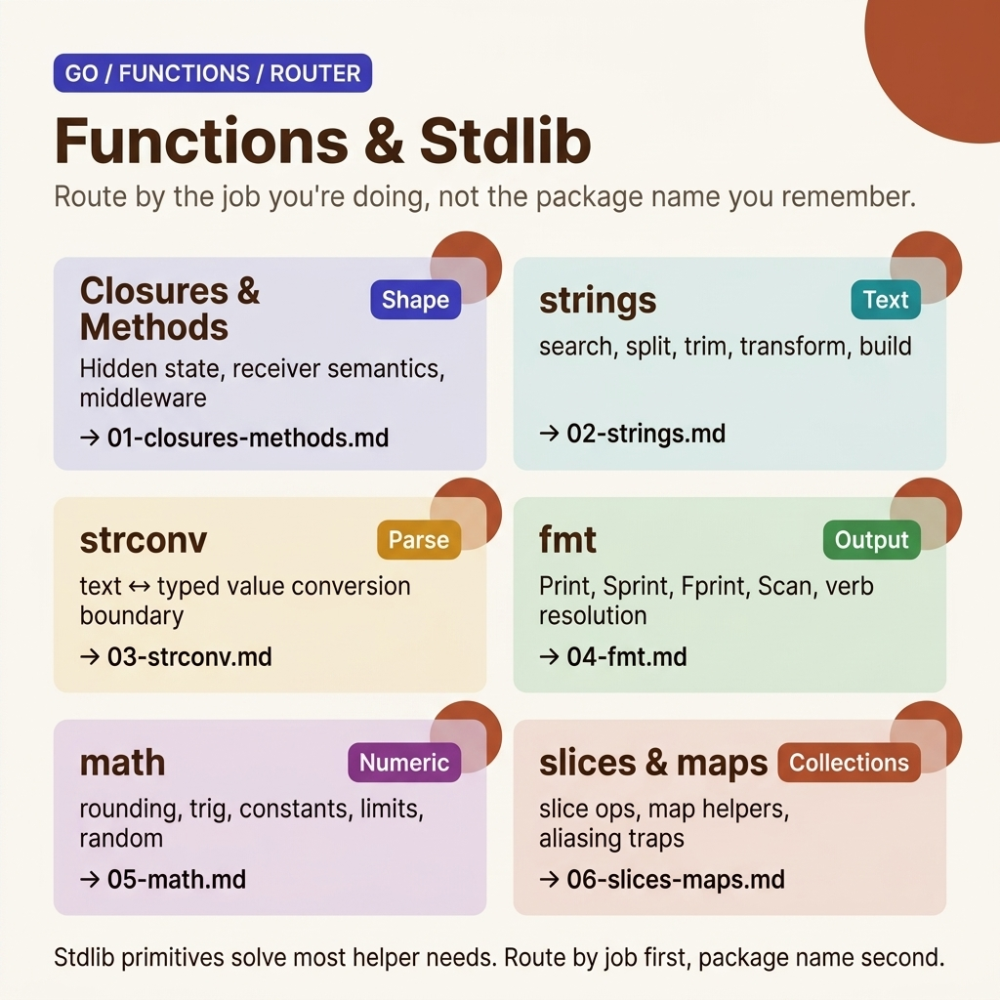

<!-- tags: golang, overview -->
# Functions — Built-in & Standard Library

> A comprehensive guide to essential Go functions and packages: from closures, string manipulation, and type conversion to formatting, math, and collections.

📅 Updated: 2026-04-19 · ⏱️ 6 min read

## 1. DEFINE

Go's standard library is vast, but API naming is consistent: `strings.HasPrefix`, `strconv.Atoi`, `fmt.Sprintf`. This cluster helps you pick the right package for the right job instead of searching "golang convert string to int" every time.

This hub does not exist to list files. It exists to help you choose the correct entry point into `fundamental/functions`: where to start, which articles should be read back-to-back, and which lane to follow when you encounter a real symptom.

### 1.1 Signals & Boundaries

- Open this hub when you know you are in the `fundamental/functions` cluster but are unsure which article to read first.
- The hub's focus is mapping pain points to the correct document, not replacing each detailed article.
- If you keep jumping between articles and still feel uncertain, the problem is usually choosing the wrong starting lane — not a lack of definitions.

### 1.2 Learning Lanes

- **Functions — Closures, Variadic, Methods** is the natural entry point if you want a clear foundation before going deep.
- **Strings — Package `strings` & String Manipulation** fits best when you need to bridge into an adjacent lane or expand from fundamentals toward production concerns.
- **Strconv — Type Conversion & Parsing** is the right entry when input from HTTP, environment variables, config files, or CLI arguments must cross a clear parse/format boundary.
- **Fmt — Formatting, Printing & Scanning** is appropriate when your problem lies in output, lightweight logging, format verbs, or CLI ergonomics.
- **Math — Numeric Functions & Constants** is the lane for numeric helpers, random numbers, precision issues, and bugs that begin to surface at the float/int boundary.
- **Slices & Maps — Built-in Functions & Package `slices`/`maps`** is the correct entry when symptoms touch collection operations, aliasing, append semantics, or map iteration.
- Keep this hub as a navigation map: after finishing one article, return here to choose the next lane with intent.

## 2. VISUAL

The `functions` lane should be entered from a real symptom, not from a habit of memorizing package names. The visual here is therefore a router map so you can immediately see which helper family addresses the task you actually need to accomplish.



*Figure: Router map dividing stdlib primitives by job type: function shape, text processing, parse boundary, output surface, numeric helpers, and collection helpers.*

Once the correct lane is selected, the pseudo-router below is merely a compressed version of that decision. The goal is not to memorize it, but to keep you from opening the wrong article each time a symptom resurfaces.

## 3. CODE

The router map guides visually. The pseudo-code below compresses that navigation logic into an artifact for your team.

### Example 1: Router artifact — choosing an article by reading goal

> **Goal**: Turn this hub into a navigation tool rather than a passive link table.
> **Approach**: Map the learning goal or symptom to the correct starting file.
> **Example**: Choose a lane by concern: fundamentals, framework knowledge, concurrency, or production ops.
> **Complexity**: O(1) at the navigation level; what matters is choosing the right entry point.

```text
func chooseLane(goal string) string {
    switch goal {
    case "closures methods": return "./01-closures-methods.md"
    case "strings": return "./02-strings.md"
    case "strconv": return "./03-strconv.md"
    case "fmt": return "./04-fmt.md"
    case "math": return "./05-math.md"
    case "slices maps": return "./06-slices-maps.md"
    default: return "./README.md"
    }
}
```

This pseudo-router is not code to run in your application; it is a way to compress the hub's navigation spirit into a concise artifact. Reading the hub with this mindset will help you maintain a coherent learning flow.

## 4. PITFALLS

A navigation hub is valuable when you use it correctly — not when you skim through and jump straight to the hardest article.

| # | Severity | Bug | Consequence | Fix |
| --- | --- | --- | --- | --- |
| 1 | 🔴 Fatal | Treating the hub as a link list to skim | Fragmented learning and wrong entry points | Always start from a specific pain point or learning goal |
| 2 | 🟡 Common | Jumping to advanced articles without a foundation lane | Understanding isolated terms and easily misapplying them | Pick one entry point and follow the cluster's rhythm |
| 3 | 🔵 Minor | Not returning to the hub after completing an article | Losing the connection between articles | Return to the hub after each lane to choose the next step |

## 5. REF

| Resource | Type | Link | Notes |
| --- | --- | --- | --- |
| Go Standard Library | Official | https://pkg.go.dev/std | Full index for all stdlib packages |
| Effective Go | Official | https://go.dev/doc/effective_go | Idioms and patterns for using built-in/stdlib functions in real code |
| Go User Manual | Official | https://go.dev/doc/ | Official router for docs, tooling, and package references |

## 6. RECOMMEND

This cluster has given you the map. Choose the lane that fits your current problem:

| Extension | When to read next | Why | File/Link |
| --- | --- | --- | --- |
| Functions — Closures, Variadic, Methods | When you need a clear entry point | Maintains a coherent reading flow within the cluster | [./01-closures-methods.md](./01-closures-methods.md) |
| Strings — Package `strings` & String Manipulation | When bridging into an adjacent lane | Maintains a coherent reading flow within the cluster | [./02-strings.md](./02-strings.md) |
| Strconv — Type Conversion & Parsing | When input touches parsing, format conversion, or numbers from strings | This is the correct entry for the text → typed-value boundary | [./03-strconv.md](./03-strconv.md) |
| Fmt — Formatting, Printing & Scanning | When code needs stable output, correct format verbs, or CLI/debug ergonomics | `fmt` is the first primitive for many console and lightweight logging workflows | [./04-fmt.md](./04-fmt.md) |
| Math — `math`, `math/big`, `math/bits`, random | When logic hits numeric helpers, random, big numbers, or bit tricks | Avoid re-implementing primitives that already exist in stdlib | [./05-math.md](./05-math.md) |
| Slices & Maps — Built-in Functions & Package `slices`/`maps` | When collection operations start repeating and spawning ad-hoc utilities | This article consolidates practical patterns around slice/map operations | [./06-slices-maps.md](./06-slices-maps.md) |
| Go Programming | When you need to switch to a different Go cluster | Return to the root router to choose another lane | [../README.md](../README.md) |
