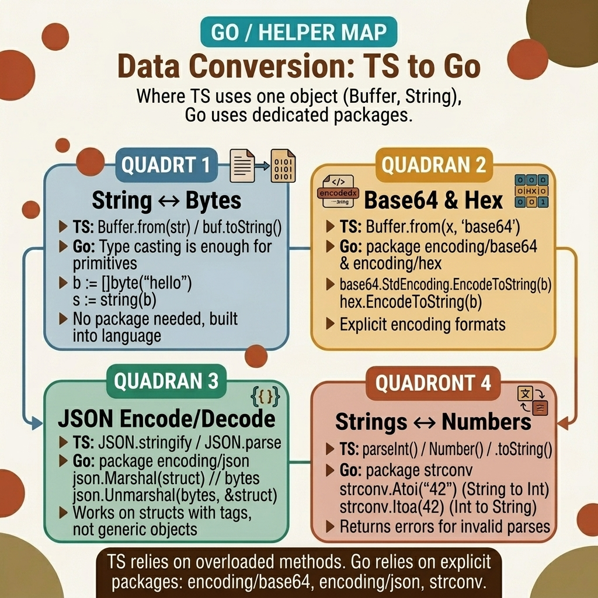

<!-- tags: golang, conversion, bytes, encoding -->
# 🔄 Data Conversion — String, Bytes, Base64, Hex, JSON

> Go separates immutable `string` from mutable `[]byte`. Every network payload, cryptographic hash, and JSON body starts as bytes. Skipping explicit conversion causes silent data corruption.

📅 Created: 2026-03-23 · 🔄 Updated: 2026-04-19 · ⏱️ 15 min read

## 1. DEFINE

Your webhook handler receives an HMAC signature as a hex string in the `X-Hub-Signature` header. Your backend computes the digest and gets a raw `[]byte`. You compare them with `==` — the check fails every time. The hex string `"a1b2c3"` and the byte slice `[]byte{0xa1, 0xb2, 0xc3}` look related, but they occupy different memory layouts. You need `hex.EncodeToString` to bring them into the same representation before comparison.

JavaScript developers expect implicit coercion between strings and binary data. Go refuses. `string(bytes)` and `[]byte(str)` create explicit copies — the string remains immutable, the byte slice remains mutable. Mixing them up corrupts cryptographic comparisons and leaks memory in streaming scenarios.

### 1.1 Invariants & Failure Modes

| Boundary | Core Responsibility |
| --- | --- |
| **`[]byte`** | The universal format. Cryptography, I/O, and JSON encoders consume byte slices exclusively. |
| **Encodings** | Base64 and hex are transport wrappers — they convert byte slices into printable strings for network transfer. |

| Rule | Rationale |
| --- | --- |
| **Explicit copies** | `string(buf)` allocates a new string. Mutating `buf` after the cast does not affect the string. |
| **Reader pipelines** | Avoid `io.ReadAll` on untrusted input. Stream large payloads through `json.NewDecoder` to cap memory usage. |

### 1.2 Failure Cascades

- **The Base64 Misalignment:** You decode a JWT payload with `base64.StdEncoding` instead of `base64.URLEncoding`. Standard Base64 uses `+` and `/`; URL-safe Base64 uses `-` and `_`. The decoder silently produces wrong bytes.
- **The OOM Decoder:** A client uploads a 2 GB JSON body. You call `io.ReadAll(request.Body)` and load the entire payload into memory. The Kubernetes pod hits its memory limit and is killed.

## 2. VISUAL

The conversion landscape has one central hub: `[]byte`. Every format — string, Base64, hex, JSON — converts to and from bytes. The visual anchors this hierarchy.



*Figure: `[]byte` sits at the center. Strings, Base64, hex, and JSON all convert through byte slices. Network payloads arrive as bytes; display formats leave as strings.*

## 3. CODE

With the conversion hierarchy established, the code below demonstrates four escalating patterns: basic string/byte casts, hex signature verification, streaming JSON decoding, and multipart assembly.

### Example 1: Basic — String and byte conversions

> **Goal**: Convert between `string` and `[]byte` for cryptographic and network payloads.
> **Approach**: Use native `[]byte()` casts and `encoding/base64` for transport encoding.
> **Complexity**: O(N) — each conversion copies the entire buffer.

```go
// basic_coercion.go
package helper

import (
	"encoding/base64"
	"fmt"
)

func ExecuteConversions(payload string) error {
	// ✅ string → []byte creates a mutable copy
	buffer := []byte(payload)
	
	// ✅ []byte → string creates an immutable copy
	reverted := string(buffer)

	standardEncoded := base64.StdEncoding.EncodeToString(buffer)
	urlEncoded := base64.URLEncoding.EncodeToString(buffer)
	
	fmt.Printf("Reverted: %s | Std: %s | URL: %s\n", reverted, standardEncoded, urlEncoded)
	return nil
}
```

> **Takeaway**: `string(buf)` and `[]byte(str)` are explicit copies. Mutating the byte slice after conversion does not affect the string. Use `URLEncoding` for JWT tokens and URL parameters; use `StdEncoding` for everything else.

---

### Example 2: Intermediate — Hex signature verification

> **Goal**: Compare a raw HMAC digest against a hex-encoded signature header.
> **Approach**: Encode the raw digest with `hex.EncodeToString` and compare strings.
> **Complexity**: O(N) — one pass to encode, one comparison.

```go
// crypto_mapping.go
package helper

import (
	"encoding/hex"
	"fmt"
)

func VerifyHexadecimalSignatures(rawHash []byte, providedSignature string) error {
	// ✅ Encode the raw bytes to a hex string for comparison
	generatedHex := hex.EncodeToString(rawHash)

	if generatedHex != providedSignature {
		return fmt.Errorf("signature mismatch: expected %s, got %s", generatedHex, providedSignature)
	}
	return nil
}
```

> **Takeaway**: Never compare raw bytes against hex strings directly. `hex.EncodeToString` converts `[]byte{0xa1}` to `"a1"` — both sides must be in the same representation.

---

### Example 3: Advanced — Streaming JSON decoding

> **Goal**: Decode large JSON request bodies without loading the entire payload into memory.
> **Approach**: Use `json.NewDecoder(reader)` to stream-parse directly from `io.ReadCloser`.
> **Complexity**: O(1) memory overhead — the decoder reads token by token.

```go
// streaming_json.go
package helper

import (
	"encoding/json"
	"net/http"
)

type VerificationPayload struct {
	EntityIdentifier string `json:"entity_identifier"`
	Action           string `json:"action"`
}

func StreamIncomingPayload(request *http.Request) (VerificationPayload, error) {
	defer request.Body.Close()

	var payload VerificationPayload
	// ✅ Stream-parse: reads from the body without buffering the entire content
	decoder := json.NewDecoder(request.Body)
	decoder.DisallowUnknownFields()
	
	if err := decoder.Decode(&payload); err != nil {
		return VerificationPayload{}, err
	}
	
	return payload, nil
}
```

> **Takeaway**: `io.ReadAll` on untrusted input is an OOM vector. `json.NewDecoder` reads the HTTP body as a stream — memory stays constant regardless of payload size.

---

### Example 4: Expert — Multipart form assembly

> **Goal**: Build an HTTP multipart body containing both JSON metadata and a binary file.
> **Approach**: Use `multipart.Writer` to write fields and file parts to a shared buffer.
> **Complexity**: O(1) buffer logic — writes stream directly.

```go
// multipart_assembly.go
package helper

import (
	"bytes"
	"mime/multipart"
)

func BuildMultipartTransmission(metadata string, binary []byte) (*bytes.Buffer, string, error) {
	buffer := new(bytes.Buffer)
	writer := multipart.NewWriter(buffer)

	_ = writer.WriteField("diagnostic_metadata", metadata)

	if len(binary) > 0 {
		part, _ := writer.CreateFormFile("diagnostic_binary", "payload.bin")
		// ✅ Write binary data directly to the multipart stream
		part.Write(binary)
	}

	// Close writes the multipart termination boundary
	writer.Close()
	
	return buffer, writer.FormDataContentType(), nil
}
```

> **Takeaway**: `multipart.Writer` handles boundary markers automatically. Call `Close()` before reading the buffer — it writes the final boundary.

## 4. PITFALLS

| # | Defect | Fix |
| --- | --- | --- |
| 1 | Using `StdEncoding` for URL/JWT payloads | Use `base64.URLEncoding` — standard encoding contains `+` and `/` which break URL parameters |
| 2 | Calling `io.ReadAll` on untrusted HTTP bodies | Use `json.NewDecoder` to stream-parse; add `http.MaxBytesReader` as a size guard |
| 3 | Comparing raw bytes against hex/Base64 strings | Encode both sides to the same format before comparison |
| 4 | Assuming `string(buf)` shares memory with `buf` | It creates a copy. Mutating `buf` after the cast is safe but allocates extra memory |

## 5. REF

| Resource | Link |
| --- | --- |
| `encoding/base64` | [pkg.go.dev/encoding/base64](https://pkg.go.dev/encoding/base64) |
| `encoding/json` | [pkg.go.dev/encoding/json](https://pkg.go.dev/encoding/json) |

## 6. RECOMMEND

| Extension | When | Rationale |
| --- | --- | --- |
| [Array Pipeline](./02-array-pipeline.md) | When processing collections of converted records | Generic `Map`, `Filter`, `Reduce` over typed slices |
| [Promise & Async](./04-promise-async.md) | When calling multiple external APIs concurrently | `errgroup` and channel patterns for parallel I/O |

**Navigation**: [← Bridge Router](./README.md) · [→ Array Pipeline](./02-array-pipeline.md)
