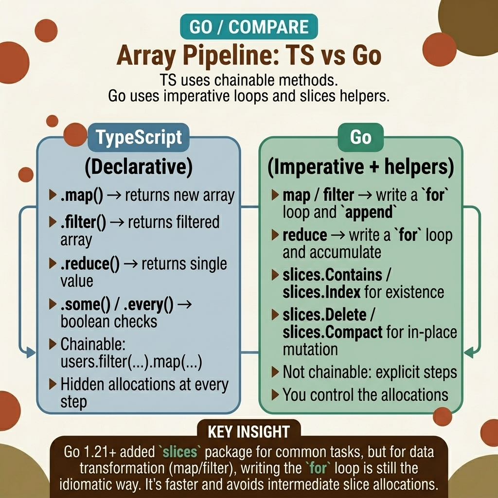

<!-- tags: golang, data-structures, arrays --> # 🔗 Array Pipeline — Map , Lọc, Giảm, Một số, Mọi

> Chuỗi JavaScript `.filter().map().reduce()` với tính năng thu thập rác tiềm ẩn. Go yêu cầu các vòng lặp `for` rõ ràng - mỗi chức năng pipeline phân bổ một slice mới. Generics ( Go 1.18+) mang lại sự an toàn về loại cho các chức năng tiện ích, nhưng các đường dẫn nóng vẫn cần các vòng lặp thủ công.

📅 Đã tạo: 23-03-2026 · 🔄 Đã cập nhật: 19-04-2026 · ⏱️ 18 phút đọc

## 1. ĐỊNH NGHĨA

Một nhà phát triển giao diện người dùng cấp cao xử lý 50.000 hồ sơ nhân viên bằng cách sử dụng `Filter(employees).Map(extractName)` . Mỗi bước pipeline phân bổ một slice mới và sao chép structs . Hai bước trên bản ghi 50K = phân bổ 100K. Vùng chứa hết bộ nhớ.

JavaScript ẩn chi phí này đằng sau garbage collector của nó. Go làm cho nó rõ ràng: mọi `append` sang một slice mới đều tốn bộ nhớ. Generics ( Go 1.18+) cho phép bạn viết các hàm an toàn kiểu `Map` , `Filter` và `Reduce` — nhưng chúng vẫn phân bổ các hàm trung gian slices . Đối với các đường dẫn nóng, vòng lặp `for` thủ công với một kết quả được phân bổ trước duy nhất slice nhanh hơn 3-5 lần.

### 1.1 Các kiểu bất biến và lỗi

| Ranh giới | Trách nhiệm cốt lõi |
| --- | --- |
| ** Pipeline loại** | Chuỗi JavaScript biến đổi dữ liệu một cách ngầm định. Các tiện ích Go chuyển rõ ràng closures qua gõ slices . |
| **Hiệu suất** | Đường dẫn khai báo ưu tiên khả năng đọc. Vòng lặp đường dẫn nóng ưu tiên phân bổ tối thiểu. |

| Quy tắc | Cơ sở lý luận |
| --- | --- |
| **Tránh xâu chuỗi sâu** | `Reduce(Map(Filter(data)))` phá hủy khả năng đọc. Chia thành các biến trung gian. |
| **Bản sao giá trị so với pointers ** | `Map` qua `[]User` sao chép mỗi struct . Đối với structs lớn, hãy sử dụng `[]*User` để tránh sao chép. |

### 1.2 Chuỗi thất bại

- **Phần tử ảo:** `Find` trả về giá trị 0 struct và `false` khi không có kết quả khớp nào tồn tại. Nếu bạn bỏ qua boolean, bạn xử lý `User{ID: 0}` - điều này có thể vô tình khớp với một bản ghi thực trong database của bạn.
- **Sự cố comparable :** `Includes(slice, target)` yêu cầu ràng buộc `comparable` . Việc truyền slice của maps sẽ gây ra lỗi biên dịch. Thay vào đó hãy sử dụng `Some` với một vị ngữ.

## 2. HÌNH ẢNH

Khoảng cách giữa chuỗi JavaScript và vòng lặp rõ ràng Go là mô hình phân bổ. Hình ảnh maps mỗi phương thức JS array tương đương với Go của nó.  *Hình: Các phương thức JS array được ánh xạ tới Go generic tương đương. Mỗi hàm Go chấp nhận một kiểu gõ slice và một closure . Không giống như JS, mỗi bước phân bổ một slice mới.*

## 3. MÃ

Với sự cân bằng phân bổ được thiết lập, mã bên dưới xây dựng năm tiện ích cốt lõi ( `Map` , `Filter` , `Reduce` , `Find` , `Includes` ) và hai tiện ích nâng cao ( `FlatMap` , `Chunk` ).

### Ví dụ 1: Cơ bản — 5 tiện ích cốt lõi

> **Mục tiêu**: Xây dựng loại an toàn `Map` , `Filter` và `Reduce` bằng cách sử dụng Go generics .
> **Phương pháp tiếp cận**: Mỗi hàm nhận một `[]T` và một closure , trả về một slice mới .
> **Độ phức tạp**: O(N) cho mỗi hàm — một lần chuyển qua đầu vào slice .```go
// core_pipeline.go
package utils

// Map transforms each element using the mapper function.
func Map[T any, R any](slice []T, mapper func(T) R) []R {
	result := make([]R, len(slice))
	for i, item := range slice {
		result[i] = mapper(item)
	}
	return result
}

// Filter returns elements where the predicate returns true.
func Filter[T any](slice []T, predicate func(T) bool) []T {
	var result []T
	for _, item := range slice {
		if predicate(item) {
			result = append(result, item)
		}
	}
	return result
}

// Reduce collapses a slice into a single value using an accumulator.
func Reduce[T any, R any](slice []T, reducer func(R, T) R, initial R) R {
	result := initial
	for _, item := range slice {
		result = reducer(result, item)
	}
	return result
}
```> **Takeaway**: `make([]R, len(slice))` phân bổ trước dung lượng chính xác cho `Map` . `Filter` sử dụng `append` vì kích thước đầu ra không xác định. Phân bổ trước bằng `make([]T, 0, len(slice))` giúp giảm phân bổ lại khi bộ lọc giữ lại hầu hết các phần tử.

---

### Ví dụ 2: Trung cấp — Tìm kiếm và xác thực

> **Mục tiêu**: Tìm các phần tử và xác thực các điều kiện slice bằng cách kết thúc sớm.
> **Phương pháp tiếp cận**: `Find` trả về `(T, bool)` — boolean thay thế `undefined` của JavaScript. `Includes` yêu cầu ràng buộc `comparable` .
> **Độ phức tạp**: Trường hợp tốt nhất O(1) — cả hai đều bị đoản mạch trong trận đấu đầu tiên.```go
// validation_logic.go
package utils

// Find returns the first element matching the predicate, plus a boolean.
func Find[T any](slice []T, predicate func(T) bool) (T, bool) {
	for _, item := range slice {
		if predicate(item) {
			return item, true
		}
	}
	
	var zero T
	return zero, false
}

// Includes checks if a value exists in the slice.
// Requires comparable constraint — maps and slices cannot use ==.
func Includes[T comparable](slice []T, target T) bool {
	for _, item := range slice {
		if item == target {
			return true
		}
	}
	return false
}
```> **Takeaway**: Luôn kiểm tra giá trị trả về boolean từ `Find` . Giá trị 0 của struct là giá trị hợp lệ - `User{ID: 0}` là giá trị thực struct , không phải `nil` . Việc bỏ qua boolean sẽ dẫn đến việc xử lý các bản ghi ảo.

---

### Ví dụ 3: Nâng cao — FlatMap và Chunk

> **Mục tiêu**: Làm phẳng slices lồng nhau và chia các bộ sưu tập lớn thành các đợt.
> **Cách tiếp cận**: `FlatMap` maps mỗi phần tử thành một slice và nối. `Chunk` chia theo kích thước cố định.
> **Độ phức tạp**: O(N×M) cho việc mở rộng `FlatMap` ; O(N) cho `Chunk` .```go
// complex_restructuring.go
package utils

// FlatMap maps each element to a slice and flattens the results.
func FlatMap[T any, R any](slice []T, fn func(T) []R) []R {
	var result []R
	for _, item := range slice {
		result = append(result, fn(item)...)
	}
	return result
}

// Chunk splits a slice into batches of the given size.
func Chunk[T any](slice []T, size int) [][]T {
	if size <= 0 {
		return nil
	}
	
	result := make([][]T, 0, (len(slice)+size-1)/size)
	for i := 0; i < len(slice); i += size {
		end := i + size
		if end > len(slice) {
			end = len(slice)
		}
		
		result = append(result, slice[i:end])
	}
	return result
}
```> **Takeaway**: `Chunk` sub- slices chia sẻ phần hỗ trợ array với bản gốc slice . Sửa đổi các phần tử trong một đoạn sẽ sửa đổi bản gốc. Nếu bạn cần cách ly, hãy sao chép từng đoạn bằng `slices.Clone` .

## 4. Cạm bẫy

| # | Khiếm khuyết | Sửa chữa |
| --- | --- | --- |
| 1 | Lồng `Reduce(Map(Filter(...)))` vào một biểu thức | Chia thành các biến trung gian - khả năng đọc quan trọng hơn một dòng |
| 2 | Bỏ qua trả về boolean từ `Find` | Luôn kiểm tra `ok` - giá trị 0 là hợp lệ structs , không phải null |
| 3 | Sử dụng generic `Map` trên các đường dẫn nóng có structs lớn | Thay thế bằng vòng lặp `for` thủ công để phân bổ trước và tránh các bản sao |
| 4 | Sửa đổi các phần tử slice bên trong `Filter` | Phần tử Slice là bản sao cho các loại giá trị. Để đột biến, hãy sử dụng `[]*T` |

## 5. GIỚI THIỆU

| Tài nguyên | Liên kết |
| --- | --- |
| `samber/lo` Thư viện tiện ích | [github.com/samber/lo](https://github.com/samber/lo) |
| Tiêu chuẩn `slices` Package | [pkg.go.dev/slices](https://pkg.go.dev/slices) |

## 6. KHUYẾN NGHỊ

| Gia hạn | Khi nào | Cơ sở lý luận |
| --- | --- | --- |
| [Object Maps](./03-object-map-utils.md) | Khi làm việc với dữ liệu khóa-giá trị động | Generic `Keys` , `Merge` , `Pick` cho `map[K]V` |
| [Optional Types](./11-optional-nullable.md) | Khi xử lý các giá trị rỗng hoặc vắng mặt | `Find` trả về giá trị 0 — các tùy chọn làm cho sự vắng mặt trở nên rõ ràng |

**Điều hướng**: [← Data Conversion](./01-data-conversion.md) · [→ Object Maps](./03-object-map-utils.md)