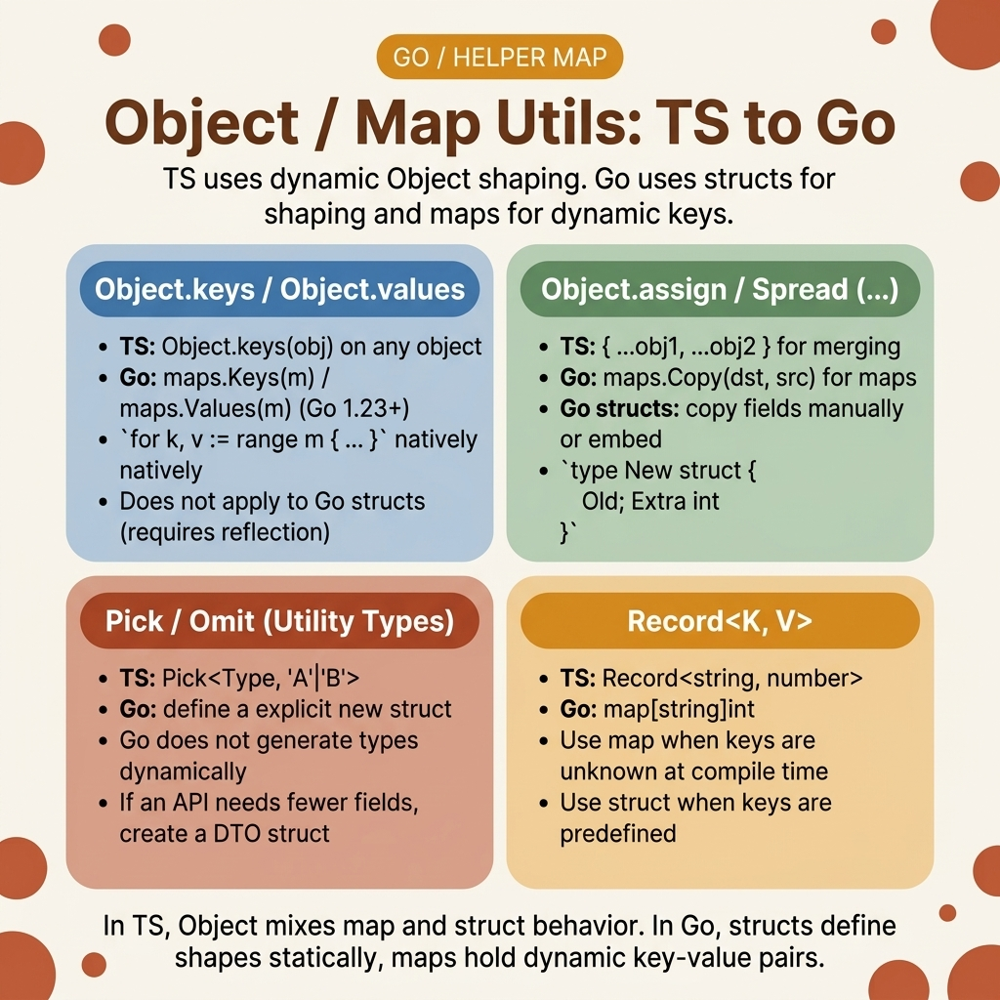

<!-- tags: golang, map, utils --> # 🗂️ Đối tượng/ Map Utils — Khóa, Giá trị, Mục nhập, Hợp nhất

> JavaScript truyền bá các đối tượng bằng `{...a, ...b}` . Go không có toán tử trải rộng — bạn lặp lại maps một cách rõ ràng. Thứ tự lặp Map được ngẫu nhiên hóa theo thiết kế. Truy cập đồng thời map không có mutex gặp sự cố với lỗi runtime nghiêm trọng.

📅 Đã tạo: 23-03-2026 · 🔄 Cập nhật: 19-04-2026 · ⏱️ Đọc 10 phút

## 1. ĐỊNH NGHĨA

Nhà phát triển TypeScript chuyển việc hợp nhất cấu hình: `{...defaultConfig, ...envConfig}` . Họ thử `reflect` để hợp nhất structs một cách linh hoạt. Mã biên dịch, chạy chậm hơn 10 lần so với vòng lặp thủ công và hoảng loạn khi thêm trường mới mà không cập nhật logic phản chiếu. Go maps ( `map[K]V` ) thay thế các đối tượng động của JavaScript. Nhưng maps có hai điểm khác biệt quan trọng: thứ tự lặp được cố tình ngẫu nhiên hóa (không có thứ tự khóa ổn định) và việc đọc/ghi đồng thời gây ra sự cố runtime nghiêm trọng - không phải là cuộc đua dữ liệu, mà là `fatal error: concurrent map writes` không thể phục hồi.

### 1.1 Các kiểu bất biến và lỗi

| Ranh giới | Trách nhiệm cốt lõi |
| --- | --- |
| ** `map[K]V` ** | Tương đương động của các đối tượng JS. Khóa phải là `comparable` ; các giá trị có thể là loại any . |
| **Lặp lại ngẫu nhiên** | Go ngẫu nhiên hóa thứ tự `range` để ngăn mã phụ thuộc vào thứ tự chèn. |

| Quy tắc | Cơ sở lý luận |
| --- | --- |
| **Không bao giờ thay đổi maps tại chỗ** | `result[k] = v` làm thay đổi bản gốc map . Tạo một map mới để hợp nhất. |
| **Sắp xếp khóa sau khi trích xuất** | `Keys(m)` trả về một thứ tự ngẫu nhiên slice . Sắp xếp nếu bạn cần đầu ra xác định. |

### 1.2 Chuỗi thất bại

- **Sắp xếp khóa bị thiếu:** Bạn trích xuất khóa map và ghi vào tệp cấu hình. Các thử nghiệm thành công cục bộ, thất bại trong CI — vì thứ tự khóa thay đổi giữa các lần chạy.
- **Bẫy phản chiếu struct :** Sử dụng `reflect` để trích xuất các trường struct bỏ qua sự an toàn biên dịch- time . Việc thêm trường vào struct âm thầm phá vỡ mã phản chiếu tại runtime .

## 2. HÌNH ẢNH

Các đối tượng JavaScript và Go maps trông giống nhau nhưng hoạt động khác nhau. Hình ảnh maps mỗi phương thức JS `Object.*` tương đương với Go generic của nó.  *Hình: JS `Object.keys/values/entries/assign` được ánh xạ tới các hàm Go generic . Go yêu cầu các vòng lặp rõ ràng trong đó JavaScript cung cấp các phương thức tích hợp sẵn.*

## 3. MÃ

Với các bất biến map được thiết lập, mã bên dưới sẽ xây dựng sáu tiện ích: `Keys` , `Entries` , `Merge` , `Pick` , `Invert` và `FilterMap` .

### Ví dụ 1: Cơ bản — Khóa và mục nhập

> **Mục tiêu**: Trích xuất map khóa và cặp khóa-giá trị thành [[E28]]] đã nhập.
> **Phương pháp tiếp cận**: Phân bổ trước kết quả slice bằng `make([]K, 0, len(m))` để tránh phân bổ lại.
> **Độ phức tạp**: O(N) — một lần vượt qua map .```go
// basic_maps.go
package utils

// Entry represents a key-value pair, equivalent to JS [key, value] tuples.
type Entry[K comparable, V any] struct {
	Key   K
	Value V
}

// Keys returns all map keys as a slice. Order is non-deterministic.
func Keys[K comparable, V any](m map[K]V) []K {
	keys := make([]K, 0, len(m))
	for k := range m {
		keys = append(keys, k)
	}
	return keys
}

// Entries returns all key-value pairs as a slice of Entry structs.
func Entries[K comparable, V any](m map[K]V) []Entry[K, V] {
	entries := make([]Entry[K, V], 0, len(m))
	for k, v := range m {
		entries = append(entries, Entry[K, V]{Key: k, Value: v})
	}
	return entries
}
```> **Bài học rút ra**: Việc phân bổ trước bằng `cap = len(m)` sẽ tránh tăng trưởng slice trong vòng lặp. Luôn sắp xếp kết quả nếu bạn cần thứ tự xác định - `slices.Sort(Keys(m))` .

---

### Ví dụ 2: Trung cấp — Hợp nhất và Chọn

> **Mục tiêu**: Hợp nhất nhiều maps (như `Object.assign` ) và trích xuất một tập hợp con các khóa (như Lodash `pick` ).
> **Phương pháp tiếp cận**: `Merge` tạo một map mới và sao chép các mục nhập — sau maps ghi đè lên các mục trước đó. `Pick` chỉ chọn các phím được chỉ định.
> **Độ phức tạp**: O(N+M) để hợp nhất; O(K) để chọn trong đó K = số lượng phím được chọn.```go
// mutable_config.go
package utils

// Merge combines multiple maps into one. Later maps overwrite earlier entries.
func Merge[K comparable, V any](maps ...map[K]V) map[K]V {
	total := 0
	for _, m := range maps {
		total += len(m)
	}
	
	result := make(map[K]V, total)
	for _, m := range maps {
		for k, v := range m {
			// ✅ Last-write-wins: later maps take priority
			result[k] = v 
		}
	}
	return result
}

// Pick returns a new map containing only the specified keys.
func Pick[K comparable, V any](m map[K]V, keys ...K) map[K]V {
	result := make(map[K]V, len(keys))
	for _, k := range keys {
		if v, ok := m[k]; ok {
			result[k] = v
		}
	}
	return result
}
```> **Takeaway**: `Merge` luôn trả về một map mới — bản gốc không được sửa đổi. Đây là Go tương đương với `Object.assign({}, ...maps)` (lưu ý đối tượng trống là đối số đầu tiên).

---

### Ví dụ 3: Nâng cao — Đảo ngược và FilterMap

> **Mục tiêu**: Hoán đổi khóa và giá trị để tra cứu ngược và lọc maps theo vị từ.
> **Cách tiếp cận**: `Invert` yêu cầu cả `K` và `V` phải là `comparable` . `FilterMap` chấp nhận một vị từ trên các cặp khóa-giá trị.
> **Độ phức tạp**: O(N) — một lượt cho mỗi thao tác.```go
// transform_maps.go
package utils

// Invert swaps keys and values. Duplicate values overwrite earlier entries.
func Invert[K comparable, V comparable](m map[K]V) map[V]K {
	result := make(map[V]K, len(m))
	for k, v := range m {
		// ⚠️ If two keys map to the same value, one entry is lost
		result[v] = k
	}
	return result
}

// FilterMap returns a new map containing only entries that match the predicate.
func FilterMap[K comparable, V any](m map[K]V, predicate func(K, V) bool) map[K]V {
	result := make(map[K]V)
	for k, v := range m {
		if predicate(k, v) {
			result[k] = v
		}
	}
	return result
}
```> **Takeaway**: `Invert` bị mất khi các giá trị không phải là duy nhất. Trước tiên hãy kiểm tra tính duy nhất hoặc sử dụng `map[V][]K` để bảo toàn tất cả các khóa gốc.

## 4. Cạm bẫy

| # | Khiếm khuyết | Sửa chữa |
| --- | --- | --- |
| 1 | Đồng thời map đọc và ghi | Sử dụng `sync.RWMutex` hoặc `sync.Map` . Nguyên nhân ghi đồng thời `fatal error: concurrent map writes` - không thể phục hồi được. |
| 2 | Mong đợi thứ tự lặp lại xác định | Go sắp xếp ngẫu nhiên thứ tự `range` theo thiết kế. Sắp xếp các khóa sau khi trích xuất nếu thứ tự quan trọng. |
| 3 | Thay đổi map được truyền dưới dạng đối số hàm | Maps là các loại tham chiếu. Đột biến bên trong một hàm ảnh hưởng đến người gọi. Sao chép trước nếu bạn cần cách ly. |

## 5. GIỚI THIỆU

| Tài nguyên | Liên kết |
| --- | --- |
| `maps` Package ( Go 1.21+) | [pkg.go.dev/maps](https://pkg.go.dev/maps) |
| Go Generics Hướng dẫn | [go.dev/doc/tutorial/generics](https://go.dev/doc/tutorial/generics) |

## 6. KHUYẾN NGHỊ

| Gia hạn | Khi nào | Cơ sở lý luận |
| --- | --- | --- |
| [Concurrent Maps](./09-set-concurrent-map.md) | Khi nhiều goroutines truy cập vào cùng một map | Các mẫu được bảo vệ `sync.Map` và mutex |
| [Array Pipelines](./02-array-pipeline.md) | Khi xử lý slices được trích xuất từ ​​ maps | Generic `Map` , `Filter` , `Reduce` trên đã gõ slices |

**Điều hướng**: [← Array Pipeline](./02-array-pipeline.md) · [→ Promise & Async](./04-promise-async.md)