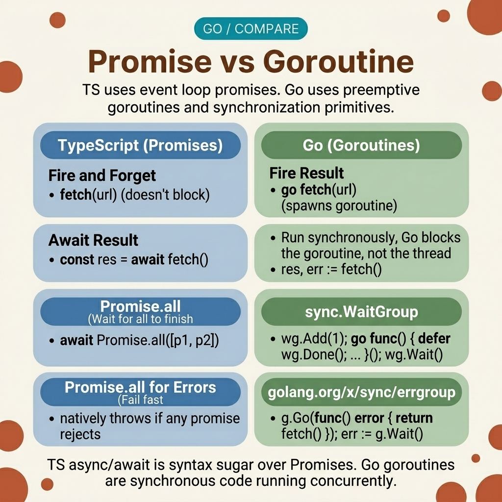

<!-- tags: golang, concurrency, goroutines --> # ⚡ Promise & Async — Concurrency TS → Go > TypeScript chạy mã async trên một mã - thread event loop . Go phân phối goroutines trên nhiều hệ điều hành threads . Việc dịch `Promise.all` yêu cầu đồng bộ hóa channel rõ ràng — goroutines mà không có điều kiện thoát khỏi bộ nhớ bị rò rỉ.

📅 Đã tạo: 23-03-2026 · 🔄 Đã cập nhật: 19-04-2026 · ⏱️ 18 phút đọc

## 1. ĐỊNH NGHĨA

Nhà phát triển giao diện người dùng xây dựng điểm cuối phụ trợ tổng hợp ba lệnh gọi API. Họ viết `go fetchUser()` , `go fetchOrders()` , `go fetchPermissions()` - ba goroutines bắn ra. Nhưng hàm `main` sẽ trả về ngay sau khi khởi chạy chúng. Không giống như JavaScript, trong đó `await Promise.all(...)` chặn cho đến khi tất cả promises giải quyết, Go 's `main` thoát ra và goroutines bị giết một cách âm thầm.

Bản sửa lỗi yêu cầu đồng bộ hóa rõ ràng: `sync.WaitGroup` cho các tác vụ quên và quên hoặc `errgroup` cho các tác vụ trả về lỗi. `errgroup` tương đương trực tiếp với `Promise.all` - nó đợi tất cả goroutines hoàn thành và hủy nhóm nếu any một nhóm không thành công.

### 1.1 Các kiểu bất biến và lỗi

| Ranh giới | Trách nhiệm cốt lõi |
| --- | --- |
| ** Goroutines ** | Nhẹ threads được ghép kênh trên hệ điều hành threads . Không bao giờ sinh sản mà không có điều kiện thoát cụ thể. |
| ** `errgroup` ** | Sự thay thế `Promise.all` trực tiếp. Hủy bỏ anh em goroutines khi trả về lỗi. |

| Quy tắc | Cơ sở lý luận |
| --- | --- |
| **Luôn vượt qua `context.Context` ** | Go tương đương với `AbortController` . Cung cấp thời gian chờ và tuyên truyền hủy bỏ. |
| **Bộ đệm channels để khớp với concurrency ** | Không có bộ đệm channels chặn người gửi cho đến khi receiver đọc. Nếu không có ai đọc, goroutine sẽ bị rò rỉ. |

### 1.2 Chuỗi thất bại

- **Zombie goroutine :** A goroutine gọi API bên ngoài mà không hết thời gian chờ ngữ cảnh. API bị treo. goroutine chặn vĩnh viễn, rò rỉ bộ nhớ trong suốt thời gian tồn tại của quy trình.
- **Cuộc đua dữ liệu trở lại:** Nhà phát triển gán kết quả cho các biến được chia sẻ bên trong goroutines — `user = fetchUser()` . Hai goroutines ghi vào cùng một biến mà không đồng bộ hóa. Máy dò chủng tộc bắt được nó; sản xuất mà không có `-race` âm thầm làm hỏng dữ liệu.

## 2. HÌNH ẢNH event loop của JavaScript tuần tự hóa các hoạt động async trên một thread . Bộ lập lịch của Go phân phối goroutines trên tất cả các lõi CPU. Hình ảnh maps sự khác biệt về mặt khái niệm.  *Hình: JS event loop (trái) tuần tự hóa callbacks trên một thread . Bộ lập lịch Go (phải) phân phối goroutines trên nhiều hệ điều hành threads . Channels thay thế `Promise.then()` để chuyển kết quả giữa goroutines .*

## 3. MÃ

Với mô hình concurrency được thiết lập, mã bên dưới thể hiện ba mẫu: cơ bản `await` qua channels , `Promise.all` qua `errgroup` và `Promise.race` qua `select` .

### Ví dụ 1: Cơ bản — Bản dịch await > **Mục tiêu**: Đợi thao tác nền, tương đương với `const result = await fetchUser(1)` .
> **Phương pháp tiếp cận**: Trả về channel được đệm từ hàm async . Người gọi đọc với `<-ch` sẽ chặn cho đến khi giá trị đến.
> **Độ phức tạp**: O(1) — một goroutine , một channel gửi/nhận.```go
// basic_async.go
package async

import (
	"fmt"
	"time"
)

// TS: async function fetchUser(id) { return "User" }
func FetchUserAsync(id int) <-chan string {
	ch := make(chan string, 1) // Buffer prevents block if receiver vanishes.
	
	go func() {
		time.Sleep(100 * time.Millisecond) // Simulate IO
		ch <- fmt.Sprintf("User_%d", id)
	}()
	
	return ch
}

func ExecuteAwait() {
	// TS: const user = await fetchUser(1)
	userChannel := FetchUserAsync(1)
	
	result := <-userChannel // Blocks until the goroutine sends
	fmt.Println("Result", result)
}
```> **Takeaway**: Vùng đệm channel ( `make(chan string, 1)` ) là rất quan trọng. Nếu người gọi từ bỏ channel , lệnh gửi không có bộ đệm sẽ chặn vĩnh viễn - goroutine sẽ bị rò rỉ. Bộ đệm 1 cho phép goroutine gửi và thoát ngay cả khi không có receiver .

---

### Ví dụ 2: Trung cấp — Promise .all với errgroup

> **Mục tiêu**: Chạy nhiều tác vụ đồng thời và chờ tất cả, tương đương với `await Promise.all([...])` .
> **Phương pháp tiếp cận**: `errgroup.WithContext` tạo một nhóm hủy tất cả goroutines nếu any một nhóm trả về lỗi.
> **Độ phức tạp**: O(N) — một goroutine cho mỗi nhiệm vụ.```go
// errgroup_sync.go
package async

import (
	"context"
	"fmt"
	"time"
	"golang.org/x/sync/errgroup"
)

func ExecutePromiseAll() error {
	var user, metadata string
	
	group, _ := errgroup.WithContext(context.Background())
	
	group.Go(func() error {
		time.Sleep(100 * time.Millisecond)
		user = "Alice"
		return nil
	})
	
	group.Go(func() error {
		time.Sleep(150 * time.Millisecond)
		metadata = "Authorized"
		return nil
	})
	
	// TS: await Promise.all([task1, task2])
	if err := group.Wait(); err != nil {
		return err
	}
	
	fmt.Printf("Results: %s, %s\n", user, metadata)
	return nil
}
```> **Tại sao `errgroup` thay vì `sync.WaitGroup` ?** `WaitGroup` không xử lý lỗi — nếu một goroutine bị lỗi, những cái khác vẫn tiếp tục chạy và người gọi không bao giờ biết về lỗi đó. `errgroup` trả về lỗi đầu tiên và (khi được tạo bằng `WithContext` ) hủy bối cảnh dẫn xuất để goroutines khác có thể kiểm tra `ctx.Err()` và thoát sớm.

---

### Ví dụ 3: Nâng cao — Promise .race with select > **Mục tiêu**: Trả về phản hồi nhanh nhất và loại bỏ những phản hồi chậm hơn, tương đương với `await Promise.race([...])` .
> **Phương pháp tiếp cận**: `select` chặn cho đến khi channel đầu tiên nhận được giá trị. `time.After` cung cấp dự phòng hết thời gian chờ.
> **Độ phức tạp**: O(N) goroutine sinh sản; Lựa chọn O(1).```go
// race_condition.go
package async

import (
	"fmt"
	"time"
)

func ExecutePromiseRace() string {
	fastChannel := make(chan string, 1)
	slowChannel := make(chan string, 1)

	// TS: const result = await Promise.race([task1, task2])
	go func() {
		time.Sleep(50 * time.Millisecond)
		fastChannel <- "Primary DB"
	}()

	go func() {
		time.Sleep(200 * time.Millisecond)
		slowChannel <- "Fallback DB"
	}()

	select {
	case result := <-fastChannel:
		return result
	case result := <-slowChannel:
		return result
	case <-time.After(300 * time.Millisecond):
		return "Timeout"
	}
}
```> **Điểm rút lui**: Vòng thua goroutine tiếp tục diễn ra sau khi `select` chọn được người chiến thắng. Nó gửi đến channel của nó, nhưng không ai đọc - channel được đệm sẽ hấp thụ giá trị và goroutine thoát ra một cách sạch sẽ. Nếu không lưu vào bộ đệm, goroutine bị mất sẽ bị chặn vĩnh viễn.

## 4. Cạm bẫy

| # | Khiếm khuyết | Sửa chữa |
| --- | --- | --- |
| 1 | Sinh sản goroutines mà không hủy ngữ cảnh | Luôn vượt qua `context.WithCancel` hoặc `context.WithTimeout` . Hủy khi có lỗi hoặc thoát chức năng. |
| 2 | Viết kết quả vào các biến được chia sẻ từ goroutines | Sử dụng channels để trả về giá trị hoặc bảo vệ trạng thái chia sẻ bằng `sync.Mutex` . |
| 3 | Thiếu thời gian chờ khi chạy dài goroutines | Liên kết `time.After` hoặc `context.WithTimeout` trong các khối `select` để ngăn chặn việc chờ đợi vô hạn. |

## 5. GIỚI THIỆU

| Tài nguyên | Liên kết |
| --- | --- |
| Bối cảnh Package | [pkg.go.dev/context](https://pkg.go.dev/context) |
| Go Concurrency Mẫu | [go.dev/blog/pipelines](https://go.dev/blog/pipelines) |

## 6. KHUYẾN NGHỊ

| Gia hạn | Khi nào | Cơ sở lý luận |
| --- | --- | --- |
| [Context Patterns](../../concurrency/03-context.md) | Khi truyền thời gian chờ thông qua chuỗi cuộc gọi | Cây khử sâu với `context.WithTimeout` |
| [Worker Pools](../../concurrency/08-worker-pool-tunny.md) | Khi giới hạn số lượng goroutine đồng thời | Ngăn chặn tình trạng cạn kiệt bộ nhớ khi sinh sản goroutine không giới hạn |

**Điều hướng**: [← Map Utils](./03-object-map-utils.md) · [→ Date Time Utilities](./05-date-time.md)