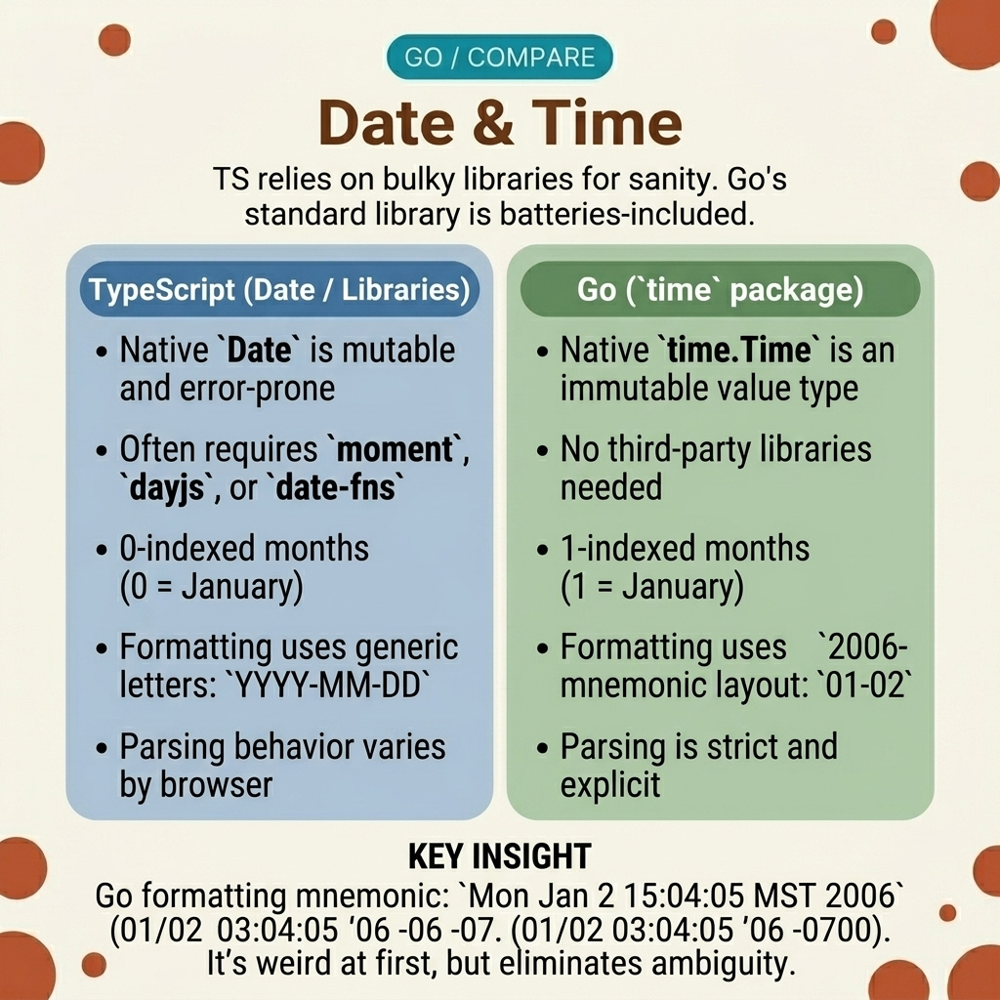

<!-- tags: golang, datetime, formats -->
# 🕐 Date & Time — TS Date/Moment/Dayjs → Go `time`

> JavaScript uses mnemonic format tokens like `YYYY-MM-DD`. Go uses a magic reference date: `2006-01-02 15:04:05`. Using JavaScript-style tokens in Go compiles without error but produces garbage output.

📅 Created: 2026-03-23 · 🔄 Updated: 2026-04-19 · ⏱️ 16 min read

## 1. DEFINE

Your frontend sends ISO 8601 timestamps. The backend engineer parses them with `time.Parse("YYYY-MM-DD", input)` — copying the JavaScript mental model. Go accepts the string without a compile error. But the parsed date is nonsensical: the year, month, and day are replaced by unrelated characters because `Y`, `M`, `D` have no meaning in Go's format system.

Go uses a **magic reference date**: `Mon Jan 2 15:04:05 MST 2006`. The numbers follow a `1-2-3-4-5-6-7` sequence: Month=1, Day=2, Hour=15 (3 PM), Minute=04, Second=05, Year=2006, Timezone offset=-0700. You write the format by example — `"2006-01-02"` means "year-month-day" because those are the reference values in those positions.

### 1.1 Invariants & Failure Modes

| Boundary | Core Responsibility |
| --- | --- |
| **Magic reference date** | Format layouts use the reference values: Month=1, Day=2, Hour=3/15, Minute=4, Second=5, Year=6, Timezone=7. |
| **Duration types** | `time.Duration` stores nanoseconds. Use `time.Hour`, `time.Minute` constants for arithmetic. |

| Rule | Rationale |
| --- | --- |
| **Reject `YYYY-MM-DD` tokens** | They compile but produce wrong results. Use `2006-01-02` exclusively. |
| **Specify timezone explicitly** | `time.Parse` assumes UTC. Use `time.ParseInLocation` when the input is in a local timezone. |

### 1.2 Failure Cascades

- **The missing timezone:** You store timestamps with `t.Format(time.RFC3339)` but parse them back without a location. The frontend displays booking times 7 hours off because UTC was assumed instead of `Asia/Ho_Chi_Minh`.
- **The month cast trap:** `time.Now().Month()` returns `time.Month` (a named type), not `int`. Comparing it to an integer from an API fails at compile time. Cast with `int(month)`.

## 2. VISUAL

The format reference is the single most confusing part of Go's `time` package. The visual maps JavaScript tokens to Go reference values.



*Figure: JavaScript format tokens (YYYY, MM, DD, HH, mm, ss) mapped to Go reference values (2006, 01, 02, 15, 04, 05). One misplaced digit produces a silently wrong date.*

## 3. CODE

With the reference date memorized, the code below demonstrates parsing, timezone handling, and periodic polling.

### Example 1: Basic — The magic reference format

> **Goal**: Parse frontend timestamps and format them for API responses.
> **Approach**: Use Go's reference date `2006-01-02 15:04:05` for layouts. Use `time.RFC3339` for ISO 8601 output.
> **Complexity**: O(1) per parse/format call.

```go
// basic_parsing.go
package dates

import (
	"fmt"
	"time"
)

func ParseFrontendTimestamp(payload string) (time.Time, error) {
	// TS: dayjs(payload).format('YYYY-MM-DD HH:mm:ss')
	// ✅ Go uses the 1-2-3-4-5-6 reference sequence
	layout := "2006-01-02 15:04:05"
	
	parsed, err := time.Parse(layout, payload)
	if err != nil {
		return time.Time{}, err
	}
	
	return parsed, nil
}

func FormatStandardOutput(now time.Time) string {
	// RFC3339 = "2006-01-02T15:04:05Z07:00" (ISO 8601)
	return now.Format(time.RFC3339) 
}
```

> **Takeaway**: Memorize the sequence `1-2-3-4-5-6-7` (month-day-hour-minute-second-year-timezone). Every Go format layout is a rearrangement of these reference values.

---

### Example 2: Intermediate — Duration and timezone shifts

> **Goal**: Schedule a future task in a specific timezone, equivalent to `moment().add(hours, 'hour').tz("Asia/Tokyo")`.
> **Approach**: Use `time.Duration` for hour offsets and `time.LoadLocation` for timezone conversion.
> **Complexity**: O(1) per operation.

```go
// bounded_durations.go
package dates

import (
	"time"
)

func ScheduleFutureTask(hours int, targetLocation string) (time.Time, error) {
	// TS: moment().add(hours, 'hour').tz("Asia/Tokyo")
	now := time.Now()
	
	offset := time.Duration(hours) * time.Hour
	future := now.Add(offset)

	// ✅ LoadLocation handles DST transitions automatically
	loc, err := time.LoadLocation(targetLocation)
	if err != nil {
		return time.Time{}, err
	}
	
	return future.In(loc), nil
}

func CalculateCalendarOffset() time.Time {
	now := time.Now()
	// ✅ AddDate handles calendar months (28/29/30/31 days)
	// Adding 30*24*time.Hour skips this and breaks on February
	return now.AddDate(0, 1, 0) 
}
```

> **Takeaway**: Use `AddDate(0, 1, 0)` for "one month later" — it handles varying month lengths correctly. `30 * 24 * time.Hour` gives you exactly 720 hours, which is wrong for February and months with 31 days.

---

### Example 3: Advanced — Tickers and periodic polling

> **Goal**: Replace JavaScript's `setInterval(fn, 1000)` with Go's `time.Ticker`.
> **Approach**: `time.NewTicker` sends on a channel at regular intervals. `select` blocks on the ticker and a context cancellation.
> **Complexity**: O(1) per tick.

```go
// interval_polling.go
package dates

import (
	"context"
	"fmt"
	"time"
)

func ExecutePollingInterval(ctx context.Context, duration time.Duration) {
	// TS: setInterval(fn, 1000)
	ticker := time.NewTicker(duration)
	
	// ✅ Stop the ticker to release the underlying goroutine
	defer ticker.Stop() 

	for {
		select {
		case <-ticker.C:
			fmt.Println("Polling active configurations")
		case <-ctx.Done():
			fmt.Println("Terminating interval loop")
			return
		}
	}
}
```

> **Takeaway**: Always call `ticker.Stop()` via `defer`. `time.Tick()` (without `New`) returns a channel with no way to stop the underlying goroutine — it leaks for the lifetime of the process.

## 4. PITFALLS

| # | Defect | Fix |
| --- | --- | --- |
| 1 | Using `YYYY-MM-DD` format tokens in Go | Replace with `2006-01-02`. Go's reference date is the only valid format. |
| 2 | Assuming `time.Parse` uses local timezone | `time.Parse` defaults to UTC. Use `time.ParseInLocation` for local times. |
| 3 | Using `time.Sleep` to emulate `setTimeout` | Use `time.AfterFunc(d, fn)` for non-blocking delayed execution. |

## 5. REF

| Resource | Link |
| --- | --- |
| `time` package | [pkg.go.dev/time](https://pkg.go.dev/time) |
| Format constants | [pkg.go.dev/time#pkg-constants](https://pkg.go.dev/time#pkg-constants) |

## 6. RECOMMEND

| Extension | When | Rationale |
| --- | --- | --- |
| [Promise and Async](./04-promise-async.md) | When combining time operations with concurrent I/O | Context timeouts integrate directly with ticker patterns |
| [Enum Types](./06-enum-union-types.md) | When modeling time-based states (daily, weekly, monthly) | `iota` constants for scheduling interval types |

**Navigation**: [← Async Contexts](./04-promise-async.md) · [→ Enum Types](./06-enum-union-types.md)
