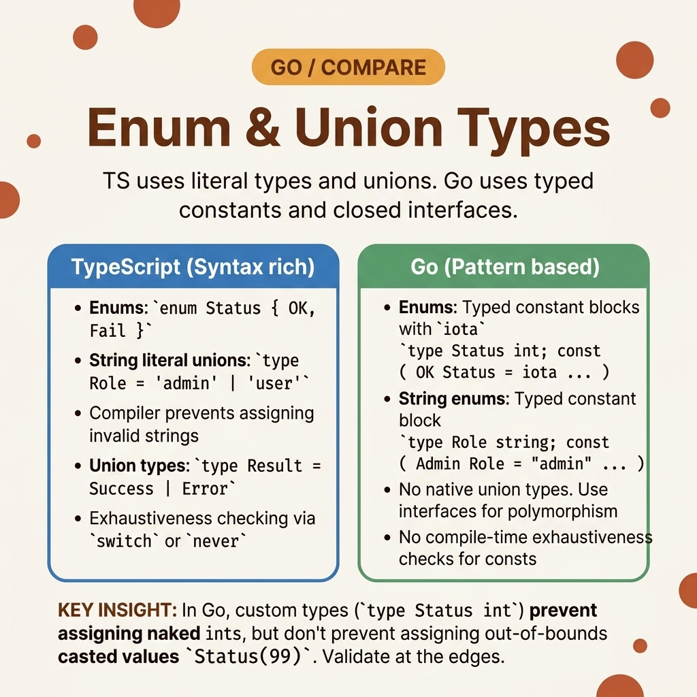

<!-- tags: golang, typing, enums --> # 🏷️ Các loại Enum & Union — TS → Go Mẫu

> TypeScript có từ khóa `enum` và các hiệp hội phân biệt đối xử ( `type Shape = Circle | Square` ). Go không có. Bạn mô phỏng các enum bằng `const` + `iota` và các loại kết hợp với interfaces được niêm phong chứa các phương thức chưa được xuất.

📅 Đã tạo: 23-03-2026 · 🔄 Đã cập nhật: 19-04-2026 · ⏱️ 14 phút đọc

## 1. ĐỊNH NGHĨA

Một kỹ sư giao diện người dùng xác định trạng thái API bằng `type Status = "ACTIVE" | "INACTIVE"` . TypeScript từ chối `Status = "UNKNOWN"` lúc biên dịch time . Kỹ sư chuyển cái này sang Go dưới dạng `type Status string` - nhưng Go cho phép bất kỳ ai viết `Status("UNKNOWN")` và trình biên dịch chấp nhận nó một cách im lặng. Trạng thái không hợp lệ đạt đến database , làm hỏng hồ sơ. Go không cung cấp kiểu chữ, không có từ khóa `enum` và không có kiểm tra `switch` đầy đủ. Bạn nhận được hai công cụ:

1. ** `const` + `iota` ** cho các enum số có giá trị tăng tự động.
2. **Đã niêm phong interfaces ** đối với các loại kết hợp — một phương thức chưa được xuất sẽ ngăn packages bên ngoài thêm các biến thể mới.

Cả hai đều yêu cầu xác thực rõ ràng: Go sẽ không bắt gặp các trường hợp `switch` bị thiếu khi biên dịch time .

### 1.1 Các kiểu bất biến và lỗi

| Ranh giới | Trách nhiệm cốt lõi |
| --- | --- |
| ** `iota` nhóm** | Các hằng số tự động tăng trong khối `const` . Đặt lại về 0 trong mỗi khối mới. |
| **Đã niêm phong interfaces ** | Một interface với phương thức chưa được xuất ( `sealed()` ) hạn chế việc triển khai ở package hiện tại. |

| Quy tắc | Cơ sở lý luận |
| --- | --- |
| **Bỏ qua số 0 bằng `_` ** | `iota` bắt đầu từ 0. Nếu số 0 là giá trị mặc định hợp lệ, các giá trị 0 ngẫu nhiên sẽ tạo ra các kết quả khớp ảo. Bỏ qua nó. |
| **Thêm phương thức `.IsValid()` ** | Các hằng chuỗi không có sự kiểm tra toàn diện. Đính kèm phương thức xác thực để từ chối các giá trị không xác định. |

### 1.2 Chuỗi thất bại

- **Việc đặt lại iota :** Bạn chia một khối `const` thành hai khối với suy nghĩ `iota` tiếp tục đếm. Nó đặt lại về 0 trong khối thứ hai - hai hằng số khác nhau có cùng giá trị số, gây ra xung đột im lặng.
- **Khẳng định sai:** Bạn viết `s.(Circle)` không có thành ngữ dấu phẩy-ok. Nếu `s` không phải là `Circle` , Go hoảng sợ. Sử dụng khối `v, ok := s.(Circle)` hoặc `switch s.(type)` .

## 2. HÌNH ẢNH

Các enum và kiểu kết hợp của TypeScript map đến Go 's `const` / `iota` và được niêm phong interfaces . Hình ảnh hiển thị bản dịch.  *Hình: TS enum trở thành khối `const` với `iota` . Các công đoàn bị phân biệt đối xử TS trở nên kín interfaces bằng các loại công tắc. Không cung cấp tính đầy đủ của biên dịch- time trong Go .*

## 3. MÃ

Với các ràng buộc được thiết lập, mã bên dưới thể hiện ba mẫu: enum số và chuỗi, liên kết kín interfaces và loại generic `Result[T]` .

### Ví dụ 1: Cơ bản — Hằng số và chuỗi enum

> **Mục tiêu**: Xác định các giá trị trạng thái giới hạn từ chối các đầu vào không hợp lệ tại runtime .
> **Phương pháp tiếp cận**: Sử dụng `const` + `iota` cho mức độ ưu tiên bằng số, `const` với các giá trị chuỗi rõ ràng cho các trạng thái. Thêm `.IsValid()` để xác thực runtime .
> **Độ phức tạp**: O(1) cho mỗi lần kiểm tra xác thực.```go
// core_enums.go
package helper

import "fmt"

type Priority int

const (
	// Skip zero to avoid accidental default matches
	_ Priority = iota 
	PriorityLow
	PriorityHigh
)

type Status string

const (
	StatusActive   Status = "ACTIVE"
	StatusInactive Status = "INACTIVE"
)

func (s Status) IsValid() bool {
	switch s {
	case StatusActive, StatusInactive:
		return true
	}
	return false
}

func ExecuteStatusGuard(input Status) {
	if !input.IsValid() {
		fmt.Println("Blocked invalid state")
		return
	}
	fmt.Println("Processing valid state")
}
```> **Takeaway**: `Status("UNKNOWN")` biên dịch — Go không hạn chế việc truyền kiểu được đặt tên. Phương pháp `.IsValid()` là cách phòng thủ duy nhất. Gọi nó ở ranh giới (trình xử lý HTTP, trình tiêu thụ thông báo) trước khi chuyển các giá trị vào logic nghiệp vụ.

---

### Ví dụ 2: Trung gian — Liên kết kín interfaces > **Mục tiêu**: Mô phỏng `type Command = StartCommand | StopCommand` của TypeScript với điều khiển biến thể biên dịch- time .
> **Phương pháp tiếp cận**: Xác định một interface bằng phương thức `sealed()` chưa xuất. Chỉ structs trong cùng package mới có thể triển khai nó.
> **Độ phức tạp**: O(1) trên type switch .```go
// sealed_unions.go
package helper

import "fmt"

// TS: type Command = StartCommand | StopCommand
type Command interface {
	Execute() error
	// ✅ Unexported method prevents external packages from adding variants
	sealed() 
}

type StartCommand struct{ TargetID string }
func (s StartCommand) Execute() error { return nil }
func (StartCommand) sealed()          {}

type StopCommand struct{ Graceful bool }
func (s StopCommand) Execute() error { return nil }
func (StopCommand) sealed()          {}

func ProcessCommand(c Command) string {
	// TS: switch (c.kind) 
	switch v := c.(type) {
	case StartCommand:
		return fmt.Sprintf("Starting %s", v.TargetID)
	case StopCommand:
		return fmt.Sprintf("Stopping: graceful=%v", v.Graceful)
	default:
		return "Unknown command"
	}
}
```> **Takeaway**: Phương thức `sealed()` không được xuất — packages bên ngoài không thể thêm các biến thể `Command` mới. Điều này mang lại cho bạn quyền kiểm soát cấp độ package đối với liên minh. Luôn bao gồm trường hợp `default` trong type switch để nắm bắt các trạng thái không thể xảy ra trong quá trình tái cấu trúc.

---

### Ví dụ 3: Nâng cao — Generic Loại kết quả

> **Mục tiêu**: Xây dựng vùng chứa `Result[T]` buộc người gọi phải kiểm tra thành công trước khi truy cập giá trị, tương tự như `Result<T, E>` của Rust.
> **Phương pháp tiếp cận**: Generic struct với các trường `ok` boolean, `value` và `err` . `Unwrap()` trả về `(T, error)` .
> **Độ phức tạp**: O(1) mỗi lần mở gói.```go
// generic_results.go
package helper

import "fmt"

// TS: type Result<T> = { ok: true, value: T } | { ok: false, error: Error }
type Result[T any] struct {
	value T
	err   error
	ok    bool
}

func Ok[T any](value T) Result[T] {
	return Result[T]{value: value, ok: true}
}

func Err[T any](err error) Result[T] {
	return Result[T]{err: err, ok: false}
}

func (r Result[T]) Unwrap() (T, error) {
	if r.ok {
		return r.value, nil
	}
	return r.value, r.err
}

func DemonstrateFunctionalReturn() {
	result := Ok("Valid Config")
	
	val, err := result.Unwrap()
	if err != nil {
		fmt.Println("Failed:", err)
		return
	}
	fmt.Println("Processed:", val)
}
```> **Takeaway**: Trong hầu hết mã Go , các giá trị trả về `(T, error)` là đủ thành ngữ. `Result[T]` rất hữu ích trong các tình huống pipeline trong đó bạn muốn xâu chuỗi các thao tác mà không cần kiểm tra lỗi ở mỗi bước — nhưng nó chống lại các quy ước Go . Sử dụng một cách thận trọng.

## 4. Cạm bẫy

| # | Khiếm khuyết | Sửa chữa |
| --- | --- | --- |
| 1 | Tách các khối `const` và mong đợi `iota` tiếp tục | Giữ tất cả các giá trị trong một khối `const` duy nhất. `iota` đặt lại trong mỗi khối mới. |
| 2 | Sử dụng số 0 làm giá trị enum hợp lệ | Bỏ qua số 0 bằng `_ = iota` để các biến chưa được khởi tạo không vô tình khớp với trạng thái hợp lệ. |
| 3 | Thiếu `default` trong loại switch | Luôn thêm trường hợp `default` . Nó nắm bắt các biến thể mới được thêm vào trong quá trình tái cấu trúc. |

## 5. GIỚI THIỆU

| Tài nguyên | Liên kết |
| --- | --- |
| Iota Thông số kỹ thuật | [go.dev/ref/spec#Iota](https://go.dev/ref/spec#Iota) |
| Công cụ `stringer` | [pkg.go.dev/golang.org/x/tools/cmd/stringer](https://pkg.go.dev/golang.org/x/tools/cmd/stringer) |

## 6. KHUYẾN NGHỊ

| Gia hạn | Khi nào | Cơ sở lý luận |
| --- | --- | --- |
| [Data Conversion](./01-data-conversion.md) | Khi phân tích các giá trị enum từ tải trọng đến | Xác thực chuyển đổi chuỗi thành enum ở ranh giới |
| [Error Handling](./07-error-handling.md) | Khi lỗi xác thực cần phản hồi lỗi có cấu trúc | Kết hợp xác thực enum với lỗi trọng điểm |

**Điều hướng**: [← Date/Time](./05-date-time.md) · [→ Error Handling](./07-error-handling.md)