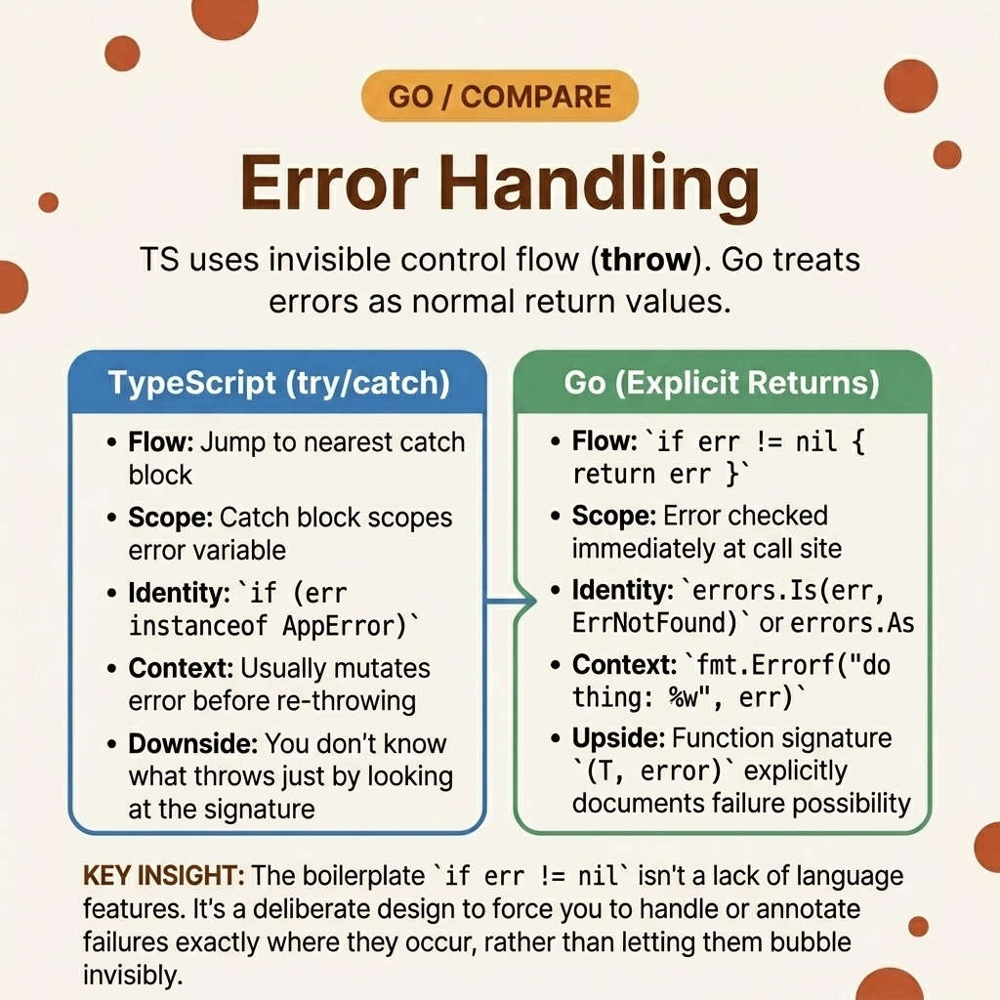

<!-- tags: golang, error-handling --> # ⚠️ Xử lý lỗi - TS try/catch → Go mẫu lỗi

> TypeScript gói toàn bộ ngăn xếp cuộc gọi trong một `try/catch` . Go trả về lỗi dưới dạng giá trị - mọi lệnh gọi hàm đều có kiểm tra `if err != nil` riêng. Đây là chi tiết theo thiết kế: lỗi được xử lý tại thời điểm chính xác mà chúng xảy ra, không phải ở một khối bắt xa nào đó.

📅 Đã tạo: 23-03-2026 · 🔄 Đã cập nhật: 19-04-2026 · ⏱️ 16 phút đọc

## 1. ĐỊNH NGHĨA

Một kỹ sư giao diện người dùng thay thế `throw new Error("invalid")` bằng `panic("invalid")` và gói người gọi trong `defer/recover` . Mã hoạt động trong các thử nghiệm. Trong quá trình sản xuất, panic loại bỏ toàn bộ goroutine stack - bao gồm cả việc chia sẻ công việc đồng thời không liên quan goroutine . Go xử lý lỗi dưới dạng **giá trị** chứ không phải ngoại lệ. Các hàm trả về bộ dữ liệu `(T, error)` . Người gọi kiểm tra `err != nil` ngay lập tức — không tháo stack , không có khối bắt ở xa. `panic` được dành riêng cho các lỗi không thể khôi phục ( nil pointer , trạng thái không thể khắc phục) sẽ làm hỏng chương trình. Lỗi thường xuyên (không tìm thấy tệp, đầu vào không hợp lệ, thời gian chờ mạng) trả về lỗi.

### 1.1 Các kiểu bất biến và lỗi

| Ranh giới | Trách nhiệm cốt lõi |
| --- | --- |
| ** `(T, error)` trả về** | Mọi hàm có thể sai đều trả về một lỗi. Người gọi kiểm tra `err != nil` trước khi sử dụng `T` . |
| ** `errors.Is` / `errors.As` ** | `Is` khớp với các giá trị trọng điểm thông qua các chuỗi được bao bọc. `As` trích xuất các lỗi đánh máy để truy cập trường. |

| Quy tắc | Cơ sở lý luận |
| --- | --- |
| **Không bao giờ sử dụng `panic` cho luồng điều khiển** | `panic` giải phóng toàn bộ goroutine stack . Chỉ sử dụng nó cho các lỗi lập trình viên, không sử dụng lỗi runtime . |
| **Gói bằng `%w` , không phải `%v` ** | `fmt.Errorf("context: %w", err)` bảo tồn chuỗi lỗi. `%v` chuyển đổi thành một chuỗi — `errors.Is` ngừng hoạt động. |

### 1.2 Chuỗi thất bại

- **Chuỗi bị mất:** Bạn gói một lỗi bằng `fmt.Errorf("failed: %v", err)` . Động từ `%v` định dạng lỗi dưới dạng chuỗi và loại bỏ lỗi gốc. Hạ lưu `errors.Is(err, ErrNotFound)` trả về `false` vì chuỗi bị hỏng.
- **Bộ dữ liệu bị bỏ qua:** Bạn viết `result, _ := Execute()` . Nếu `Execute` trả về lỗi, `result` là giá trị bằng 0. Bạn chèn một bản ghi trống vào database mà không để ý.

## 2. HÌNH ẢNH

JavaScript bắt lỗi từ xa. Go bắt chúng tại nguồn. Hình ảnh so sánh cả hai luồng.  *Hình: JS `try/catch` kết thúc nhiều lệnh gọi. Go kiểm tra `err != nil` sau mỗi cuộc gọi. Mẫu Go dài dòng nhưng xác định chính xác thao tác nào không thành công.*

## 3. MÃ

Với triết lý lỗi đã được thiết lập, mã bên dưới thể hiện ba mẫu: bao gồm các lỗi trọng điểm, các loại lỗi miền tùy chỉnh và tổng hợp nhiều lỗi với `errors.Join` .

### Ví dụ 1: Cơ bản — Gói lỗi trọng điểm

> **Mục tiêu**: Trả về các lỗi cụ thể theo miền mà người gọi có thể khớp với `errors.Is` .
> **Cách tiếp cận**: Xác định trọng điểm bằng `errors.New` . Gói bằng `fmt.Errorf("context: %w", err)` để thêm ngữ cảnh trong khi bảo toàn chuỗi.
> **Độ phức tạp**: O(1) mỗi gói/kiểm tra.```go
// sentinel_wrapping.go
package errors

import (
	"errors"
	"fmt"
)

var (
	ErrNotFound   = errors.New("record missing")
	ErrValidation = errors.New("invalid payload")
)

func QueryDatabase(id int) (string, error) {
	if id <= 0 {
		// ✅ %w preserves the sentinel — errors.Is(err, ErrValidation) works
		return "", fmt.Errorf("query validation failure id=%d: %w", id, ErrValidation)
	}
	return "Record_Hash", nil
}

func ExecuteLookup() {
	_, err := QueryDatabase(-5)
	
	if err != nil {
		// TS: if (err instanceof ValidationError)
		if errors.Is(err, ErrValidation) {
			fmt.Println("Blocked invalid query")
			return
		}
		fmt.Println("Unhandled error:", err)
	}
}
```> **Takeaway**: `%w` là động từ format duy nhất giữ lại chuỗi lỗi. Thay thế mọi `%v` trong error wrapping bằng `%w` .

---

### Ví dụ 2: Trung cấp — Các loại lỗi miền tùy chỉnh

> **Mục tiêu**: Đính kèm siêu dữ liệu có cấu trúc (mã trạng thái HTTP, thông báo tên miền) vào các lỗi về phản hồi API.
> **Phương pháp tiếp cận**: Triển khai `error` và `Unwrap()` interfaces trên struct . Sử dụng `errors.As` để trích xuất các trường.
> **Độ phức tạp**: O(1) trên type assertion .```go
// custom_domains.go
package errors

import (
	"errors"
	"fmt"
)

type DomainError struct {
	Code    int  
	Message string
	Err     error
}

func (e *DomainError) Error() string {
	if e.Err != nil {
		return fmt.Sprintf("[%d] %s: %v", e.Code, e.Message, e.Err)
	}
	return fmt.Sprintf("[%d] %s", e.Code, e.Message)
}

func (e *DomainError) Unwrap() error {
	return e.Err
}

func ExtractDomain(err error) {
	var target *DomainError
	
	// TS: if (e instanceof DomainError)
	if errors.As(err, &target) {
		fmt.Printf("API Code: %d\n", target.Code)
		return
	}
}
```> **Takeaway**: `errors.As` duyệt chuỗi lỗi và trích xuất kết quả khớp đầu tiên. `Unwrap()` cho phép việc truyền tải này. Nếu không có `Unwrap` , các lỗi được gói sẽ mờ đối với `errors.As` .

---

### Ví dụ 3: Nâng cao — Tập hợp nhiều lỗi

> **Mục tiêu**: Thu thập tất cả các lỗi xác thực thay vì dừng ở lỗi đầu tiên, giống như trình xác thực biểu mẫu.
> **Phương pháp tiếp cận**: Tích lũy lỗi trong slice và kết hợp với `errors.Join` ( Go 1.20+). Mỗi lỗi riêng lẻ vẫn có thể khớp với `errors.Is` .
> **Độ phức tạp**: O(N) — một lỗi cho mỗi quy tắc xác thực.```go
// aggregate_joins.go
package errors

import (
	"errors"
	"fmt"
)

func ValidateFields(name string, age int) error {
	var aggregated []error

	if name == "" {
		aggregated = append(aggregated, errors.New("name is required"))
	}
	
	if age < 0 || age > 150 {
		aggregated = append(aggregated, fmt.Errorf("invalid age: %d", age))
	}

	if len(aggregated) > 0 {
		// ✅ Join combines multiple errors into one; errors.Is checks each
		return errors.Join(aggregated...)
	}
	return nil
}

func VerifyAggregates() {
	err := ValidateFields("", -5)
	if err != nil {
		fmt.Println("Validation errors:", err)
	}
}
```> **Takeaway**: `errors.Join` giữ nguyên từng lỗi riêng lẻ — `errors.Is(joined, ErrSpecific)` hoạt động nếu lỗi phụ any khớp. Đây là Go tương đương với việc thu thập các lỗi xác thực trong array .

## 4. Cạm bẫy

| # | Khiếm khuyết | Sửa chữa |
| --- | --- | --- |
| 1 | Chuyển sai loại pointer sang `errors.As` | Vượt qua `&target` trong đó `target` là một `*DomainError` . Cần có pointer kép. |
| 2 | Sử dụng `recover` để xử lý lỗi thông thường | `recover` chỉ dành cho sự hoảng loạn. Sử dụng `if err != nil` cho các lỗi thông thường. |
| 3 | Trả về lỗi thô không có ngữ cảnh | Bao bọc bằng `fmt.Errorf("functionName: %w", err)` để thêm ngữ cảnh trang web cuộc gọi. |

## 5. GIỚI THIỆU

| Tài nguyên | Liên kết |
| --- | --- |
| `errors` package | [pkg.go.dev/errors](https://pkg.go.dev/errors) |
| Hiệu lực Go : Lỗi | [go.dev/doc/effective_go#errors](https://go.dev/doc/effective_go#errors) |

## 6. KHUYẾN NGHỊ

| Gia hạn | Khi nào | Cơ sở lý luận |
| --- | --- | --- |
| [Custom Error Wrappers](../errors/01-wrapping-custom.md) | Khi xây dựng hệ thống phân cấp lỗi microservice nhiều lớp | Các loại lỗi dành riêng cho tên miền với mã HTTP và siêu dữ liệu |
| [Defer/Panic/Recover](../basics/03-defer-panic-recover.md) | Khi xử lý các trạng thái thực sự không thể phục hồi | Các mẫu `defer` / `recover` cho panic -safe goroutines |

**Điều hướng**: [← Enum Types](./06-enum-union-types.md) · [→ Regex & Templates](./08-regex-templates.md)