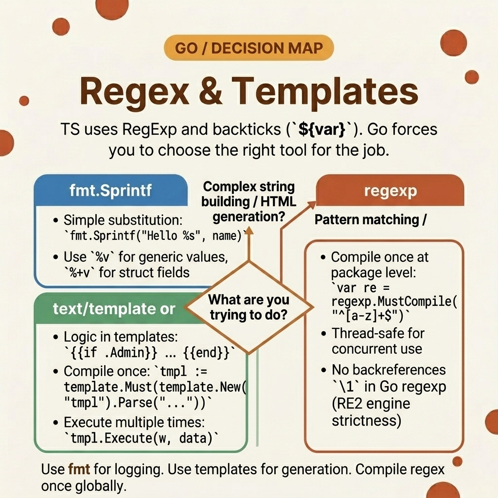

<!-- tags: golang, regex, templates -->
# 🔍 Regex & Templates — TS RegExp → Go `regexp` & `text/template`

> JavaScript caches regex engines internally. Go does not — calling `regexp.Compile` inside a loop rebuilds the finite automaton every iteration. Compile once at package level with `regexp.MustCompile`. Go's RE2 engine guarantees linear-time matching but drops lookaheads and lookbehinds.

📅 Created: 2026-03-23 · 🔄 Updated: 2026-04-19 · ⏱️ 14 min read

## 1. DEFINE

A backend developer processes thousands of audit log lines, extracting timestamps and error codes. They call `regexp.Compile(`\d+`)` inside the loop — one compilation per line. Go builds a finite automaton from the pattern string on every call. At 10K lines/second, the CPU spends more time compiling patterns than matching text.

JavaScript's VM caches `RegExp` objects transparently. Go exposes the compilation cost directly. The fix: declare `var pattern = regexp.MustCompile(...)` at package scope. The pattern compiles once at init time and is safe for concurrent use across goroutines.

Go uses the **RE2 engine**, which guarantees O(N) matching time — no catastrophic backtracking. The trade-off: RE2 does not support lookaheads (`(?=...)`), lookbehinds (`(?<=...)`), or backreferences (`\1`). If your JavaScript regex uses these, you must refactor it into multiple simpler patterns.

### 1.1 Invariants & Failure Modes

| Boundary | Core Responsibility |
| --- | --- |
| **`regexp.MustCompile`** | Compiles at package init, panics on invalid patterns. Use for known-good patterns. Thread-safe. |
| **RE2 syntax** | Linear-time guarantee. No lookaheads, lookbehinds, or backreferences. |

| Rule | Rationale |
| --- | --- |
| **Use `Compile` for user input** | `MustCompile` panics on invalid patterns. User-provided patterns must use `Compile` with error handling. |
| **Use `html/template` for HTML** | `text/template` does not escape output. Rendering user input produces XSS vulnerabilities. |

### 1.2 Failure Cascades

- **The regex loop collapse:** Compiling a pattern inside a hot loop allocates a new automaton per iteration. Under load, GC pauses spike and the service becomes unresponsive.
- **The lookahead panic:** You port a JavaScript regex with `(?=...)` to Go. `MustCompile` panics at startup because RE2 does not support lookaheads. The service never starts.

## 2. VISUAL

JavaScript regex methods and Go equivalents map differently. The visual shows the translation.



*Figure: JS regex methods (`match`, `replace`, `test`) mapped to Go `regexp` receivers (`FindAllString`, `ReplaceAllString`, `MatchString`). All Go methods require a pre-compiled `*Regexp`.*

## 3. CODE

With the compilation rules established, the code below demonstrates three patterns: global compilation with matching, named capture groups, and Go templates for dynamic output.

### Example 1: Basic — Package-level compilation

> **Goal**: Extract and replace digit sequences in strings without recompiling per call.
> **Approach**: Declare the pattern at package scope with `MustCompile`. Call methods on the cached instance.
> **Complexity**: O(1) compile, O(N) per match/replace.

```go
// core_regex_compilation.go
package parsers

import (
	"fmt"
	"regexp"
)

// ✅ Compiled once at package init — safe for concurrent use
var digitsPattern = regexp.MustCompile(`\d+`)

func ExtractDigits(input string) {
	// TS: input.match(/\d+/g)
	matches := digitsPattern.FindAllString(input, -1)
	
	fmt.Println("Count:", len(matches))
	fmt.Println("Values:", matches)
}

func MaskCharacters(input string) string {
	// TS: input.replace(/\d+/g, "***")
	return digitsPattern.ReplaceAllString(input, "***")
}
```

> **Takeaway**: Treat compiled regexes like singletons — declare them at package scope. `MustCompile` panics on invalid patterns, which is correct for hardcoded patterns (you want to fail at startup, not at runtime).

---

### Example 2: Intermediate — Named capture groups

> **Goal**: Parse structured log lines into a key-value map using named groups.
> **Approach**: Use `(?P<name>...)` syntax (note: Go uses `P` prefix, unlike JavaScript's `(?<name>...)`). `SubexpNames()` returns group names for mapping.
> **Complexity**: O(N) per match.

```go
// grouped_metadata.go
package parsers

import (
	"regexp"
)

var accessLogPattern = regexp.MustCompile(`(?P<date>\d{4}-\d{2}-\d{2})\s+\[(?P<level>\w+)\]\s+(?P<message>.+)`)

func ExtractStructuredLogs(logString string) map[string]string {
	match := accessLogPattern.FindStringSubmatch(logString)
	if match == nil {
		return nil
	}

	result := make(map[string]string)
	
	// SubexpNames()[0] is the full match (empty name) — skip it
	for i, name := range accessLogPattern.SubexpNames() {
		if i > 0 && name != "" && i < len(match) {
			result[name] = match[i]
		}
	}
	
	return result
}
```

> **Takeaway**: Go uses `(?P<name>...)` — the `P` prefix is required. JavaScript uses `(?<name>...)` without the `P`. Missing the `P` produces a compile error.

---

### Example 3: Advanced — Go templates for dynamic output

> **Goal**: Generate structured text output with loops and conditionals, similar to JavaScript template literals but with logic.
> **Approach**: Use `text/template` with `template.Must` for compile-time validation. `Execute` renders the template into a `strings.Builder`.
> **Complexity**: O(N) per render.

```go
// structural_templates.go
package parsers

import (
	"fmt"
	"strings"
	"text/template"
)

type Notification struct {
	User  string
	Role  string
	Flags []string
}

// ✅ template.Must panics on parse errors — fail at init, not at runtime
var alertTemplate = template.Must(template.New("alert").Parse(`
User: {{.User}}
Role: {{.Role}}
Flags: {{range .Flags}}[{{.}}] {{end}}
`))

func GenerateWarning(alert Notification) {
	var buffer strings.Builder
	
	// Execute renders the template with the provided data
	alertTemplate.Execute(&buffer, alert)
	
	fmt.Println(buffer.String())
}
```

> **Takeaway**: Use `text/template` for logs, emails, and internal output. Use `html/template` for anything rendered in a browser — it auto-escapes HTML entities to prevent XSS.

## 4. PITFALLS

| # | Defect | Fix |
| --- | --- | --- |
| 1 | Using `MustCompile` with user-provided patterns | `MustCompile` panics on invalid input. Use `regexp.Compile(input)` and handle the error. |
| 2 | Porting JavaScript regex with lookaheads | Go's RE2 engine does not support `(?=...)` or `(?<=...)`. Split into multiple simpler patterns. |
| 3 | Using `text/template` for HTML output | `text/template` does not escape HTML. Use `html/template` to prevent XSS. |

## 5. REF

| Resource | Link |
| --- | --- |
| `regexp` package | [pkg.go.dev/regexp](https://pkg.go.dev/regexp) |
| RE2 syntax reference | [github.com/google/re2/wiki/Syntax](https://github.com/google/re2/wiki/Syntax) |

## 6. RECOMMEND

| Extension | When | Rationale |
| --- | --- | --- |
| [Goroutines & Channels](../concurrency/01-goroutines-and-channels.md) | When processing logs concurrently | Compiled regexes are thread-safe — share across goroutines |
| [Data Conversion](./01-data-conversion.md) | When replacing fixed strings without regex | `strings.Replacer` is faster than regex for literal replacements |

**Navigation**: [← Error Handling](./07-error-handling.md) · [→ Set & Concurrent Map](./09-set-concurrent-map.md)
