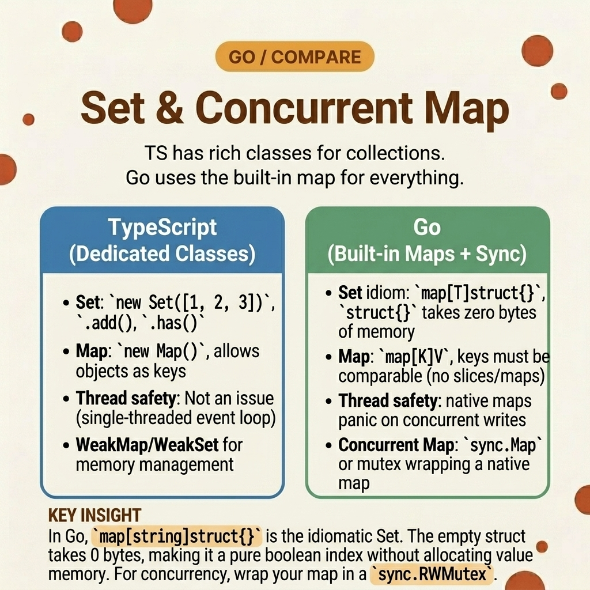

<!-- tags: golang, map, concurrency, data-structures --> # 🗃️ Đặt & Đồng thời Map — TS Set/ Map /WeakMap → Go > JavaScript có sẵn `Set<T>` và `Map<K,V>` . Go không có — bạn xây dựng các tập hợp có `map[T]struct{}` và đồng thời maps với các trình bao bọc `sync.RWMutex` . Truy cập đồng thời map mà không có mutex gây ra sự cố nghiêm trọng, không thể phục hồi.

📅 Đã tạo: 23-03-2026 · 🔄 Đã cập nhật: 19-04-2026 · ⏱️ 12 phút đọc

## 1. ĐỊNH NGHĨA

Năm goroutines chèn ID người dùng vào `map[string]bool` được chia sẻ cùng một lúc. Go runtime phát hiện quá trình ghi đồng thời và gặp sự cố với `fatal error: concurrent map writes` — không phục hồi, không tắt máy dễ dàng. Quá trình này bị giết. Go maps không an toàn thread -. Không giống như JavaScript (chạy trên một thread ), Go truy cập thường xuyên maps từ nhiều goroutines . Có hai lựa chọn:

1. ** `sync.RWMutex` ** — bọc một map thông thường bằng các khóa đọc/ghi. An toàn loại đầy đủ với generics .
2. ** `sync.Map` ** — tích hợp đồng thời map , nhưng sử dụng `any` cho các khóa và giá trị (không generics , yêu cầu xác nhận loại).

Đối với các bộ, Go không có loại `Set` . Sử dụng `map[T]struct{}` — struct trống chiếm 0 byte, làm cho nó trở thành biểu diễn tập hợp hiệu quả về bộ nhớ nhất.

### 1.1 Các kiểu bất biến và lỗi

| Ranh giới | Trách nhiệm cốt lõi |
| --- | --- |
| **Bộ phân bổ bằng 0** | `map[T]struct{}` sử dụng 0 byte cho mỗi giá trị. `map[T]bool` lãng phí 1 byte cho mỗi mục nhập. |
| ** Thread -truy cập an toàn** | Quyền truy cập map không được bảo vệ từ nhiều goroutines là một sự cố nghiêm trọng, không phải là một cuộc chạy đua dữ liệu. |

| Quy tắc | Cơ sở lý luận |
| --- | --- |
| **Không bao giờ chia sẻ thô maps trên goroutines ** | Ngay cả việc đọc đồng thời với một lần ghi cũng làm hỏng quá trình. Sử dụng trình bao bọc mutex hoặc `sync.Map` . |
| **Thích trình bao bọc generic hơn `sync.Map` ** | `sync.Map` lưu trữ `any` - mọi quyền truy cập đều cần có type assertion . Trình bao bọc Generic mutex bảo đảm an toàn cho loại. |

### 1.2 Chuỗi thất bại

- **Thuế bộ nhớ boolean:** `map[string]bool` với 1 triệu mục nhập sẽ lãng phí 1 MB đối với các giá trị boolean. `map[string]struct{}` sử dụng chính xác byte bằng 0 cho các giá trị - chỉ các khóa mới tiêu tốn bộ nhớ.
- **Bẫy `sync.Map` chưa được gõ:** `sync.Map.Load` trả về `any` . Việc quên type assertion âm thầm truyền nhầm loại xuống dòng gây hoang mang xa nguồn.

## 2. HÌNH ẢNH

Bộ JavaScript và bộ dựa trên Go map - khác nhau về bề mặt API và độ an toàn thread . Hình ảnh maps bản dịch.  *Hình: Các phương thức JS `Set` được ánh xạ tới các hoạt động Go `map[T]struct{}` . Go yêu cầu trình bao bọc mutex rõ ràng để truy cập đồng thời.*

## 3. MÃ

Với các ràng buộc concurrency được thiết lập, mã bên dưới sẽ xây dựng ba mẫu: một bộ generic , một mutex -protected map và cách sử dụng `sync.Map` .

### Ví dụ 1: Cơ bản — Generic Cài đặt triển khai

> **Mục tiêu**: Xây dựng một loại `Set[T]` an toàn với `Add` , `Has` , `Delete` và `Intersection` sử dụng các giá trị phân bổ bằng 0.
> **Phương pháp tiếp cận**: Xác định `Set[T comparable]` làm bí danh loại cho `map[T]struct{}` .
> **Độ phức tạp**: O(1) mỗi lần thêm/có/xóa; O(min(N,M)) cho giao lộ.```go
// generic_sets.go
package collections

type Set[T comparable] map[T]struct{}

func NewSet[T comparable](items ...T) Set[T] {
	target := make(Set[T], len(items))
	for _, element := range items {
		target[element] = struct{}{} // zero bytes per entry
	}
	return target
}

func (s Set[T]) Add(item T)       { s[item] = struct{}{} }
func (s Set[T]) Has(item T) bool  { _, exists := s[item]; return exists }
func (s Set[T]) Delete(item T)    { delete(s, item) }

func (s Set[T]) Intersection(other Set[T]) Set[T] {
	result := NewSet[T]()
	for element := range s {
		if other.Has(element) {
			result.Add(element)
		}
	}
	return result
}
```> **Takeaway**: `struct{}` là giá trị thành ngữ Go "Tôi chỉ quan tâm đến khóa". Nó chiếm 0 byte - `unsafe.Sizeof(struct{}{})` trả về 0.

---

### Ví dụ 2: Trung cấp — Mutex -được bảo vệ generic map > **Mục tiêu**: Xây dựng một map đồng thời với loại an toàn đầy đủ bằng cách sử dụng generics và `sync.RWMutex` .
> **Phương pháp tiếp cận**: `RLock` để đọc (cho phép nhiều người đọc đồng thời), `Lock` để ghi (độc quyền).
> **Độ phức tạp**: O(1) cho mỗi thao tác; khóa thang đo tranh chấp với số lượng goroutine .```go
// secure_maps.go
package collections

import "sync"

type SafeMap[K comparable, V any] struct {
	mu    sync.RWMutex
	store map[K]V
}

func NewSafeMap[K comparable, V any]() *SafeMap[K, V] {
	return &SafeMap[K, V]{store: make(map[K]V)}
}

func (sm *SafeMap[K, V]) Set(key K, value V) {
	sm.mu.Lock()
	defer sm.mu.Unlock()
	sm.store[key] = value
}

func (sm *SafeMap[K, V]) Get(key K) (V, bool) {
	sm.mu.RLock()
	defer sm.mu.RUnlock()
	
	val, ok := sm.store[key]
	return val, ok
}
```> **Takeaway**: `RWMutex` cho phép nhiều người đọc đồng thời — chỉ có thao tác ghi là độc quyền. Điều này quan trọng đối với khối lượng công việc đọc nhiều (bộ đệm cấu hình, cửa hàng session ). Đối với khối lượng công việc ghi nhiều, mutex sẽ trở thành nút thắt cổ chai.

---

### Ví dụ 3: Nâng cao — Đồng bộ hóa tích hợp. Map > **Mục tiêu**: Sử dụng tính năng đồng thời tích hợp sẵn của Go map cho các tình huống đọc nhiều, hiếm ghi.
> **Phương pháp tiếp cận**: `sync.Map` được tối ưu hóa cho hai mẫu: (1) các khóa được viết một lần và đọc nhiều lần, (2) các bộ khóa rời rạc trên goroutines . Nó sử dụng `any` cho cả khóa và giá trị.
> **Độ phức tạp**: O(1) được khấu hao cho mỗi hoạt động.```go
// standard_sync_map.go
package collections

import (
	"fmt"
	"sync"
)

func ExecuteSyncMap() {
	var sharedMap sync.Map

	// Store accepts any key and any value — no type safety
	sharedMap.Store("TargetHost", "127.0.0.1")
	sharedMap.Store("ActivePort", 443)

	payload, exists := sharedMap.Load("TargetHost")
	fmt.Printf("Value: %v (Found: %v)\n", payload, exists)

	// LoadOrStore returns existing value if key exists, stores otherwise
	current, loaded := sharedMap.LoadOrStore("TargetHost", "192.168.1.1")
	fmt.Printf("Value: %v (Was cached: %v)\n", current, loaded)
}
```> **Takeaway**: `sync.Map` chậm hơn so với mutex -wrapped map để sử dụng thông thường. Nó tỏa sáng theo hai kiểu cụ thể: phím ổn định (đọc nặng) và phím rời (không tranh chấp). Đối với mọi thứ khác, hãy sử dụng generic `SafeMap` từ Ví dụ 2.

## 4. Cạm bẫy

| # | Khiếm khuyết | Sửa chữa |
| --- | --- | --- |
| 1 | Chia sẻ thô `map` trên goroutines | Gói bằng `sync.RWMutex` hoặc sử dụng `sync.Map` . Việc ghi đồng thời rất nguy hiểm - không phải là một cuộc chạy đua dữ liệu, mà là một sự cố. |
| 2 | Sử dụng `sync.Map` cho mã an toàn loại | `sync.Map` lưu trữ `any` . Sử dụng generic mutex -wrapped map để đảm bảo an toàn về loại. |
| 3 | Sử dụng `map[T]bool` cho các bộ | Sử dụng `map[T]struct{}` - 0 byte cho mỗi giá trị thay vì 1 byte cho mỗi boolean. |

## 5. GIỚI THIỆU

| Tài nguyên | Liên kết |
| --- | --- |
| `sync.Map` tài liệu | [pkg.go.dev/sync#Map](https://pkg.go.dev/sync#Map) |
| `sync.RWMutex` tài liệu | [pkg.go.dev/sync#RWMutex](https://pkg.go.dev/sync#RWMutex) |

## 6. KHUYẾN NGHỊ

| Gia hạn | Khi nào | Cơ sở lý luận |
| --- | --- | --- |
| [Goroutines & Channels](../concurrency/01-goroutines-and-channels.md) | Khi thiết kế đường dẫn dữ liệu đồng thời | Hiểu vòng đời goroutine để truy cập map an toàn |
| [Map Utilities](./03-object-map-utils.md) | Khi chuyển đổi dữ liệu map (khóa, hợp nhất, chọn) | Generic các hàm tiện ích cho các hoạt động đơn luồng map |

**Điều hướng**: [← Regex & Templates](./08-regex-templates.md) · [→ Iterator Patterns](./10-iterator.md)