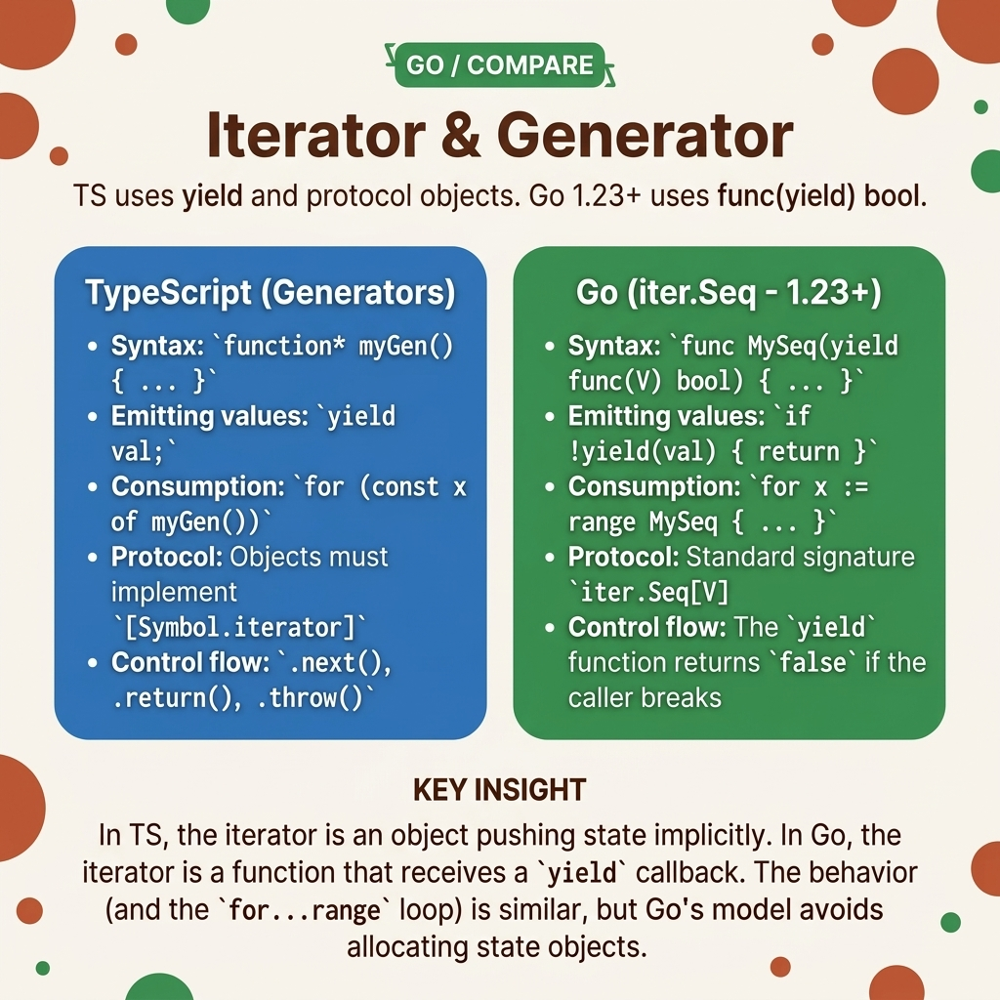

<!-- tags: golang, iterators, generics -->
# 🔄 Iterator — TS for...of / Generator → Go `iter.Seq` & range

> TypeScript uses `function*` generators with `yield` for lazy sequences. Go 1.23+ introduces `iter.Seq[V]` — a function-based iterator that integrates with `for range`. No channels, no goroutines, no leaks.

📅 Created: 2026-03-23 · 🔄 Updated: 2026-04-19 · ⏱️ 12 min read

## 1. DEFINE

A developer ports a paginated database cursor from JavaScript's `for await (const page of fetchPages())` generator. They implement it using Go channels — a goroutine sends pages to a channel, the consumer reads with `for page := range ch`.

The client disconnects mid-iteration. Nobody reads from the channel anymore. The goroutine blocks on `ch <- page` forever — it leaks memory for the lifetime of the process. Go 1.23+ solves this with `iter.Seq[V]`: a closure-based iterator that runs synchronously in the caller's goroutine. When the consumer breaks, the iterator stops immediately — no goroutine to leak.

### 1.1 Invariants & Failure Modes

| Boundary | Core Responsibility |
| --- | --- |
| **`iter.Seq[V]`** | A function `func(yield func(V) bool)` that calls `yield` for each element. Runs in the caller's goroutine. |
| **Zero-leak guarantee** | No goroutines are spawned. When the consumer breaks, `yield` returns `false` and the iterator exits. |

| Rule | Rationale |
| --- | --- |
| **Always check `!yield(v)`** | If the consumer breaks out of the `for range` loop, `yield` returns `false`. Ignoring it creates an infinite loop. |
| **Prefer `iter.Seq` over channels** | Channel-based iterators require goroutine lifecycle management. `iter.Seq` has no lifecycle — it's a function call. |

### 1.2 Failure Cascades

- **The zombie loop:** Your iterator ignores the `yield` return value. The consumer calls `break` in the `for range` loop, but the iterator keeps generating values — infinite CPU usage until the process is killed.
- **The channel trap:** You use a goroutine and a channel to implement lazy iteration. The consumer abandons the channel. The goroutine blocks on send forever — one leaked goroutine per abandoned iteration.

## 2. VISUAL

JavaScript generators and Go `iter.Seq` achieve the same goal (lazy iteration) through different mechanisms.



*Figure: JS generators use `yield` to pause execution. Go `iter.Seq` uses a closure that calls `yield(v)` — when `yield` returns `false`, the iterator exits. No goroutines involved.*

## 3. CODE

With the closure-based model established, the code below builds three patterns: basic range generation, key-value iteration with `iter.Seq2`, and lazy filtering pipelines.

### Example 1: Basic — Range generator

> **Goal**: Create a custom range iterator equivalent to JavaScript's `function* range(start, end)`.
> **Approach**: Return an `iter.Seq[int]` closure that calls `yield` for each value.
> **Complexity**: O(N) elements yielded.

```go
// basic_sequences.go
package iterators

import (
	"fmt"
	"iter"
)

// TS: function* range(start, end) { for (let i = start; i < end; i++) yield i }
func RangeBounds(start, end int) iter.Seq[int] {
	return func(yield func(int) bool) {
		for index := start; index < end; index++ {
			// ✅ Check yield return: false means the consumer called break
			if !yield(index) {
				return
			}
		}
	}
}

func ExecuteGenerators() {
	// Works directly with for-range (Go 1.23+)
	for value := range RangeBounds(1, 4) {
		fmt.Printf("Value: %d\n", value)
	}
}
```

> **Takeaway**: `if !yield(v) { return }` is the critical line. Without it, `break` in the consumer's loop has no effect — the iterator keeps running. This is the Go equivalent of checking if a generator's caller is still listening.

---

### Example 2: Intermediate — Key-value pairs with `iter.Seq2`

> **Goal**: Create an indexed iterator equivalent to JavaScript's `Array.entries()` or `Object.entries()`.
> **Approach**: `iter.Seq2[int, T]` yields two values per iteration — index and element.
> **Complexity**: O(N) elements yielded.

```go
// coordinate_sequences.go
package iterators

import (
	"fmt"
	"iter"
)

// TS: Array.prototype.entries() → [index, value] pairs
func Enumerate[T any](collection []T) iter.Seq2[int, T] {
	return func(yield func(int, T) bool) {
		for index, element := range collection {
			if !yield(index, element) {
				return
			}
		}
	}
}

func MapStructures() {
	payload := []string{"Primary", "Secondary", "Tertiary"}
	
	for index, value := range Enumerate(payload) {
		fmt.Printf("Index [%d]: %s\n", index, value)
	}
}
```

> **Takeaway**: `iter.Seq2[K, V]` works with `for k, v := range ...` — two-variable destructuring. Use it for any iterator that produces pairs (index+value, key+value, error+result).

---

### Example 3: Advanced — Lazy filter pipeline

> **Goal**: Filter a large sequence without allocating an intermediate slice, equivalent to RxJS `pipe(filter(...))`.
> **Approach**: Chain `iter.Seq` functions — each wraps the previous iterator and applies a transformation. No intermediate slices are allocated.
> **Complexity**: O(N) total — each element is evaluated once through the chain.

```go
// pipeline_streams.go
package iterators

import (
	"iter"
)

func FilterSeq[T any](stream iter.Seq[T], predicate func(T) bool) iter.Seq[T] {
	return func(yield func(T) bool) {
		for element := range stream {
			if predicate(element) {
				// ✅ Propagate the consumer's break signal through the chain
				if !yield(element) {
					return
				}
			}
		}
	}
}

func Collect[T any](stream iter.Seq[T]) []T {
	var result []T
	for element := range stream {
		result = append(result, element)
	}
	return result
}
```

> **Takeaway**: Iterator pipelines are lazy — `FilterSeq` does not process any elements until the consumer starts iterating. `Collect` materializes the sequence into a slice. This is the same lazy/eager split as RxJS observables vs array methods.

## 4. PITFALLS

| # | Defect | Fix |
| --- | --- | --- |
| 1 | Using channels to implement lazy iteration | Replace with `iter.Seq` — no goroutines, no channel lifecycle, no leaks |
| 2 | Ignoring the `yield` return value | Always check `if !yield(v) { return }` — without it, `break` has no effect |
| 3 | Calling `Collect` on infinite iterators | Add a `Take(n)` wrapper that stops after N elements before collecting |

## 5. REF

| Resource | Link |
| --- | --- |
| `iter` package | [pkg.go.dev/iter](https://pkg.go.dev/iter) |
| Range functions blog | [go.dev/blog/range-functions](https://go.dev/blog/range-functions) |

## 6. RECOMMEND

| Extension | When | Rationale |
| --- | --- | --- |
| [Array Pipelines](./02-array-pipeline.md) | When the input fits in memory | Eager `Map`/`Filter`/`Reduce` over concrete slices |
| [Optional Types](./11-optional-nullable.md) | When iterators may produce absent values | `Optional[T]` wraps nullable elements in iterator chains |

**Navigation**: [← Set & Concurrent Map](./09-set-concurrent-map.md) · [→ Optional & Nullable](./11-optional-nullable.md)
