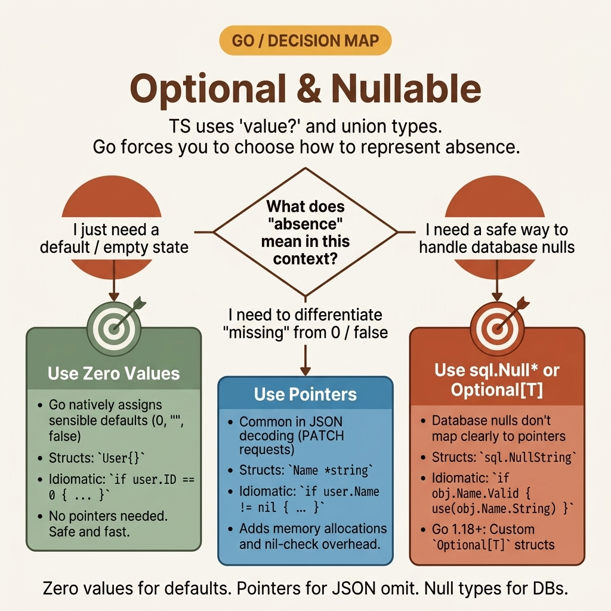

<!-- tags: golang, memory, pointers --> # ❓ Tùy chọn & Nullable — TS `T?` / `undefined` → Go Pointers & giá trị 0

> TypeScript phân biệt `undefined` (not set) với `null` (rõ ràng trống) và cung cấp chuỗi tùy chọn ( `?.` ). Go không có `undefined` — các biến không đặt sẽ nhận giá trị bằng 0 ( `""` , `0` , `false` , `nil` ). Bạn phân biệt "không được đặt" với "được đặt thành 0" bằng cách sử dụng pointers .

📅 Đã tạo: 23-03-2026 · 🔄 Đã cập nhật: 19-04-2026 · ⏱️ 12 phút đọc

> [!MẸO]
> Go 1.26 thêm `new(expr)` để tạo pointers thành các giá trị bằng chữ, thay thế các hàm trợ giúp `Ptr()` dài dòng.

## 1. ĐỊNH NGHĨA

API của bạn chấp nhận các yêu cầu `PATCH` với một phần JSON: `{"age": 0}` . Trường struct `Age int` nhận giá trị 0 `0` — nhưng nó được đặt rõ ràng thành 0 hay không có trong yêu cầu? Với `int` , bạn không thể biết được. Cả "không được gửi" và "được gửi dưới dạng 0" đều tạo ra cùng một giá trị.

Cách khắc phục: sử dụng `*int` . Khi trường JSON không có, pointer là `nil` . Khi trường có giá trị 0, pointer trỏ đến `0` . pointer phân biệt sự vắng mặt với số không.

Mẫu này áp dụng cho tất cả các điểm cuối PATCH, trường cấu hình tùy chọn và cột database có thể rỗng: sử dụng pointers khi "không được đặt" và "không" có nghĩa khác nhau.

### 1.1 Các kiểu bất biến và lỗi

| Ranh giới | Trách nhiệm cốt lõi |
| --- | --- |
| ** Pointers `*T` ** | `nil` có nghĩa là "chưa được đặt." Non- nil có nghĩa là "được đặt thành giá trị này." Giá trị 0 không còn xung đột với sự vắng mặt. |
| ** Nil vô hiệu** | Truy cập `*ptr` khi `ptr == nil` hoảng sợ. Luôn kiểm tra `ptr != nil` trước khi hội thảo. |

| Quy tắc | Cơ sở lý luận |
| --- | --- |
| **Luôn luôn nil -kiểm tra pointers ** | `*ptr` trên nil pointer là một panic nghiêm trọng — không phải là một lỗi có thể phục hồi được. |
| **Sử dụng `sql.NullString` cho các cột DB** | Trình điều khiển Database sử dụng `NullString` / `NullInt64` thay vì pointers cho các cột có thể rỗng. |

### 1.2 Chuỗi thất bại

- **Xóa giá trị bằng 0:** Yêu cầu PATCH gửi `{"priority": 0}` . Trình xử lý sử dụng `Priority int` , xem `0` và bỏ qua cập nhật ("không có nghĩa là không thay đổi"). Số 0 rõ ràng của người dùng bị âm thầm bỏ qua.
- **Xâu chuỗi panic :** Bạn chuyển `user?.address?.city` sang Go dưới dạng `user.Address.City` . Nếu `Address` là nil , quyền truy cập sẽ hoảng loạn. Go không có chuỗi tùy chọn - bạn phải kiểm tra từng pointer .

## 2. HÌNH ẢNH

Quyết định giữa `T` , `*T` và `Optional[T]` phụ thuộc vào việc số 0 có phải là giá trị hợp lệ hay không.  *Hình: Cây quyết định cho các giá trị tùy chọn. Sử dụng `T` khi số 0 không bao giờ hợp lệ. Sử dụng `*T` khi số 0 và "không được đặt" cần xử lý khác nhau. Sử dụng `Optional[T]` khi bạn muốn xâu chuỗi chức năng.*

## 3. MÃ

Với quyết định pointer -vs-value được làm rõ, mã bên dưới thể hiện ba mẫu: xử lý pointer cơ bản, các bản vá struct một phần và loại generic `Optional[T]` .

### Ví dụ 1: Cơ bản — Pointer mặc định và kiểm tra nil > **Mục tiêu**: Triển khai Go tương đương với `customer?.name ?? "Anonymous"` của TypeScript.
> **Phương pháp tiếp cận**: Kiểm tra `ptr != nil` trước khi hội thảo. Sử dụng `OrDefault` cho các giá trị dự phòng.
> **Độ phức tạp**: O(1) mỗi lần kiểm tra.```go
// basic_pointers.go
package pointers

import "fmt"

type Customer struct {
	Name string
}

// TS: function connect(customer?: Customer)
func ConnectSession(customer *Customer) string {
	// TS: customer?.name ?? "Anonymous"
	if customer == nil {
		return "Anonymous"
	}
	return "Connected: " + customer.Name
}

func OrDefault[T any](ptr *T, fallback T) T {
	if ptr != nil {
		return *ptr
	}
	return fallback
}

func ExecuteDefaults() {
	var inputPointer *string
	fmt.Println("Empty:", OrDefault(inputPointer, "Offline"))
	
	// Go 1.26: new(expr) creates a pointer to a literal
	inputPointer = new("Active")
	fmt.Println("Active:", OrDefault(inputPointer, "Offline"))
}
```> **Takeaway**: Go không có toán tử `??` . `OrDefault` là tương đương với generic . Đối với phiên bản trước 1.26 Go , hãy sử dụng trình trợ giúp `Ptr [T](v T) *T` để tạo pointers thành chữ — `Ptr("Active")` thay vì khai báo một biến và lấy địa chỉ của nó.

---

### Ví dụ 2: Trung cấp — Bản vá một phần struct > **Mục tiêu**: Giải tuần tự hóa nội dung PATCH JSON trong đó các trường vắng mặt sẽ không ghi đè lên các giá trị hiện có.
> **Cách tiếp cận**: Sử dụng `*string` và `*int` trong bản vá struct . `nil` có nghĩa là "không được gửi." Non- nil có nghĩa là "cập nhật giá trị này."
> **Độ phức tạp**: O(1) mỗi trường.```go
// partial_structs.go
package pointers

import "encoding/json"

type Schema struct {
	Category string `json:"category"`
	Priority int    `json:"priority"`
}

// Partial<Schema> equivalent: pointer fields distinguish absence from zero
type PatchPayload struct {
	Category *string `json:"category,omitempty"`
	Priority *int    `json:"priority,omitempty"`
}

func (s *Schema) ApplyPatch(payload PatchPayload) {
	if payload.Category != nil {
		s.Category = *payload.Category
	}
	if payload.Priority != nil {
		s.Priority = *payload.Priority
	}
}

func DeserializePatch(data []byte) (*Schema, error) {
	var payload PatchPayload
	if err := json.Unmarshal(data, &payload); err != nil {
		return nil, err
	}
	
	base := Schema{Category: "General", Priority: 5}
	base.ApplyPatch(payload)
	
	return &base, nil
}
```> **Takeaway**: `json:"priority,omitempty"` với `*int` có nghĩa là: nếu `priority` không có trong JSON → `nil` . Nếu `priority` là `0` trong JSON → `*int` trỏ đến `0` . pointer duy trì ý định của người gọi.

---

### Ví dụ 3: Nâng cao — Generic Loại tùy chọn

> **Mục tiêu**: Xây dựng một chức năng `Optional[T]` ngăn chặn tình trạng vô hiệu hóa nil thông qua một API an toàn.
> **Phương pháp tiếp cận**: Bao bọc giá trị và một boolean `present` . `UnwrapOr` cung cấp một dự phòng. `Map` biến đổi giá trị nếu có.
> **Độ phức tạp**: O(1) cho mỗi thao tác.```go
// functional_optionals.go
package pointers

type Optional[T any] struct {
	element T
	present bool
}

func Some[T any](value T) Optional[T] {
	return Optional[T]{element: value, present: true}
}

func None[T any]() Optional[T] {
	return Optional[T]{present: false}
}

func (o Optional[T]) UnwrapOr(fallback T) T {
	if o.present {
		return o.element
	}
	return fallback
}

func (o Optional[T]) Map(transform func(T) T) Optional[T] {
	if o.present {
		return Some(transform(o.element))
	}
	return None[T]()
}
```> **Takeaway**: `Optional[T]` an toàn hơn `*T` — không có sự hoảng loạn do vô căn cứ nil . Nhưng nó chống lại các thành ngữ Go : hầu hết mã Go sử dụng `(T, bool)` trả về (như tra cứu `map` ) hoặc `(T, error)` . Sử dụng `Optional[T]` trong pipeline - mã nặng trong đó chuỗi `.Map().Map().UnwrapOr()` đọc tốt hơn.

## 4. Cạm bẫy

| # | Khiếm khuyết | Sửa chữa |
| --- | --- | --- |
| 1 | Hủy tham chiếu pointer không có kiểm tra nil | Luôn kiểm tra `if ptr != nil` trước `*ptr` . Nil sự vô căn cứ là một panic gây tử vong. |
| 2 | Sử dụng `int` cho các trường JSON tùy chọn | Sử dụng `*int` - cả hai đều vắng mặt và `0` giải tuần tự hóa thành `int(0)` , khiến chúng không thể phân biệt được. |
| 3 | Bỏ qua `omitempty` trên các trường pointer | Không có `omitempty` , nil pointers tuần tự hóa thành `null` trong JSON. Thêm `omitempty` để bỏ qua chúng. |

## 5. GIỚI THIỆU

| Tài nguyên | Liên kết |
| --- | --- |
| Đặc tả giá trị 0 | [go.dev/ref/spec#The_zero_value](https://go.dev/ref/spec#The_zero_value) |
| Blog JSON và Go | [go.dev/blog/json](https://go.dev/blog/json) |

## 6. KHUYẾN NGHỊ

| Gia hạn | Khi nào | Cơ sở lý luận |
| --- | --- | --- |
| [Data Conversion](./01-data-conversion.md) | Khi giải tuần tự hóa các tải trọng phức tạp | Các trường Pointer kết hợp với giải mã JSON phát trực tuyến |
| [Iterator Patterns](./10-iterator.md) | Khi các trình vòng lặp tạo ra các giá trị null | `Optional[T]` tích hợp với `iter.Seq[Optional[T]]` để tạo ra các đường ống lười an toàn |

**Điều hướng**: [← Iterator Patterns](./10-iterator.md) · [→ Class → Struct](./12-class-struct.md)