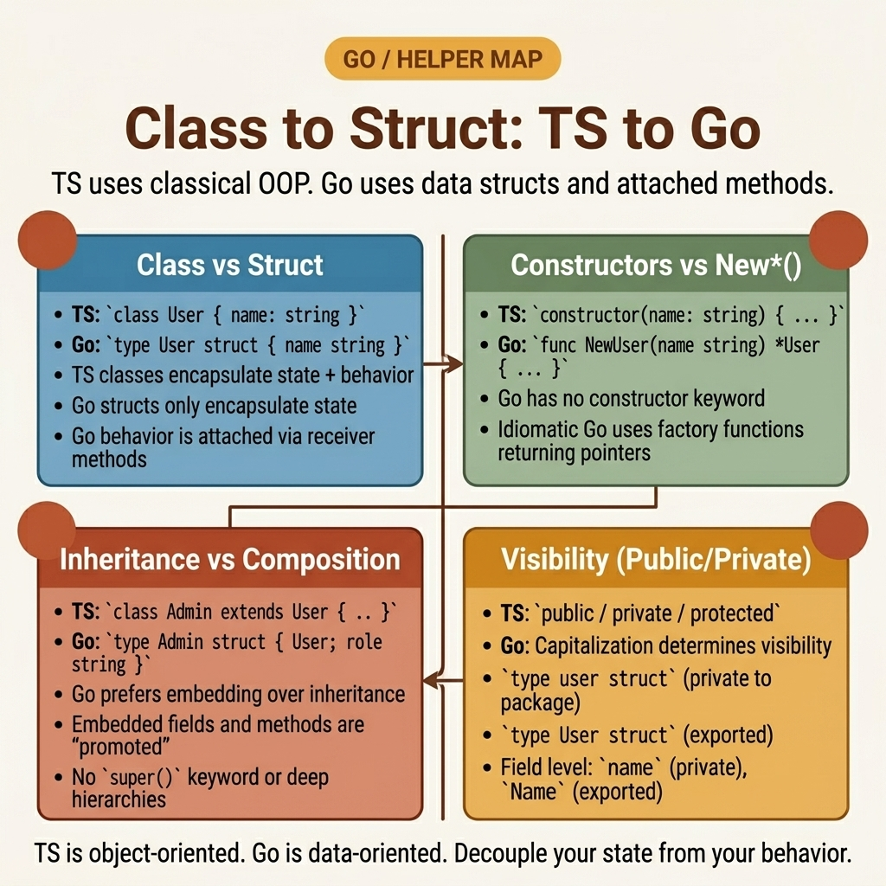

<!-- tags: golang, structs, design-patterns --> # 🏗️ Lớp → Struct — TS OOP → Go Composition > TypeScript sử dụng `class` inheritance với `extends` và `super()` . Go không có lớp, không có inheritance và không có `super` . Bạn xây dựng hành vi thông qua struct embedding ( composition ) và interface sự hài lòng (thực hiện ngầm).

📅 Đã tạo: 23-03-2026 · 🔄 Đã cập nhật: 19-04-2026 · ⏱️ 16 phút đọc

## 1. ĐỊNH NGHĨA

Một kiến trúc sư chuyển hệ thống phân cấp bộ điều khiển NestJS: `UserController extends BaseController` . Họ nhúng `BaseController` vào một Go struct , mong đợi `super.handleRequest()` gửi đi một cách đa hình. Nó không. Go embedding là cú pháp để truy cập trường - nó sao chép các phương thức của cha mẹ nhưng không tạo ra chuỗi inheritance . Các phương thức của struct được nhúng luôn đề cập đến loại được nhúng, không phải struct bên ngoài. Go thay thế inheritance bằng hai cơ chế:

1. ** Struct embedding ** — quảng bá các trường và phương thức từ bên trong struct . Hữu ích cho việc sử dụng lại việc triển khai nhưng không có công văn đa hình.
2. ** Interfaces ** — sự hài lòng tiềm ẩn. Any struct với các phương pháp phù hợp sẽ triển khai từ khóa interface , không có `implements` . Đây là Go của polymorphism .

### 1.1 Các kiểu bất biến và lỗi

| Ranh giới | Trách nhiệm cốt lõi |
| --- | --- |
| ** Composition trên inheritance ** | Embedding thúc đẩy khả năng truy cập trường. Nó không ghi đè các phương thức - receiver của loại được nhúng luôn là chính nó. |
| **Ngụ ý interfaces ** | A struct thỏa mãn interface bằng cách có tất cả các phương thức được yêu cầu. Không cần khai báo. |

| Quy tắc | Cơ sở lý luận |
| --- | --- |
| **Sử dụng hàm tạo `NewXxx()` ** | Go không có cú pháp hàm tạo. Quy ước: `NewCustomer(id, email)` trả về `*Customer` đã được xác thực. |
| **Sử dụng các tùy chọn chức năng** | Cấu hình struct lớn với nhiều trường tùy chọn sẽ không thể đọc được. Các hàm tùy chọn `WithTimeout(5s)` có tỷ lệ rõ ràng. |

### 1.2 Chuỗi thất bại

- **Bẫy phương thức bị che khuất:** Bạn nhúng `BaseLogger` và xác định phương thức `Log()` của riêng bạn. Phương thức bên ngoài che mờ phương thức bên trong — mã gọi `base.Log()` thông qua trường được nhúng vẫn chạy bản gốc chứ không phải phần ghi đè của bạn. Đây không phải là polymorphism .
- ** Đột biến value receiver :** Bạn đính kèm các phương thức vào `func (c Customer)` ( value receiver ). Bên trong phương thức, `c.Email = "new"` sửa đổi một bản sao. struct của người gọi không thay đổi. Sử dụng pointer receivers `func (c *Customer)` cho các đột biến.

## 2. HÌNH ẢNH

Hệ thống phân cấp lớp JavaScript và Go thành phần structs giải quyết cùng một vấn đề theo cách khác nhau.  *Hình: Lớp TS inheritance (trái) vs Go struct embedding + interface (phải). Go quảng bá các trường thông qua embedding nhưng gửi các phương thức một cách tĩnh — không có bảng phương thức ảo.*

## 3. MÃ

Khi composition và [[E40]]] được thiết lập, mã bên dưới thể hiện ba mẫu: struct hàm tạo với encapsulation , interface -based polymorphism và các tùy chọn chức năng cho cấu hình.

### Ví dụ 1: Cơ bản — Structs , hàm tạo và receivers > **Mục tiêu**: Thay thế TypeScript `class Customer` bằng Go struct , hàm xây dựng và các phương thức.
> **Phương pháp tiếp cận**: Các trường chưa xuất (chữ thường) thực thi encapsulation . `NewCustomer` xác nhận đầu vào. Pointer receivers kích hoạt đột biến.
> **Độ phức tạp**: O(1) cho mỗi công trình.```go
// core_entities.go
package domain

import "errors"

// Replaces: class Customer { private id: string; email: string }
type Customer struct {
	identifier string // unexported = private
	Email      string // exported = public
}

// Replaces: constructor(id: string, email: string)
func NewCustomer(id, email string) (*Customer, error) {
	if id == "" {
		return nil, errors.New("id is required")
	}
	return &Customer{
		identifier: id,
		Email:      email,
	}, nil
}

// Getter for the private field
func (c *Customer) ID() string {
	return c.identifier
}

// Pointer receiver: mutations affect the original struct
func (c *Customer) UpdateEmail(email string) {
	c.Email = email
}
```> **Takeaway**: Go sử dụng cách viết hoa để kiểm soát truy cập — chữ hoa = được xuất (công khai), chữ thường = không được xuất (riêng tư cho package ). Không có ranh giới `protected` — package là phạm vi truy cập duy nhất.

---

### Ví dụ 2: Trung cấp — Interface -based polymorphism > **Mục tiêu**: Xác định một `Transmitter` interface mà nhiều structs thỏa mãn, thay thế `abstract class Transmitter` .
> **Phương pháp tiếp cận**: interface xác định hợp đồng. Structs triển khai nó một cách ngầm định bằng cách sử dụng đúng phương pháp. Embedding sử dụng lại cách triển khai `Protocol()` .
> **Độ phức tạp**: O(1) mỗi lần gửi.```go
// polymorphic_engines.go
package domain

import "fmt"

// TS: abstract class Transmitter { abstract dispatch(payload: Buffer): void }
type Transmitter interface {
	Dispatch(payload []byte) error
	Protocol() string
}

type BaseNetwork struct {
	targetURL string
}

func (b *BaseNetwork) Protocol() string {
	return "HTTPS"
}

// Embeds BaseNetwork — gets Protocol() for free
type SecureTransmitter struct {
	BaseNetwork
	Certificate string
}

func NewSecureTransmitter(url string, cert string) *SecureTransmitter {
	return &SecureTransmitter{
		BaseNetwork: BaseNetwork{targetURL: url},
		Certificate: cert,
	}
}

func (s *SecureTransmitter) Dispatch(payload []byte) error {
	fmt.Printf("Transmitting via %s: %s\n", s.Protocol(), s.targetURL)
	return nil
}
```> **Takeaway**: `SecureTransmitter` thỏa mãn `Transmitter` mà không cần khai báo `implements` . Nó nhận `Protocol()` từ embedding và định nghĩa trực tiếp `Dispatch()` . Đây là composition - không phải inheritance .

---

### Ví dụ 3: Nâng cao — Mẫu tùy chọn chức năng

> **Mục tiêu**: Thay thế danh sách tham số hàm tạo lớn bằng các hàm tùy chọn có thể kết hợp.
> **Phương pháp**: Xác định `type Option func(*Config)` . Mỗi tùy chọn sửa đổi một trường. Hàm tạo áp dụng tất cả các tùy chọn theo thứ tự.
> **Độ phức tạp**: O(N) trong đó N = số lượng tùy chọn được áp dụng.```go
// functional_options.go
package domain

import "time"

type Application struct {
	endpoint string
	timeout  time.Duration
	debug    bool
}

type AppOption func(*Application)

func WithTimeout(d time.Duration) AppOption {
	return func(app *Application) {
		app.timeout = d
	}
}

func WithDebugMode() AppOption {
	return func(app *Application) {
		app.debug = true
	}
}

func NewApplication(endpoint string, opts ...AppOption) *Application {
	// Sensible defaults
	app := &Application{
		endpoint: endpoint,
		timeout:  30 * time.Second,
		debug:    false,
	}

	for _, opt := range opts {
		opt(app)
	}
	
	return app
}
```> **Takeaway**: Các tùy chọn chức năng chia tỷ lệ theo any số lượng tham số tùy chọn mà không phá vỡ hàm tạo signature . Mỗi tùy chọn đều tự ghi lại tài liệu: `WithTimeout(5 * time.Second)` đọc tốt hơn đối số vị trí. Mẫu này được sử dụng bởi `grpc.NewServer` , `http.NewServeMux` và hầu hết các thư viện Go sản xuất.

## 4. Cạm bẫy

| # | Khiếm khuyết | Sửa chữa |
| --- | --- | --- |
| 1 | Sử dụng giá trị receivers cho các phương thức đột biến | Sử dụng pointer receivers `func (c *Customer)` . Giá trị receivers hoạt động trên một bản sao. |
| 2 | Phương thức mong đợi ghi đè thông qua embedding | Embedding không phải là inheritance . Các phương thức của struct được nhúng luôn liên kết với kiểu được nhúng. |
| 3 | Sử dụng cấu hình lớn structs với nhiều trường có giá trị bằng 0 | Sử dụng mẫu tùy chọn chức năng - mỗi chức năng tùy chọn đều có khả năng tự ghi lại và có thể kết hợp được. |

## 5. GIỚI THIỆU

| Tài nguyên | Liên kết |
| --- | --- |
| Pointers so với Giá trị | [go.dev/doc/effective_go#pointers_vs_values](https://go.dev/doc/effective_go#pointers_vs_values) |
| Embedding | [go.dev/doc/effective_go#embedding](https://go.dev/doc/effective_go#embedding) |

## 6. KHUYẾN NGHỊ

| Gia hạn | Khi nào | Cơ sở lý luận |
| --- | --- | --- |
| [Optional Properties](./11-optional-nullable.md) | Khi tham số hàm tạo là tùy chọn | Các trường Pointer và các tùy chọn chức năng phục vụ các trường hợp sử dụng khác nhau |
| [Map Utilities](./03-object-map-utils.md) | Khi xây dựng cấu hình từ các nguồn khóa-giá trị động | Generic map thao tác để hợp nhất cấu hình |

**Điều hướng**: [← Optional & Nullable](./11-optional-nullable.md) · [→ Directory Overview](./README.md)