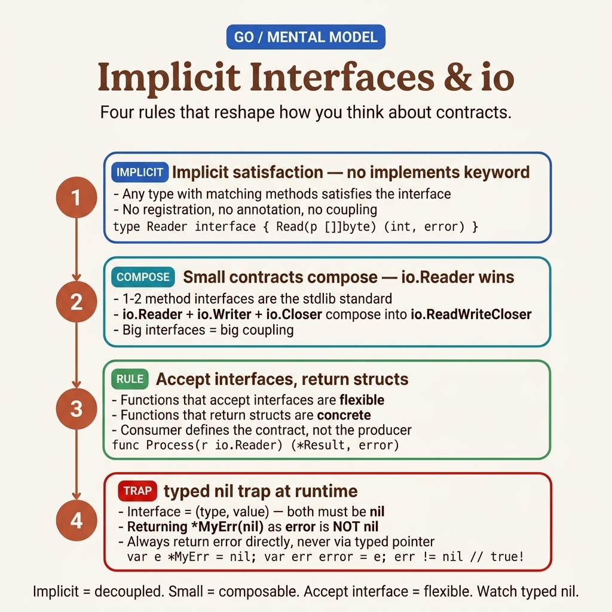

<!-- tags: golang, interfaces -->
# 🔌 Interfaces — Implicit, io.Reader/Writer, Empty Interface

> Go interfaces: implicit satisfaction, duck typing, io patterns, generics

📅 Created: 2026-03-20 · 🔄 Updated: 2026-04-19 · ⏱️ 17 min read

| Aspect          | Detail                                        |
| --------------- | --------------------------------------------- |
| **Concept**     | Behavioral contracts, implicit implementation |
| **Use case**    | Abstraction, dependency injection, testing    |
| **Key insight** | NO `implements` keyword — implicit!           |
| **Go proverb**  | "Accept interfaces, return structs"           |

---

## 1. DEFINE

Producers defining 8-method interfaces force consumers to implement behaviors they never use. Tests then require full mock implementations for a single method. The fix: consumers define the minimal interface they need.

> *`exportReport(dest ???)` starts writing to a file. Next sprint: S3. Next: a test buffer. Hardcoding `*os.File` means three signature changes across the codebase — three regression risks.*
>
> *Go solves this with `io.Writer` — **1 method**: `Write([]byte) (int, error)`. Files, HTTP responses, `bytes.Buffer`, `strings.Builder`, and S3 writers all satisfy it. Functions accepting `io.Writer` need zero changes when the destination changes. There is **no `implements` keyword** — a type satisfies an interface by having the right method signatures. This is structural typing.*

Implicit satisfaction has a sharp edge: Go interfaces store `(type, value)` internally. A nil `*bytes.Buffer` assigned to an `io.Writer` is **not** a nil interface — `w != nil` returns `true`, and `w.Write()` panics. This trap is unpacked in PITFALLS.

### 1.1 Interface Rules

| Rule        | Description                                            |
| ----------- | ------------------------------------------------------ |
| Implicit    | No `implements` keyword — matching method signatures is enough |
| Small       | Prefer 1–2 methods for maximum composability                 |
| Naming      | Single-method interfaces use `-er` suffix: `Reader`, `Writer` |
| Composition | Embed interfaces to combine: `ReadWriter = Reader + Writer`  |
| `any`       | `interface{}` alias — accepts any type                       |

### 1.2 Standard Library Interfaces — Reference

| Interface        | Methods                         | Package       | Use case                     |
| ---------------- | ------------------------------- | ------------- | ---------------------------- |
| `io.Reader`      | `Read([]byte) (int, error)`     | io            | Read from a byte source              |
| `io.Writer`      | `Write([]byte) (int, error)`    | io            | Write to a byte destination          |
| `io.Closer`      | `Close() error`                 | io            | Release a resource                   |
| `fmt.Stringer`   | `String() string`               | fmt           | Custom string representation         |
| `error`          | `Error() string`                | builtin       | Error value                          |
| `sort.Interface` | `Len, Less, Swap`               | sort          | Custom collection sorting            |
| `http.Handler`   | `ServeHTTP(w, r)`               | net/http      | HTTP request handler                 |
| `json.Marshaler` | `MarshalJSON() ([]byte, error)` | encoding/json | Custom JSON encoding                 |

> **Why implicit satisfaction?** In Java/C#, implementing an interface requires importing the package that defines it — coupling producer and consumer. Go inverts this: the consumer defines the interface, the producer never imports it. Result: **zero coupling**, and any type from any package can satisfy the contract.

The standard interfaces above cover most use cases. The failure modes below expose traps that catch even experienced Go developers.

### 1.3 Failure Modes

| Defect | Cause | Consequence | Fix |
| --- | ------------ | ------ | --- |
| Nil interface vs interface holding nil | `var w io.Writer` (nil) vs `var w io.Writer = (*bytes.Buffer)(nil)` (non-nil!) | `w != nil` is true → `w.Write()` panics | Return `nil` explicitly, not a typed nil pointer |
| Pointer receiver vs value | `func (t *T) Method()` → only `*T` satisfies the interface, not `T` | Silent compile error | Use pointer consistently |
| Fat interfaces (>3 methods) | Too many methods in one interface | Hard to mock, hard to test | Decompose into smaller interfaces |

---

The theory is clear. The danger is that implicit satisfaction can break silently: add a method to an interface, and every type that previously satisfied it stops compiling — with no `implements` line to search for.

## 2. VISUAL

Most interface confusion comes from projecting OOP class hierarchies onto Go's structural typing. This visual consolidates the three things you need to hold simultaneously: implicit satisfaction, the `(type, value)` pair, and the nil-interface trap.



*Figure: Mental model for Go interfaces — implicit satisfaction, interface composition, and the nil-interface vs nil-value distinction.*

With this model in mind, the code below reads differently: you will see not just what each pattern does, but where the implicit contract can break.

## 3. CODE

The theory is mapped. Now let's see implicit satisfaction, `io.Reader/Writer` composition, and type assertions in action.

### Example 1: Basic — Implicit Implementation & Polymorphism

Both `Rectangle` and `Circle` implement `Shape` without declaring it. `PrintShape` accepts any `Shape` — the compiler checks method signatures at compile time.

```go
package main

import "fmt"

// ✅ Define interface — small, focused (2 methods)
type Shape interface {
    Area() float64
    Perimeter() float64
}

// ✅ Rectangle implements Shape IMPLICITLY
type Rectangle struct {
    Width, Height float64
}

func (r Rectangle) Area() float64      { return r.Width * r.Height }
func (r Rectangle) Perimeter() float64 { return 2 * (r.Width + r.Height) }
func (r Rectangle) String() string     { return fmt.Sprintf("Rect(%gx%g)", r.Width, r.Height) }

// ✅ Circle also implements Shape — no "implements" keyword
type Circle struct {
    Radius float64
}

func (c Circle) Area() float64      { return 3.14159 * c.Radius * c.Radius }
func (c Circle) Perimeter() float64 { return 2 * 3.14159 * c.Radius }

// ✅ Accept interface → works with ANY Shape implementation
func PrintShape(s Shape) {
    fmt.Printf("Area=%.2f Perimeter=%.2f\n", s.Area(), s.Perimeter())
}

func TotalArea(shapes []Shape) float64 {
    total := 0.0
    for _, s := range shapes {
        total += s.Area()
    }
    return total
}

func main() {
    shapes := []Shape{
        Rectangle{10, 5},
        Circle{7},
        Rectangle{3, 4},
    }
    for _, s := range shapes {
        PrintShape(s)
    }
    fmt.Printf("Total: %.2f\n", TotalArea(shapes))
}
```

> **Takeaway**: No `implements` keyword — matching method signatures is the only requirement. `[]Shape` holds any type that satisfies the contract.

Implicit satisfaction scales because the stdlib uses the same pattern: `io.Reader` is a 1-method interface satisfied by hundreds of types. The next example shows how to compose and decorate readers.

---

### Example 2: Intermediate — io.Reader/Writer Pattern

`CountWords()` accepts `io.Reader` — it works with strings, files, HTTP bodies, or any custom reader. `UpperReader` wraps any `io.Reader` and uppercases the output — the decorator pattern without inheritance.

```go
package main

import (
    "bytes"
    "fmt"
    "io"
    "os"
    "strings"
)

// ✅ Custom type implementing io.Reader — decorator pattern
type UpperReader struct {
    reader io.Reader
}

func (u *UpperReader) Read(p []byte) (int, error) {
    n, err := u.reader.Read(p)
    for i := range n {
        if p[i] >= 'a' && p[i] <= 'z' {
            p[i] -= 32  // Convert to uppercase
        }
    }
    return n, err
}

// ✅ Accept io.Reader → works with ANY reader
func CountWords(r io.Reader) (int, error) {
    data, err := io.ReadAll(r)
    if err != nil {
        return 0, err
    }
    words := strings.Fields(string(data))
    return len(words), nil
}

func main() {
    // ✅ strings.Reader implements io.Reader
    count, _ := CountWords(strings.NewReader("hello world foo bar"))
    fmt.Println("Words:", count)  // 4

// ✅ bytes.Buffer implements io.Reader AND io.Writer
    var buf bytes.Buffer
    buf.WriteString("data from buffer")
    count, _ = CountWords(&buf)
    fmt.Println("Words:", count)  // 3

// ✅ io.Copy — works with ANY Reader→Writer pair
    src := strings.NewReader("Hello, 世界")
    io.Copy(os.Stdout, src)
    fmt.Println()

// ✅ Compose readers — decorator pattern: UpperReader wraps any Reader
    upper := &UpperReader{reader: strings.NewReader("hello go")}
    io.Copy(os.Stdout, upper)  // HELLO GO
    fmt.Println()
}
```

> **Why 1-method interfaces?** A function accepting `io.Reader` works with every type that has `Read`. Add a second method and you exclude half the stdlib. Small interfaces maximize composability.
>
> **Why decorators?** Go has no inheritance. Instead, wrap an `io.Reader` inside another `io.Reader` to add behavior. Stack them: `&GzipReader{&UpperReader{fileReader}}`. Each layer is independent and testable.

> **Takeaway**: Accept `io.Reader`/`io.Writer` to decouple from concrete types. Decorators replace inheritance for layered behavior.

---

### Example 3: Advanced — Interface Composition & Type Assertion

Compose small interfaces into larger ones (`ReadWriteCloser = Reader + Writer + Closer`). Use type assertions and type switches for runtime dispatch. Use compile-time guards (`var _ Writer = (*MyWriter)(nil)`) to catch missing methods early.

```go
package main

import "fmt"

// ✅ Small interfaces — 1 method each
type Reader interface {
    Read(p []byte) (n int, err error)
}

type Writer interface {
    Write(p []byte) (n int, err error)
}

type Closer interface {
    Close() error
}

// ✅ Interface composition — embed to combine
type ReadWriter interface {
    Reader
    Writer
}

type ReadWriteCloser interface {
    Reader
    Writer
    Closer
}

// ✅ Type assertion — safe comma-ok pattern
func describe(i interface{}) {
    // ❌ UNSAFE: s := i.(string) — panics if wrong type

// ✅ Safe assertion with comma-ok
    if s, ok := i.(string); ok {
        fmt.Println("String:", s)
        return
    }

// ✅ Type switch — runtime dispatch by type
    switch v := i.(type) {
    case int:
        fmt.Println("Int:", v*2)
    case string:
        fmt.Println("String:", v)
    case bool:
        fmt.Println("Bool:", v)
    default:
        fmt.Printf("Unknown: %T = %v\n", v, v)
    }
}

// ✅ Compile-time interface guard — fails at compile if not satisfied
type MyWriter struct{}

func (w *MyWriter) Write(p []byte) (int, error) {
    return len(p), nil
}

// This line fails at compile-time if *MyWriter doesn't implement Writer
var _ Writer = (*MyWriter)(nil)

func main() {
    describe(42)
    describe("hello")
    describe(true)
    describe(3.14)
}
```

> **Why compose interfaces?** Each small interface captures one capability. Embedding combines them without creating a class hierarchy. Clients depend only on the methods they use — Interface Segregation Principle.
>
> **Why compile-time guards?** `var _ Writer = (*MyWriter)(nil)` fails at compile time if `*MyWriter` does not implement `Writer`. This catches missing methods before tests run.

> **Takeaway**: Compose small interfaces via embedding. Use `var _ I = (*T)(nil)` for compile-time verification. Type switches handle runtime dispatch safely.

---

## 4. PITFALLS

The mechanics of **Interfaces** are clear. What remains is recognizing patterns that look correct but cause runtime panics or silent type errors.

| # | Severity | Defect | Consequence | Fix |
|---|----------|-----|---------|-----|
| 1 | 🔴 Fatal | Nil interface vs interface holding nil | `w != nil` is true but `w.Write()` panics | Return `nil` explicitly, not a typed nil pointer |
| 2 | 🔴 Fatal | Unsafe type assertion `i.(string)` | Panics if type is wrong | Use comma-ok: `s, ok := i.(string)` |
| 3 | 🟡 Common | Pointer receiver excludes value satisfaction | `T` does not satisfy interface requiring `*T` method | Use pointer receivers consistently |
| 4 | 🟡 Common | Fat interfaces (>3 methods) | Hard to mock, hard to test | Decompose into 1–2 method interfaces |
| 5 | 🟡 Common | Returning interfaces instead of concrete types | Caller cannot access concrete methods | "Accept interfaces, return structs" |
| 6 | 🔵 Minor | Overusing `interface{}`/`any` | Loses type safety | Use generics (Go 1.18+) instead |

### 🔴 Pitfall #1 — Nil interface trap

A Go interface stores `(type, value)`. Returning a typed nil pointer wraps it in a non-nil interface — `w != nil` is `true`, but calling any method panics.

```go
func getWriter() io.Writer {
    var buf *bytes.Buffer // nil
    return buf            // ❌ interface{type: *Buffer, value: nil} — w != nil is true!
}
// Fix: return nil explicitly
func getWriter() io.Writer { return nil }
```

**Rule**: Never return a typed nil pointer as an interface. Return `nil` directly.

### 🔴 Pitfall #2 — Type assertion panic

`s := i.(string)` panics if `i` is not a string. Unlike other languages, Go does not return a default value — it crashes.

**Fix**: Always use the comma-ok form: `s, ok := i.(string)`.

---

---

## 5. REF

| Resource      | Type     | Link                                                                             | Description |
| ------------- | -------- | -------------------------------------------------------------------------------- | ------- |
| Go Tour       | Official | [go.dev/tour/methods/9](https://go.dev/tour/methods/9)                           | Interactive interface tutorial |
| io Package    | Official | [pkg.go.dev/io](https://pkg.go.dev/io)                                           | Core streaming interfaces |
| Effective Go  | Official | [go.dev/doc/effective_go#interfaces](https://go.dev/doc/effective_go#interfaces) | Naming and design guidance |

---

## 6. RECOMMEND

The foundations of **Interfaces** are settled. The extensions below connect interface patterns to testing, generics, and production HTTP.

| Extension | When | Why | File/Link |
| ------- | ------- | ----- | --------- |
| DI & Mocking | Testing with isolated dependencies | Replace real implementations with mocks via interfaces | [02-di-mocking-patterns.md](./02-di-mocking-patterns.md) |
| Generics | Type-safe reusable functions | Constrain type parameters with interfaces | [../types/02-generics.md](../types/02-generics.md) |
| HTTP Handler | Building web services | `http.Handler` is a 1-method interface | [../../concurrency/03-context.md](../../concurrency/03-context.md) |
| sort.Interface | Custom sorting | `Len`, `Less`, `Swap` for collection ordering | [pkg.go.dev/sort](https://pkg.go.dev/sort) |

---

**Navigation**: [← Structs](../structs/) · [→ DI & Mocking Patterns](./02-di-mocking-patterns.md)
