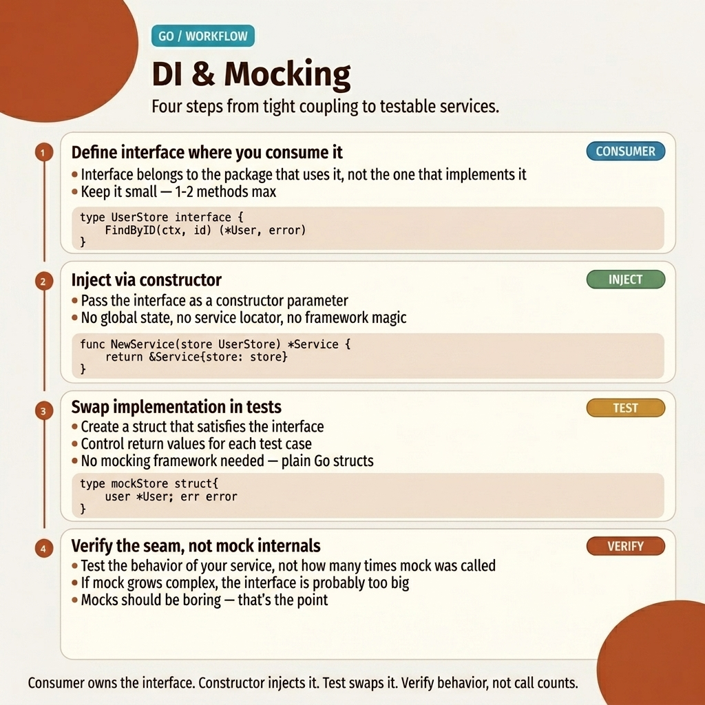

<!-- tags: golang, interfaces -->
# 💉 DI via Interfaces & Mocking Patterns

> Go skips DI frameworks — interfaces + constructor injection are sufficient. Generate mocks with mockgen/mockery.

📅 Created: 2026-03-23 · 🔄 Updated: 2026-04-19 · ⏱️ 12 min read

| Aspect | Detail |
| --- | --- |
| **Concept** | Constructor injection via interfaces, generated mocks |
| **Use case** | Unit testing business logic without databases or HTTP |
| **Key insight** | No DI container — explicit constructors, no magic |
| **Go stdlib** | `testing`, `context`, `net/http` |

| TS/NestJS                     | Go                                        |
| ----------------------------- | ----------------------------------------- |
| `@Injectable()` + `@Inject()` | Constructor: `func NewService(repo Repo)` |
| `interface UserRepo {}`       | `type UserRepo interface{}`              |
| `jest.mock()`                 | `mockgen` / `mockery`      |
| `useClass: MockRepo`          | Pass mock to constructor directly |

---

## 1. DEFINE

Your handler calls the database, the cache, and an external API. Testing it requires a running Postgres, a Redis, and a mock HTTP server. CI takes 5 minutes per run. The fix: define interfaces for each dependency, inject them via constructors, and swap real implementations for in-memory mocks during tests.

> *Unit tests for `GetUser` hit the database. Each test seeds records, runs queries, and cleans up. CI spins up Postgres containers for every suite. A 200-test run takes 4 minutes. Replace the `UserRepository` concrete type with an interface, inject a map-backed mock, and tests run in microseconds.*
>
> *This is Dependency Injection in Go: no framework, no decorators, no reflection. Define an interface at the consumer, accept it in the constructor, and pass the real implementation in `main()` and a mock in `_test.go`.*

### DI Principles in Go

| Principle | Description | Why |
| --- | --- | --- |
| **Consumer-defined interfaces** | The consumer (service) defines the interface, not the producer (repo) | Eliminates import coupling |
| **Constructor injection** | Dependencies passed as constructor arguments | Explicit, traceable in IDE |
| **Small interfaces** | 1–3 methods per interface | Easy to mock, easy to compose |
| **No DI framework** | No container, no reflection | Compile-time safety, zero magic |

### Failure Modes

| Defect | Cause | Consequence | Fix |
| --- | ------------ | ------ | --- |
| Fat interfaces (10+ methods) | Single interface for all repo operations | Every mock must implement 10+ methods | Split by use case (Reader, Writer, Deleter) |
| Producer-side interfaces | Interface defined next to implementation | Consumer forced to import producer package | Define interface at the consumer |
| Concrete dependencies | Struct field is `*PostgresRepo` not `UserRepo` | Cannot substitute mocks | Use interface types in struct fields |

---

## 2. VISUAL

DI in Go is three steps: define interface → inject via constructor → swap real for mock in tests. The visual below maps this flow.



*Figure: DI workflow — interface definition, constructor injection, and mock substitution in tests.*

## 3. CODE

Three progression levels: basic interface + constructor DI, manual mock, and generated mock with mockery.

### Example 1: Basic — Interface + Constructor DI

The service depends on `UserRepository` (an interface), not `*PostgresUserRepo` (a concrete type). The constructor accepts the interface — production passes the real repo, tests pass a mock.

```go
// ✅ Define interface at consumer (UserService package)
type UserRepository interface {
	FindByID(ctx context.Context, id string) (*User, error)
	Create(ctx context.Context, user *User) error
	Delete(ctx context.Context, id string) error
}

// ✅ Service depends on interface, not concrete type
type UserService struct {
	repo UserRepository // interface field
}

// ✅ Constructor injection — explicit, no magic
func NewUserService(repo UserRepository) *UserService {
	return &UserService{repo: repo}
}

func (s *UserService) GetUser(ctx context.Context, id string) (*User, error) {
	return s.repo.FindByID(ctx, id)
}
```

> **Takeaway**: The service never imports the repository package. It only knows the interface. This is how Go achieves DI without a framework.

---

### Example 2: Intermediate — Manual Mock

A manual mock implements the interface with an in-memory map. No database, no network — tests run in microseconds.

```go
// ✅ Mock implementation — in-memory, no DB dependency
type MockUserRepo struct {
	users map[string]*User
}

func NewMockUserRepo() *MockUserRepo {
	return &MockUserRepo{users: make(map[string]*User)}
}

func (m *MockUserRepo) FindByID(_ context.Context, id string) (*User, error) {
	user, ok := m.users[id]
	if !ok {
		return nil, apperror.ErrNotFound
	}
	return user, nil
}

func (m *MockUserRepo) Create(_ context.Context, user *User) error {
	m.users[user.ID] = user
	return nil
}

func (m *MockUserRepo) Delete(_ context.Context, id string) error {
	delete(m.users, id)
	return nil
}

// ✅ Test — inject mock, no DB, microsecond execution
func TestGetUser(t *testing.T) {
	mockRepo := NewMockUserRepo()
	mockRepo.users["1"] = &User{ID: "1", Name: "Alice"}

service := NewUserService(mockRepo) // inject mock

user, err := service.GetUser(context.Background(), "1")
	assert.NoError(t, err)
	assert.Equal(t, "Alice", user.Name)
}
```

> **When manual mocks?** When you need custom behavior (simulating errors, tracking calls, returning dynamic data). Manual mocks give full control.
>
> **Why `_` for `context.Context`?** Test cases use `context.Background()` — no timeouts or cancellation needed. The underscore signals that the parameter is intentionally unused.

> **Takeaway**: Manual mocks are best for small interfaces (1–3 methods). For larger interfaces, code generation avoids boilerplate.

---

### Example 3: Advanced — Generated Mock (mockery)

`mockery` generates mock implementations from interface definitions. Set up expectations declaratively and verify calls automatically.

```bash
# Install mockery
go install github.com/vektra/mockery/v2@latest

# Generate mock from interface
mockery --name=UserRepository --dir=./internal/domain --output=./internal/domain/mocks
```

```go
// Generated: internal/domain/mocks/UserRepository.go
// ✅ No manual mock code — all auto-generated

func TestGetUser_WithMockery(t *testing.T) {
	mockRepo := mocks.NewUserRepository(t)

// ✅ Setup expectations — declarative
	mockRepo.EXPECT().
		FindByID(mock.Anything, "1").
		Return(&User{ID: "1", Name: "Alice"}, nil)

service := NewUserService(mockRepo)
	user, err := service.GetUser(context.Background(), "1")

assert.NoError(t, err)
	assert.Equal(t, "Alice", user.Name)
	mockRepo.AssertExpectations(t) // ✅ Verify all expectations met
}
```

> **Why `mock.Anything` for context?** Context values vary across tests. `mock.Anything` matches any value, keeping expectations focused on the business parameter (`"1"`).
>
> **Why `AssertExpectations`?** Without it, a test passes even if the mock was never called. `AssertExpectations` verifies that every declared expectation was actually invoked.

> **Takeaway**: `mockery` eliminates boilerplate for large interfaces. Combine with `AssertExpectations` to prevent false positives.

---

## 4. PITFALLS

The mechanics of **DI & Mocking** are clear. What remains is recognizing patterns that introduce false test confidence.

| # | Severity | Defect | Consequence | Fix |
|---|----------|-----|---------|-----|
| 1 | 🔴 Fatal | Missing `AssertExpectations` on generated mocks | Tests pass even when expected methods are never called | Always call `mockRepo.AssertExpectations(t)` |
| 2 | 🟡 Common | Fat interfaces (10+ methods) | Every mock must implement all methods | Split interfaces by use case |
| 3 | 🟡 Common | Interface defined at producer, not consumer | Consumer imports the producer package | Define interface at the consumer |
| 4 | 🟡 Common | Hardcoded struct types in function signatures | Cannot substitute mocks | Accept interfaces, not concrete types |
| 5 | 🔵 Minor | Over-engineered mocks with complex logic | Mock tests the mock, not the code | Keep mocks simple: return fixed values |

### 🔴 Pitfall #1 — Missing assertion verification

Generated mocks record expectations but do not enforce them automatically. Without `AssertExpectations(t)`, a test passes even if the mock method was never invoked — a false positive that hides real bugs.

---

---

## 5. REF

| Resource                    | Type     | Link                                                                                                         | Description |
| --------------------------- | -------- | ------------------------------------------------------------------------------------------------------------ | ------- |
| mockery                     | Tool     | [github.com/vektra/mockery](https://github.com/vektra/mockery)                                               | Auto-generates mocks from interfaces |
| Go Interface Best Practices | Official | [go.dev/wiki/CodeReviewComments#interfaces](https://github.com/golang/go/wiki/CodeReviewComments#interfaces) | Interface naming and design guidance |
| google/wire                 | Tool     | [github.com/google/wire](https://github.com/google/wire)                                                     | Compile-time dependency injection |

---

## 6. RECOMMEND

The foundations of **DI & Mocking** are settled. The extensions below connect DI patterns to testing workflows and production wiring.

| Extension | When | Why | File/Link |
| ------- | ------- | ----- | --------- |
| Implicit Interfaces | Understanding interface mechanics | Foundation for consumer-defined contracts | [01-implicit-io-patterns.md](./01-implicit-io-patterns.md) |
| Table-Driven Testing | Structuring test cases systematically | Pairs with DI mocks for comprehensive coverage | [../../testing/01-table-driven-mocking.md](../testing/01-table-driven-mocking.md) |
| google/wire | Complex dependency graphs | Compile-time DI code generation for large apps | [github.com/google/wire](https://github.com/google/wire) |

---

**Navigation**: [← Implicit Interfaces](./01-implicit-io-patterns.md) · [→ Structs](../structs/01-composition-embedding.md)
