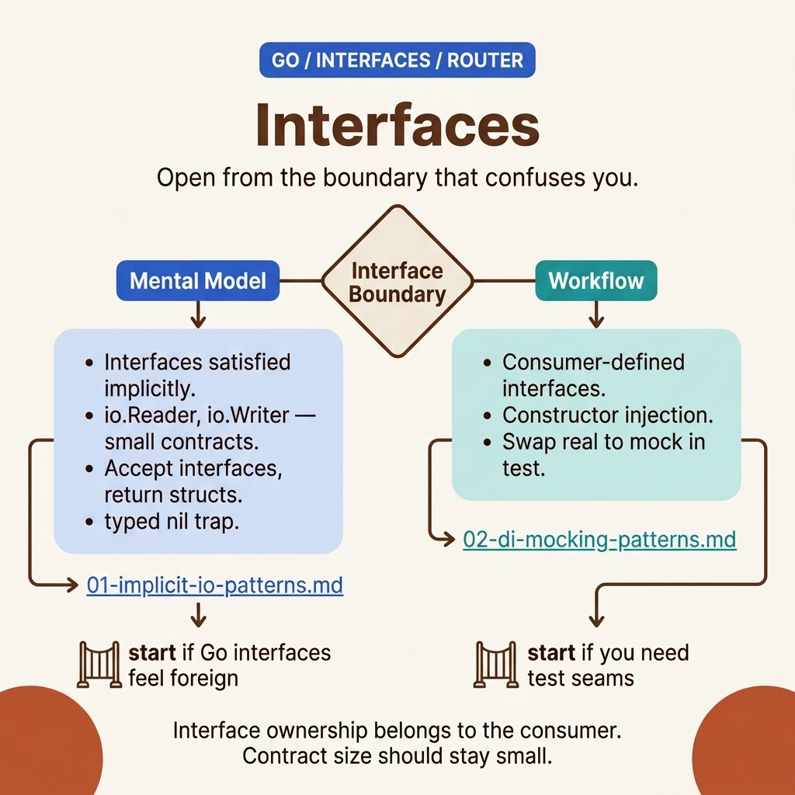

<!-- tags: golang, overview -->
# Interfaces — Implicit, io patterns, DI & mocking

> Go interfaces: implicit satisfaction, io.Reader/Writer, dependency injection, testable design.

📅 Updated: 2026-04-19 · ⏱️ 6 min read

## 1. DEFINE

Go interfaces are implicit — a struct satisfies an interface without an `implements` keyword. This is the most important design decision of the Go type system, and explains why Go does not need a DI framework but is still fully testable.

This hub does not exist to list files. It exists to help you choose the right entrance to `fundamental/interfaces`: where to start, which articles to read together, and when you encounter real symptoms, which lane.

### 1.1 Signals & Boundaries

- Open this hub when you know you're in the `fundamental/interfaces` cluster but aren't sure which article to read first.
- The focus of the hub is to map pain points to the correct document, not to replace each detail.
- If you keep jumping between articles and still feel confused, the problem is usually choosing the wrong starting lane — not a lack of definitions.

### 1.2 Learning Lanes

- `Interfaces — Implicit, io.Reader/Writer, Empty Interface` is the natural entry point if you want to have a strong grip before diving in.
- `DI via Interfaces & Mocking Patterns` is more suitable when you need to bridge to an adjacent lane or extend from the platform to a production concern.
- Use this hub as a navigation map: after reading one article, go back to the next point with purpose.

## 2. VISUAL

The `interfaces` lane is useful when you enter from the boundary that confuses you: who owns the contract, who can change the implementation, and where the nil/interface trap lives.



*Figure: Router map of `interfaces` divides the cluster by three needs: implicit satisfaction as the underlying mental model, io-style small contracts as the stdlib pattern, and DI/mocking as the test seam.*

Once the boundary is named, the pseudo-router below compresses the navigation decision. It is not a replacement for the two detailed articles.

## 3. CODE

Router map shows directions with pictures. The pseudo-code below compresses that navigation logic into an artifact for the team.

### Example 1: Router artifact — select articles according to reading goals.

> **Goal**: Turn this hub into a navigation tool instead of a passive link table.
> **Approach**: Map learning goals or symptoms to the correct starting file.
> **Example**: Choose lanes by concern: fundamentals, framework knowledge, concurrency, or production ops.
> **Complexity**: O(1) at navigation level; what matters is choosing the right entry point.

```text
func chooseLane(goal string) string {
    switch goal {
    case "implicit io patterns": return "./01-implicit-io-patterns.md"
    case "di mocking patterns": return "./02-di-mocking-patterns.md"
    default: return "./README.md"
    }
}
```

This pseudo-router is not code to run in your application; it compresses the hub's navigation logic into a concise artifact.

## 4. PITFALLS

The navigation hub is valuable when you use it correctly — not by skimming and jumping straight to the most difficult lesson.

| # | Severity | Error | Consequence | Fix |
| --- | --- | --- | --- | --- |
| 1 | 🔴 Fatal | Use the hub as a list of links to surf | Learning is fragmentary and choosing the wrong entry point | Always start from a pain point or specific learning goal |
| 2 | 🟡 Common | Jump straight into a deep post when there is no base lane yet | Understanding terms is fragmentary and easy to misapply | Choose an entry point and then follow the cluster rhythm |
| 3 | 🔵 Minor | After reading, do not return to the hub | Lost rhythm and connection between songs | Return to the hub after each lane to choose the next step |

## 5. REF

| Resource | Type | Link | Note |
| --- | --- | --- | --- |
| A Tour of Go — Interfaces | Official | https://go.dev/tour/methods/9 | The most concise entry point for implicit interface satisfaction |
| `io` package | Official | https://pkg.go.dev/io | Source of truth for small Go-style interfaces |
| Effective Go — Interfaces | Official | https://go.dev/doc/effective_go#interfaces | Naming and design guidance for idiomatic interfaces |

## 6. RECOMMEND

After reading this article, the important thing is not to keep more definitions in mind, but to move on to the right related concept.

| Extend | When should I continue reading? | Reason | File/Link |
| --- | --- | --- | --- |
| Interfaces — Implicit, io.Reader/Writer, Empty Interface | When you need a clear entry point | Keep a seamless reading rhythm within the same cluster | [./01-implicit-io-patterns.md](./01-implicit-io-patterns.md) |
| DI via Interfaces & Mocking Patterns | When you want to connect to the next lane | Keep a seamless reading rhythm within the same cluster | [./02-di-mocking-patterns.md](./02-di-mocking-patterns.md) |
| Go Programming | When you need to change Go cluster | Return to the original router to choose another lane | [../README.md](../README.md) |
