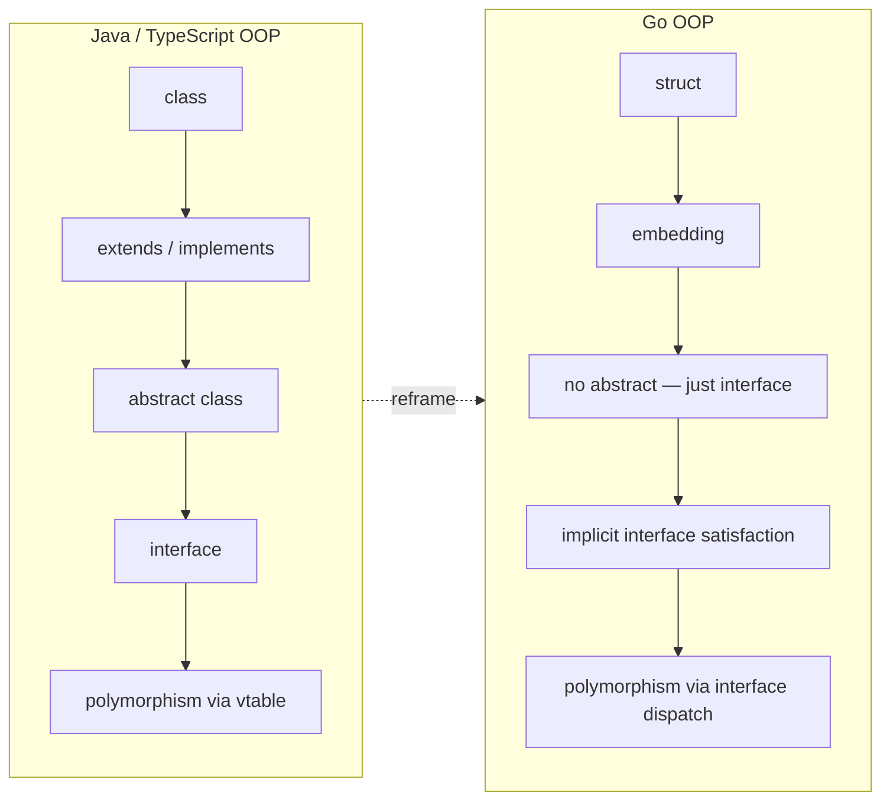
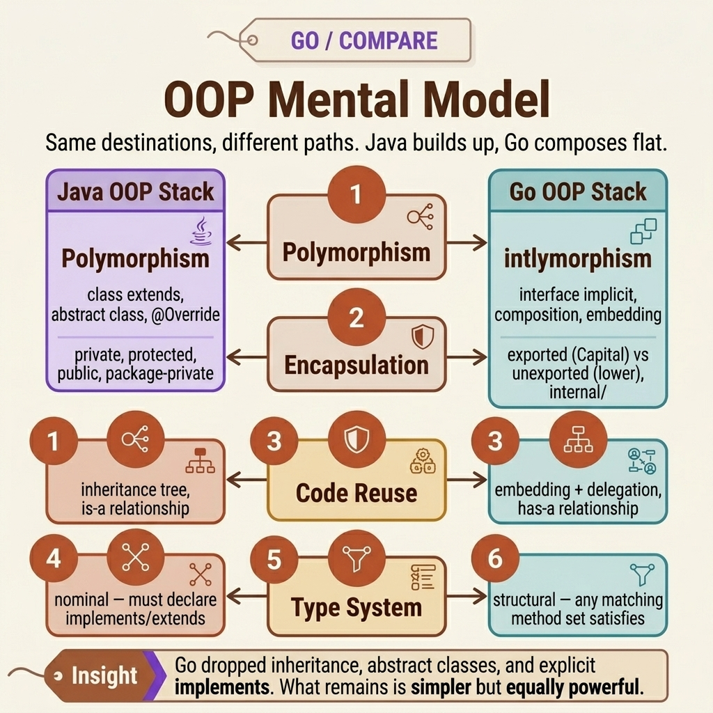
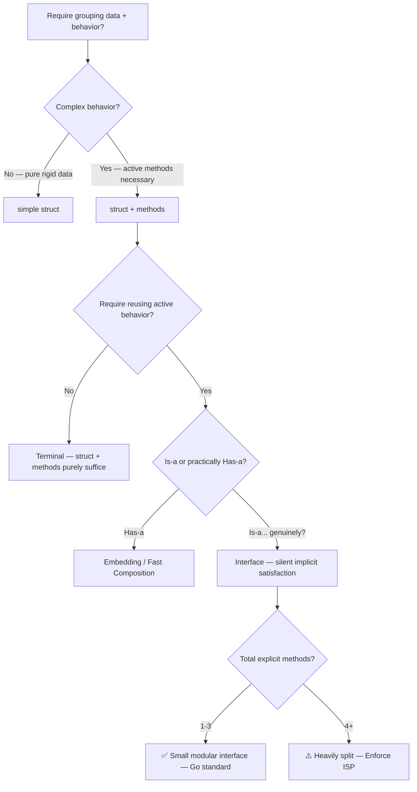

<!-- tags: golang, oop, mental-model -->
# 🧠 OOP Mental Model — Transitioning from Java/TypeScript

> Does Go have OOP? Yes — but a minimalist variant. No classes, extends, or abstract modifiers. Structs + interfaces + composition replace all of them. This guide reframes your mental model.

📅 Created: 2026-04-10 · 🔄 Updated: 2026-04-19 · ⏱️ 18 min read

| Aspect            | Detail                                       |
| ----------------- | -------------------------------------------- |
| **Concept**       | OOP concepts mapped to Go equivalents        |
| **Use case**      | Developers migrating from Java/TS/C++ to Go |
| **Key insight**   | Go is OOP — just not the OOP you learned     |
| **Go philosophy** | Simplicity, composability, explicit > implicit|

---

## 1. DEFINE

Day one writing Go. You launch the IDE, create `user.go`, and immediately type `class User` — error. You attempt `abstract class BaseEntity` — error. `User extends BaseEntity implements Serializable` — the syntax fundamentally does not exist.

You search: "does Go support OOP?" Stack Overflow says: "Go is not an object-oriented language." You read further: "Go supports encapsulation, polymorphism, and composition." These statements contradict each other — that is the core confusion when arriving from Java or TypeScript.

The truth: **Go has OOP, but a stripped-down variant.** No `class` keyword, no inheritance hierarchies, no `abstract` constraints, no `protected` scope. Instead, Go uses:

| Traditional OOP | Go Equivalent | Core Differential |
| --- | --- | --- |
| `class` | `struct` | Data + methods; no hierarchy |
| `extends` | Embedding | Composition (has-a), not inheritance (is-a) |
| `implements` | Implicit satisfaction | No explicit declaration; method matching suffices |
| `abstract` | Interface | Minimalist, consumer-defined |
| `private/public` | lowercase/Uppercase | Package-level scoping |
| `new()` | Factory function | Explicit validation |
| `this` | Receiver `(u *User)` | Explicit, no implicit state |

### Why did Go engineer this precise structure?

Go originated at Google — navigating codebases with billions of lines and thousands of engineer commits daily. Pike, Thompson, and Griesemer deliberately removed:

- **Inheritance**: Because a 5+ level hierarchy practically guarantees fragile base classes, the diamond problem, and tight coupling.
- **Class keywords**: Because struct + methods provide sufficient capability — classes add unnecessary ceremony.
- **Implicit `this`**: Because explicit receivers make code far easier to trace at scale.

The outcome: Go’s OOP retains what matters — encapsulation, polymorphism, composition — while eliminating fragile inheritance, abstract state classes, and convoluted hierarchies.

### Failure Modes

| Mental Error | Symptom | Consequence |
| --- | --- | --- |
| "Go lacks OOP" | Writing flat procedural spaghetti | Domain logic bleeds everywhere, no encapsulation |
| "Go OOP = Java OOP" | Translating 1:1 Java enterprise patterns | Verbose, non-idiomatic, hard to review |
| "Every struct needs an interface" | Fat interfaces defined at the producer boundary | Coupling, mock hell, ISP violations |

Missing the paradigm in either direction has real cost. Below shows how the mental model actually works — mapping the thought flow, not just syntax.

---

## 2. VISUAL

The friction is not about syntax — it is about thought flow. When you think "I need polymorphism", Java drives you toward `extends` → `override`. Go directs you toward `interface` → implicit satisfaction. Same destination, opposite paths.

### Java OOP Stack vs Go OOP Stack





*Figure: Same 5 target tiers — but Go strips the inner 2 (class hierarchy + abstract class). Result: flat, low coupling.*

### Decision Map: When strictly to deploy what?



*Figure: The Go developer’s decision flow — most paths terminate at simple struct + methods or small interfaces. Embedding appears only when method promotion is required.*

The mental model is clear. The code below maps it into working artifacts — starting from the simplest "class to struct" translation.

---

## 3. CODE

### Example 1: Basic — Class → Struct + Methods

You process a standard Java class: `User` featuring private fields, a constructor, getters, and a business method. How strongly does this migrate into Go?

> **Goal**: Map a Java class to a Go struct + methods + factory.
> **Approach**: Struct holds data, methods bind to it, `NewXxx()` handles construction validation.
> **Example**: `User` Java class → `User` Go struct.

```go
// mental_model.go — Java class → Go struct

// Java:
// public class User {
//     private String email;
//     private String name;
//     public User(String email, String name) { this.email = email; this.name = name; }
//     public String getEmail() { return email; }
//     public String greet() { return "Hello, " + name; }
// }

// Go equivalent:
type User struct {
	email string // lowercase = unexported (strictly private to the declared package)
	name  string
}

// NewUser acts as the constructor proxy. Go inherently lacks an explicit constructor keyword.
// Execute validation here — the factory function strictly guarantees the resulting object is logically valid.
func NewUser(email, name string) (*User, error) {
	if email == "" {
		return nil, fmt.Errorf("email strictly required")
	}
	return &User{email: email, name: name}, nil
}

// Method bound to User — utilizing an explicit receiver bypassing the implicit Java `this` pointer
// (u *User) defines a pointer receiver — safely mutating the core origin struct while massively avoiding memory copy overhead
func (u *User) Email() string { return u.email }

func (u *User) Greet() string {
	return "Hello, " + u.name
}
```

> **Takeaway**: No `class`, no `this`, no boilerplate get/set. Structs + methods + factory functions = complete. The explicit receiver `(u *User)` clarifies what Java hides behind implicit `this`.

Struct + methods handle a single entity. When you need polymorphism — making different types share the same behavioral contract — Java uses `implements`. How does Go handle it?

---

### Example 2: Intermediate — Interface implements → Implicit Satisfaction

Java: `class EmailNotifier implements Notifier {}`. Go: drop the `implements` keyword entirely — if a struct has the matching methods, it satisfies the contract.

> **Goal**: Translate Java `implements` to Go’s implicit interface satisfaction.
> **Approach**: Define the interface at the consumer boundary. Any struct satisfies it by providing matching methods.
> **Example**: `Notifier` interface — `EmailNotifier` and `SlackNotifier` satisfy it implicitly.

```go
// implicit_interface.go — Java implements → Go implicit satisfaction

// Java:
// interface Notifier { void send(String to, String msg); }
// class EmailNotifier implements Notifier {
//     public void send(String to, String msg) { /* SMTP implementation */ }
// }

// Go: Interface rigorously defined WHERE IT IS ACTIVELY CONSUMED — entirely ignoring the upstream producer origin
type Notifier interface {
	Send(to, msg string) error
}

// EmailNotifier — EXPLICITLY NO "implements Notifier" hard declaration
// If this root struct functionally ships the `Send(to, msg string) error` method → it automatically structurally satisfies the `Notifier` constraint
type EmailNotifier struct {
	SMTPHost string
}

func (e *EmailNotifier) Send(to, msg string) error {
	// execute internal SMTP dispatch
	fmt.Printf("[Email] to=%s msg=%s via %s\n", to, msg, e.SMTPHost)
	return nil
}

type SlackNotifier struct {
	WebhookURL string
}

func (s *SlackNotifier) Send(to, msg string) error {
	// execute internal Slack webhook payload transit
	fmt.Printf("[Slack] channel=%s msg=%s\n", to, msg)
	return nil
}

// ✅ Consumer processes strictly generic interfaces — completely oblivious tracking concrete nested types
type OrderService struct {
	notifier Notifier // structurally injected dependency — dynamically accepting Email, Slack, or any compatible future architectural entity
}

func (os *OrderService) Complete(orderID string) error {
	// ... sequentially finalize root order transition parameters ...
	return os.notifier.Send("ops-channel", "Order "+orderID+" completed successfully")
}
```

> **Why implicit satisfaction instead of explicit `implements`?**
> Explicit `implements` creates tight coupling: the producer MUST know the interface exists. Go reverses this: the consumer defines the minimum interface it needs. The producer implements methods without knowing which interface will consume them. Result: zero imports from producer to consumer. Clean decoupling.
>
> **Trap**: Do not create an "interface for every struct" — if only 1 concrete implementation exists and you do not need a test mock, skip the interface. Interfaces surface when ≥2 implementations exist OR when testing requires mock boundaries.

> **Takeaway**: Go uses structural typing (duck typing) rather than nominal typing. If the struct has the matching methods, it satisfies the interface — no declaration needed. Consumer-defined, not producer-defined.

Implicit interfaces cover polymorphism. But when you need cross-type code reuse — Java uses `extends`. How does Go handle that?

---

### Example 3: Advanced — Inheritance Hierarchy → Flat Composition

In Java, `AdminUser extends User extends BaseEntity` drives code reuse. Go lacks `extends`. It substitutes with flat embedding + interface composition — creating flat, non-fragile structures.

> **Goal**: Map a 3-level Java hierarchy to Go flat composition.
> **Approach**: Embedding for field/method reuse, interfaces for contract reuse.
> **Example**: BaseEntity + User + AdminUser — 3 Java levels → 2 Go levels (embedded).

```go
// flat_composition.go — Java 3-level hierarchy → Go flat embedding

// Java:
// abstract class BaseEntity { Long id; LocalDateTime createdAt; }
// class User extends BaseEntity { String email; }
// class AdminUser extends User { String role; boolean canDelete(); }

// Go: NO explicit hierarchy. Embedding strictly = composition, entirely excluding inheritance.

// ✅ Reusable "base" fields — fundamentally NOT a parent class
type Timestamps struct {
	CreatedAt time.Time
	UpdatedAt time.Time
}

func (t *Timestamps) Touch() {
	now := time.Now()
	if t.CreatedAt.IsZero() {
		t.CreatedAt = now
	}
	t.UpdatedAt = now
}

// ✅ User simply embeds Timestamps — explicitly "has timestamps", strictly not "is a timestamp"
type User struct {
	Timestamps        // embedded element — implicitly promotes nested fields/methods
	ID         int64
	Email      string
}

// ✅ Admin cleanly embeds User — explicitly "has user data", strictly not "is a user"
type Admin struct {
	User              // embedded element — silently promotes User fields/methods upward
	Role   string
	Perms  []string
}

func (a *Admin) CanDelete() bool {
	for _, p := range a.Perms {
		if p == "delete" {
			return true
		}
	}
	return false
}

// ⚠️ CRITICAL DIFFERENCE from Java:
// var u User = admin  ← FATAL COMPILE ERROR in Go!
// Admin variables strictly ARE NOT statically assignable targeting User allocations.
// An Admin physically HAS a User. Construct a dynamic interface dictating polymorphism:

type Authenticatable interface {
	GetEmail() string
}

func (u *User) GetEmail() string { return u.Email }

// ✅ Both structured User and Admin completely satisfy Authenticatable — executing via the natively promoted method
// func authenticate(a Authenticatable) { ... }
```

> **Why flat beats a deep 3-level hierarchy?**
> In Java: changing `BaseEntity.createdAt` type ripples through `User`, `AdminUser`, and every subclass. That is the Fragile Base Class problem. With Go embedding: changing `Timestamps.CreatedAt` only affects types that embed `Timestamps`. No vtables, no method resolution order conflicts. And critically: `Admin` IS NOT a `User` — you need an explicit interface for polymorphism. This sounds restrictive but proves safer: it forces deliberate thinking about polymorphism instead of defaulting to inheritance.

> **Takeaway**: Go composition equals Java inheritance minus the fragility. Embedding drives code reuse. Interfaces drive polymorphism. Two separate concerns — cleanly isolated from the `extends` trap.

These examples map to the 3 OOP pillars. Next: common traps where Java thinking triggers Go bugs.

---

## 4. PITFALLS

| # | Severity | Error | Consequence | Fix |
| --- | --- | --- | --- | --- |
| 1 | 🔴 Fatal | Translating 1:1 Java design patterns | An `AbstractFactoryBuilder` spanning 200 lines that nobody can review | Simplify: struct + factory + small interface |
| 2 | 🔴 Fatal | Assuming embedding = inheritance (`admin = user`) | Compile error; or worse, silent runtime logic errors | Embedding is has-a. Use interfaces for polymorphism |
| 3 | 🟡 Common | Creating fat interfaces before needing 2 implementations | Interface boundaries with zero value | YAGNI: create interfaces when ≥2 variants exist |
| 4 | 🟡 Common | Adding getter/setter for every field | Redundant Java muscle memory | Go standard: export fields directly when appropriate |
| 5 | 🔵 Minor | Using `this.field` by muscle memory | Non-idiomatic | Use short receivers (e.g., `u *User`) |

### 🔴 Pitfall #1 — Java-to-Go translation = ceremony monster

Java developer writing Go natively creates:
```go
// ❌ Java-translated Go — structurally excessively complex
type UserFactory interface {
    CreateUser(email string) (*User, error)
}
type UserFactoryImpl struct{}
func (f *UserFactoryImpl) CreateUser(email string) (*User, error) { /* ... */ }
```

Crucial necessity purely:
```go
// ✅ Idiomatic Go — clean robust simple factory function
func NewUser(email string) (*User, error) { /* ... */ }
```

The interface `UserFactory` logically exists fundamentally exclusively precisely when operating multiple implementations cleanly or securely mocking boundaries.

---

## 5. REF

| Resource | Type | Link | Notes |
| --- | --- | --- | --- |
| Go FAQ — Is Go OOP? | Official | https://go.dev/doc/faq#Is_Go_an_object-oriented_language | Rob Pike's definitive answer |
| Effective Go | Official | https://go.dev/doc/effective_go | Canonical structural idioms |
| Go Blog — Composition | Official | https://go.dev/blog/embedding | Embedding conceptually explained purely |

---

## 6. RECOMMEND

The core of **OOP Mental Model — Reframe for Go** is clear. The branches below navigate each OOP pillar in depth.

| Extension | When | Rationale | File/Link |
| --- | --- | --- | --- |
| [Encapsulation & Visibility](./02-encapsulation-visibility.md) | When navigating package-level visibility natively | Uppercase/lowercase is deceptively simple — the real complexity lies inside internal packages precisely | Next in sequence |
| [Composition over Inheritance](./03-composition-over-inheritance.md) | When embedding structural patterns for DDD | Embedding + delegation = Go's replacement for extends | Core OOP logic |
| [Interfaces & Polymorphism](./04-interfaces-polymorphism.md) | When requiring polymorphism design cleanly | Consumer-defined, implicit modular bounds — deep dive | Core OOP logic |
| [Structs & Composition](../structs/01-composition-embedding.md) | When executing struct-specific structural details efficiently | Struct tags, native copy semantics, explicit constructor pattern pipelines | Cross-link |

---

**Navigation**: [← OOP in Go](./README.md) · [→ Encapsulation](./02-encapsulation-visibility.md)
