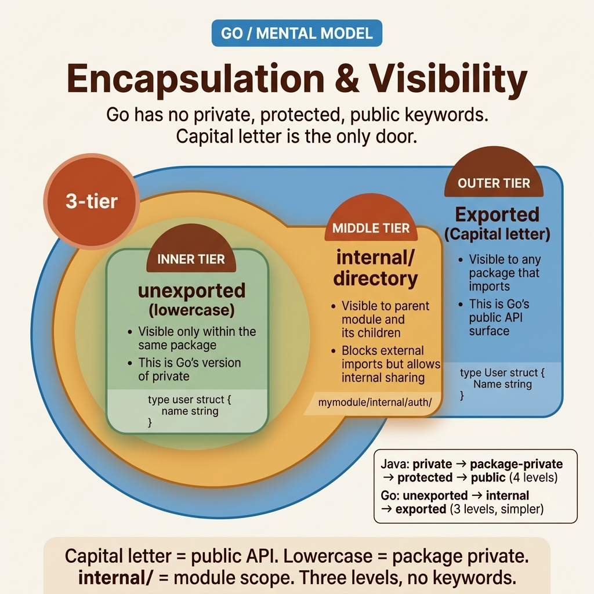

<!-- tags: golang, oop, encapsulation, visibility --> # 🔒 Encapsulation & Khả năng hiển thị — Package là Ranh giới, Không phải Lớp

> Go có loại bỏ các công cụ sửa đổi riêng tư/được bảo vệ/công khai không? Đúng. Nó sử dụng cách đặt tên chữ hoa (đã xuất) và chữ thường (không xuất). Nhưng sự đơn giản không có nghĩa là hoàn hảo.

📅 Đã tạo: 2026-04-10 · 🔄 Đã cập nhật: 19-04-2026 · ⏱️ 16 phút đọc

| Khía cạnh | Chi tiết |
| ----------------- | ------------------------------------------ |
| **Khái niệm** | Go quy tắc hiển thị và package -level encapsulation |
| **Trường hợp sử dụng** | Thiết kế API cứng, mô hình miền, bảo mật trạng thái |
| **Thông tin chi tiết quan trọng** | Go package hoạt động như đơn vị tuyệt đối của encapsulation ​​|
| ** Go triết lý** | Các ranh giới hiển thị rõ ràng ghi đè mạnh mẽ cấu trúc inheritance |

---

## 1. ĐỊNH NGHĨA

Đánh giá mã, Thứ Năm, 3 giờ chiều. Nhà phát triển gửi đăng ký người dùng mô hình PR modules :```go
type User struct {
    ID       int64
    Email    string
    Password string  // ← Uppercase = exported publicly
}
```Trình xử lý API tiến hành sắp xếp các phản hồi JSON chỉ đạo `User` ; hàm băm mật khẩu thô bị rò rỉ công khai trực tiếp vào tải trọng giao diện người dùng. Sự cố sản xuất chính thức được tuyên bố vào lúc 7 giờ tối.

**Đây là hiểu lầm phổ biến nhất** khi ánh xạ tư duy OOP sang Go : khả năng hiển thị không nằm ở cấp độ struct — nó hoạt động ở cấp độ ** package **.

| Cấu trúc Java/TS | Bản địa Go Tương đương | Phạm vi kiến ​​trúc |
| --- | --- | --- |
| `private field` | `lowercase field` | Bị cô lập nghiêm ngặt trong cùng một package |
| `protected` | Khái niệm cơ bản bị bỏ qua | Go vốn dĩ vĩnh viễn thiếu các cơ chế phân lớp chức năng |
| `public` | `Uppercase field` | Có thể truy cập toàn cầu ở mọi nơi tích cực nhập package |
| `internal` | `internal/` thư mục con | Bị cô lập nghiêm ngặt trong ranh giới bao trùm module giống hệt nhau |

### Mô hình cốt lõi Go encapsulation rất đơn giản: **chữ hoa = đã xuất, chữ thường = chưa xuất.**

Nhưng đơn giản ≠ không thể sai lầm:

- Trường không được xuất `password` ẩn khỏi packages bên ngoài nhưng vẫn hiển thị trong cùng package .
- Mọi file trong cùng package đều có thể thấy các trường ngang hàng chưa được xuất.
- Thư mục `internal/` chặn nhập từ modules bên ngoài.

### Chế độ lỗi

| Lỗi cấu trúc | Nguyên nhân gốc rễ | Hậu quả hệ thống |
| --- | --- | --- |
| Xuất các trường nhạy cảm | Mặc định viết hoa một cách mù quáng | Rò rỉ dữ liệu thông qua việc sắp xếp JSON |
| Người khổng lồ nguyên khối packages | Kết xuất mọi thành phần vào một thư mục | Chưa được xuất khẩu = có thể truy cập được ở mọi nơi bên trong package |
| Bỏ qua xác thực hàm tạo | Sử dụng chữ struct thô | Tạo `User{Email: ""}` phá vỡ xác thực |

Dưới đây: quy tắc hiển thị chính xác trong mã làm việc.

---

## 2. HÌNH ẢNH

### Go Phạm vi hiển thị ```mermaid
flowchart TD
    subgraph Module["Go Module"]
        subgraph PkgA["package user"]
            A1["type User struct"]
            A2["email string ← unexported"]
            A3["Email() string ← exported method"]
        end
        subgraph PkgB["package handler"]
            B1["import user"]
            B2["u.Email() ✅ — cleanly exported"]
            B3["u.email ❌ — fatally unexported"]
        end
        subgraph Internal["internal/auth"]
            C1["Can safely import user ✅"]
            C2["External modules fundamentally blocked ❌"]
        end
    end

    PkgA -->|"exported strictly"| PkgB
    PkgA -->|"exported strictly"| Internal
    Internal -.->|"blocked securely for external"| External["External Module"]
```*Hình: 3 cấp phạm vi: ranh giới package , ranh giới module và giới hạn module bên ngoài.*

### Encapsulation Luồng quyết định```mermaid
flowchart TD
    A[New Field] --> B{Who specifically requires active access?}
    B -->|Strictly intra-package purely| C[lowercase — decisively unexported]
    B -->|Cross-package intra-module merely| D{Inherently deeply sensitive data?}
    D -->|Absolutely No| E[Uppercase — confidently cleanly exported]
    D -->|Absolutely Yes| F[unexported struct field + exported getter/method boundary]
```*Hình: Các quyết định kiến trúc chỉ ra một cách hiệu quả các đường dẫn được xuất và không được xuất về mặt cấu trúc chỉ dựa vào ranh giới phạm vi kết hợp với độ nhạy nội tại.*

---

## 3. MÃ

### Ví dụ 1: Cơ bản — Trường đã xuất và chưa xuất

> **Mục tiêu**: Hiểu các quy tắc hiển thị và giới hạn sắp xếp JSON.
> **Phương pháp tiếp cận**: Các trường chưa xuất kết hợp với các phương thức đã xuất đạt được encapsulation .```go
// visibility.go — user package
package user

import "time"

type User struct {
	id        int64     // unexported — package internal
	email     string    // unexported — prevents JSON leakage
	name      string    // unexported
	password  string    // unexported — CRITICAL: never export this
	CreatedAt time.Time // ⚠️ Exported — JSON marshal will include this
}

func (u *User) ID() int64     { return u.id }
func (u *User) Email() string { return u.email }
func (u *User) Name() string  { return u.name }

func (u *User) ChangeEmail(newEmail string) error {
	if newEmail == "" {
		return fmt.Errorf("email cannot be empty")
	}
	u.email = newEmail
	return nil
}
```

```go
// handler.go — handler package (different boundary)
package handler

import "myapp/user"

func HandleGetUser(u *user.User) {
	_ = u.Email()    // ✅ — exported method
	// _ = u.email   // ❌ COMPILE ERROR — unexported field
}
```> **Takeaway**: Chữ thường ẩn trường khỏi packages bên ngoài. Các phương thức tên miền như `ChangeEmail()` thay thế các setters để thực thi các quy tắc kinh doanh.

---

### Ví dụ 2: Trung gian — Hàm tạo + Nội bộ Package > **Mục tiêu**: Thực thi trạng thái hợp lệ thông qua hàm tạo, chặn việc lạm dụng theo nghĩa đen struct .
> **Phương pháp tiếp cận**: Các trường chưa xuất + hàm factory đã xuất.```go
// user.go — constructor enforcement
package user

import (
	"fmt"
	"strings"
	"time"
)

type User struct {
	id        int64
	email     string
	name      string
	createdAt time.Time
}

func NewUser(email, name string) (*User, error) {
	email = strings.TrimSpace(email)
	if email == "" {
		return nil, fmt.Errorf("user: email required")
	}
	
	name = strings.TrimSpace(name)
	if name == "" {
		return nil, fmt.Errorf("user: name required")
	}

	return &User{
		email:     email,
		name:      name,
		createdAt: time.Now(),
	}, nil
}
```

```go
// internal/auth/token.go — internal package pattern
package auth

// ✅ Accessible strictly within the overarching module boundary
type TokenClaims struct {
	UserID int64
	Email  string
	Exp    int64
}
```> **Bài học rút ra**: Các trường chưa xuất + nhà máy xây dựng sẽ ngăn trạng thái `User{Email: ""}` không hợp lệ.

---

### Ví dụ 3: Nâng cao — Mẫu kho lưu trữ Encapsulation > **Mục tiêu**: Đóng gói các chi tiết về tính bền vững đằng sau interfaces .
> **Phương pháp tiếp cận**: Xác định interface trong miền; thực hiện nó trong cơ sở hạ tầng.```go
// domain/repository.go
package domain

import "context"

type UserRepository interface {
	FindByID(ctx context.Context, id int64) (*User, error)
}
```

```go
// infrastructure/postgres/user_repo.go
package postgres

import (
	"context"
	"database/sql"
	"myapp/domain"
)

type pgUserRepository struct {
	db *sql.DB // specific raw infrastructure detail structurally hidden
}

func NewUserRepository(db *sql.DB) domain.UserRepository {
	return &pgUserRepository{db: db}
}

func (r *pgUserRepository) FindByID(ctx context.Context, id int64) (*domain.User, error) {
	return nil, nil // Internal raw persistence implementations safely hidden entirely.
}
```> **Takeaway**: Hệ thống hiển thị của Go thực hiện Đảo ngược phụ thuộc một cách tự nhiên — database bộ điều hợp luôn ẩn sau miền interfaces .

---

## 4. Cạm bẫy

| # | Mức độ nghiêm trọng | Lỗi | Hậu quả | Sửa chữa |
| --- | --- | --- | --- | --- |
| 1 | 🔴 Gây tử vong | Xuất các trường nhạy cảm (Mật khẩu) | Rò rỉ dữ liệu trực tiếp qua phản hồi API JSON | Sử dụng chữ thường + không có getter |
| 2 | 🔴 Gây tử vong | Xây dựng khối đá khổng lồ packages | Các trường chưa xuất vẫn có thể truy cập được trong suốt | Chia rẽ quyết liệt |
| 3 | 🟡 Chung | Thêm getters cho mọi trường một cách mù quáng | Bộ nhớ cơ Java còn sót lại | Sử dụng các phương thức miền nếu cần có bộ bảo vệ xác thực |

---

## 5. GIỚI THIỆU

| Tài nguyên | Loại | Liên kết | Ghi chú |
| --- | --- | --- | --- |
| Có hiệu lực Go — Tên | Chính thức | https://go.dev/doc/effect_go#names | Đặt tên chính xác = khả năng hiển thị chặt chẽ |
| Go Nội bộ Packages ​​| Chính thức | https://go.dev/doc/go1.4#internalpackages | Nội bộ/tính năng nghiêm ngặt |

---