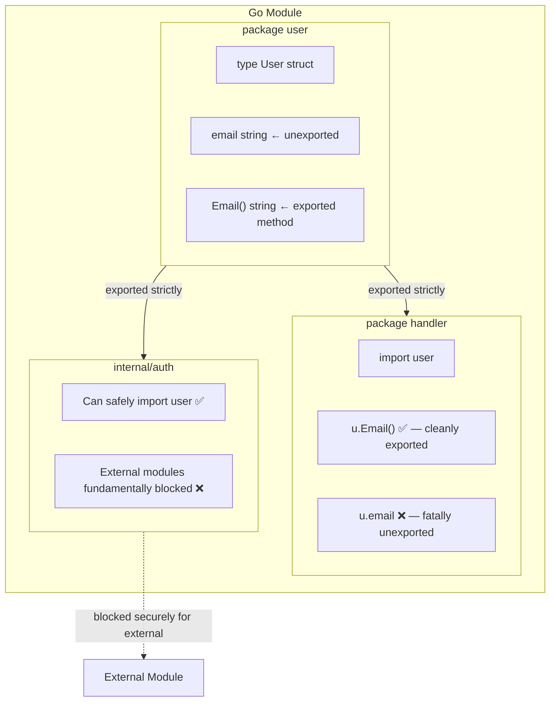
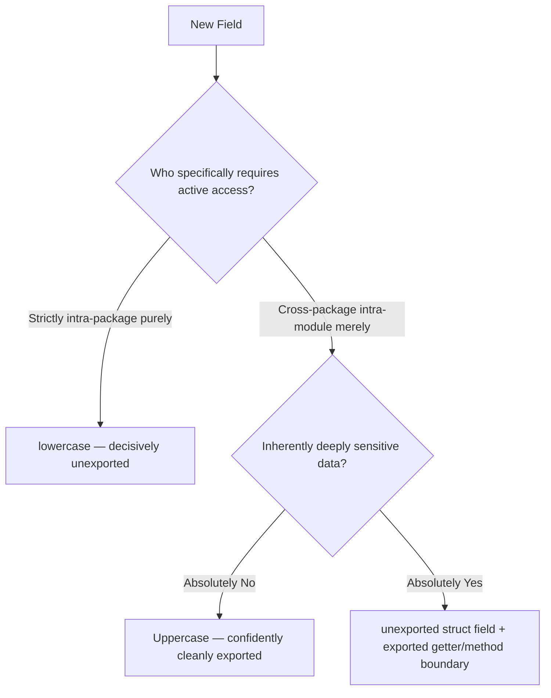

<!-- tags: golang, oop, encapsulation, visibility -->
# 🔒 Encapsulation & Visibility — The Package is the Boundary, Not the Class

> Does Go eliminate private/protected/public modifiers? Yes. It uses uppercase (exported) and lowercase (unexported) naming. But simplicity does not mean foolproof.

📅 Created: 2026-04-10 · 🔄 Updated: 2026-04-19 · ⏱️ 16 min read

| Aspect            | Detail                                     |
| ----------------- | ------------------------------------------ |
| **Concept**       | Go visibility rules and package-level encapsulation    |
| **Use case**      | Hardened API design, domain modeling, state security      |
| **Key insight**   | The Go package operates as the absolute unit of encapsulation |
| **Go philosophy** | Explicitly visible boundaries strongly override structural inheritance |

---

## 1. DEFINE

Code review, Thursday, 3 PM. A developer submits a PR modeling user registration modules:

```go
type User struct {
    ID       int64
    Email    string
    Password string  // ← Uppercase = exported publicly
}
```

The API handler proceeds to marshal the `User` directing JSON responses; the raw password hash leaks publicly directly into the frontend payload. Production incident officially declared at 7 PM.

**This is the most common misunderstanding** when mapping OOP mindsets to Go: visibility does not reside at the struct level — it operates at the **package level**.

| Java/TS Structure | Native Go Equivalent | Architectural Scope |
| --- | --- | --- |
| `private field` | `lowercase field` | Strictly isolated within the identical package |
| `protected` | Concept fundamentally omitted | Go inherently permanently lacks functional subclass mechanisms |
| `public` | `Uppercase field` | Globally accessible anywhere actively importing the package |
| `internal` | `internal/` subfolder | Strictly isolated within the identical overarching module boundary |

### The Core Paradigm

Go encapsulation is simple: **uppercase = exported, lowercase = unexported.**

But simple ≠ infallible:

- An unexported field `password` hides from external packages but remains visible within the same package.
- Every file in the same package can see unexported peer fields.
- The `internal/` directory blocks imports from external modules.

### Failure Modes

| Structural Error | Native Root Cause | Systemic Consequence |
| --- | --- | --- |
| Exporting sensitive fields | Defaulting to uppercase blindly | Data leaks via JSON marshaling |
| Monolithic giant packages | Dumping every component into one directory | Unexported = accessible everywhere inside that package |
| Bypassing constructor validation | Using raw struct literals | Generating `User{Email: ""}` that circumvents validation |

Below: precise visibility rules in working code.

---

## 2. VISUAL

### Go Visibility Scopes




*Figure: 3 tiers of scope: package boundary, module boundary, and external module limit.*

### Encapsulation Decision Flow



*Figure: Architectural decisions effectively dictating exported vs unexported paths structurally rely exclusively on scope boundaries combined with intrinsic sensitivity.*

---

## 3. CODE

### Example 1: Basic — Exported vs Unexported Fields

> **Goal**: Understand visibility rules and JSON marshaling limits.
> **Approach**: Unexported fields combined with exported methods achieve encapsulation.

```go
// visibility.go — user package
package user

import "time"

type User struct {
	id        int64     // unexported — package internal
	email     string    // unexported — prevents JSON leakage
	name      string    // unexported
	password  string    // unexported — CRITICAL: never export this
	CreatedAt time.Time // ⚠️ Exported — JSON marshal will include this
}

func (u *User) ID() int64     { return u.id }
func (u *User) Email() string { return u.email }
func (u *User) Name() string  { return u.name }

func (u *User) ChangeEmail(newEmail string) error {
	if newEmail == "" {
		return fmt.Errorf("email cannot be empty")
	}
	u.email = newEmail
	return nil
}
```

```go
// handler.go — handler package (different boundary)
package handler

import "myapp/user"

func HandleGetUser(u *user.User) {
	_ = u.Email()    // ✅ — exported method
	// _ = u.email   // ❌ COMPILE ERROR — unexported field
}
```

> **Takeaway**: Lowercase hides the field from external packages. Domain methods like `ChangeEmail()` substitute setters to enforce business rules.

---

### Example 2: Intermediate — Constructor + Internal Package

> **Goal**: Enforce valid state via constructor, blocking struct literal abuse.
> **Approach**: Unexported fields + exported factory function.

```go
// user.go — constructor enforcement
package user

import (
	"fmt"
	"strings"
	"time"
)

type User struct {
	id        int64
	email     string
	name      string
	createdAt time.Time
}

func NewUser(email, name string) (*User, error) {
	email = strings.TrimSpace(email)
	if email == "" {
		return nil, fmt.Errorf("user: email required")
	}
	
	name = strings.TrimSpace(name)
	if name == "" {
		return nil, fmt.Errorf("user: name required")
	}

	return &User{
		email:     email,
		name:      name,
		createdAt: time.Now(),
	}, nil
}
```

```go
// internal/auth/token.go — internal package pattern
package auth

// ✅ Accessible strictly within the overarching module boundary
type TokenClaims struct {
	UserID int64
	Email  string
	Exp    int64
}
```

> **Takeaway**: Unexported fields + constructor factories prevent invalid `User{Email: ""}` states.

---

### Example 3: Advanced — Repository Encapsulation Pattern

> **Goal**: Encapsulate persistence details behind interfaces.
> **Approach**: Define the interface in the domain; implement it in infrastructure.

```go
// domain/repository.go
package domain

import "context"

type UserRepository interface {
	FindByID(ctx context.Context, id int64) (*User, error)
}
```

```go
// infrastructure/postgres/user_repo.go
package postgres

import (
	"context"
	"database/sql"
	"myapp/domain"
)

type pgUserRepository struct {
	db *sql.DB // specific raw infrastructure detail structurally hidden
}

func NewUserRepository(db *sql.DB) domain.UserRepository {
	return &pgUserRepository{db: db}
}

func (r *pgUserRepository) FindByID(ctx context.Context, id int64) (*domain.User, error) {
	return nil, nil // Internal raw persistence implementations safely hidden entirely.
}
```

> **Takeaway**: Go’s visibility system naturally implements Dependency Inversion — database adapters stay hidden behind domain interfaces.

---

## 4. PITFALLS

| # | Severity | Error | Consequence | Fix |
| --- | --- | --- | --- | --- |
| 1 | 🔴 Fatal | Exporting sensitive fields (Password) | Data leaks directly via JSON API responses | Use lowercase + no getter |
| 2 | 🔴 Fatal | Constructing monolithic giant packages | Unexported fields remain accessible throughout | Split aggressively |
| 3 | 🟡 Common | Adding getters for every field blindly | Residual Java muscle memory | Use domain methods if validation guards are necessary |

---

## 5. REF

| Resource | Type | Link | Notes |
| --- | --- | --- | --- |
| Effective Go — Names | Official | https://go.dev/doc/effective_go#names | Exact naming = tight visibility |
| Go Internal Packages | Official | https://go.dev/doc/go1.4#internalpackages | Strict internal/ feature |

---
