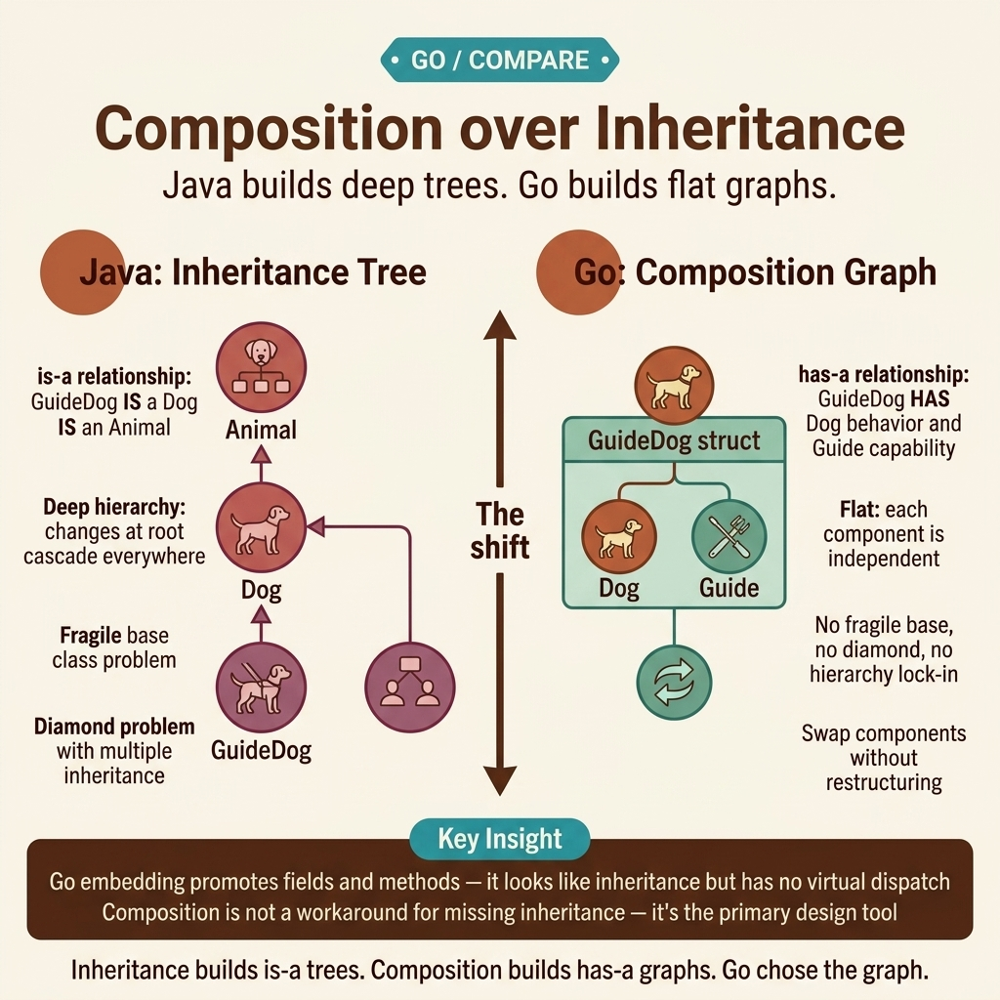

<!-- tags: golang, oop, composition, embedding -->
# 🧩 Composition over Inheritance — Go Omits extends by Design

> **Struct Embedding**: Delegate to discrete components instead of deep inheritance hierarchies.

📅 Created: 2026-04-10 · 🔄 Updated: 2026-04-19 · ⏱️ 17 min read

| Aspect            | Detail                                                |
| ----------------- | ----------------------------------------------------- |
| **Concept**       | Struct embedding and delegation patterns |
| **Use case**      | Domain aggregates mixing component capabilities |
| **Key insight**   | Method promotion handles delegation without inheritance |
| **Go philosophy** | Flat data beats nested parent hierarchies |

---

## 1. DEFINE

Consider migrating Java domains to Go. Legacy systems build sprawling class hierarchies with multiple parent levels that silently break downstream dependencies. 

Go takes a different path. There is no `extends` keyword. Structs embed targeted references for code reuse without creating coupling hierarchies. Composition replaces parent layers entirely.

### Embedding vs Named Field vs Interface

| Technique | Syntax | Role |
| --- | --- | --- |
| **Embedding** | `type User struct { Timestamps }` | Method promotion mapping specific functional routes |
| **Named field** | `type User struct { ts Timestamps }` | Explicit dependency access defining distinct targets |
| **Interface** | `type Saver interface { Save() error }` | Contract paths establishing basic execution constraints |

### When to Embed Structs?

- Methods map explicit behavioral checks checking structural identity limits.
- Target structures avoid recursive field overlap blocking native runtime errors.
- Target logic implements explicit interfaces delegating nested behavior structures.

### Failure Modes

| Error | Consequence | Fix |
| --- | --- | --- |
| Embedding simple utilities | `user.Execute()` promotes HTTP methods, confusing the API | Use named fields for utilities |
| Multiple embedded collisions | Identical method signatures cause compiler errors | Define explicit wrapper methods to resolve ambiguity |
| Treating embedding as inheritance | Go rejects type assignments between embedded types | Use interfaces for polymorphism |

## 2. VISUAL



*Figure: Java maintains deep vertical chains. Go uses flat graph components with precise dependency targeting.*

Method resolution catches conflicts at compile time, blocking ambiguous promoted methods.

## 3. CODE

### Example 1: Basic — Embedding Promoted Fields & Methods

> **Goal**: Share `Timestamps` fields across structs without base classes.
> **Approach**: Embed `Timestamps` directly; methods are promoted automatically.
> **Complexity**: Basic

```go
package model

import "time"

type Timestamps struct {
	CreatedAt time.Time
	UpdatedAt time.Time
}

func (t *Timestamps) Touch() {
	now := time.Now()
	if t.CreatedAt.IsZero() {
		t.CreatedAt = now
	}
	t.UpdatedAt = now
}

type User struct {
	Timestamps // Anonymous field promoting inner structures
	ID    int64
	Email string
}

func main() {
	u := User{Email: "test@domain.com"}
	u.Touch() // Invokes Timestamps.Touch() resolving operations natively
	_ = u.CreatedAt
}
```

> **Takeaway**: Anonymous embedding promotes fields and methods. Composition keeps definitions flat while sharing behavior.

### Example 2: Intermediate — Multiple Embedding & Method Shadowing

> **Goal**: Resolve ambiguous method signatures when multiple embedded types collide.
> **Approach**: Define an explicit wrapper method that delegates to the correct embedded type.
> **Complexity**: Intermediate

```go
package model

import "fmt"

type User struct {
	Email string
}

func (u *User) String() string { return "User:" + u.Email }

type Logger struct {
	Level string
}

func (l *Logger) String() string { return "Logger:" + l.Level }

type Admin struct {
	User
	Logger
	Role string
}

// Map explicit functions bypassing distinct ambiguous method selections
func (a *Admin) String() string {
	return fmt.Sprintf("Admin(%s, log=%s)", a.User.String(), a.Logger.String())
}

func main() {
	a := Admin{
		User:   User{Email: "admin@domain.com"},
		Logger: Logger{Level: "info"},
	}
	fmt.Println(a.String())
}
```

> **Takeaway**: Go prevents silent method collisions. Define explicit methods to resolve ambiguity between embedded types.

### Example 3: Advanced — DDD Aggregate with Composition

> **Goal**: Build a DDD Aggregate with embedded event collection and transition invariants.
> **Approach**: Embed `AggregateRoot` for event tracking; validate state transitions in domain methods.
> **Complexity**: Advanced

```go
package domain

import (
	"fmt"
	"time"
)

type DomainEvent interface {
	EventName() string
}

type AggregateRoot struct {
	id      string
	events  []DomainEvent
}

func (ar *AggregateRoot) ID() string { return ar.id }

func (ar *AggregateRoot) AddEvent(e DomainEvent) {
	ar.events = append(ar.events, e)
}

type Order struct {
	AggregateRoot
	Status string
}

func NewOrder(id string) *Order {
	return &Order{
		AggregateRoot: AggregateRoot{id: id},
		Status:        "DRAFT",
	}
}

type ItemAddedEvent struct {
	OrderID string
}
func (e *ItemAddedEvent) EventName() string { return "item.added" }

func (o *Order) AddItem() error {
	if o.Status != "DRAFT" {
		return fmt.Errorf("invalid mapping processing state transitions")
	}

	o.AddEvent(&ItemAddedEvent{OrderID: o.ID()})
	return nil
}
```

> **Takeaway**: Aggregate roots track domain events via embedded composition. Embedding creates functional objects that enforce business invariants natively.

## 4. PITFALLS

Composition replaces inheritance hierarchies. Key traps to avoid:

| # | Severity | Defect | Fix |
| --- | --- | --- | --- |
| 1 | 🔴 Fatal | Treating embedded structs as parent types, expecting assignment polymorphism | Use interfaces for polymorphism, not type assignment |
| 2 | 🔴 Fatal | Embedding utility structs that pollute the domain API surface | Use named fields to isolate utility access |
| 3 | 🟡 Common | Chaining multi-level embeddings that obscure field origins | Limit embedding depth; prefer named fields for clarity |

## 5. REF

| Resource | Link | Note |
| --- | --- | --- |
| Effective Go | [https://go.dev/doc/effective_go#embedding](https://go.dev/doc/effective_go#embedding) | Embedding semantics and rules |
| Go Blog | [https://go.dev/blog/embedding](https://go.dev/blog/embedding) | Composition patterns |

---
