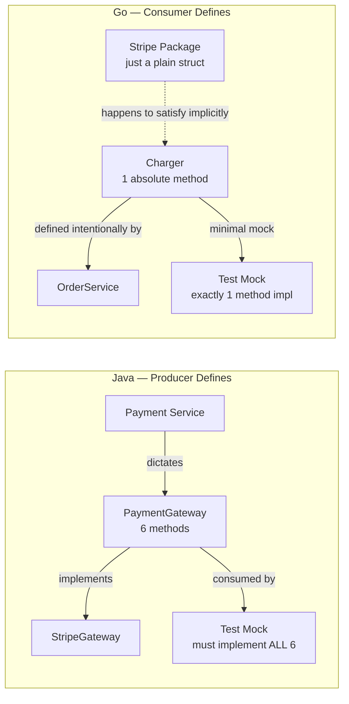
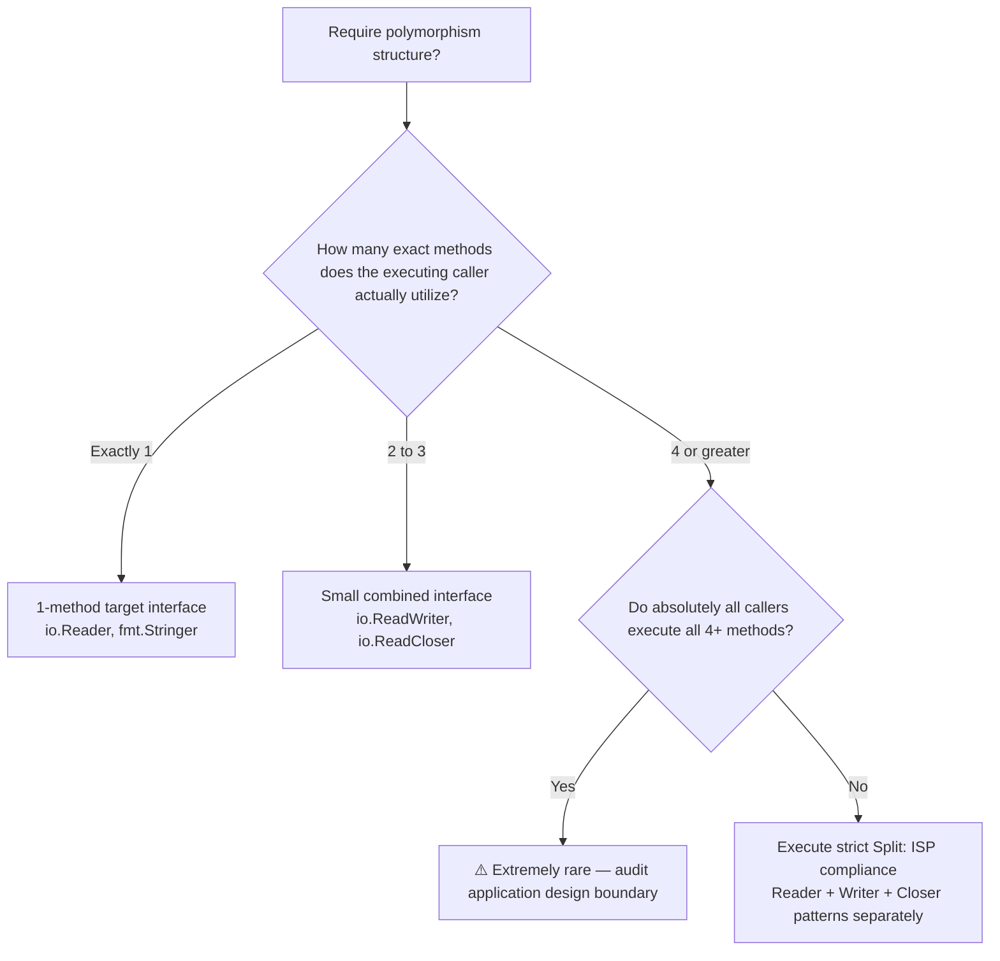

<!-- tags: golang, oop, interfaces, polymorphism -->
# 🦆 Interfaces & Polymorphism — Consumer-Defined, Implicit, Small

> Go interfaces contrast with Java interfaces in every aspect: implicit satisfaction, consumer-defined contracts, and minimal size constraints. This article reframes concrete polymorphism for Go.

📅 Created: 2026-04-10 · 🔄 Updated: 2026-04-19 · ⏱️ 18 min read

| Aspect            | Detail                                          |
| ----------------- | ----------------------------------------------- |
| **Concept**       | Implicit interfaces, duck typing, composition   |
| **Use case**      | Polymorphism, dependency injection, testing      |
| **Key insight**   | The interface belongs to the consumer, not the producer      |
| **Go philosophy** | Accept interfaces, return concrete structs                |

---

## 1. DEFINE

Consider a sprint retrospective. The test coverage report shows 23%. The engineering team comments: "Mocking dependencies is too difficult." You review the codebase:

```java
// Java — producer-defined fat interface
public interface PaymentGateway {
    PaymentResult charge(Money amount, String token);
    RefundResult refund(String txnId);
    Balance getBalance();
    List<Transaction> listTransactions(DateRange range);
    void setWebhookUrl(String url);
    HealthStatus healthCheck();
}
```

Six methods. The test only requires validating `charge()` — but the generated mock must implement all six methods. When `PaymentGateway` adds a seventh method during an upgrade, **every mock breaks compilation**. Developers find this exhausting, skip unit tests, and coverage drops.

The Go response: **the interface is defined by the consumer.** If a test package only evaluates `charge()`, define a single-method interface:

```go
// Go — consumer-defined, 1 method
type Charger interface {
    Charge(ctx context.Context, amount Money, token string) (PaymentResult, error)
}
```

The mock requires exactly 1 method. If the underlying producer adds 20 new methods, the consumer interface remains unaffected. Total decoupling.

### Go Interface Rules

| Rule | Java/TS | Go |
| --- | --- | --- |
| Declaration | `class X implements Y` | Unnecessary — fully implicit |
| Ownership | Producer dictates interface | Consumer defines exact interface |
| Component Size | Fat — 5 to 20 methods observed | Small — 1 to 3 methods optimal |
| Empty container | `Object` | `any` (alias for `interface{}`) |
| Type check | `instanceof` | Type assertion or type switch structure |

### Rob Pike's Guidance

> *"The bigger the interface, the weaker the abstraction."* — Rob Pike

The native Go standard library proves this rule:
- `io.Reader` — 1 method: `Read([]byte) (int, error)`
- `io.Writer` — 1 method: `Write([]byte) (int, error)`
- `fmt.Stringer` — 1 method: `String() string`
- `error` — 1 method: `Error() string`

The most powerful interfaces in Go’s standard library have **exactly 1 method**.

### Failure Modes

| Structural Defect | Root Cause | Ripple Effect |
| --- | --- | --- |
| Fat interface configured at producer | Java mindset defaulting to mirror ALL methods | Rigid coupling, mock failure, ISP violations |
| Isolated interface for 1 single implementation | Mechanical OOP ceremony habit | Pointless structural indirection yielding zero value |
| Generic `interface{}` usage everywhere | Prioritizing loose flexibility | Total loss of static type safety, runtime panics |

The fat interface trap is clear. Let us see what consumer-defined design looks like — from basic 1-method patterns to composed interfaces.

---

## 2. VISUAL

### Producer-Defined versus Consumer-Defined Setup




*Figure: Java forces the producer to own the interface, bloating consumer mocks. Go gives interface ownership to the consumer, decoupling the producer. The dependency arrow is inverted.*

### Interface Construction Size Workflow



*Figure: Default to 1-3 methods. 4+ methods require strong justification. Splitting is the default.*

The consumer-defined rule is clear. The code below implements it — from basic implicit satisfaction to composed interfaces.

---
## 3. CODE

### Example 1: Basic — Implicit Satisfaction (No implements keyword)

The simplest fact confusing Java developers: Go structs satisfy interfaces without explicit declaration.

> **Goal**: Understand implicit satisfaction.
> **Approach**: Define the interface. Create a struct with matching methods. Done.
> **Example**: `Dog` and `Cat` satisfy `Animal` — no declaration needed.

```go
// implicit.go — strict implicit interface satisfaction
package main

import "fmt"

// Target Interface — explicitly defined structurally by the CONSUMER package
type Animal interface {
	Speak() string
}

// Dog — features a Speak() method → immediately satisfies Animal implicitly
type Dog struct{ Name string }
func (d Dog) Speak() string { return d.Name + " says: Woof!" }

// Cat — also features Speak() → cleanly satisfies Animal structurally
type Cat struct{ Name string }
func (c Cat) Speak() string { return c.Name + " says: Meow!" }

// ✅ General function accepts standard interface — blind to the concrete type
func MakeNoise(a Animal) {
	fmt.Println(a.Speak())
}

func main() {
	// ✅ Active compiler strictly verifies the target implicitly satisfies Animal here
	MakeNoise(Dog{Name: "Rex"})   // Prints: Rex says: Woof!
	MakeNoise(Cat{Name: "Luna"})  // Prints: Luna says: Meow!
}
```

> **Takeaway**: No `implements`, no `@Override`, no class registration. A matching method signature = satisfaction. The compiler validates at the call site, not the definition.

Implicit satisfaction works in toy examples. The production pattern: define interfaces in the consumer package for dependency injection.

---

### Example 2: Intermediate — Consumer-Defined Interface Pattern

The production pattern: `OrderService` needs persistence and email notification. It defines only what it requires — without importing producer modules that contain fat interfaces.

> **Goal**: Consumer defines only what it needs. Producer never imports consumer dependencies.
> **Approach**: `OrderService` defines 2 interfaces (`OrderSaver`, `OrderNotifier`), each with 1 method.
> **Example**: Test mocks implement exactly 1 method per interface.

```go
// order_service.go — specific consumer-defined modular interfaces
package order

import "context"

// ✅ Concrete interfaces structurally formulated strictly by the CONSUMER target (order package)
// Each isolated interface equals the exact method the operational OrderService needs
// Producers (external packages like postgres or email) never import these constraints

type OrderSaver interface {
	Save(ctx context.Context, o *Order) error
}

type OrderNotifier interface {
	NotifyOrderPlaced(ctx context.Context, orderID string) error
}

type OrderService struct {
	saver    OrderSaver
	notifier OrderNotifier
}

func NewOrderService(s OrderSaver, n OrderNotifier) *OrderService {
	return &OrderService{saver: s, notifier: n}
}

func (os *OrderService) PlaceOrder(ctx context.Context, o *Order) error {
	if err := o.Place(); err != nil {
		return fmt.Errorf("place order execution failed: %w", err)
	}
	if err := os.saver.Save(ctx, o); err != nil {
		return fmt.Errorf("save order boundary failed: %w", err)
	}
	// General notification failures = operationally non-critical, actively log and silently continue
	if err := os.notifier.NotifyOrderPlaced(ctx, o.ID()); err != nil {
		log.Printf("WARN: notify failed for %s: %v", o.ID(), err)
	}
	return nil
}
```

```go
// postgres/repo.go — basic producer knows absolutely NOTHING concerning order.OrderSaver structures
package postgres

type OrderRepository struct{ db *sql.DB }

// ✅ This native struct merely incidentally possesses a Save() execution mapping the signature
// It directly satisfies the logical order.OrderSaver strictly WITHOUT importing the order module
func (r *OrderRepository) Save(ctx context.Context, o *order.Order) error {
	// ... Executable target INSERT INTO active orders mapping ...
	return nil
}
```

```go
// order/service_test.go — executing tests driving minimal test mocks
package order_test

// ✅ Formal mock structurally mandates merely 1 explicit method parameter — avoiding implementing 10
type mockSaver struct {
	called bool
	err    error
}
func (m *mockSaver) Save(ctx context.Context, o *Order) error {
	m.called = true
	return m.err
}

type mockNotifier struct{}
func (m *mockNotifier) NotifyOrderPlaced(ctx context.Context, id string) error {
	return nil
}

func TestPlaceOrder(t *testing.T) {
	saver := &mockSaver{}
	svc := NewOrderService(saver, &mockNotifier{})
	// ... trigger specific TestPlaceOrder routine ...
	if !saver.called { t.Fatal("expected save to be called") }
}
```

> **Why consumer-defined over a shared interface package?**
> A shared `interfaces.OrderRepository` package couples both producers and consumers through heavy imports. Consumer-defined: producers never import consumers → clean decoupling. If a consumer refactors its interface, only the affected producer needs updating.
>
> **Golden Rule**: "Accept interfaces, return concrete structs." Function parameters = interface. Function return = concrete type.

> **Takeaway**: Consumer-defined interfaces achieve clean decoupling. Test mocks stay trivial. Coverage maps directly to interface usage.

Single-method interfaces are the norm. When a consumer needs multiple capabilities (e.g., `ReadWriteCloser`), interface composition handles it.

---
\n### Example 3: Advanced — Interface Composition & Type Assertion

Go composes interfaces precisely like it composes structs: using embedding. `ReadWriter = Reader + Writer`. Type assertions then permit native runtime explicit capability checking.

> **Goal**: Compose interfaces from small pieces. Use type assertions and type switches for runtime flexibility.
> **Approach**: Interface embedding for composition. Type switches for dispatch.
> **Example**: `ReadWriter = Reader + Writer`. Type switches detect capabilities.

```go
// composition.go — active interface composition plus strict type assertion
package storage

import (
	"context"
	"fmt"
	"io"
)

// ✅ Small explicit interfaces — exactly 1 method each
type Reader interface {
	Read(ctx context.Context, key string) ([]byte, error)
}

type Writer interface {
	Write(ctx context.Context, key string, data []byte) error
}

type Deleter interface {
	Delete(ctx context.Context, key string) error
}

// ✅ Composed interface — embedding, NOT extends
type ReadWriter interface {
	Reader
	Writer
}

type Storage interface {
	Reader
	Writer
	Deleter
}

// MemoryStore satisfies Storage (all 3 methods)
type MemoryStore struct {
	data map[string][]byte
}

func NewMemoryStore() *MemoryStore {
	return &MemoryStore{data: make(map[string][]byte)}
}

func (m *MemoryStore) Read(ctx context.Context, key string) ([]byte, error) {
	v, ok := m.data[key]
	if !ok {
		return nil, fmt.Errorf("key not found: %s", key)
	}
	return v, nil
}

func (m *MemoryStore) Write(ctx context.Context, key string, data []byte) error {
	m.data[key] = data
	return nil
}

func (m *MemoryStore) Delete(ctx context.Context, key string) error {
	delete(m.data, key)
	return nil
}

// ✅ Function accepts smaller interface — caller does not need full Storage
func CopyKey(ctx context.Context, src Reader, dst Writer, key string) error {
	data, err := src.Read(ctx, key)
	if err != nil {
		return err
	}
	return dst.Write(ctx, key, data)
}

// ✅ Type assertion — checking if a narrow interface supports wider behavior
func MaybePurge(ctx context.Context, store Reader, key string) {
	// store might also support Deleter — check at runtime
	if d, ok := store.(Deleter); ok {
		_ = d.Delete(ctx, key)
		fmt.Println("purged", key)
	} else {
		fmt.Println("store does not support delete — skip purge")
	}
}

// ✅ Type switch — dispatch by concrete type
func Describe(w io.Writer) string {
	switch w.(type) {
	case *os.File:
		return "file writer"
	case *bytes.Buffer:
		return "buffer writer"
	default:
		return "unknown writer type"
	}
}
```

> **Why interface composition over 1 massive interface?**
> A massive `Storage` interface forces the consumer to know all methods. `CopyKey` only needs `Reader` and `Writer`. Requiring `Storage` would over-couple. Composition builds small pieces, combining only when needed. ISP compliance is automatic.
>
> **Type assertion vs type switch**: `store.(Deleter)` asks "does this also support delete?" — runtime capability opt-in. Type switches dispatch by concrete type — useful for serialization, logging, or error handling.

> **Takeaway**: Interface composition is Go’s native ISP. Keep interfaces small → compose on demand. Use type assertions for runtime flexibility. Golden rule: require the smallest interface your function actually needs.

---

## 4. PITFALLS

| # | Severity | Defect | Consequence | Fix |
| --- | --- | --- | --- | --- |
| 1 | 🔴 Fatal | Fat interfaces at producer (Java legacy) | Coupling, mock hell, ISP violations | Consumer-defined, ≤3 methods |
| 2 | 🔴 Fatal | Using `any` everywhere across APIs | Loss of type safety, runtime panics | Use concrete types or small interfaces |
| 3 | 🟡 Common | Creating an interface for 1 implementation | Pointless indirection | Use concrete type. Add interface when ≥2 variants or mock needed |
| 4 | 🟡 Common | Returning interfaces instead of structs | Caller loses access to underlying methods | "Accept interfaces, return concrete structs" |
| 5 | 🔵 Minor | Java naming (`IUser`) | Non-idiomatic | Use `-er` suffix: `Reader`, `Writer` |

---

## 5. REF

| Resource | Type | Link | Notes |
| --- | --- | --- | --- |
| Effective Go — Interfaces | Official | https://go.dev/doc/effective_go#interfaces | Canonical reference |
| Go Proverbs | Philosophy | https://go-proverbs.github.io/ | Core design principles |
| Go Blog — Errors are Values | Official | https://go.dev/blog/errors-are-values | Error interface — single method |

---

## 6. RECOMMEND

The core of **Interfaces & Polymorphism** is clear. The extensions below go deeper into SOLID principles and production patterns.

| Extension | When | Rationale | File/Link |
| --- | --- | --- | --- |
| [SOLID in Go](./05-solid-in-go.md) | When applying principles to architecture | Go-specific SRP, OCP, DIP | Next in sequence |
| [Design Patterns Go Way](./06-design-patterns-go-way.md) | When implementing Factory, Strategy, Observer | Patterns built on interfaces | Patterns file |
| [Interfaces Deep Dive](../interfaces/01-implicit-io-patterns.md) | When exploring `io.Reader`, `io.Writer` patterns | Standard library interface composition | Cross-link |

---

**Navigation**: [← Composition](./03-composition-over-inheritance.md) · [→ SOLID in Go](./05-solid-in-go.md)
