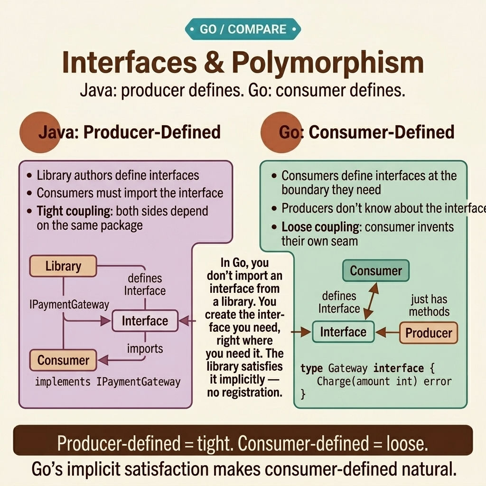

<!-- tags: golang, oop, interfaces, polymorphism --> # 🦆 Interfaces & Polymorphism — Do người tiêu dùng xác định, ngầm định, nhỏ

> Go interfaces tương phản với Java interfaces ở mọi khía cạnh: sự hài lòng tiềm ẩn, hợp đồng do người tiêu dùng xác định và các ràng buộc về kích thước tối thiểu. Bài viết này điều chỉnh lại cụ thể polymorphism ​​cho Go .

📅 Đã tạo: 2026-04-10 · 🔄 Đã cập nhật: 19-04-2026 · ⏱️ 18 phút đọc

| Khía cạnh | Chi tiết |
| ----------------- | ----------------------------------------------- |
| **Khái niệm** | Ẩn ý interfaces , gõ vịt, composition |
| **Trường hợp sử dụng** | Polymorphism , dependency injection , thử nghiệm |
| **Thông tin chi tiết quan trọng** | interface thuộc về người tiêu dùng, không phải nhà sản xuất |
| ** Go triết lý** | Chấp nhận interfaces , trả lại bê tông structs |

---

## 1. ĐỊNH NGHĨA

Hãy xem xét một cuộc hồi tưởng chạy nước rút. Báo cáo phạm vi kiểm tra cho thấy 23%. Nhóm kỹ thuật nhận xét: "Các phần phụ thuộc Mocking quá khó." Bạn xem lại cơ sở mã:```java
// Java — producer-defined fat interface
public interface PaymentGateway {
    PaymentResult charge(Money amount, String token);
    RefundResult refund(String txnId);
    Balance getBalance();
    List<Transaction> listTransactions(DateRange range);
    void setWebhookUrl(String url);
    HealthStatus healthCheck();
}
```Sáu phương pháp. Thử nghiệm chỉ yêu cầu xác thực `charge()` — nhưng mock được tạo phải triển khai tất cả sáu phương pháp. Khi `PaymentGateway` thêm phương thức thứ bảy trong quá trình nâng cấp, **mọi mock sẽ phá vỡ quá trình biên dịch**. Các nhà phát triển nhận thấy điều này thật mệt mỏi, bỏ qua các bài kiểm tra đơn vị và mức độ phù hợp giảm xuống.

Phản hồi Go : ** interface do người tiêu dùng xác định.** Nếu thử nghiệm package chỉ đánh giá `charge()` , hãy xác định một phương thức duy nhất interface :```go
// Go — consumer-defined, 1 method
type Charger interface {
    Charge(ctx context.Context, amount Money, token string) (PaymentResult, error)
}
```mock yêu cầu chính xác 1 phương thức. Nếu nhà sản xuất cơ bản thêm 20 phương thức mới, thì người tiêu dùng interface vẫn không bị ảnh hưởng. Tách rời hoàn toàn.

### Go Interface Quy tắc

| Quy tắc | Java/TS | Go |
| --- | --- | --- |
| Tuyên bố | `class X implements Y` | Không cần thiết - hoàn toàn ngầm định |
| Quyền sở hữu | Nhà sản xuất ra lệnh interface | Người tiêu dùng xác định chính xác interface |
| Kích thước thành phần | Chất béo — 5 đến 20 phương pháp được quan sát | Nhỏ — tối ưu 1 đến 3 phương pháp |
| Thùng rỗng | `Object` | `any` (bí danh cho `interface{}` ) |
| Kiểm tra loại | `instanceof` | Xác nhận kiểu hoặc cấu trúc type switch |

### Hướng dẫn của Rob Pike

> *" interface , độ trừu tượng càng yếu."* - Rob Pike

Thư viện chuẩn Go gốc chứng minh quy tắc này:
- `io.Reader` — 1 phương thức: `Read([]byte) (int, error)` - `io.Writer` — 1 phương thức: `Write([]byte) (int, error)` - `fmt.Stringer` — 1 phương thức: `String() string` - `error` — 1 phương thức: `Error() string` interfaces mạnh nhất trong thư viện chuẩn của Go có **chính xác 1 phương thức**.

### Chế độ lỗi

| Khiếm khuyết cấu trúc | Nguyên nhân gốc rễ | Hiệu ứng gợn sóng |
| --- | --- | --- |
| Fat interface được định cấu hình tại nhà sản xuất | Tư duy Java mặc định phản chiếu TẤT CẢ các phương thức | Khớp nối cứng, lỗi mock , vi phạm ISP |
| Bị cô lập interface cho 1 lần triển khai duy nhất | Thói quen lễ OOP cơ khí | Cấu trúc gián tiếp vô nghĩa mang lại giá trị bằng 0 |
| Cách sử dụng Generic `interface{}` ở mọi nơi | Ưu tiên tính linh hoạt lỏng lẻo | Mất hoàn toàn an toàn kiểu tĩnh, runtime hoảng loạn |

Bẫy mỡ interface đã rõ ràng. Chúng ta hãy xem thiết kế do người tiêu dùng xác định trông như thế nào - từ các mẫu 1 phương thức cơ bản đến các mẫu tổng hợp interfaces .

---

## 2. HÌNH ẢNH

### Thiết lập do nhà sản xuất xác định và thiết lập do người tiêu dùng xác định```mermaid
flowchart LR
    subgraph Java["Java — Producer Defines"]
        direction TB
        P1[Payment Service] -->|"dictates"| I1["PaymentGateway\n6 methods"]
        I1 -->|"implements"| C1[StripeGateway]
        I1 -->|"consumed by"| T1[Test Mock\nmust implement ALL 6]
    end

    subgraph Go["Go — Consumer Defines"]
        direction TB
        P2[Stripe Package\njust a plain struct] -.->|"happens to satisfy implicitly"| I2
        I2["Charger\n1 absolute method"] -->|"defined intentionally by"| C2[OrderService]
        I2 -->|"minimal mock"| T2[Test Mock\nexactly 1 method impl]
    end
``` *Hình: Java buộc nhà sản xuất phải sở hữu interface , làm tăng thêm người tiêu dùng mocks . Go trao quyền sở hữu interface ​​cho người tiêu dùng, tách rời nhà sản xuất. Mũi tên phụ thuộc bị đảo ngược.*

### Interface Quy trình quy trình xây dựng```mermaid
flowchart TD
    A[Require polymorphism structure?] --> B{How many exact methods does the executing caller actually utilize?}
    B -->|Exactly 1| C["1-method target interface\nio.Reader, fmt.Stringer"]
    B -->|2 to 3| D["Small combined interface\nio.ReadWriter, io.ReadCloser"]
    B -->|4 or greater| E{Do absolutely all callers execute all 4+ methods?}
    E -->|Yes| F["⚠️ Extremely rare — audit application design boundary"]
    E -->|No| G["Execute strict Split: ISP compliance\nReader + Writer + Closer patterns separately"]
```*Hình: Mặc định là 1-3 phương pháp. Phương pháp 4+ yêu cầu sự biện minh mạnh mẽ. Chia tách là mặc định.*

Quy tắc do người tiêu dùng xác định là rõ ràng. Đoạn mã bên dưới triển khai nó - từ sự thỏa mãn tiềm ẩn cơ bản đến sự thỏa mãn ngầm định interfaces .

---
## 3. MÃ

### Ví dụ 1: Cơ bản — Sự hài lòng tiềm ẩn (Không có từ khóa cụ thể)

Thực tế đơn giản nhất khiến các nhà phát triển Java bối rối: Go structs thỏa mãn interfaces mà không cần khai báo rõ ràng.

> **Mục tiêu**: Hiểu được sự hài lòng tiềm ẩn.
> **Phương pháp**: Xác định interface . Tạo một struct bằng các phương thức khớp. Xong.
> **Ví dụ**: `Dog` và `Cat` thỏa mãn `Animal` — không cần khai báo.```go
// implicit.go — strict implicit interface satisfaction
package main

import "fmt"

// Target Interface — explicitly defined structurally by the CONSUMER package
type Animal interface {
	Speak() string
}

// Dog — features a Speak() method → immediately satisfies Animal implicitly
type Dog struct{ Name string }
func (d Dog) Speak() string { return d.Name + " says: Woof!" }

// Cat — also features Speak() → cleanly satisfies Animal structurally
type Cat struct{ Name string }
func (c Cat) Speak() string { return c.Name + " says: Meow!" }

// ✅ General function accepts standard interface — blind to the concrete type
func MakeNoise(a Animal) {
	fmt.Println(a.Speak())
}

func main() {
	// ✅ Active compiler strictly verifies the target implicitly satisfies Animal here
	MakeNoise(Dog{Name: "Rex"})   // Prints: Rex says: Woof!
	MakeNoise(Cat{Name: "Luna"})  // Prints: Luna says: Meow!
}
```> **Takeaway**: Không `implements` , không `@Override` , không đăng ký lớp học. Phương thức khớp signature = sự hài lòng. Trình biên dịch xác thực tại trang gọi chứ không phải định nghĩa.

Sự hài lòng tiềm ẩn có tác dụng trong các ví dụ về đồ chơi. Mẫu sản xuất: xác định interfaces trong người tiêu dùng package cho dependency injection .

---

### Ví dụ 2: Trung cấp — Mẫu do người tiêu dùng xác định Interface Mẫu sản xuất: `OrderService` cần có thông báo liên tục và qua email. Nó chỉ xác định những gì nó yêu cầu - mà không nhập nhà sản xuất modules có chứa chất béo interfaces .

> **Mục tiêu**: Người tiêu dùng chỉ xác định những gì họ cần. Nhà sản xuất không bao giờ nhập phụ thuộc của người tiêu dùng.
> **Cách tiếp cận**: `OrderService` định nghĩa 2 interfaces ( `OrderSaver` , `OrderNotifier` ), mỗi cái có 1 phương thức.
> **Ví dụ**: Kiểm tra mocks triển khai chính xác 1 phương thức cho mỗi interface .```go
// order_service.go — specific consumer-defined modular interfaces
package order

import "context"

// ✅ Concrete interfaces structurally formulated strictly by the CONSUMER target (order package)
// Each isolated interface equals the exact method the operational OrderService needs
// Producers (external packages like postgres or email) never import these constraints

type OrderSaver interface {
	Save(ctx context.Context, o *Order) error
}

type OrderNotifier interface {
	NotifyOrderPlaced(ctx context.Context, orderID string) error
}

type OrderService struct {
	saver    OrderSaver
	notifier OrderNotifier
}

func NewOrderService(s OrderSaver, n OrderNotifier) *OrderService {
	return &OrderService{saver: s, notifier: n}
}

func (os *OrderService) PlaceOrder(ctx context.Context, o *Order) error {
	if err := o.Place(); err != nil {
		return fmt.Errorf("place order execution failed: %w", err)
	}
	if err := os.saver.Save(ctx, o); err != nil {
		return fmt.Errorf("save order boundary failed: %w", err)
	}
	// General notification failures = operationally non-critical, actively log and silently continue
	if err := os.notifier.NotifyOrderPlaced(ctx, o.ID()); err != nil {
		log.Printf("WARN: notify failed for %s: %v", o.ID(), err)
	}
	return nil
}
```

```go
// postgres/repo.go — basic producer knows absolutely NOTHING concerning order.OrderSaver structures
package postgres

type OrderRepository struct{ db *sql.DB }

// ✅ This native struct merely incidentally possesses a Save() execution mapping the signature
// It directly satisfies the logical order.OrderSaver strictly WITHOUT importing the order module
func (r *OrderRepository) Save(ctx context.Context, o *order.Order) error {
	// ... Executable target INSERT INTO active orders mapping ...
	return nil
}
```

```go
// order/service_test.go — executing tests driving minimal test mocks
package order_test

// ✅ Formal mock structurally mandates merely 1 explicit method parameter — avoiding implementing 10
type mockSaver struct {
	called bool
	err    error
}
func (m *mockSaver) Save(ctx context.Context, o *Order) error {
	m.called = true
	return m.err
}

type mockNotifier struct{}
func (m *mockNotifier) NotifyOrderPlaced(ctx context.Context, id string) error {
	return nil
}

func TestPlaceOrder(t *testing.T) {
	saver := &mockSaver{}
	svc := NewOrderService(saver, &mockNotifier{})
	// ... trigger specific TestPlaceOrder routine ...
	if !saver.called { t.Fatal("expected save to be called") }
}
```> **Tại sao do người tiêu dùng xác định qua interface package được chia sẻ?**
> Một `interfaces.OrderRepository` package chung chia sẻ giữa người sản xuất và người tiêu dùng thông qua nhập khẩu nhiều. Do người tiêu dùng xác định: nhà sản xuất không bao giờ nhập khẩu người tiêu dùng → tách rời rõ ràng. Nếu người tiêu dùng tái cấu trúc interface thì chỉ nhà sản xuất bị ảnh hưởng mới cần cập nhật.
>
> **Quy tắc vàng**: "Chấp nhận interfaces , trả lại bê tông structs ." Tham số hàm = interface . Hàm trả về = loại cụ thể.

> **Takeaway**: interfaces do người tiêu dùng xác định đạt được khả năng tách rời rõ ràng. Kiểm tra mocks vẫn tầm thường. Phạm vi bảo hiểm maps trực tiếp đến mức sử dụng interface .

Phương thức đơn interfaces là tiêu chuẩn. Khi người tiêu dùng cần nhiều khả năng (ví dụ: `ReadWriteCloser` ), interface composition sẽ xử lý nó.

---
\n### Ví dụ 3: Nâng cao — Interface Composition & Type Assertion Go soạn interfaces chính xác giống như nó soạn structs : sử dụng embedding . `ReadWriter = Reader + Writer` . Sau đó, hãy nhập các xác nhận cho phép kiểm tra khả năng rõ ràng runtime gốc.

> **Mục tiêu**: Soạn interfaces từ những phần nhỏ. Sử dụng xác nhận loại và chuyển đổi loại để linh hoạt runtime .
> **Cách tiếp cận**: Interface embedding cho composition . Loại công tắc để gửi đi.
> **Ví dụ**: `ReadWriter = Reader + Writer` . Loại công tắc phát hiện khả năng.```go
// composition.go — active interface composition plus strict type assertion
package storage

import (
	"context"
	"fmt"
	"io"
)

// ✅ Small explicit interfaces — exactly 1 method each
type Reader interface {
	Read(ctx context.Context, key string) ([]byte, error)
}

type Writer interface {
	Write(ctx context.Context, key string, data []byte) error
}

type Deleter interface {
	Delete(ctx context.Context, key string) error
}

// ✅ Composed interface — embedding, NOT extends
type ReadWriter interface {
	Reader
	Writer
}

type Storage interface {
	Reader
	Writer
	Deleter
}

// MemoryStore satisfies Storage (all 3 methods)
type MemoryStore struct {
	data map[string][]byte
}

func NewMemoryStore() *MemoryStore {
	return &MemoryStore{data: make(map[string][]byte)}
}

func (m *MemoryStore) Read(ctx context.Context, key string) ([]byte, error) {
	v, ok := m.data[key]
	if !ok {
		return nil, fmt.Errorf("key not found: %s", key)
	}
	return v, nil
}

func (m *MemoryStore) Write(ctx context.Context, key string, data []byte) error {
	m.data[key] = data
	return nil
}

func (m *MemoryStore) Delete(ctx context.Context, key string) error {
	delete(m.data, key)
	return nil
}

// ✅ Function accepts smaller interface — caller does not need full Storage
func CopyKey(ctx context.Context, src Reader, dst Writer, key string) error {
	data, err := src.Read(ctx, key)
	if err != nil {
		return err
	}
	return dst.Write(ctx, key, data)
}

// ✅ Type assertion — checking if a narrow interface supports wider behavior
func MaybePurge(ctx context.Context, store Reader, key string) {
	// store might also support Deleter — check at runtime
	if d, ok := store.(Deleter); ok {
		_ = d.Delete(ctx, key)
		fmt.Println("purged", key)
	} else {
		fmt.Println("store does not support delete — skip purge")
	}
}

// ✅ Type switch — dispatch by concrete type
func Describe(w io.Writer) string {
	switch w.(type) {
	case *os.File:
		return "file writer"
	case *bytes.Buffer:
		return "buffer writer"
	default:
		return "unknown writer type"
	}
}
```> **Tại sao interface composition trên 1 lớn interface ?**
> Một `Storage` interface lớn buộc người tiêu dùng phải biết tất cả các phương pháp. `CopyKey` chỉ cần `Reader` và `Writer` . Yêu cầu `Storage` sẽ kết hợp quá mức. Composition xây dựng các phần nhỏ, chỉ kết hợp khi cần thiết. Việc tuân thủ ISP là tự động.
>
> **Xác nhận kiểu so với type switch **: `store.(Deleter)` hỏi "điều này cũng hỗ trợ xóa phải không?" - chọn tham gia khả năng runtime . Loại công tắc gửi đi theo loại cụ thể — hữu ích cho việc tuần tự hóa, ghi nhật ký hoặc xử lý lỗi.

> **Takeaway**: Interface composition là ISP gốc của Go . Giữ interfaces nhỏ → soạn theo yêu cầu. Sử dụng xác nhận kiểu để có tính linh hoạt runtime . Quy tắc vàng: yêu cầu interface nhỏ nhất mà chức năng của bạn thực sự cần.

---

## 4. Cạm bẫy

| # | Mức độ nghiêm trọng | Khiếm khuyết | Hậu quả | Sửa chữa |
| --- | --- | --- | --- | --- |
| 1 | 🔴 Gây tử vong | Fat interfaces tại nhà sản xuất (di sản Java) | Khớp nối, mock chết tiệt, vi phạm ISP | Phương pháp do người tiêu dùng xác định, 3 phương pháp |
| 2 | 🔴 Gây tử vong | Sử dụng `any` ở mọi nơi trên các API | Mất an toàn kiểu, runtime hoảng loạn | Sử dụng các loại bê tông nhỏ hoặc interfaces |
| 3 | 🟡 Chung | Tạo một interface cho 1 lần triển khai | Sự gián tiếp vô nghĩa | Sử dụng loại bê tông. Thêm interface khi cần ≥2 biến thể hoặc mock |
| 4 | 🟡 Chung | Trả về interfaces thay vì structs | Người gọi mất quyền truy cập vào các phương thức cơ bản | "Chấp nhận interfaces , trả lại bê tông structs " |
| 5 | 🔵 Nhỏ | Đặt tên Java ( `IUser` ) | Không thành ngữ | Sử dụng hậu tố `-er` : `Reader` , `Writer` |

---

## 5. GIỚI THIỆU

| Tài nguyên | Loại | Liên kết | Ghi chú |
| --- | --- | --- | --- |
| Có hiệu lực Go — Interfaces | Chính thức | https://go.dev/doc/effect_go# interfaces | Tài liệu tham khảo kinh điển |
| Go Châm ngôn | Triết học | https://go-proverbs.github.io/ | Nguyên tắc thiết kế cốt lõi |
| Go Blog — Lỗi là giá trị | Chính thức | https://go.dev/blog/errors-are-values ​​| Lỗi interface — phương thức đơn |

---

## 6. KHUYẾN NGHỊ

Cốt lõi của ** Interfaces & Polymorphism ** rất rõ ràng. Các phần mở rộng bên dưới đi sâu hơn vào các nguyên tắc và mô hình sản xuất SOLID .

| Gia hạn | Khi nào | Cơ sở lý luận | Tệp/Liên kết |
| --- | --- | --- | --- |
| [SOLID in Go](./05-solid-in-go.md) | Khi áp dụng các nguyên tắc vào kiến ​​trúc | Go -SRP, OCP, DIP cụ thể | Tiếp theo theo thứ tự |
| [Design Patterns Go Way](./06-design-patterns-go-way.md) | Khi triển khai Factory , Strategy , Observer | Các mẫu được xây dựng trên interfaces | Tệp mẫu |
| [Interfaces Deep Dive](../interfaces/01-implicit-io-patterns.md) | Khi khám phá các mẫu `io.Reader` , `io.Writer` | Thư viện chuẩn interface composition | Liên kết chéo |

---

**Điều hướng**: [← Composition](./03-composition-over-inheritance.md) · [→ SOLID in Go](./05-solid-in-go.md)