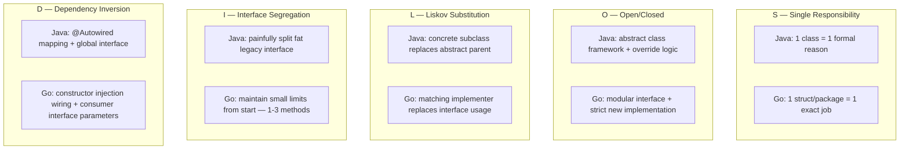
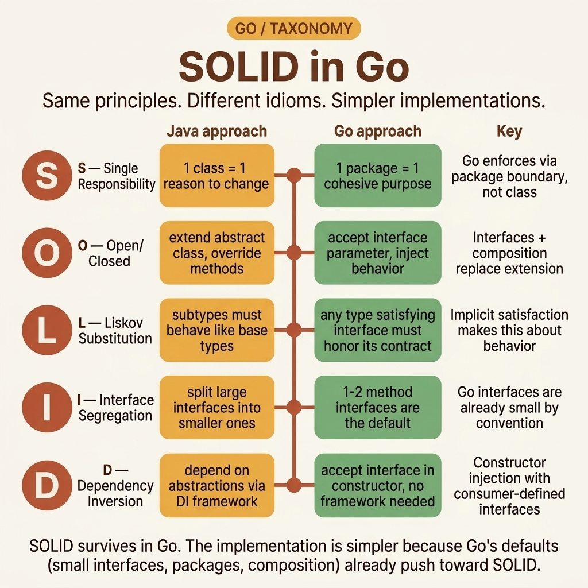
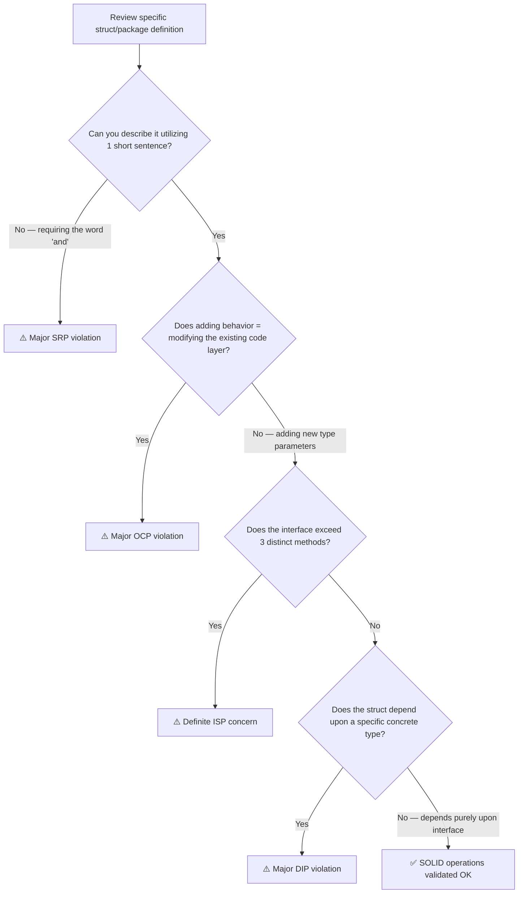

<!-- tags: golang, oop, solid, principles -->
# ⚖️ SOLID in Go — Identical Names, Distinct Expression

> SOLID principles remain valid in Go — but their expression differs entirely. There are no classes, no extends, and no abstract declarations. This guide maps each core principle to native Go idioms.

📅 Created: 2026-04-10 · 🔄 Updated: 2026-04-19 · ⏱️ 16 min read

| Aspect            | Detail                                         |
| ----------------- | ---------------------------------------------- |
| **Concept**       | SOLID principles mapped directly to Go constructs |
| **Use case**      | Code review structures, architecture decisions            |
| **Key insight**   | SOLID ≠ Java SOLID. Identical ideas, Go expression  |
| **Go philosophy** | The principles function correctly, implementation differs            |

---

## 1. DEFINE

Consider a Tuesday code review. You comment on the `OrderProcessor` struct inside a PR:

> "This struct violates SRP — it validates, persists, and notifies simultaneously."

A junior developer replies: "But Go has no classes. Does SRP apply to a struct? And OCP — Open/Closed — what does 'open for extension' mean when the language lacks `extends`?"

This is a good question. **SOLID principles remain valid in Go** — but the expression changes:

| Principle | Java Expression | Go Expression |
| --- | --- | --- |
| **S** — Single Responsibility | One class, one specific reason to change | One struct/package, one distinct job responsibility |
| **O** — Open/Closed | Abstract class definitions + formal override | Interface contracts + new structural implementations |
| **L** — Liskov Substitution | Subclass operates directly substitutable for parent | Interface implementer remains safely substitutable |
| **I** — Interface Segregation | Splitting massive fat interfaces | Small focused interfaces modeled from the absolute start |
| **D** — Dependency Inversion | Abstract class/interface rigid DI | Consumer-defined specific interface + constructor based injection |

If you think "SOLID in Go is too easy because Go enforces pure composition" — that is true... regarding O, L, and I. But S (SRP) and D (DIP) still command strict structural discipline — Go does not enforce them automatically.

### Failure Modes

| Structural Defect | Root Cause | Ripple Effect |
| --- | --- | --- |
| "SOLID = mandate an interface for every single struct" | Misunderstanding basic ISP logic | Meaningless ceremony, strict YAGNI violation |
| "Go structs lack classes therefore SRP fails" | Confusing structural SRP scope | Generating 500-line God structs |
| "DIP = importing generic interface packages" | Maintaining obsolete Java-style DI constraints | Fatal shared interface dependency coupling |

SRP ranks first because it impacts architecture most — but it generates heavy confusion when arriving from Java backgrounds. Let us examine each distinct principle.

---

## 2. VISUAL

### SOLID Decision Mapping: Java → Go





*Figure: 5 formal principles, identical terminology, distinct operational vehicles. Go lacks `abstract`, `extends`, and `@Autowired` frameworks — but SOLID elements survive utilizing structs, interfaces, and explicit constructors.*

### SOLID Violation Detection Logic



*Figure: 4 sequential evaluation questions targeting violation detection. Perfect for implementation during code review — each specific question tests exactly 1 principle.*

We will now implement each principle — starting with SRP, the most frequently violated.

---

### Example 1: Basic — SRP: One Struct, One Job

A God struct does too much. Split responsibilities.

> **Goal**: Fix SRP violations.
> **Approach**: Describe the struct. If you use "and", split it.
> **Example**: `OrderProcessor` becomes `OrderValidator` plus `OrderRepository` plus `OrderNotifier`.

```go
// ❌ SRP violation — God struct
type OrderProcessor struct {
	db       *sql.DB
	smtp     *smtp.Client
	rules    []ValidationRule
}

func (op *OrderProcessor) Process(o *Order) error {
	// validation (reason 1)
	for _, r := range op.rules { /* validate */ }
	// persistence (reason 2)
	_, err := op.db.Exec("INSERT INTO orders") 
	// notification (reason 3)
	op.smtp.Send(o.CustomerEmail, "Order confirmed")
	return nil
}

// ✅ SRP fixed — 1 job per struct
type OrderValidator struct {
	rules []ValidationRule
}
func (v *OrderValidator) Validate(o *Order) error {
	for _, r := range v.rules {
		if err := r.Check(o); err != nil {
			return err
		}
	}
	return nil
}

type OrderRepository struct {
	db *sql.DB
}
func (r *OrderRepository) Save(ctx context.Context, o *Order) error {
	_, err := r.db.ExecContext(ctx, "INSERT INTO orders")
	return err
}

type OrderNotifier struct {
	smtp *smtp.Client
}
func (n *OrderNotifier) Notify(ctx context.Context, o *Order) error {
	return n.smtp.Send(o.CustomerEmail, "Order confirmed")
}

// Orchestrator — thin coordinator
type OrderService struct {
	validator *OrderValidator
	repo      *OrderRepository
	notifier  *OrderNotifier
}
func (s *OrderService) Process(ctx context.Context, o *Order) error {
	if err := s.validator.Validate(o); err != nil { return err }
	if err := s.repo.Save(ctx, o); err != nil       { return err }
	_ = s.notifier.Notify(ctx, o) // non-critical
	return nil
}
```

> **Takeaway**: SRP in Go means a struct has one job. Do not use "and" in its description. A service struct coordinates, it does not hold logic.

---

### Example 2: Intermediate — OCP + DIP: Add Behavior Without Modifying

Add a pricing strategy by making a new struct, not modifying the service. Interface injection fulfills OCP and DIP.

> **Goal**: OCP — open for extension, closed for modification. DIP — depend on abstractions.
> **Approach**: Use a `PricingStrategy` interface. Inject concrete implementations.
> **Example**: Add `WeekendPricing` without modifying `CheckoutService`.

```go
// ocp_dip.go — Open/Closed + Dependency Inversion
package checkout

import "time"

// Interface — abstraction (DIP)
type PricingStrategy interface {
	Calculate(entry, exit time.Time) int64 // cents
}

// ✅ Implementation 1
type HourlyPricing struct {
	RatePerHour int64
}
func (h *HourlyPricing) Calculate(entry, exit time.Time) int64 {
	hours := int64(exit.Sub(entry).Hours()) + 1
	return hours * h.RatePerHour
}

// ✅ Implementation 2 — added LATER, NO code modified
type BlockPricing struct {
	RatePerBlock int64
	BlockHours   int64
}
func (b *BlockPricing) Calculate(entry, exit time.Time) int64 {
	hours := int64(exit.Sub(entry).Hours())
	blocks := (hours / b.BlockHours) + 1
	return blocks * b.RatePerBlock
}

// ✅ Implementation 3 — added EVEN LATER. CheckoutService remains unmodified.
type WeekendPricing struct {
	Weekday PricingStrategy // composition!
	Weekend PricingStrategy
}
func (w *WeekendPricing) Calculate(entry, exit time.Time) int64 {
	if entry.Weekday() == time.Saturday || entry.Weekday() == time.Sunday {
		return w.Weekend.Calculate(entry, exit)
	}
	return w.Weekday.Calculate(entry, exit)
}

// CheckoutService — NEVER MODIFIED when new pricing added
// Depends on interface (DIP)
type CheckoutService struct {
	pricing PricingStrategy // injected at construction
}

func NewCheckoutService(p PricingStrategy) *CheckoutService {
	return &CheckoutService{pricing: p}
}

func (cs *CheckoutService) Checkout(entry, exit time.Time) int64 {
	return cs.pricing.Calculate(entry, exit)
}
```

> **Why is this OCP and DIP?**
> **OCP**: `CheckoutService` is closed to modification. To add `WeekendPricing`, write a new struct. The service code has zero changes. 
> **DIP**: `CheckoutService` depends on `PricingStrategy` (abstraction), not `HourlyPricing` (concrete). 

> **Takeaway**: OCP plus DIP in Go is interface injection and constructor wiring. Constructor plus interface is all you need. No frameworks required.

\n### Example 3: Advanced — ISP + LSP: Split Interface & Ensure Substitutability

ISP rules: a caller needing one method gets an interface with one method. LSP rules: every implementation behaves correctly when substituted.

> **Goal**: ISP — split fat interfaces. LSP — ensure safe substitutability.
> **Approach**: Build small interfaces. Prohibit panics or unexpected return values in implementations.
> **Example**: Repository splits into Reader plus Writer. Detect LSP violations.

```go
// isp_lsp.go — Interface Segregation plus Liskov Substitution
package repository

import "context"

// ✅ ISP — split by caller requirements, not by domain
type UserReader interface {
	FindByID(ctx context.Context, id int64) (*User, error)
	FindByEmail(ctx context.Context, email string) (*User, error)
}

type UserWriter interface {
	Save(ctx context.Context, u *User) error
	Delete(ctx context.Context, id int64) error
}

// Composed interface if both are required
type UserRepository interface {
	UserReader
	UserWriter
}

// ✅ Query handler requires Reader only — Writer methods are ignored
func GetUserHandler(reader UserReader) http.HandlerFunc {
	return func(w http.ResponseWriter, r *http.Request) {
		user, err := reader.FindByID(r.Context(), parseID(r))
		// handler logic
	}
}

// ✅ Command handler requires Writer only
func DeleteUserHandler(writer UserWriter) http.HandlerFunc {
	return func(w http.ResponseWriter, r *http.Request) {
		err := writer.Delete(r.Context(), parseID(r))
		// handler logic
	}
}

// --- LSP — Substitutability Rules ---

// ✅ Correct: PostgresRepo implements the full contract
type PostgresRepo struct{ db *sql.DB }
func (r *PostgresRepo) FindByID(ctx context.Context, id int64) (*User, error) {
	// Proper implementation
	return nil, sql.ErrNoRows // allow caller checking via errors.Is
}

// ❌ LSP VIOLATION: CacheRepo.Delete() panics
type BrokenCacheRepo struct{}
func (r *BrokenCacheRepo) Delete(ctx context.Context, id int64) error {
	panic("cache does not support delete") // 🔴 LSP VIOLATION
	// The caller expects an error return. A panic breaks substitution.
}

// ✅ LSP CORRECT: CacheRepo returns explicit errors
type CacheRepo struct{}
func (r *CacheRepo) Delete(ctx context.Context, id int64) error {
	return fmt.Errorf("cache repository does not support delete") // ✅ safe handling
}
```

> **Why does a panic equal an LSP violation?**
> The interface contract dictates `Delete() error`. The caller expects an error return and handles it. A `panic` crashes the execution. Substituting `BrokenCacheRepo` for `PostgresRepo` causes a runtime crash. LSP is broken.
>
> **ISP rule**: If an implementation must leave methods empty or panicking, the target interface is too fat. Split it.

> **Takeaway**: ISP in Go equals composing small interfaces upon requirement. LSP dictates all implementations behave logically when substituted without panics or silent failures.

---

## 4. PITFALLS

| # | Severity | Defect | Consequence | Fix |
| --- | --- | --- | --- | --- |
| 1 | 🔴 Fatal | Panicking inside interface implementations | LSP violation and application crash | Return standard errors. Do not panic. |
| 2 | 🔴 Fatal | God structs with numerous dependencies | ISP and SRP violated, tests fail | Split into focused struct definitions. |
| 3 | 🟡 Common | Preemptive interface for every struct | Ceremony and useless indirection | Define a concrete type first. Use interfaces only when needing mocks. |
| 4 | 🟡 Common | Shared interface packages | Tight coupling defeating DIP | Consumer defines interfaces natively where used. |
| 5 | 🔵 Minor | Naming structs like `XxxImpl` | Java legacy formatting | Name descriptively like `PostgresRepo`. |

---

## 5. REF

| Resource | Type | Link | Notes |
| --- | --- | --- | --- |
| SOLID Go Design | Presentation | https://dave.cheney.net/2016/08/20/solid-go-design | Dave Cheney's talk |
| Go Proverbs | Philosophy | https://go-proverbs.github.io/ | Architectural quotes |
| Effective Go | Documentation | https://go.dev/doc/effective_go | Native code patterns |

---

## 6. RECOMMEND

The core operations of **SOLID in Go** are clear. The extensions below transition SOLID principles into practical patterns and architectures.

| Extension | When | Rationale | File linking |
| --- | --- | --- | --- |
| [Design Patterns Formats](./06-design-patterns-go-way.md) | When implementing structure patterns | Factory, Strategy, Observer | Next sequence |
| [OOP Mental Model Configs](./01-oop-mental-model.md) | Reviewing foundational rules | Broad structural review | Go back |
| [Interfaces structure deep dive](../interfaces/02-di-mocking-patterns.md) | When needing mock logic | DI wiring structures | Module crossing |

---

**Directory Navigation**: [← Interfaces module](./04-interfaces-polymorphism.md) · [→ Design Patterns logic](./06-design-patterns-go-way.md)
