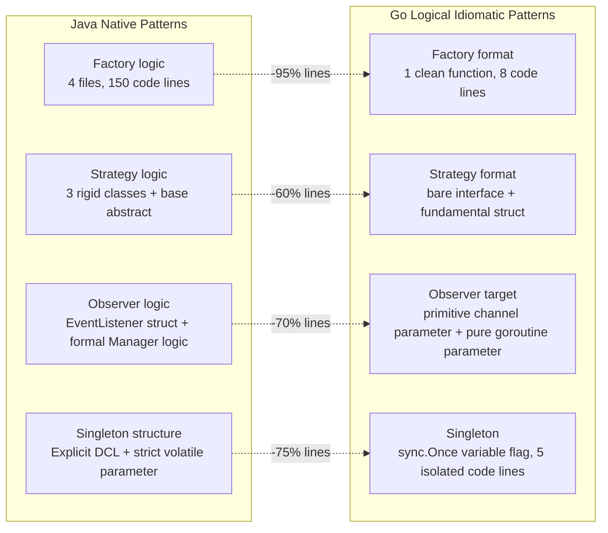
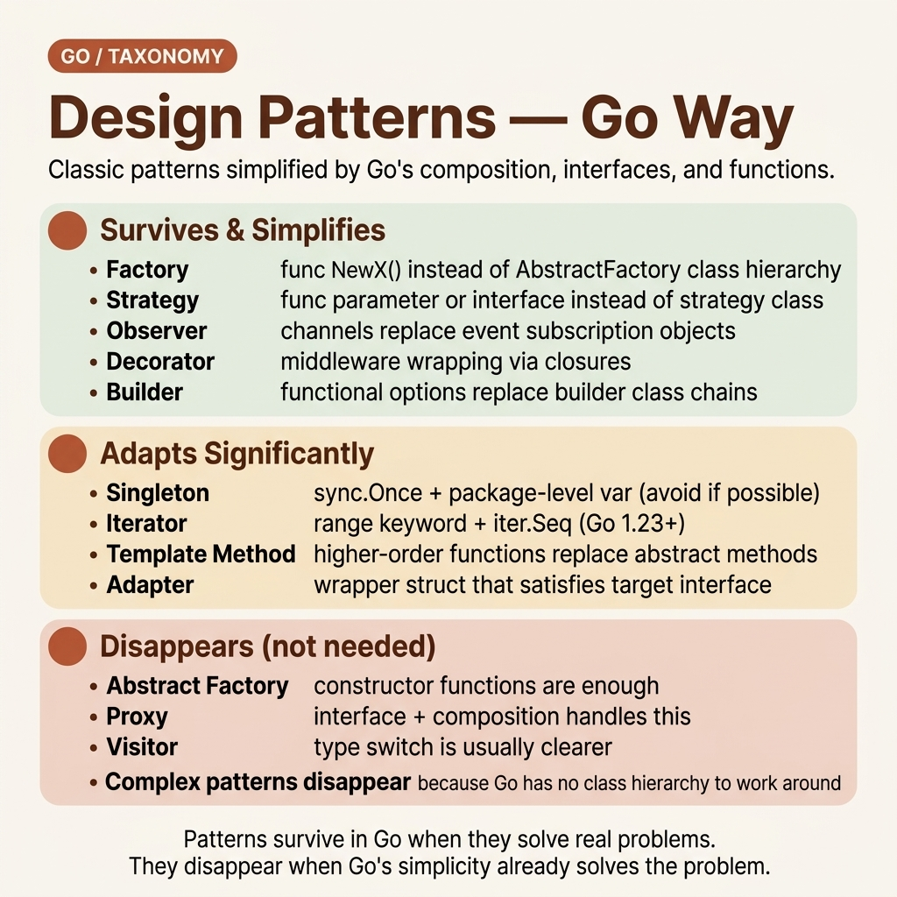
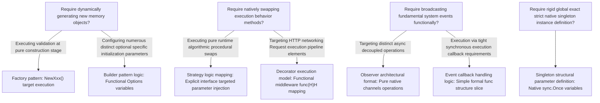

<!-- tags: golang, oop, design-patterns -->
# 🏗️ Design Patterns, the Go Way — Simpler Than Anticipated

> Many design patterns simplify dramatically in Go. Factories become functions. Strategies become interfaces. Observers run via channels. Singletons wrap in `sync.Once`. This guide shows idiomatic Go implementations.

📅 Created: 2026-04-10 · 🔄 Updated: 2026-04-19 · ⏱️ 18 min read

| Aspect            | Detail                                              |
| ----------------- | --------------------------------------------------- |
| **Concept**       | GoF design patterns re-implemented in Go idioms |
| **Use case**      | Code design, architecture decisions |
| **Key insight**   | Many patterns simplify. Some disappear. None require class hierarchies. |
| **Go philosophy** | Do not implement a pattern until you need it |

---

## 1. DEFINE

A new development team starts writing Go. You review a PR generating `AbstractPaymentProcessorFactory` — containing 4 files, 3 interfaces, 2 abstract base structs, spanning 150 lines.

The senior code reviewer comments: "You only require `NewStripeProcessor()`. A function. 8 lines total."

```go
func NewStripeProcessor(apiKey string) *StripeProcessor {
    return &StripeProcessor{apiKey: apiKey}
}
```

You compare `AbstractPaymentProcessorFactory` and realize: Java needs 150 lines because `new` ignores validation, constructors cannot return errors, and class hierarchies need an abstract layer for polymorphism. Go: `NewXxx()` functions validate, return errors, and yield concrete types. The Factory pattern reduces to 1 function.

**Not every pattern simplifies equally** — Strategy, Observer, and Middleware still need structure. But that structure is lighter than Java equivalents.

### Pattern Transformation Matrix

| Legacy Pattern | Java Format Implementation | Go Format Implementation | Simplification Results |
| --- | --- | --- | --- |
| **Factory** | Abstract factory + concrete factory legacy classes | `NewXxx()` exact function | Classes → 1 native function |
| **Builder** | Builder class logic + formal Director | Functional options format `With...()` | Class elements → pure functions |
| **Singleton** | Double-checked locking + rigid static fields | `sync.Once` + target package-level variable | 20 lines reducing → 5 lines |
| **Strategy** | Interface + abstract definition + concrete classes | Native interface + raw structural struct | No abstract base class formatting needed |
| **Observer** | EventListener mapping + EventManager orchestration | Channels parameters + executing goroutines | Zero registration lists, zero distinct callback chains |
| **Decorator** | Deep wrapper classes formally extending base | Middleware function pattern `func(H) H` | Zero base classes required |
| **Iterator** | Iterator format interface + concrete loops | Target `range` logic + structural channels | Formally built directly into compiler language elements |
| **Template Method** | Abstract class inheritance + required override | Basic interface protocol + native default func | Zero abstract classes |

### Failure Modes

| Structural Defect | Root Cause | Ripple Effect |
| --- | --- | --- |
| Translating Java patterns 1:1 | "Must have abstract factories" | Over-engineered, non-idiomatic |
| Skipping patterns entirely | "Go is simple, no patterns needed" | Spaghetti code at scale |
| Building patterns prematurely | Implementing before 3 concrete use cases | Unnecessary abstraction |

The pattern map is clear. Let’s implement 3 critical patterns — starting with Factory.

---

## 2. VISUAL

### Java versus Go Structural Complexity





*Figure: Operating complexity reduction targets: Factory –95%, Singleton –75%, Observer –70%, Strategy –60%. Built-in language features eliminate legacy pattern boilerplate entirely.*

### Structural Pattern Decision Tree Model



*Figure: 7 common patterns translated to idiomatic Go. No abstract classes anywhere.*

---
### Example 1: Basic — Factory + Functional Options.

Factory pattern in Java: AbstractFactory → ConcreteFactory → Product. Go: `NewXxx()` function. When multiple optional params are needed: functional options.

> **Goal**: Factory pattern + Builder alternative (functional options).
> **Approach**: `NewServer()` required params + `WithXxx()` optional params.
> **Example**: HTTP server with configurable timeout, logger, TLS.

```go
// factory.go — Factory + Functional Options pattern
package server

import (
	"log"
	"time"
	"crypto/tls"
)

// Server — the "product"
type Server struct {
	host         string
	port         int
	timeout      time.Duration
	logger       *log.Logger
	tlsConfig    *tls.Config
	maxBodyBytes int64
}

// Option — functional option type
type Option func(*Server)

// WithXxx — each option is a function returning Option
func WithTimeout(d time.Duration) Option {
	return func(s *Server) { s.timeout = d }
}

func WithLogger(l *log.Logger) Option {
	return func(s *Server) { s.logger = l }
}

func WithTLS(config *tls.Config) Option {
	return func(s *Server) { s.tlsConfig = config }
}

func WithMaxBody(bytes int64) Option {
	return func(s *Server) { s.maxBodyBytes = bytes }
}

// NewServer — factory function: required params + optional options
// ✅ Replace: AbstractServerFactory + ConcreteServerFactory + ServerBuilder + Director
func NewServer(host string, port int, opts ...Option) (*Server, error) {
	if host == "" {
		return nil, fmt.Errorf("host required")
	}
	if port <= 0 || port > 65535 {
		return nil, fmt.Errorf("invalid port: %d", port)
	}

	// Defaults — sane, overridable
	s := &Server{
		host:         host,
		port:         port,
		timeout:      30 * time.Second,
		maxBodyBytes: 1 << 20, // 1MB
	}

	// Apply options
	for _, opt := range opts {
		opt(s)
	}

	return s, nil
}

// Usage:
// s, err := NewServer("localhost", 8080,
//     WithTimeout(5 * time.Second),
//     WithTLS(tlsConfig),
//     WithLogger(customLogger),
// )
```

> **Why Functional Options instead of Builder class?**
> Builder class: `ServerBuilder.SetHost().SetPort().Build()` — mutable builder object, chaining methods, separate Build() step. Functional Options: immutable functions, composable, no intermediate state. Dave Cheney (Go core team): "Functional options are the most Go-like way to build complex objects." Need another option later? Add 1 function — existing code unchanged.

> **Takeaway**: Factory = `NewXxx()` function. Builder = Functional Options `WithXxx()`. Both Java patterns collapse into one Go pattern — simpler, idiomatic.

Factory cover object creation. Strategy cover behavior swap — the most important pattern for OCP.

---

### Example 2: Intermediate — Strategy + Middleware (Decorator).

Strategy: swap algorithm at runtime via interface injection. Middleware: decorator pattern for HTTP pipelines.

> **Goal**: Strategy pattern + Decorator as middleware.
> **Approach**: `Compressor` interface (strategy). `Middleware func(http.Handler) http.Handler` (decorator).
> **Example**: File compressor swapping gzip/zstd. HTTP middleware chain.

```go
// strategy.go — Strategy pattern
package compress

import (
	"bytes"
	"compress/gzip"
	"io"
)

// Compressor — strategy interface
type Compressor interface {
	Compress(data []byte) ([]byte, error)
	Extension() string
}

// GzipCompressor — concrete strategy
type GzipCompressor struct {
	Level int
}

func (g *GzipCompressor) Compress(data []byte) ([]byte, error) {
	var buf bytes.Buffer
	w, err := gzip.NewWriterLevel(&buf, g.Level)
	if err != nil {
		return nil, err
	}
	if _, err := w.Write(data); err != nil {
		return nil, err
	}
	if err := w.Close(); err != nil {
		return nil, err
	}
	return buf.Bytes(), nil
}

func (g *GzipCompressor) Extension() string { return ".gz" }

// ZstdCompressor — another strategy (added later, 0 changes to FileExporter)
type ZstdCompressor struct{}

func (z *ZstdCompressor) Compress(data []byte) ([]byte, error) {
	// ... zstd compression ...
	return data, nil
}
func (z *ZstdCompressor) Extension() string { return ".zst" }

// FileExporter — uses strategy, doesn't know which compressor
type FileExporter struct {
	compressor Compressor // injected
}

func NewFileExporter(c Compressor) *FileExporter {
	return &FileExporter{compressor: c}
}

func (fe *FileExporter) Export(filename string, data []byte) error {
	compressed, err := fe.compressor.Compress(data)
	if err != nil {
		return fmt.Errorf("compress: %w", err)
	}
	outFile := filename + fe.compressor.Extension()
	return os.WriteFile(outFile, compressed, 0644)
}
```

```go
// middleware.go — Decorator pattern as HTTP middleware
package middleware

import (
	"log"
	"net/http"
	"time"
)

// Middleware type — decorator pattern in 1 line
// func(http.Handler) http.Handler = wraps handler, returns new handler
type Middleware func(http.Handler) http.Handler

// Logging middleware
func Logging(logger *log.Logger) Middleware {
	return func(next http.Handler) http.Handler {
		return http.HandlerFunc(func(w http.ResponseWriter, r *http.Request) {
			start := time.Now()
			next.ServeHTTP(w, r) // ← delegate to wrapped handler
			logger.Printf("%s %s %v", r.Method, r.URL.Path, time.Since(start))
		})
	}
}

// Auth middleware
func RequireAuth(tokenValidator func(string) bool) Middleware {
	return func(next http.Handler) http.Handler {
		return http.HandlerFunc(func(w http.ResponseWriter, r *http.Request) {
			token := r.Header.Get("Authorization")
			if !tokenValidator(token) {
				http.Error(w, "unauthorized", http.StatusUnauthorized)
				return // ← short circuit: don't call next
			}
			next.ServeHTTP(w, r)
		})
	}
}

// Chain — compose middleware
func Chain(handler http.Handler, middlewares ...Middleware) http.Handler {
	// Apply in reverse order — outermost middleware wraps first
	for i := len(middlewares) - 1; i >= 0; i-- {
		handler = middlewares[i](handler)
	}
	return handler
}

// Usage:
// handler := Chain(myHandler,
//     Logging(logger),
//     RequireAuth(validateToken),
//     RateLimit(100),
// )
```

> **Why middleware instead of Decorator class?**
> Java Decorator: `class LoggingHandler extends HandlerWrapper { ... }` — class per decorator, extends base. Go: `func(http.Handler) http.Handler` — 1 function = 1 decorator. No class, no extends, no base. Compose with `Chain()`. Same pattern.

> **Takeaway**: Strategy = interface + injection — like Java, minus the abstract class. Middleware = decorator via function composition — Go’s functional side shines here.

Factory, Strategy, Decorator cover "structural + behavioral" patterns. Observer — pattern for event-driven — Go has a built-in tool: channels.

---

### Example 3: Advanced — Observer via Channels + Singleton via sync.Once.

Observer in Go does not need an EventListener interface — channels IS the mechanism. Singleton: `sync.Once` instead of double-checked locking.

> **Goal**: Observer pattern via channels. Singleton via sync.Once.
> **Approach**: Event channel + subscriber goroutines. Package-level var + sync.Once.
> **Example**: Event bus publish/subscribe. Config singleton.

```go
// observer.go — Observer pattern via channels
package eventbus

import (
	"context"
	"sync"
)

// Event — domain event
type Event struct {
	Type    string
	Payload any
}

// EventBus — publisher
type EventBus struct {
	mu          sync.RWMutex
	subscribers map[string][]chan Event
}

func NewEventBus() *EventBus {
	return &EventBus{
		subscribers: make(map[string][]chan Event),
	}
}

// Subscribe — returns channel for events of given type
// ✅ No EventListener interface needed — channel IS the listener
func (eb *EventBus) Subscribe(eventType string, bufSize int) <-chan Event {
	ch := make(chan Event, bufSize)
	eb.mu.Lock()
	eb.subscribers[eventType] = append(eb.subscribers[eventType], ch)
	eb.mu.Unlock()
	return ch
}

// Publish — fan-out to all subscribers
func (eb *EventBus) Publish(ctx context.Context, evt Event) {
	eb.mu.RLock()
	subs := eb.subscribers[evt.Type]
	eb.mu.RUnlock()

	for _, ch := range subs {
		select {
		case ch <- evt: // non-blocking if buffer available
		case <-ctx.Done():
			return
		default:
			// ⚠️ Subscriber slow — drop event (or log, or buffer)
			// Decision: drop vs block vs buffer depends on your SLA
		}
	}
}

// Close — clean up all channels
func (eb *EventBus) Close() {
	eb.mu.Lock()
	defer eb.mu.Unlock()
	for _, subs := range eb.subscribers {
		for _, ch := range subs {
			close(ch)
		}
	}
}

// Usage:
// bus := NewEventBus()
// orderEvents := bus.Subscribe("order.placed", 100)
// go func() {
//     for evt := range orderEvents {
//         log.Printf("Order placed: %v", evt.Payload)
//     }
// }()
// bus.Publish(ctx, Event{Type: "order.placed", Payload: order})
```

```go
// singleton.go — Singleton via sync.Once
package config

import (
	"os"
	"sync"
)

// config — unexported type, cannot be instantiated externally
type config struct {
	DatabaseURL string
	Port        string
	Debug       bool
}

var (
	instance *config
	once     sync.Once
)

// Get — returns singleton config
// ✅ sync.Once guarantees exactly 1 initialization, thread-safe
// No double-checked locking, no volatile, no synchronized
func Get() *config {
	once.Do(func() {
		instance = &config{
			DatabaseURL: os.Getenv("DATABASE_URL"),
			Port:        getEnvOr("PORT", "8080"),
			Debug:       os.Getenv("DEBUG") == "true",
		}
	})
	return instance
}

func getEnvOr(key, fallback string) string {
	if v := os.Getenv(key); v != "" {
		return v
	}
	return fallback
}

// Usage: cfg := config.Get()
// First call: initializes. All subsequent calls: returns same instance.
// Thread-safe. No mutex needed after initialization.
```

> **Why channel instead of callback/EventListener?**.
> Java Observer: `listener.onEvent(event)` — synchronous callback, listener must implement interface, unregister complex. Go channels: async by default, buffered for decoupling, `range` for iteration, `close()` for teardown. Channel back-pressure built-in (full buffer = publisher blocked or drops). No EventListener, no unregister dance.
>
> **sync.Once vs double-checked locking?**
> Java DCL: 10 lines, `volatile` + `synchronized` + null check × 2. Easy to get wrong. Go `sync.Once`: guaranteed by runtime, zero chance of race. 5 lines total. Done.

> **Takeaway**: Observer = channels + goroutines — Go’s concurrency primitives ARE the pattern. Singleton = `sync.Once` — 5 lines, thread-safe, done. Many GoF patterns are simplified or absorbed by Go’s built-in features.

---

## 4. PITFALLS

| # | Severity | Error | Consequence | Fix |
| --- | --- | --- | --- | --- |
| 1 | 🔴 Fatal | Translate Java patterns 1:1 (AbstractFactory, Builder class) | Over-engineered, non-idiomatic | `NewXxx()` + functional options |
| 2 | 🔴 Fatal | Observer with goroutine leak — subscriber never closes | Memory leak, goroutine count grows forever | Context cancellation + `Close()` cleanup + defer |
| 3 | 🟡 Common | Singleton abuse (use for everything) | Hidden dependency, testing hell | Prefer explicit injection. Singleton only for config, logger |
| 4 | 🟡 Common | Channel Observer without back-pressure | Publisher blocks when subscriber is slow | Buffered channel + `select default` drop or log |
| 5 | 🔵 Minor | Premature pattern — apply before 3rd use case | Unnecessary abstraction | Wait for 3 concrete cases, then extract pattern |

---

## 5. REF

| Resource | Type | Link | Note |
| --- | --- | --- | --- |
| Go Design Patterns | Book | https://www.packtpub.com/product/go-design-patterns/9781786466204 | Comprehensive |
| Dave Cheney — SOLID Go | Talk | https://dave.cheney.net/2016/08/20/solid-go-design | Patterns + SOLID |
| Functional Options | Blog | https://dave.cheney.net/2014/10/17/functional-options-for-friendly-apis | Original proposal |

---

## 6. RECOMMEND

The core of **Design Patterns — Go Way** is clear. The extension branches below help you bring design patterns into production with DDD, clean architecture, and microservices patterns.

| Extend | When | Reason | File/Link |
| --- | --- | --- | --- |
| [Go Concurrency](../../concurrency/) | When you need goroutines, channels, sync patterns | Observer pattern → concurrency deep dive | Go track |
| [Go Design Patterns](../../design-patterns/) | When you need a full pattern catalog | All GoF patterns idiomatic | Go track |
| [Clean Architecture](../../../architecture/go/) | When you need to structure the application | DDD + Clean Architecture in Go | Architecture |
| [OOP Mental Model](./01-oop-mental-model.md) | When you need to review reframes | Entire Java map → Go | This folder |

---

**Navigation**: [← SOLID in Go](./05-solid-in-go.md) · [→ OOP in Go Hub](./README.md)
