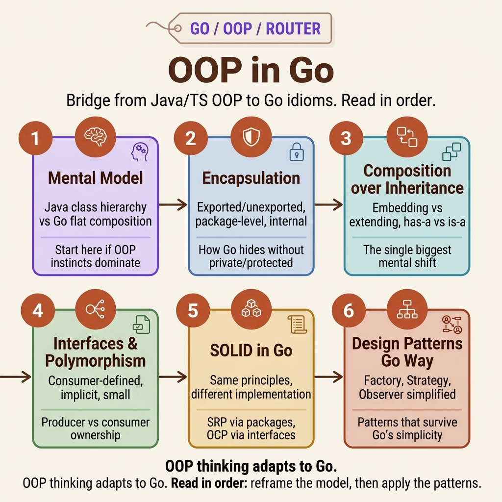

<!-- tags: golang, oop, overview -->
# OOP in Go — Composition, Interfaces, Patterns

> Go has OOP — but a stripped-down version. No classes, no extends, no abstract. Structs + interfaces + composition replace everything. This hub guides you to the right entry point.

📅 Updated: 2026-04-19 · ⏱️ 6 min read

## 1. DEFINE

You arrive from Java, TypeScript, or C++. You know OOP — classes, inheritance, polymorphism, and SOLID. Then Go’s docs say: "Go is not an object-oriented language." Yet it also says: "Go supports encapsulation, polymorphism, and composition."

This hub does not re-explain OOP. It **reframes** your existing mental model into Go idioms — shifting from "class extends" to "struct + interface + embedding." Each article resolves one facet of that migration.

### 1.1 Signals & Boundaries

- Open this hub when you **know OOP but Go code feels alien** — "Why are there no classes? Why do interfaces skip `implements`?"
- This hub does not teach OOP from scratch — it reframes the OOP you know into Go.
- If you lack foundational Go struct/interface knowledge, start in `structs/` and `interfaces/` first.

### 1.2 Learning Lanes

- **Lane 1: Reframe** → `01-oop-mental-model.md` — begin exactly here if you are actively pivoting into Go.
- **Lane 2: Mechanics** → `02-encapsulation-visibility.md` → `03-composition-over-inheritance.md` → `04-interfaces-polymorphism.md`
- **Lane 3: Principles & Patterns** → `05-solid-in-go.md` → `06-design-patterns-go-way.md`
- Sequentially read from 01→06 if you require a complete journey. Otherwise, jump immediately into specific articles targeting your exact pain point.

## 2. VISUAL

The `oop` cluster bridges traditional OOP to Go idioms. The visual map below shows the learning flow — from mental model reframing to production patterns.



*Figure: 6 articles in a flow: Mental Model → Encapsulation → Composition → Interfaces → SOLID → Patterns. Each resolves one aspect of "How is OOP different in Go?"*

Once you identify where you are struggling, the decision table below routes you to the right article.

## 3. CODE

### Example 1: Router artifact — Select the exact article mapping to your precise pain point

> **Goal**: Make this hub an active router, not a passive link list.
> **Approach**: Map pain points to the right starting file.
> **Example**: Select your learning lane based on your symptom.

| Pain Point / Question | Target Article | Rationale |
| --- | --- | --- |
| "Does Go have OOP? Why does the code look so different from Java?" | [01 — Mental Model](./01-oop-mental-model.md) | Reframes the paradigm: class→struct, extends→embedding, implements→implicit |
| "Uppercase/lowercase is all Go has — does this replace private/protected?" | [02 — Encapsulation](./02-encapsulation-visibility.md) | Package-level visibility, constructor enforcement, internal packages |
| "Java uses extends — what does Go use for code reuse?" | [03 — Composition](./03-composition-over-inheritance.md) | Embedding, delegation, method resolution, DDD aggregates |
| "Go interfaces skip implements — why? What is consumer-defined?" | [04 — Interfaces](./04-interfaces-polymorphism.md) | Implicit satisfaction, consumer-defined patterns |
| "How does SOLID differ in Go compared to Java?" | [05 — SOLID](./05-solid-in-go.md) | Each principle expressed differently: SRP=struct, OCP=interface, DIP=constructor |
| "How are Factory, Strategy, Observer written in Go?" | [06 — Patterns](./06-design-patterns-go-way.md) | Factory=function, Strategy=interface, Observer=channels |

```text
func chooseLane(painPoint string) string {
    switch painPoint {
    case "mental model":  return "./01-oop-mental-model.md"
    case "encapsulation": return "./02-encapsulation-visibility.md"
    case "composition":   return "./03-composition-over-inheritance.md"
    case "interfaces":    return "./04-interfaces-polymorphism.md"
    case "solid":         return "./05-solid-in-go.md"
    case "patterns":      return "./06-design-patterns-go-way.md"
    default:              return "./README.md"
    }
}
```

## 4. PITFALLS

| # | Severity | Error | Consequence | Fix |
| --- | --- | --- | --- | --- |
| 1 | 🔴 Fatal | Treating this hub as a list of links to skim | Fragmented learning, missing the sequential arc | Choose a lane → read sequentially within it |
| 2 | 🟡 Common | Jumping to SOLID/Patterns without Composition + Interfaces | Building on weak foundations | Process Lane 2 (02→03→04) before Lane 3 (05→06) |
| 3 | 🔵 Minor | Skipping cross-links at the end of each article | Missing connective tissue between concepts | Every article has a RECOMMEND table — follow it |

## 5. REF

| Resource | Type | Link | Notes |
| --- | --- | --- | --- |
| Go FAQ — Is Go OOP? | Official | https://go.dev/doc/faq#Is_Go_an_object-oriented_language | Rob Pike's definitive answer |
| Effective Go | Official | https://go.dev/doc/effective_go | Canonical Go idioms |
| SOLID Go Design | Talk | https://dave.cheney.net/2016/08/20/solid-go-design | Dave Cheney’s SOLID mapping |

## 6. RECOMMEND

When the `oop` lane concludes, expand into Go-specific depth covering advanced architecture patterns.

| Extension | When | Rationale | File/Link |
| --- | --- | --- | --- |
| OOP Mental Model | When transitioning from Java/TS | The entry point for this cluster | [./01-oop-mental-model.md](./01-oop-mental-model.md) |
| Design Patterns Go Way | When you grasp interfaces + composition | The capstone applying OOP concepts | [./06-design-patterns-go-way.md](./06-design-patterns-go-way.md) |
| Structs deep dive | When exploring tags, copy semantics, embedding | Structural depth beyond OOP overview | [../structs/README.md](../structs/README.md) |
| Interfaces deep dive | When exploring `io.Reader`, DI, mocking | Production interface patterns | [../interfaces/README.md](../interfaces/README.md) |
| Go Fundamental | When switching to a different cluster | Root router | [../README.md](../README.md) |
