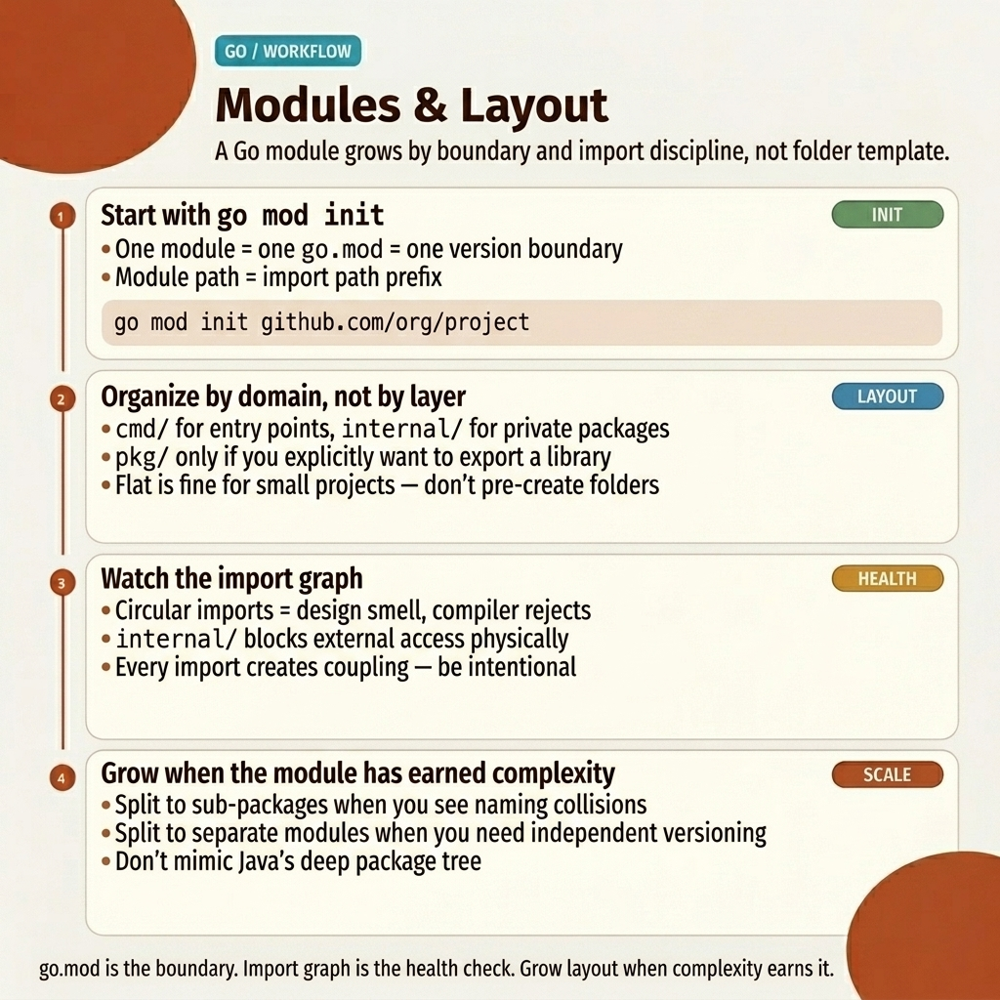

<!-- tags: golang, packages, modules -->
# 📦 Packages & Modules

> Go enforces strict module isolation with precise dependency graphs, directory-based packages, and compiler-enforced visibility.

📅 Created: 2026-03-20 · 🔄 Updated: 2026-04-19 · ⏱️ 15 min read

| Aspect          | Detail                                    |
| --------------- | ----------------------------------------- |
| **Concept**     | Module declaration, package layout, dependency management |
| **Use case**    | Project structure, dependency isolation, code organization |
| **Key insight** | Package = directory. Uppercase = exported. `internal/` = compiler-enforced boundary |
| **CLI**         | `go mod`, `go get`, `go work`             |

---

## 1. DEFINE

Clone any well-structured Go repo and you immediately see its architecture: `cmd/` for entry points, `internal/` for private packages, `pkg/` for shared libraries. The directory tree **is** the module graph. Importing from `internal/` outside the parent module triggers a compiler error — not a convention, a hard guarantee.

> *`exportReport()` lives in `internal/report`. The API server in `cmd/server` imports it freely. But an external consumer who `go get`s your module cannot — the compiler blocks it. This is `internal/` enforcement: zero-config encapsulation.*
>
> *Go's visibility model is equally simple: uppercase identifier = exported, lowercase = unexported. No `public`/`private`/`protected` keywords. One character decides access scope.*

### Package Rules

Go enforces **5 fundamental rules** for package organization:

| Rule                       | Description                              |
| -------------------------- | ---------------------------------- |
| Directory = Package    | Each directory is one package |
| Uppercase = Exported       | Capitalized identifiers are public |
| `internal/` Boundary       | Compiler blocks external imports of `internal/` packages |
| `main` Entrypoint          | Package `main` + `func main()` = executable binary |
| No Circular Imports      | The compiler rejects import cycles |

**Why case-based visibility?** It eliminates `public`/`private`/`protected` keywords entirely. One glance at a name tells you its access scope.

### Project Layout (Standard)

```
project/
├── cmd/
│   ├── server/main.go       # API server entrypoint
│   └── worker/main.go       # Worker entrypoint
├── internal/                 # Private packages
│   ├── domain/               # Business entities
│   ├── usecase/              # Business logic
│   ├── repository/           # Data access
│   └── handler/              # HTTP handlers
├── pkg/                      # Public packages (reusable)
├── go.mod                    # Module definition
├── go.sum                    # Dependency checksums
└── Makefile
```

**Why multiple `cmd/` binaries?** A single module can produce multiple executables (API server, worker, CLI tool) while sharing `internal/` packages. Each `cmd/*/main.go` is a separate build target.

### go mod Commands

| Command                | Description                           |
| ---------------------- | ------------------------------- |
| `go mod init <module>` | Initialize a new module           |
| `go mod tidy`          | Add missing, remove unused dependencies   |
| `go mod download`      | Download dependencies to local cache             |
| `go mod vendor`        | Copy dependencies into `vendor/`           |
| `go mod graph`         | Print the module dependency graph          |
| `go get pkg@version`   | Add or upgrade a dependency        |
| `go work init`         | Initialize a multi-module workspace |

**Why run `go mod tidy` regularly?** It removes unused dependencies and adds missing ones — keeping `go.mod` and `go.sum` accurate. Stale entries cause CI failures and confusing import errors.

---

The rules are clear. The visual below maps how packages, modules, and the `internal/` boundary interact in a real project.

## 2. VISUAL

Most confusion about Go packages comes from conflating directories with import paths. The visual below maps the relationship between directory structure, module declaration, and compiler-enforced boundaries.



*Figure: Module layout showing `cmd/`, `internal/`, and `pkg/` boundaries with import direction arrows and compiler enforcement points.*

With this model in mind, the code examples below show each layer in action — from basic project structure through `internal/` enforcement to multi-module workspaces.

## 3. CODE

Three progression levels: basic project structure, `internal/` package boundaries, and multi-module workspaces.

### Example 1: Basic — Project Structure

Standard Go project layout with `go.mod`, `cmd/` entry point, and layered `internal/` packages.

```go
// go.mod
module github.com/myorg/myapp

go 1.22

require (
    github.com/gin-gonic/gin v1.9.1
    github.com/jackc/pgx/v5 v5.5.3
)
```

```go
// cmd/server/main.go — Entry point
package main

import (
    "log"
    "github.com/myorg/myapp/internal/handler"
    "github.com/myorg/myapp/internal/repository"
    "github.com/myorg/myapp/internal/usecase"
)

func main() {
    repo := repository.NewUserRepo("postgres://...")
    uc := usecase.NewUserUseCase(repo)
    h := handler.NewUserHandler(uc)

log.Fatal(h.Start(":8080"))
}
```

```go
// internal/domain/user.go — Domain entity
package domain

import "time"

type User struct {
    ID        int64
    Email     string
    FullName  string
    CreatedAt time.Time
}

// ✅ Exported interface — defines contract
type UserRepository interface {
    FindByID(id int64) (*User, error)
    Create(user *User) error
}
```

```go
// internal/repository/user_repo.go
package repository

import "github.com/myorg/myapp/internal/domain"

type userRepo struct {
    dsn string     // ✅ unexported
}

func NewUserRepo(dsn string) domain.UserRepository {
    return &userRepo{dsn: dsn}
}

func (r *userRepo) FindByID(id int64) (*domain.User, error) {
    // ... database query
    return nil, nil
}

func (r *userRepo) Create(user *domain.User) error {
    // ... database insert
    return nil
}
```

> **Takeaway**: `cmd/` wires dependencies, `internal/` hides implementation, `domain/` defines contracts. The directory tree is the architecture diagram.

---

### Example 2: Intermediate — internal/ Package

The `internal/` directory is compiler-enforced: only the parent module can import packages under `internal/`. External consumers get a build error.

```go
// internal/auth/token.go — ONLY accessible by this module
package auth

import "errors"

var ErrInvalidToken = errors.New("invalid token")

// ✅ Exported within internal
func ValidateToken(token string) (int64, error) {
    if token == "" {
        return 0, ErrInvalidToken
    }
    // ... validate JWT
    return 42, nil
}

// unexported
func generateSecret() string {
    return "secret"
}
```

```
// ✅ Import rules:
// cmd/server/main.go      → CAN import internal/auth
// internal/handler/user.go → CAN import internal/auth
// external-module          → CANNOT import internal/auth ← blocked!
```

> **Why `internal/`?** It provides encapsulation without configuration. No build tags, no access modifiers — just a directory name that the compiler recognizes.

> **Takeaway**: Use `internal/` for any package that should not be part of your module's public API. The compiler enforces this automatically.

---

### Example 3: Advanced — Go Workspace (Multi-module)

When a monorepo contains multiple modules that depend on each other, `go work` lets you develop them simultaneously without publishing intermediate versions.

```bash
# ✅ Multi-module monorepo
mkdir myproject && cd myproject

# Module 1: shared library
mkdir -p libs/common && cd libs/common
go mod init github.com/myorg/common
cd ../..

# Module 2: API service
mkdir -p services/api && cd services/api
go mod init github.com/myorg/api
cd ../..

# ✅ Create workspace
go work init
go work use ./libs/common
go work use ./services/api
```

```go
// go.work
go 1.22

use (
    ./libs/common
    ./services/api
)
```

> **Takeaway**: `go work` replaces `replace` directives for local multi-module development. It stays in `.gitignore` and does not pollute `go.mod`.

---

## 4. PITFALLS

The layout rules are straightforward. The traps below catch teams who skip `go mod tidy` or misuse `internal/`.

| # | Severity | Error | Consequence | Fix |
|---|----------|-----|---------|-----|
| 1 | 🔴 Fatal | Circular imports between packages | Compiler rejects the build | Refactor shared types into a separate package |
| 2 | 🟡 Common | Stale `go.mod` with unused dependencies | CI failures, confusing import errors | Run `go mod tidy` before every commit |

---

## 5. REF

| Resource       | Type     | Link                                                                                             | Description |
| -------------- | -------- | ------------------------------------------------------------------------------------------------ | ------- |
| Go Modules     | Official | [go.dev/ref/mod](https://go.dev/ref/mod)                                                         | Complete module system reference |
| Project Layout | Community | [github.com/golang-standards/project-layout](https://github.com/golang-standards/project-layout) | Community-standard project structure |
| Go Workspaces  | Official | [go.dev/doc/tutorial/workspaces](https://go.dev/doc/tutorial/workspaces)                         | Multi-module workspace tutorial |

---

## 6. RECOMMEND

The foundations of **Packages & Modules** are settled. The extension below connects to workspace and vendoring workflows.

| Extension | When | Why | File/Link |
| ------- | ------- | ----- | --------- |
| Go Workspaces & Vendoring | Multi-module repos, offline builds, private registries | Covers `go work`, `vendor/`, `GOPRIVATE` | [02-workspaces-vendoring.md](./02-workspaces-vendoring.md) |

**Navigation**: [← Errors](../errors/) · [→ Testing](../testing/)
