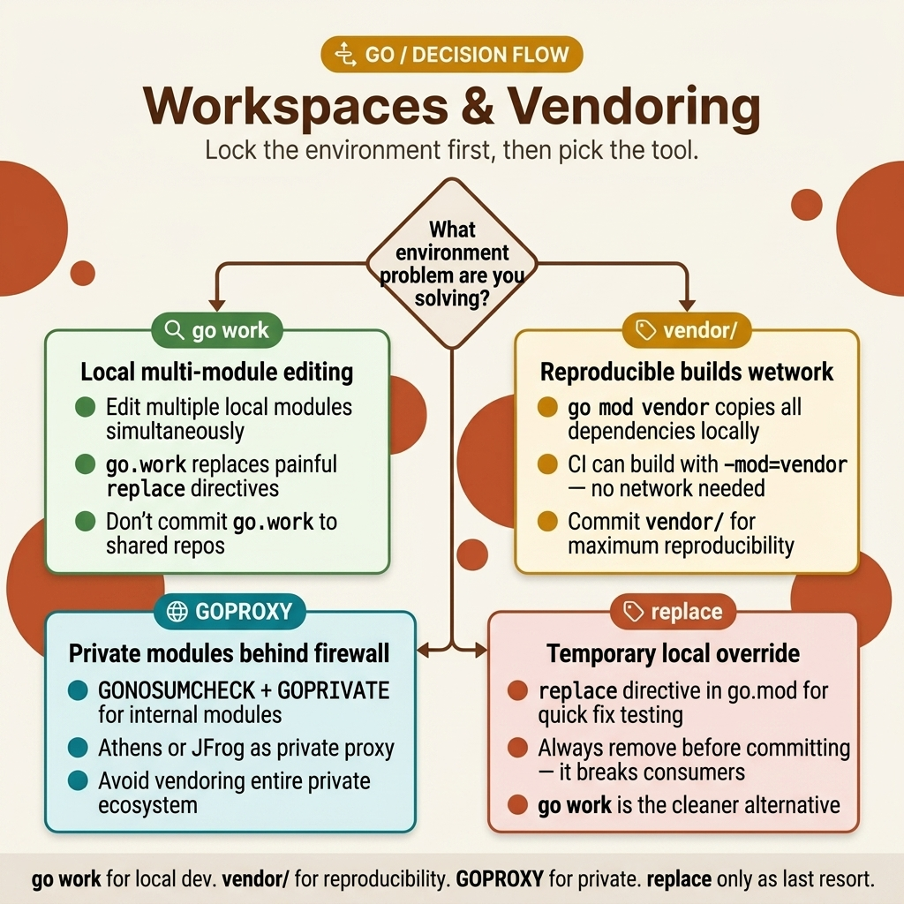

<!-- tags: golang, modules --> # 📦 Go Workspaces , Vendoring & Riêng tư Modules > Phát triển đa module với `go.work` , xây dựng ngoại tuyến với `vendor/` và cấu hình đăng ký riêng với `GOPRIVATE` .

📅 Đã tạo: 23-03-2026 · 🔄 Cập nhật: 19-04-2026 · ⏱️ Đọc 10 phút

| Khía cạnh | Chi tiết |
| --- | --- |
| **Khái niệm** | Phát triển đa module cục bộ, phụ thuộc ngoại tuyến vendoring , truy cập module riêng tư |
| **Trường hợp sử dụng** | Monorepos, bản dựng air-gapped, nội bộ công ty modules |
| **Thông tin chi tiết quan trọng** | `go.work` thay thế các lệnh `replace` cho nhà phát triển cục bộ - vẫn ở `.gitignore` , không bao giờ gây ô nhiễm `go.mod` |
| ** Go chuỗi công cụ** | `go work` , `go mod vendor` , `go env` , `replace` |

| TS/Nút | Go |
| ------------------------- | --------------------------------- |
| Monorepo (nx, turborepo) | `go.work` workspaces ( Go 1.18+) |
| `node_modules/` | `vendor/` thư mục |
| `.npmrc` sổ đăng ký riêng tư | `GOPRIVATE` , `GONOSUMDB` env vars |
| đường dẫn `"file:../shared"` | Chỉ thị `replace` trong `go.mod` |

---

## 1. ĐỊNH NGHĨA

Phát triển đồng thời thư viện dùng chung và dịch vụ API? Nếu không có workspaces , mọi thay đổi đối với thư viện đều yêu cầu cập nhật cam kết, đẩy và `go get` trong dịch vụ. Với `go.work` , cả hai modules đều giải quyết cục bộ - không có chu kỳ xuất bản.

> *Thư viện chia sẻ của bạn phát triển hàng ngày. Dịch vụ API tiêu thụ nó. Nếu không có `go.work` , mọi thay đổi thư viện đều yêu cầu: cam kết → đẩy → thẻ → `go get` trong dịch vụ. Đó là 4 bước cho mỗi lần lặp. Với `go.work` , các thay đổi sẽ hiển thị ngay lập tức — workspace ghi đè độ phân giải module cục bộ.*
>
> * Vendoring giải quyết một vấn đề khác: các bản dựng có thể tái tạo mà không cần truy cập mạng. `go mod vendor` sao chép tất cả các phụ thuộc vào `vendor/` và `go build -mod=vendor` chỉ sử dụng chúng. Môi trường không có khoảng cách, CI không có internet và kiểm tra tuân thủ đều được hưởng lợi. `GOPRIVATE` xử lý trường hợp thứ ba: nội bộ modules sẽ bỏ qua tổng kiểm tra công khai database .*

### Khi nào nên sử dụng cái gì

| Tình huống | Công cụ | Mục đích |
| -------------------------------------------- | ---------------------- | -------------------------------------------- |
| Chỉnh sửa đồng thời nhiều modules | `go.work` | Phát triển chéo cục bộ module mà không xuất bản |
| Xây dựng mà không cần truy cập mạng | `go mod vendor` | Lưu trữ tất cả các phụ thuộc cục bộ |
| Tìm nạp nội bộ công ty packages | `GOPRIVATE` | Bỏ qua DB tổng kiểm tra công khai cho các kho lưu trữ riêng tư |
| Tạm thời sử dụng ngã ba cục bộ | `replace` chỉ thị | Trỏ tới một đường dẫn cục bộ hoặc repo rẽ nhánh |

**Tại sao `go.work` thay vì `replace` ?** `replace` chỉ thị sửa đổi `go.mod` , được cam kết kiểm soát phiên bản và phá vỡ các bản dựng của nhà phát triển khác. `go.work` vẫn cục bộ ( `.gitignore` d) và không ảnh hưởng đến tệp module .

---

## 2. HÌNH ẢNH

Cây quyết định rất đơn giản: local multi- module dev → `go.work` ; bản dựng ngoại tuyến → `vendor/` ; kho lưu trữ riêng tư → `GOPRIVATE` . Hình ảnh bên dưới maps ba đường dẫn này.  *Hình: Quyết định map định tuyến các kịch bản phụ thuộc tới đúng công cụ: `go.work` dành cho nhà phát triển cục bộ, `vendor/` dành cho các bản dựng ngoại tuyến, `GOPRIVATE` dành cho nội bộ modules .*

## 3. MÃ

Bốn cấp độ tiến triển: chỉ thị workspace , vendoring , riêng tư modules và `replace` .

### Ví dụ 1: Cơ bản — Go Workspaces (Monorepo)

Một monorepo có ba modules : thư viện dùng chung, dịch vụ API và nhân viên. `go.work` liên kết chúng để phát triển cục bộ đồng thời.```bash
# Project structure:
my-project/
├── go.work           # workspace root
├── services/
│   ├── api/
│   │   ├── go.mod    # module: myproject/services/api
│   │   └── main.go
│   └── worker/
│       ├── go.mod    # module: myproject/services/worker
│       └── main.go
└── pkg/
    └── shared/
        ├── go.mod    # module: myproject/pkg/shared
        └── utils.go
```

```bash
# Initialize workspace
cd my-project
go work init ./services/api ./services/worker ./pkg/shared

# go.work (auto-generated):
go 1.22

use (
    ./services/api
    ./services/worker
    ./pkg/shared
)

# Now: all modules can import each other without versioning
# services/api can `import "myproject/pkg/shared"` directly
```> **Takeaway**: `go.work` loại bỏ chu kỳ xuất bản trong quá trình phát triển cục bộ. Thêm nó vào `.gitignore` - nó chỉ là một công cụ cục bộ.

---

### Ví dụ 2: Trung cấp — Vendoring Vendoring sao chép tất cả các phụ thuộc vào cây dự án. Các bản dựng chỉ sử dụng mã được cung cấp — không cần mạng.```bash
# Create vendor directory with all dependencies
go mod vendor

# Build using vendor (offline, reproducible)
go build -mod=vendor ./...

# Verify vendor matches go.sum
go mod verify
```

```
# vendor/ structure:
vendor/
├── github.com/
│   └── gin-gonic/
│       └── gin/
├── gorm.io/
│   └── gorm/
└── modules.txt         # dependency list
```> **Khi nào cần đến nhà cung cấp?** Môi trường không có khoảng cách, yêu cầu tuân thủ nghiêm ngặt hoặc hệ thống CI không có quyền truy cập Internet. Đối với hầu hết các dự án, bộ đệm module ( `go mod download` ) là đủ.

> **Takeaway**: `go mod vendor` + `go build -mod=vendor` cung cấp các bản dựng ngoại tuyến, có thể tái tạo hoàn toàn.

---

### Ví dụ 3: Nâng cao — Riêng tư Modules Nội bộ công ty modules thực hiện xác thực và không được xác minh dựa vào tổng kiểm tra công khai database .```bash
# Tell Go to skip checksum DB for private modules
export GOPRIVATE=github.com/mycompany/*,gitlab.com/myorg/*

# Configure Git for private repos (SSH)
git config --global url."git@github.com:mycompany/".insteadOf "https://github.com/mycompany/"

# Or use GONOSUMDB + GOFLAGS
export GONOSUMDB=github.com/mycompany/*
```> **Takeaway**: `GOPRIVATE` yêu cầu `go get` bỏ qua proxy công khai và tổng kiểm tra database . Kết hợp với cấu hình Git dựa trên SSH để xác thực liền mạch.

---

### Ví dụ 4: Expert — Thay thế Chỉ thị

 Lệnh `replace` ghi đè độ phân giải module trong `go.mod` . Sử dụng cho các nhánh cục bộ tạm thời - nhưng không cam kết chúng với các kho lưu trữ được chia sẻ.```go
// go.mod

module myapp

go 1.22

require (
    github.com/mycompany/shared-lib v1.2.0
)

// ✅ Local development: point to local copy
replace github.com/mycompany/shared-lib => ../shared-lib

// ✅ Fork: use forked repo
replace github.com/original/lib => github.com/myfork/lib v1.0.0-patched
```> **Tại sao phải xử lý `replace` cẩn thận?** Các lệnh `replace` đã cam kết phá vỡ các bản dựng của nhà phát triển khác — đường dẫn cục bộ không tồn tại trên máy của họ. Ưu tiên `go.work` để phát triển địa phương.

> **Takeaway**: Sử dụng `replace` để gỡ lỗi cục bộ nhanh chóng. Sử dụng `go.work` để phát triển đa module bền vững. Không bao giờ cam kết chỉ thị `replace` trỏ đến đường dẫn cục bộ.

---

## 4. Cạm bẫy

Các công cụ rất đơn giản. Những cái bẫy bên dưới sẽ bắt những nhóm thực hiện chỉ thị `replace` hoặc quên cập nhật danh mục nhà cung cấp của họ.

| # | Mức độ nghiêm trọng | Lỗi | Hậu quả | Sửa chữa |
|---|----------|------|----------|------|
| 1 | 🔴 Gây tử vong | Cam kết chỉ thị `replace` với đường dẫn cục bộ | Các bản dựng phá vỡ dành cho tất cả các nhà phát triển khác | Thay vào đó hãy sử dụng `go.work` ; thêm `go.work` vào `.gitignore` |
| 2 | 🟡 Chung | Thư mục `vendor/` cũ sau khi cập nhật phụ thuộc | Bản dựng sử dụng phiên bản phụ thuộc cũ | Chạy `go mod vendor` sau mỗi `go get` |

---

## 5. GIỚI THIỆU

| Tài nguyên | Loại | Liên kết | Mô tả |
| --------------- | -------- | ------------------------------------------------------------------------ | ------- |
| Go Workspaces | Chính thức | [go.dev/doc/tutorial/workspaces](https://go.dev/doc/tutorial/workspaces) | Multi- module workspace hướng dẫn |
| Go Modules | Chính thức | [go.dev/ref/mod](https://go.dev/ref/mod) | Hoàn thành module và tham chiếu phụ thuộc |

---

## 6. KHUYẾN NGHỊ

Nền tảng của ** Workspaces & Vendoring ** đã được giải quyết. Tiện ích mở rộng bên dưới kết nối trở lại các nguyên tắc cơ bản về bố cục module .

| Gia hạn | Khi nào | Tại sao | Tệp/Liên kết |
| ------- | ------- | ----- | --------- |
| Modules & Bố cục | Cấu trúc dự án và ranh giới `internal/` | Nền tảng cho tổ chức package | [01-modules-layout.md](./01-modules-layout.md) |

---

**Điều hướng**: [← Modules Layout](./01-modules-layout.md) · [→ Basics](../basics/01-syntax-variables.md)