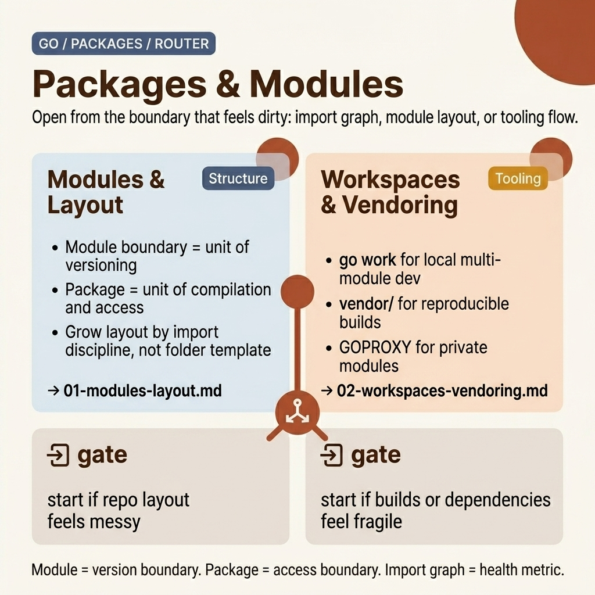

<!-- tags: golang, overview -->
# Packages — Modules, layout, workspaces, vendoring

> Go package system: module management, project layout, workspaces (Go 1.18+), vendoring.

📅 Updated: 2026-04-19 · ⏱️ 6 min read

## 1. DEFINE

`go mod init`, `go get`, `go work` — three commands that determine how a Go project organizes dependencies, visibility, and multi-module development. This cluster helps you choose the right layout from day one.

This hub does not exist to list files. It exists to help you choose the right entrance to `fundamental/packages`: where to start, which articles to read together, and when you encounter real symptoms, which lane.

### 1.1 Signals & Boundaries

- Open this hub when you know you're in the `fundamental/packages` cluster but aren't sure which article to read first.
- The focus of the hub is to map pain points to the correct document, not to replace each detail.
- If you keep jumping between articles and still feel confused, the problem is usually choosing the wrong starting lane — not a lack of definitions.

### 1.2 Learning Lanes

- `Packages & Modules` is the natural entry point if you want a strong grip before diving in.
- `Go Workspaces, Vendoring & Private Modules` is more suitable when you need to connect to an adjacent lane or expand from the platform to a production concern.
- Use this hub as a navigation map: after reading one article, go back to the next point with purpose.

## 2. VISUAL

The `packages` lane should be opened from where import graphs, module boundaries, or tooling flows are causing confusion — not from the pretty folder tree.



*Figure: Router map of `packages` divides the cluster into two symptom groups: module/layout foundation at the code organization level, and workspace/vendoring/private-module flow at the tool boundary level.*

Once you know whether your problem lies in repo structure or in the dependency/tooling workflow, the pseudo-router below acts as a navigation artifact.

## 3. CODE

Router map shows directions with pictures. The pseudo-code below compresses that navigation logic into an artifact for the team.

### Example 1: Router artifact — select articles according to reading goals.

> **Goal**: Turn this hub into a navigation tool instead of a passive link table.
> **Approach**: Map learning goals or symptoms to the correct starting file.
> **Example**: Choose lanes by concern: module layout, workspace tooling, or vendoring.
> **Complexity**: O(1) at navigation level; what matters is choosing the right entry point.

```text
func chooseLane(goal string) string {
    switch goal {
    case "modules layout": return "./01-modules-layout.md"
    case "workspaces vendoring": return "./02-workspaces-vendoring.md"
    default: return "./README.md"
    }
}
```

This pseudo-router is not code to run in your application; it compresses the hub's navigation logic into a concise artifact.

## 4. PITFALLS

The navigation hub is valuable when you use it correctly — not by skimming and jumping straight to the most difficult lesson.

| # | Severity | Error | Consequence | Fix |
| --- | --- | --- | --- | --- |
| 1 | 🔴 Fatal | Use the hub as a list of links to surf | Learning is fragmentary and choosing the wrong entry point | Always start from a pain point or specific learning goal |
| 2 | 🟡 Common | Jump straight into a deep post when there is no base lane yet | Understanding terms is fragmentary and easy to misapply | Choose an entry point and then follow the cluster rhythm |
| 3 | 🔵 Minor | After reading, do not return to the hub | Lost rhythm and connection between songs | Return to the hub after each lane to choose the next step |

## 5. REF

| Resource | Type | Link | Note |
| --- | --- | --- | --- |
| Go Modules Reference | Official | https://go.dev/ref/mod | Module system, versioning, replace directives, private modules |
| Go Workspaces Tutorial | Official | https://go.dev/doc/tutorial/workspaces | Multi-module development with `go.work` |
| CodeReviewComments — Package Names | Official | https://go.dev/wiki/CodeReviewComments#package-names | Standard guidelines for package naming |

## 6. RECOMMEND

After reading this article, the important thing is not to keep more definitions in mind, but to move on to the right related concept.

| Extend | When should I continue reading? | Reason | File/Link |
| --- | --- | --- | --- |
| Packages & Modules | When you need a clear entry point | Keep a seamless reading rhythm within the same cluster | [./01-modules-layout.md](./01-modules-layout.md) |
| Go Workspaces, Vendoring & Private Modules | When you want to connect to the next lane | Keep a seamless reading rhythm within the same cluster | [./02-workspaces-vendoring.md](./02-workspaces-vendoring.md) |
| Go Programming | When you need to change Go cluster | Return to the original router to choose another lane | [../README.md](../README.md) |
