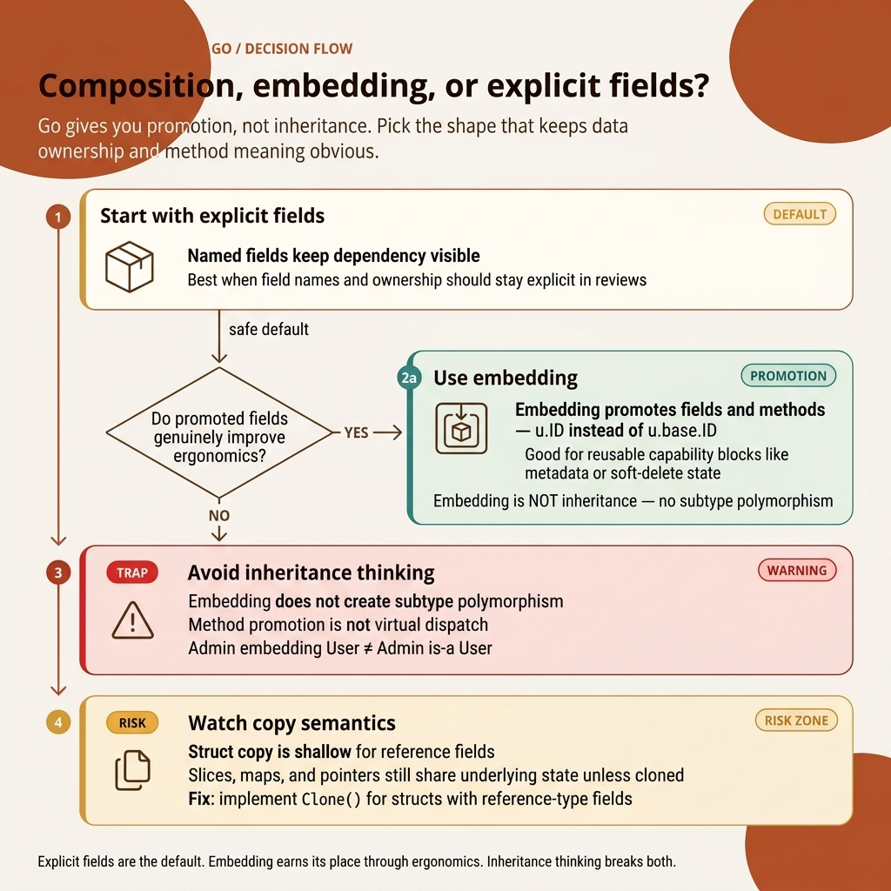

<!-- tags: golang, structs -->
# 🧱 Structs & Composition

> Structs, embedding, composition over inheritance — Go's core approach to OOP

📅 Created: 2026-03-20 · 🔄 Updated: 2026-04-19 · ⏱️ 17 min read

| Aspect            | Detail                                |
| ----------------- | ------------------------------------- |
| **Concept**       | Struct types, embedding (composition) |
| **Use case**      | Data modeling, DDD entities           |
| **Key insight**   | Go has NO classes, NO inheritance     |
| **Go philosophy** | Composition > Inheritance             |

---

## 1. DEFINE

You embed a `sync.Mutex` directly into a struct and pass that struct by value. The mutex copies — two goroutines now lock two different mutexes, and a data race begins. This is the most common bug when developers use embedding without understanding value semantics.

> *You model a system with `User`, `AdminUser`, `Product`, and `AuditLog`. Every type needs `ID`, `CreatedAt`, and `UpdatedAt`. In Java or C#, you create a `BaseEntity` and `extends`. Two years later: the hierarchy is 5 layers deep, `BaseEntity` has 20 methods, new engineers cannot tell which methods to override, and `AdminUser extends User extends BaseEntity extends Auditable` — a diamond problem. Refactoring touches 200 files. Tests break for 3 days.*
>
> *Go has no classes and no inheritance. Instead: **embedding** — placing `BaseModel` inside `User` promotes all fields and methods. `user.ID`, `user.CreatedAt`, and `user.Touch()` work as if they belong to `User`. But this is **not** "is-a" — this is "has-a" with method promotion. It is lightweight, flexible, and eliminates the diamond problem.*

This sounds clean — but raw composition hides a trap: `c2 := c1` copies the struct, but slice and map fields copy only their headers. Both structs now share the same underlying data. This bug only detonates in production when two goroutines modify the shared copy concurrently. We dissect that trap in PITFALLS.

### 1.1 Struct Features

| Feature          | Description                   | Example                        |
| ---------------- | ----------------------- | ---------------------------- |
| Fields           | Internal Data members            | `Name string`                |
| Tags             | Explicit Metadata (JSON, DB)     | `` `json:"name"` ``          |
| Embedding        | Native Composition (has-a)     | `type Admin struct { User }` |
| Anonymous struct | Ephemeral Inline struct           | `struct{ X, Y int }{1, 2}`   |
| Constructor      | Idiomatic Factory function        | `func NewUser(...) *User`    |

### 1.2 Struct Tags — Reference Table

| Tag                   | Package       | Description              |
| --------------------- | ------------- | ------------------ |
| `json:"name"`         | encoding/json | Binds JSON field name    |
| `json:"-"`            | encoding/json | Forces field skip         |
| `json:",omitempty"`   | encoding/json | Skips whenever zero value |
| `db:"column"`         | sqlx/pgx      | Maps DB column name     |
| `validate:"required"` | validator     | Applies Validation rules   |
| `gorm:"primaryKey"`   | gorm          | Installs ORM configuration         |

### 1.3 Failure Modes

| Error | Root Cause | Consequence | Fix |
| --- | ------------ | ------ | --- |
| Shallow copy struct containing slices | `c2 := c1` copies the slice header but shares the underlying array | Mutating `c2.Tags[0]` also mutates `c1.Tags[0]` | Deep copy: `copy(dst, src)` for slices, manual clone for maps |
| Embedding ≠ inheritance | Developer assumes `Admin` "is-a" `User` | `Admin` is not assignable to a `User` variable | Use embedding for composition (has-a) and interfaces for polymorphism |
| Comparing struct with embedded slices | `c1 == c2` when fields include a slice | Compile error — slices are not comparable | Use `reflect.DeepEqual()` or write a manual comparison |

Struct features, tags, failure modes — the theory is covered. Now let us see how embedding works visually, and how it differs from inheritance.

---

The patterns above sound clean — but there is a severe trap: embedded struct promotion can cause silent method name collisions, and embedded interface satisfaction can become opaque. That trap surfaces in PITFALLS.

## 2. VISUAL

The costliest friction with structs comes from treating embedding as inheritance. The decision map below forces a stronger test: do you need method promotion, or do you need a named dependency with explicit access?



*Figure: A decision map that separates four paths: named fields as the default, embedding as a conditional promotion engine, inheritance-thinking as a logic trap, and copy semantics as a production risk.*

With the decision tree routed, the code section below becomes actionable. Read constructors, embeddings, and deep-copy examples as three validation passes for an ownership model — not as disconnected syntax demos.

## 3. CODE

With **Structs & Composition**, we have a mental model for embedding and method promotion. Now we anchor it in code: named fields vs. embedding, value receivers vs. pointer receivers, promotion vs. shadowing — each choice shifts runtime behavior and interface satisfaction.

### Example 1: Basic — Structs & Constructors

> **Goal**: Define a struct with tags, build an idiomatic constructor, and use functional options for flexible creation.
> **Approach**: `User` struct with JSON tags, `NewUser()` constructor, and `NewUserWithOptions()` for optional parameters.
> **Example**: `json:"-"` hides the `Password` field from JSON output. `WithAge(30)` injects an optional parameter.

```go
package main

import (
    "encoding/json"
    "fmt"
    "time"
)

// ✅ Struct definition — fields + tags
type User struct {
    ID        int64     `json:"id"`
    Email     string    `json:"email" validate:"required,email"`
    FullName  string    `json:"full_name"`
    Age       int       `json:"age,omitempty"`
    Password  string    `json:"-"`                // ✅ Never serialize
    CreatedAt time.Time `json:"created_at"`
    UpdatedAt time.Time `json:"updated_at"`
}

// ✅ Constructor pattern — idiomatic Go
func NewUser(email, name, password string) *User {
    now := time.Now()
    return &User{
        Email:     email,
        FullName:  name,
        Password:  password,
        CreatedAt: now,
        UpdatedAt: now,
    }
}

// ✅ Functional options — flexible constructor
type UserOption func(*User)

func WithAge(age int) UserOption {
    return func(u *User) { u.Age = age }
}

func WithID(id int64) UserOption {
    return func(u *User) { u.ID = id }
}

func NewUserWithOptions(email, name string, opts ...UserOption) *User {
    u := &User{
        Email:     email,
        FullName:  name,
        CreatedAt: time.Now(),
    }
    for _, opt := range opts {
        opt(u)
    }
    return u
}

func main() {
    u1 := NewUser("alice@example.com", "Alice", "secret123")

u2 := NewUserWithOptions("bob@example.com", "Bob",
        WithAge(30),
        WithID(42),
    )

// ✅ JSON marshal — Password excluded by json:"-"
    data, _ := json.MarshalIndent(u1, "", "  ")
    fmt.Println(string(data))
    fmt.Println(u2)
}
```

> **Takeaway**: Struct + constructor = Go's idiomatic replacement for a class. `json:"-"` hides sensitive fields from JSON output. Functional options provide flexible construction without method overloading.

A single constructor handles one struct. But what happens when 5 types all need the same `ID`, `CreatedAt`, and `UpdatedAt` fields — do you copy-paste them into every struct? No. Embedding solves this: declare `BaseModel` once, embed it everywhere.

---

Basic composition is clear. But embedding has complex promotion rules — which methods surface, and which fields get shadowed?

### Example 2: Intermediate — Embedding & Composition

> **Goal**: Embed `BaseModel` to reuse fields and methods across multiple types.
> **Approach**: `User` embeds `BaseModel` → `user.ID` and `user.SetTimestamps()` are promoted.
> **Example**: Calling `u.SetTimestamps()` sets both `CreatedAt` and `UpdatedAt` — code reuse without inheritance.

```go
package main

import (
    "fmt"
    "time"
)

// ✅ Base model — reusable fields + methods
type BaseModel struct {
    ID        int64     `json:"id"`
    CreatedAt time.Time `json:"created_at"`
    UpdatedAt time.Time `json:"updated_at"`
}

func (b *BaseModel) SetTimestamps() {
    now := time.Now()
    if b.CreatedAt.IsZero() {
        b.CreatedAt = now
    }
    b.UpdatedAt = now
}

// ✅ Embedding = composition (NOT inheritance!)
type User struct {
    BaseModel                // Embedded — fields/methods promoted
    Email    string `json:"email"`
    FullName string `json:"full_name"`
}

type Product struct {
    BaseModel
    Name  string  `json:"name"`
    Price float64 `json:"price"`
}

type AuditLog struct {
    BaseModel
    Action    string `json:"action"`
    UserID    int64  `json:"user_id"`
    TableName string `json:"table_name"`
}

func main() {
    u := User{
        Email:    "alice@example.com",
        FullName: "Alice",
    }

// ✅ Promoted methods — call directly on User
    u.SetTimestamps()

// ✅ Promoted fields — access directly
    u.ID = 1  // Same as u.BaseModel.ID = 1
    fmt.Println(u.ID, u.CreatedAt)

// ✅ Composition: User IS NOT a BaseModel
    // User HAS a BaseModel — no "is-a" relationship
}
```

> **Why embed instead of using a named field?**
> A named field `base BaseModel` requires `u.base.ID` and `u.base.SetTimestamps()` — verbose. Embedding (`BaseModel` without a field name) promotes fields and methods: `u.ID` and `u.SetTimestamps()` work directly. The syntax looks like inheritance, but the mechanics are pure composition.
>
> **Why does Go reject inheritance?**
> Inheritance creates tight coupling (children depend on parent internals), the fragile base class problem (modifying a parent breaks children), and diamond ambiguity (multiple inheritance conflicts). Composition keeps coupling loose, method resolution simple (breadth-first lookup, no vtables), and explicit only when needed.

> **Takeaway**: Embedding = composition with implicit promotion. A `User` "has-a" `BaseModel`, never "is-a". Reuse fields and methods without inheritance coupling.

Embedding covers code reuse. But a dangerous anomaly hides below the surface: `c2 := c1` feels like a safe copy, but when the struct contains slice or map fields, both structs share the same underlying data. This bug was seeded in the definitions above — now watch it break at runtime.

---

Embedding rules are covered. Moving into Advanced territory: struct comparability, shallow vs. deep copy, and the `Clone()` pattern.

### Example 3: Advanced — Comparison & Deep Copy

> **Goal**: Understand struct comparability rules, diagnose the shallow copy trap, and establish the `Clone()` pattern.
> **Approach**: Structs with only comparable fields support `==`. Structs with slices or maps require manual deep copy.
> **Example**: `p1 == p2` works (all comparable fields). `c2 := c1` shares slice data (shallow copy trap). `c1.Clone()` produces a safe independent copy.

```go
package main

import "fmt"

// ✅ Comparable struct — all fields are comparable types
type Point struct {
    X, Y int
}

// ❌ NOT comparable — has slice field
type Config struct {
    Name  string
    Tags  []string  // slices are not comparable!
}

// ✅ Deep copy — manually copy reference types
func (c Config) Clone() Config {
    tagsCopy := make([]string, len(c.Tags))
    copy(tagsCopy, c.Tags)
    return Config{
        Name: c.Name,
        Tags: tagsCopy,
    }
}

func main() {
    p1 := Point{1, 2}
    p2 := Point{1, 2}
    fmt.Println(p1 == p2)  // true — struct comparison works

c1 := Config{Name: "app", Tags: []string{"go", "api"}}
    c2 := c1               // ⚠️ Shallow copy — Tags shares underlying array!
    c2.Tags[0] = "rust"
    fmt.Println(c1.Tags)   // [rust api] — c1 modified!

c3 := c1.Clone()       // ✅ Deep copy
    c3.Tags[0] = "python"
    fmt.Println(c1.Tags)   // [rust api] — c1 NOT modified
}
```

> **Why does `c2 := c1` cause bugs?**
> Go struct assignment copies all fields by value. But a slice header is `{pointer, len, cap}` — copying the header means sharing the underlying array. Modifying `c2.Tags[0]` modifies that shared array, which also changes `c1.Tags[0]`. Maps behave the same way. The fix: always deep copy reference type fields (slices, maps, pointers).
>
> **When to use `reflect.DeepEqual` vs. manual comparison?**
> `reflect.DeepEqual`: convenient, recursive, works for all types. Tradeoffs: slow (reflection overhead), and blind to semantic equality (two timestamps in different timezones that represent the same instant). Manual comparison: fast, gives full semantic control. In production code: use manual comparison. In tests: `reflect.DeepEqual` or `assert.Equal` is acceptable.

> **Takeaway**: Struct `==` works only when all fields are comparable (no slices, maps, or functions). The shallow copy trap: reference type fields continue sharing underlying data after assignment. Implement `Clone()` for any struct with reference fields.

You now know how to define, construct, embed, and deep copy structs. The most dangerous trap remains: the shallow copy bug that only surfaces in production when two goroutines share a copied struct.

---

## 4. PITFALLS

The mechanics of **Structs & Composition** are clear. The remaining goal is recognizing where almost-correct code drags a composition bug or silent method collision into production.

| # | Severity | Error | Consequence | Fix |
|---|----------|-------|-------------|-----|
| 1 | 🔴 Fatal | Shallow copy of structs with slices/maps | Shared underlying data → mutation bug | Deep copy via `Clone()` method |
| 2 | 🟡 Common | Treating embedding as inheritance | False expectation of polymorphism; `Admin` is not assignable to `User` | Use embedding for composition (has-a) and interfaces for polymorphism |
| 3 | 🟡 Common | Missing JSON tags | Field names output as `FullName` instead of `full_name` | Add `json:"snake_case"` to every exported field |
| 4 | 🟡 Common | Method name collision from multiple embeds | Compile error when 2 embedded types define the same method name | Use explicit path: `s.TypeA.Method()` |
| 5 | 🔵 Minor | Export visibility confusion | Lowercase `id` is unexported → inaccessible from other packages | Capitalize for public, lowercase for private |

### 🔴 Pitfall #1 — Shallow copy silently shares underlying data

`user2 := user1` copies struct fields — but slice/map fields copy only their header (pointer + len + cap). Modifying `user2.Tags[0]` corrupts `user1.Tags[0]`. This bug hides in testing because tests use fresh data — production triggers it when two goroutines share the incorrectly copied struct.

```go
// ❌ Shallow copy — shared slice
u2 := u1
u2.Tags[0] = "changed" // u1.Tags[0] was also changed!

// ✅ Deep copy
u2 := u1
u2.Tags = slices.Clone(u1.Tags)
```

You now know struct design, embedding, deep copying, and the most dangerous pitfall. The resources below go deeper into struct memory internals.

---

## 5. REF

| Resource     | Type     | Link                                                                           | Notes |
| ------------ | -------- | ------------------------------------------------------------------------------ | ----- |
| Go Structs   | Official | [go.dev/tour/moretypes/2](https://go.dev/tour/moretypes/2)                     | Struct basics tutorial |
| Struct Tags  | Official | [pkg.go.dev/reflect#StructTag](https://pkg.go.dev/reflect#StructTag)           | Runtime tag parsing and format spec |
| Effective Go | Official | [go.dev/doc/effective_go#embedding](https://go.dev/doc/effective_go#embedding) | Composition and embedding patterns |

---

## 6. RECOMMEND

The core mechanics of **Structs & Composition** are covered. The resources below extend struct design into production: declarative tags, flexible constructors, and interface-based polymorphism.

| Extension | When to Read Next | Rationale | File/Link |
| ------- | ------- | ----- | --------- |
| Tags, Options & Builder | Flexible constructors, struct tag internals | Functional options, builder patterns, reflection-based tag systems | [02-tags-options-builder.md](./02-tags-options-builder.md) |
| Interfaces | Polymorphism in Go | Interfaces are Go's approach to polymorphism — replacing inheritance | [../interfaces/01-implicit-io-patterns.md](../interfaces/01-implicit-io-patterns.md) |
| Pointers & Memory | Layout alignment, padding | `unsafe.Sizeof`, field alignment, cache-friendly struct design | [../basics/04-pointers-memory.md](../basics/04-pointers-memory.md) |

---

**Sequential Navigation**: [← Functions](../functions/) · [→ Tags & Options](./02-tags-options-builder.md)
