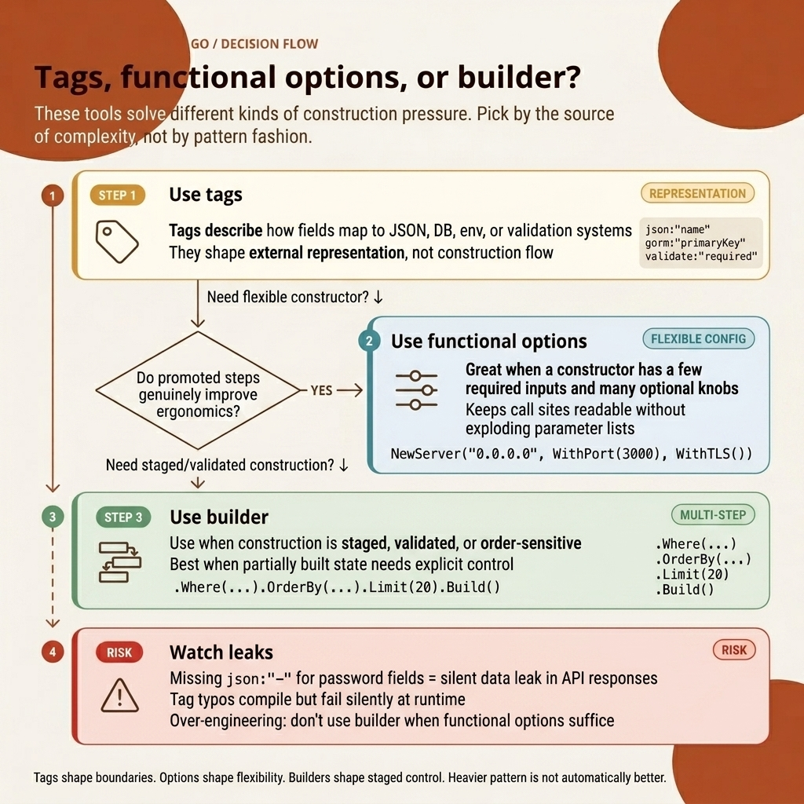

<!-- tags: golang, structs -->
# 🏷️ Struct Tags, Options & Builder Pattern

> **Three construction patterns**: Struct tags control serialization and validation at the field level. Functional options create flexible constructors with sensible defaults. Builders enforce step-by-step object assembly with final validation.

📅 Created: 2026-03-23 · 🔄 Updated: 2026-04-19 · ⏱️ 12 min read

| Aspect | Detail |
| --- | --- |
| **Concept** | Struct tags, functional options, builder pattern |
| **Use case** | JSON serialization, flexible construction, step-by-step assembly |
| **Key insight** | Tags are strings parsed at runtime via reflection — no compile-time safety |
| **Go stdlib** | `encoding/json`, `reflect`, `net/url` |

| External Paradigm | Go Pattern                               |
| --------------------------------- | ---------------------------------------- |
| Decorators `@Column()`, `@Prop()` | Struct tags: `json:"name"`, `gorm:"..."` |
| Constructor overloads             | Functional Options system               |
| Builder pattern class             | Chained pointer mutation structures      |

---

## 1. DEFINE

A missing `json:"-"` tag on a `Password` field leaks credentials in every API response. A typo in `json:"naem"` silently drops a field from the JSON output. Both bugs produce zero compile-time warnings — struct tags are raw strings parsed by reflection at runtime.

Struct tags control how external systems (JSON encoders, ORMs, validators) interpret struct fields. Functional options replace constructor overloading — each option is a closure that mutates a default config. The Builder pattern chains method calls to assemble complex objects, deferring validation to a final `Build()` step.

### Struct Tag Anatomy

```text
type User struct {
    ID    uint   `json:"id" gorm:"primaryKey" validate:"required"`
    //            ↑json tag  ↑gorm tag         ↑validate tag
}
```

### Tag Systems — Reference Table

| Tag System | Package | Purpose |
| --- | --- | --- |
| `json:"name"` | `encoding/json` | JSON field name mapping |
| `gorm:"column"` | `gorm.io/gorm` | Database column binding |
| `validate:"required"` | `go-playground/validator` | Input validation rules |
| `form:"field"` | Fiber/Gin | HTTP form/query binding |
| `env:"VAR"` | `caarlos0/env` | Environment variable binding |

Tags, options, builder — three patterns, one shared goal: controlling how structs interact with the world outside Go's type system. The visual below maps when to reach for each.

## 2. VISUAL



*Figure: The decision map routes three construction pressures — external format control (tags), flexible defaults (functional options), and sequential assembly with validation (builder) — to the correct pattern based on the problem shape.*

## 3. CODE

### Example 1: Basic — Struct Tags

> **Goal**: Demonstrate how struct tags control JSON output and hide sensitive fields.
> **Approach**: Use `json:"-"` to exclude passwords and `omitempty` to skip nil pointers.
> **Complexity**: Basic

```go
package main

import (
	"encoding/json"
	"fmt"
	"strings"
	"time"
)

type User struct {
	ID        uint      `json:"id" gorm:"primaryKey"`
	Name      string    `json:"name" gorm:"size:100" validate:"required"`
	Password  string    `json:"-" gorm:"size:255"` // Hidden from JSON output
	Bio       *string   `json:"bio,omitempty"`     // Skipped when nil
	CreatedAt time.Time `json:"created_at" gorm:"autoCreateTime"`
}

func main() {
	bio := "Gopher limits API logic"
	user := User{
		ID:        42,
		Name:      "Alice",
		Password:  "super-secret",
		Bio:       &bio,
		CreatedAt: time.Now(),
	}

	data, err := json.MarshalIndent(user, "", "  ")
	if err != nil {
		panic(err)
	}

	fmt.Println(string(data))
	fmt.Println("Password leaked?", strings.Contains(string(data), "super-secret"))
}
```

> **Takeaway**: `json:"-"` prevents a field from appearing in JSON output. `omitempty` skips fields with zero values. Tags are strings — the compiler cannot catch typos. Run `go vet` to validate tag syntax.

### Example 2: Intermediate — Functional Options Pattern

> **Goal**: Build a flexible constructor that supports optional parameters without breaking existing callers.
> **Approach**: Each option is a `func(*Server)` closure that sets one field. The constructor applies defaults first, then iterates over options.
> **Complexity**: Intermediate

```go
package main

import (
	"fmt"
	"time"
)

type Server struct {
	host         string
	port         int
	readTimeout  time.Duration
	enableTLS    bool
}

// Option is a function that modifies Server config.
type Option func(*Server)

func WithPort(port int) Option {
	return func(s *Server) {
		if port > 0 {
			s.port = port
		}
	}
}

func WithTLS() Option {
	return func(s *Server) { s.enableTLS = true }
}

// NewServer creates a Server with sensible defaults, then applies options.
func NewServer(host string, opts ...Option) *Server {
	s := &Server{
		host:        host,
		port:        8080,
		readTimeout: 15 * time.Second,
	}
	
	for _, opt := range opts {
		opt(s)
	}
	return s
}

func main() {
	customServer := NewServer("0.0.0.0", WithPort(3000), WithTLS())
	fmt.Printf("Server configured on %s:%d\n", customServer.host, customServer.port)
}
```

> **Takeaway**: Functional options separate configuration concerns from the constructor. Adding a new option does not change the constructor signature — backward compatibility is preserved by default.

### Example 3: Advanced — Builder Pattern

> **Goal**: Assemble a SQL query step by step, validating all required fields in a final `Build()` call.
> **Approach**: Each method returns `*QueryBuilder` for chaining. `Build()` validates required fields before producing output.
> **Complexity**: Advanced

```go
package main

import (
	"errors"
	"fmt"
	"strings"
)

type QueryBuilder struct {
	table      string
	conditions []string
	limit      int
}

func NewQuery(table string) *QueryBuilder {
	return &QueryBuilder{table: table}
}

func (q *QueryBuilder) Where(condition string) *QueryBuilder {
	q.conditions = append(q.conditions, condition)
	return q // Returns the same pointer — enables method chaining
}

func (q *QueryBuilder) Limit(n int) *QueryBuilder {
	q.limit = n
	return q
}

// Build assembles the final SQL string and validates required fields.
func (q *QueryBuilder) Build() (string, error) {
	if q.table == "" {
		return "", errors.New("table name required")
	}

	sql := "SELECT * FROM " + q.table
	if len(q.conditions) > 0 {
		sql += " WHERE " + strings.Join(q.conditions, " AND ")
	}
	if q.limit > 0 {
		sql += fmt.Sprintf(" LIMIT %d", q.limit)
	}
	return sql, nil
}

func main() {
	sql, err := NewQuery("users").Where("role = admin").Limit(20).Build()
	if err != nil {
		panic(err)
	}
	fmt.Println(sql)
}
```

> **Takeaway**: The Builder pattern defers validation to `Build()`, preventing partially constructed objects from escaping. Each chained method accumulates state; validation runs once at the end.

## 4. PITFALLS

Struct tags, functional options, and builders each carry a distinct failure mode.

| # | Severity | Defect | Fix |
|---|----------|--------|-----|
| 1 | 🔴 Fatal | Missing `json:"-"` on sensitive fields (passwords, tokens) leaks credentials in API responses | Audit all struct fields that touch HTTP responses — add `json:"-"` to every secret field |
| 2 | 🟡 Common | Tag typo (`json:"naem"` instead of `json:"name"`) silently drops the field from JSON output | Run `go vet` on every build — it catches malformed struct tags |
| 3 | 🟡 Common | Using `omitempty` on `bool` fields drops `false` values — clients receive no field instead of `false` | Avoid `omitempty` on boolean fields where `false` carries semantic meaning |

## 5. REF

| Resource     | Link                                                                           |
| ------------ | ------------------------------------------------------------------------------ |
| Struct Tags  | [pkg.go.dev/reflect#StructTag](https://pkg.go.dev/reflect#StructTag)           |
| Effective Go | [go.dev/doc/effective_go#embedding](https://go.dev/doc/effective_go#embedding) |

---
