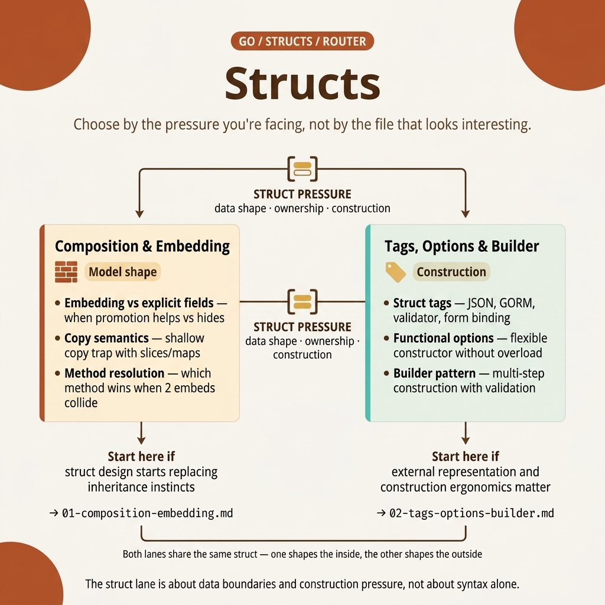

<!-- tags: golang, overview -->

# Structs — Composition, embedding, tags, builder

> Go structs: composition over inheritance, embedding, struct tags, options & builder patterns.

📅 Updated: 2026-04-19 · ⏱️ 6 min read

## 1. DEFINE

A Go struct looks simple until you debug a shadowed field or trace a promoted method through three embedding levels. That is when **Structs — Composition, embedding, tags, builder** becomes essential.

This hub helps you pick the right entry point for `fundamental/structs`: where to start, which articles to read in order, and which lane to take when you hit a specific problem.

### 1.1 Signals & Boundaries

- Open this hub when you are inside the `fundamental/structs` cluster but unsure which article to start with.
- This hub maps pain points to the correct article — it does not replace the articles themselves.
- If you keep jumping between articles and feel lost, the issue is the wrong entry lane, not missing definitions.

### 1.2 Learning Lanes

- `Structs & Composition` is the gateway if you need a solid foundation before going deeper.
- `Struct Tags, Options & Builder Pattern` covers the production side: serialization, validation, and construction ergonomics.
- Use this hub as a navigation map: after finishing an article, return here to pick the next step.

## 2. VISUAL

The `structs` lane covers more than field or tag syntax. It is where you face data ownership, method promotion, and construction pressure head-on. The router map below surfaces those three concerns.



_Figure: The `structs` router map splits the cluster into two vectors: composition/embedding for structural shape and ownership, and tags/options/builder for serialization and construction ergonomics._

Once you identify whether your hurdle involves data shaping or construction flows, the router below guides your article selection without summarizing the technical details.

## 3. CODE

The router map provided visual directions. The pseudo-code below compresses that navigation logic into a functional artifact.

### Example 1: Router artifact — selecting an article by reading objective

> **Goal**: Turn this hub into a navigation tool, not a passive link list.
> **Approach**: Map learning objectives or symptoms to their correct starting file.
> **Example**: Select a lane based on your concern — composition, serialization, or construction.
> **Complexity**: O(1) navigation; the real difficulty is choosing the right entry point.

```text
func chooseLane(goal string) string {
    switch goal {
    case "composition embedding": return "./01-composition-embedding.md"
    case "tags options builder": return "./02-tags-options-builder.md"
    default: return "./README.md"
    }
}
```

This pseudo-router is not executable code. It captures the hub's navigation logic in one artifact. Use the hub with that mindset to keep a cohesive learning rhythm.

## 4. PITFALLS

A navigation hub delivers value when used correctly — not skimmed before jumping into the hardest article.

| #   | Severity  | Error                                         | Consequence                             | Fix                                                 |
| --- | --------- | ------------------------------------------- | ----------------------------------- | --------------------------------------------------- |
| 1   | 🔴 Fatal  | Treating the hub as a passive link list         | Fragmented learning, wrong entry points | Start from a known pain point or a concrete learning goal |
| 2   | 🟡 Common | Jumping into advanced articles without foundations | Definitions learned out of context → misapplication | Pick an entry point and follow the cluster order       |
| 3   | 🔵 Minor  | Not returning to the hub after reading an article | Lost connection between articles     | Return to the hub after each lane to pick the next step      |

## 5. REF

| Resource                 | Type     | Link                                      | Notes                                      |
| ------------------------ | -------- | ----------------------------------------- | -------------------------------------------- |
| A Tour of Go — Structs   | Official | [go.dev/tour/moretypes/2](https://go.dev/tour/moretypes/2)           | The most concise entry point for raw struct basics  |
| Effective Go — Embedding | Official | [go.dev/doc/effective_go#embedding](https://go.dev/doc/effective_go#embedding) | Core guidance on composition and embedding |
| `reflect.StructTag`      | Official | [pkg.go.dev/reflect#StructTag](https://pkg.go.dev/reflect#StructTag)      | Source of truth for struct tag format and parsing    |

## 6. RECOMMEND

The map is set. Pick the lane that matches your current scenario:

| Extension                                | When to read next            | Rationale                                     | File/Link                                                      |
| -------------------------------------- | ------------------------------- | ----------------------------------------- | -------------------------------------------------------------- |
| Structs & Composition                  | When you need a solid entry point | Covers composition, embedding, and method promotion | [./01-composition-embedding.md](./01-composition-embedding.md) |
| Struct Tags, Options & Builder Pattern | When you need production patterns   | Covers serialization, validation, and construction | [./02-tags-options-builder.md](./02-tags-options-builder.md)   |
| Go Programming                         | When you need a different cluster | Returns to the root router for a new lane     | [../README.md](../README.md)                                   |
