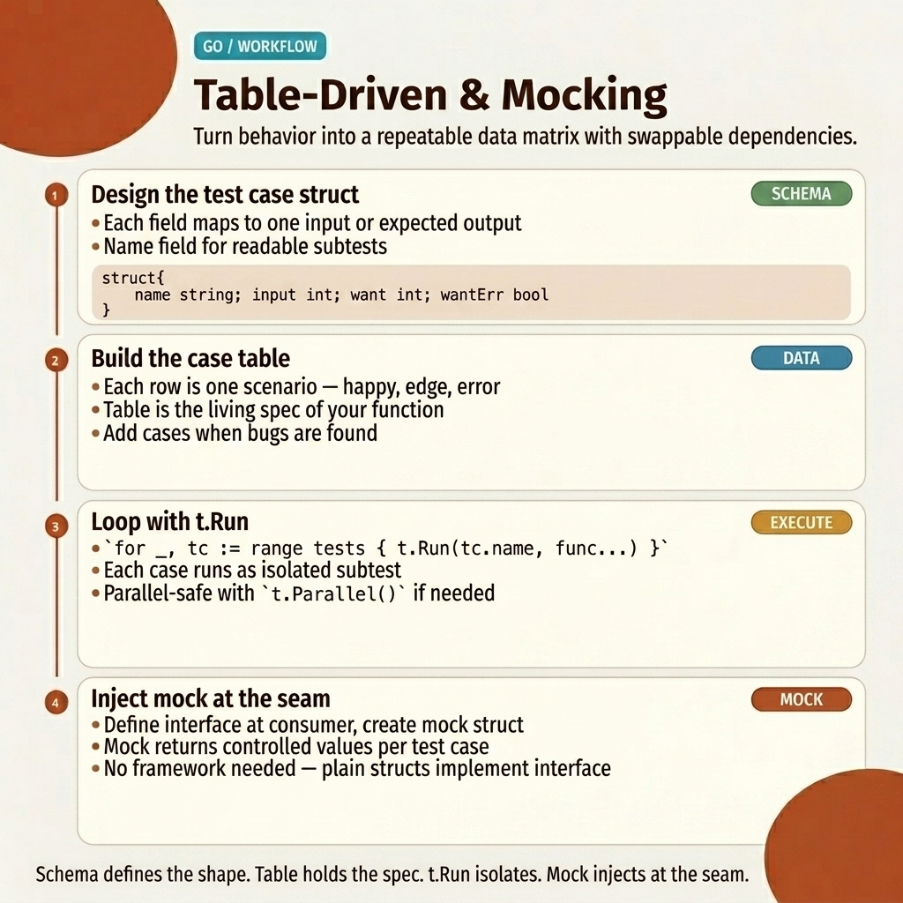

<!-- tags: golang, testing -->
# 🧪 Testing — Table-driven, Benchmarks, Mocking

> Go's `testing` package is built into the language. Table-driven tests handle input matrices, `testify` provides assertions, and `testify/mock` replaces dependencies with controlled fakes.

📅 Created: 2026-03-20 · 🔄 Updated: 2026-04-19 · ⏱️ 15 min read

| Aspect          | Detail                                        |
| --------------- | --------------------------------------------- |
| **Tool**        | Built-in `testing` package — no external framework required |
| **Use case**    | Unit tests, benchmarks, coverage, race detection |
| **Key insight** | Table-driven tests scale input coverage without code duplication |
| **CLI**         | `go test`, `go test -bench`, `go test -cover` |

---

## 1. DEFINE

You write `TestDivide_Normal`, `TestDivide_ByZero`, `TestDivide_NegativeResult`, `TestDivide_LargeNumbers`. Four functions, identical structure, only the inputs differ. A new edge case means a new function. Bug in the assertion pattern? Fix four places. Pull request review? Read four nearly identical blocks.

> *Table-driven testing eliminates this duplication. You define a `[]struct{ name, input, expected }` slice — one row per test case. The loop calls `t.Run(tt.name, ...)` for each row. Adding a case means adding one struct literal. The assertion logic exists exactly once. The test output groups results by name: `TestDivide/normal`, `TestDivide/by_zero` — readable, filterable with `-run`.*
>
> *But table-driven tests only verify the code you control. When your function depends on a database, an HTTP client, or a message broker, you need to replace that dependency with a controlled fake. Go solves this with interfaces: define the dependency as an interface, inject a mock in tests. `testify/mock` automates expectation setup and verification.*

### Test Types

Go provides four test function patterns. Each lives in `_test.go` files and is excluded from production binaries:

| Type          | File suffix | Function prefix | Purpose                             |
| ------------- | ----------- | --------------- | ----------------------------------- |
| **Unit test** | `_test.go`  | `TestXxx`       | Verify correctness of a single unit |
| **Benchmark** | `_test.go`  | `BenchmarkXxx`  | Measure performance (ns/op, B/op)   |
| **Example**   | `_test.go`  | `ExampleXxx`    | Executable documentation            |
| **Fuzz**      | `_test.go`  | `FuzzXxx`       | Find edge cases via random input (Go 1.18+) |

> **Why `_test.go`?** The Go compiler excludes all `_test.go` files from production binaries. Test helpers, mock structs, and test data never ship to production — zero overhead, no build tags needed.

### Test Commands

| Command                       | Purpose                              |
| ----------------------------- | ------------------------------------ |
| `go test ./...`               | Run all tests in all packages        |
| `go test -v`                  | Verbose output with test names       |
| `go test -run TestName`       | Run a specific test by name          |
| `go test -cover`              | Show coverage percentage             |
| `go test -coverprofile=c.out` | Write coverage data to file          |
| `go test -bench .`            | Run benchmarks                       |
| `go test -race`               | Enable race detector                 |
| `go test -count=1`            | Disable test caching                 |

> **Why `-race`?** The race detector instruments memory access at runtime. It catches data races that unit tests miss — goroutines reading and writing the same variable without synchronization. Run `-race` in CI for every PR.

---

## 2. VISUAL

The gap between "tests pass" and "tests catch bugs" is the input matrix. Table-driven testing forces you to think about edge cases as data, not as code. The workflow below shows how a single test function handles all cases through a loop.



*Figure: Table-driven test workflow. Input cases are defined as struct slices. A single loop iterates over cases, calls `t.Run` for named sub-tests, and asserts results. Adding a case means adding one row — no new functions.*

## 3. CODE

With **Testing — Table-driven, Benchmarks, Mocking**, the testing types and commands are established. Now we anchor them in code: table-driven tests for input matrices, interface mocking for dependency isolation, and benchmarks for performance measurement.

### Example 1: Basic — Table-driven Tests

Your `Add` function takes two integers and returns their sum. Your `Divide` function takes two floats and returns a result or an error. Both need multiple test cases — positive, negative, zero, edge cases.

> **Objective**: Test `Add` and `Divide` with multiple inputs using a single test function per target.
> **Approach**: Define test cases as a `[]struct` slice. Loop with `t.Run` for named sub-tests.
> **Example**: `TestDivide` handles normal division, decimal results, and division by zero in one function.

```go
// math.go
package math

func Add(a, b int) int { return a + b }

func Divide(a, b float64) (float64, error) {
    if b == 0 {
        return 0, errors.New("division by zero")
    }
    return a / b, nil
}
```

```go
// math_test.go
package math

import (
    "testing"
    "github.com/stretchr/testify/assert"
    "github.com/stretchr/testify/require"
)

// ✅ Table-driven test (idiomatic Go)
func TestAdd(t *testing.T) {
    tests := []struct {
        name     string
        a, b     int
        expected int
    }{
        {"positive", 2, 3, 5},
        {"negative", -1, -2, -3},
        {"zero", 0, 0, 0},
        {"mixed", -5, 10, 5},
    }

    for _, tt := range tests {
        t.Run(tt.name, func(t *testing.T) {
            result := Add(tt.a, tt.b)
            assert.Equal(t, tt.expected, result)
        })
    }
}

// ✅ Test with error cases
func TestDivide(t *testing.T) {
    tests := []struct {
        name      string
        a, b      float64
        expected  float64
        wantErr   bool
    }{
        {"normal", 10, 2, 5, false},
        {"decimal", 7, 3, 2.333, false},
        {"by zero", 10, 0, 0, true},
    }

    for _, tt := range tests {
        t.Run(tt.name, func(t *testing.T) {
            result, err := Divide(tt.a, tt.b)
            if tt.wantErr {
                require.Error(t, err)  // ✅ require = stop test if fail
                return
            }
            require.NoError(t, err)
            assert.InDelta(t, tt.expected, result, 0.01)  // Float comparison
        })
    }
}
```

> **Why `require` for errors and `assert` for values?**
> `require.Error` stops the test immediately if the error is nil — no point checking the result of a failed operation. `assert.Equal` reports the failure but continues the test, which is useful when you want to see all failing assertions at once. Rule: `require` for preconditions, `assert` for value checks.
>
> **Conclusion**: Table-driven tests separate test data from test logic. Adding a new edge case is one struct literal — no new function, no copied assertion code. The `wantErr` pattern handles both success and error paths in the same table.

Table-driven tests cover pure functions. But when your function calls a database, you need to replace that dependency with a controlled fake. That requires interfaces.

---

### Example 2: Intermediate — Mocking with Interfaces

Your `UserService.GetUser` validates the ID, then calls `repo.FindByID`. The test must verify three paths: success, not found, and invalid ID. The test must not touch a real database.

> **Objective**: Test a service method with three paths (success, not found, invalid input) using a mock repository.
> **Approach**: Define `UserRepository` as an interface. Create `MockUserRepo` using `testify/mock`. Configure expectations with `.On().Return()`.
> **Example**: The "invalid id" test passes `nil` as the repository — the service rejects the input before calling the repo.

```go
// service.go
package user

type UserRepository interface {
    FindByID(id int64) (*User, error)
    Create(user *User) error
}

type UserService struct {
    repo UserRepository
}

func NewUserService(repo UserRepository) *UserService {
    return &UserService{repo: repo}
}

func (s *UserService) GetUser(id int64) (*User, error) {
    if id <= 0 {
        return nil, errors.New("invalid id")
    }
    return s.repo.FindByID(id)
}
```

```go
// service_test.go
package user

import (
    "errors"
    "testing"
    "github.com/stretchr/testify/assert"
    "github.com/stretchr/testify/mock"
)

// ✅ Mock implementation
type MockUserRepo struct {
    mock.Mock
}

func (m *MockUserRepo) FindByID(id int64) (*User, error) {
    args := m.Called(id)
    if args.Get(0) == nil {
        return nil, args.Error(1)
    }
    return args.Get(0).(*User), args.Error(1)
}

func (m *MockUserRepo) Create(user *User) error {
    args := m.Called(user)
    return args.Error(0)
}

func TestGetUser(t *testing.T) {
    t.Run("success", func(t *testing.T) {
        mockRepo := new(MockUserRepo)
        expected := &User{ID: 1, Email: "alice@test.com"}
        mockRepo.On("FindByID", int64(1)).Return(expected, nil)

        svc := NewUserService(mockRepo)
        user, err := svc.GetUser(1)

        assert.NoError(t, err)
        assert.Equal(t, expected, user)
        mockRepo.AssertExpectations(t)
    })

    t.Run("not found", func(t *testing.T) {
        mockRepo := new(MockUserRepo)
        mockRepo.On("FindByID", int64(999)).Return(nil, errors.New("not found"))

        svc := NewUserService(mockRepo)
        user, err := svc.GetUser(999)

        assert.Error(t, err)
        assert.Nil(t, user)
    })

    t.Run("invalid id", func(t *testing.T) {
        svc := NewUserService(nil)  // No repo needed
        _, err := svc.GetUser(-1)
        assert.EqualError(t, err, "invalid id")
    })
}
```

> **Why `mockRepo.AssertExpectations(t)`?**
> `AssertExpectations` verifies that every `.On(...)` expectation was actually called. Without it, you could remove the `repo.FindByID(id)` call from the service — the test would still pass because no assertion checks that the repo was called. `AssertExpectations` catches missing calls.
>
> **Conclusion**: Interface mocking decouples tests from infrastructure. The mock controls exactly what the repository returns. `AssertExpectations` ensures the service actually calls the repository. The "invalid id" test proves early validation by passing `nil` — no mock needed for input rejection.

Unit tests and mocking cover correctness. Benchmarks measure performance: nanoseconds per operation, bytes allocated, allocations per call.

---

### Example 3: Advanced — Benchmarks & Coverage

Your `Add` function runs in nanoseconds. Your string concatenation has two implementations — `+` operator and `strings.Builder`. You want to know which is faster and whether it allocates memory.

> **Objective**: Benchmark `Add` and compare two string concatenation strategies with allocation tracking.
> **Approach**: `BenchmarkXxx(b *testing.B)` with `b.Loop()` (Go 1.24+) or `for range b.N` (Go 1.22+). Sub-benchmarks for parameterized comparison.
> **Example**: `BenchmarkStringConcat` compares `+` vs `strings.Builder`. `-benchmem` reveals allocation differences.

```go
// benchmark_test.go
package math

import "testing"

func BenchmarkAdd(b *testing.B) {
    for i := range b.N { // Go 1.22+
        Add(42, 58)
    }
}

// ✅ Benchmark with setup
func BenchmarkDivide(b *testing.B) {
    b.ReportAllocs()  // Report memory allocations
    for i := range b.N { // Go 1.22+
        Divide(100, 3)
    }
}

// ✅ Sub-benchmarks
func BenchmarkStringConcat(b *testing.B) {
    b.Run("plus", func(b *testing.B) {
        s := ""
        for i := range b.N { // Go 1.22+
            s += "a"
        }
    })
    b.Run("builder", func(b *testing.B) {
        var sb strings.Builder
        for i := range b.N { // Go 1.22+
            sb.WriteString("a")
        }
    })
}
```

```bash
# ✅ Run benchmarks
go test -bench . -benchmem
# BenchmarkAdd-8           1000000000  0.29 ns/op  0 B/op  0 allocs/op
# BenchmarkDivide-8        500000000   2.31 ns/op  0 B/op  0 allocs/op

# ✅ Coverage
go test -cover ./...
# ok  myapp/math  0.3s  coverage: 95.2% of statements

go test -coverprofile=coverage.out ./...
go tool cover -html=coverage.out  # Open browser

# ✅ Race detection
go test -race ./...
```

> **Why `-benchmem`?**
> `ns/op` measures time but hides memory pressure. A function that runs in 10ns but allocates 3 times per call will create GC pressure at scale. `-benchmem` reports `B/op` (bytes per operation) and `allocs/op` — essential for identifying hot-path allocations.
>
> **Conclusion**: Benchmarks measure what unit tests cannot: time, memory, and allocation cost. Sub-benchmarks compare strategies side by side. `-benchmem` reveals hidden allocations. `-race` catches data races that no assertion can detect.

---

## 4. PITFALLS

The syntax of Go testing is minimal. The bugs hide in test design — caching, parallelism, and mock verification.

| # | Severity  | Error                               | Consequence                              | Fix                                       |
|---|-----------|-------------------------------------|------------------------------------------|--------------------------------------------|
| 1 | 🔴 Fatal  | Not calling `AssertExpectations`   | Mock expectations silently ignored        | Always call `mockRepo.AssertExpectations(t)` |
| 2 | 🟡 Common | Cached test results                 | `go test` skips re-run if code unchanged | Use `go test -count=1` to disable cache    |
| 3 | 🟡 Common | Forgetting `-race` in CI           | Data races pass CI and crash in production | Add `-race` to the CI test command         |
| 4 | 🟡 Common | `assert` instead of `require` for preconditions | Test continues with `nil` pointer after error → panic | Use `require` for error/nil checks        |
| 5 | 🔵 Minor  | Not using `t.Parallel()`           | Sequential tests waste CI time            | Mark independent tests with `t.Parallel()` |

---

## 5. REF

| Resource           | Type     | Link                                                                 | Notes                              |
| ------------------ | -------- | -------------------------------------------------------------------- | ---------------------------------- |
| Go Testing         | Official | [pkg.go.dev/testing](https://pkg.go.dev/testing)                     | Built-in testing API reference     |
| Table-driven Tests | Official | [go.dev/wiki/TableDrivenTests](https://go.dev/wiki/TableDrivenTests) | Canonical table-driven test pattern |

---

## 6. RECOMMEND

Table-driven tests, mocking, benchmarks, and coverage are covered. The branches below extend testing into performance profiling and real dependencies.

| Expansion      | When                                  | Rationale                                    | File/Link                              |
| -------------- | ------------------------------------- | -------------------------------------------- | -------------------------------------- |
| Benchmarks & Fuzz | When you need performance measurement and edge-case discovery | `b.Loop()` (Go 1.24+), fuzzing, `benchstat` | [02-benchmark-fuzz.md](./02-benchmark-fuzz.md) |
| Integration Tests | When mocks are not enough — test real DB, Redis, Kafka | `testcontainers-go` spins up Docker containers per test | [03-integration-testcontainers.md](./03-integration-testcontainers.md) |

**Navigation**: [← Packages](../packages/) · [← README](../README.md)
