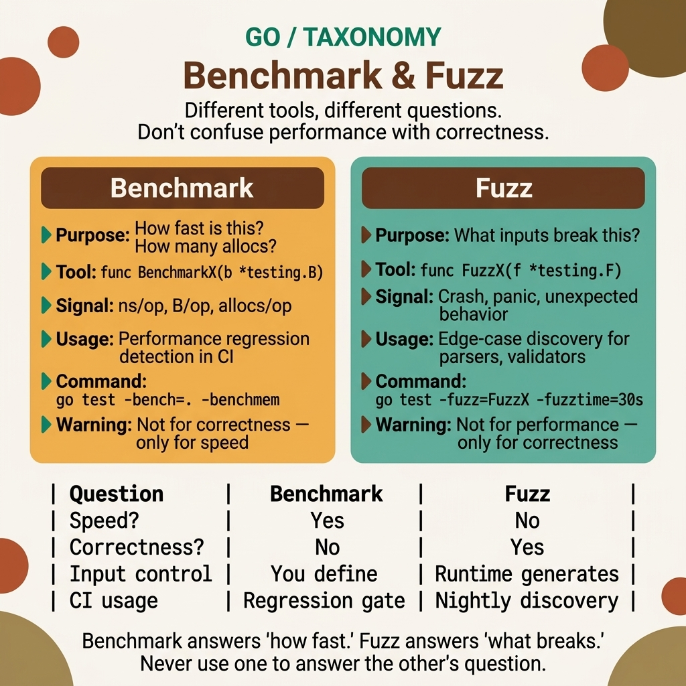

<!-- tags: golang, testing --> # 🏋️ Benchmark & Kiểm tra Fuzz — Go Kiểm tra ngoài các bài kiểm tra đơn vị

> Go được tích hợp sẵn benchmarks ( `b.N` , `b.Loop()` ) và fuzzing ( `f.Fuzz()` ) — không cần thư viện bên ngoài.

📅 Đã tạo: 23-03-2026 · 🔄 Đã cập nhật: 19-04-2026 · ⏱️ 12 phút đọc

| Khía cạnh | Chi tiết |
| --- | --- |
| **Khái niệm** | Benchmark , đo lường phân bổ, fuzzing , đột biến đầu vào theo định hướng khối liệu |
| **Trường hợp sử dụng** | Hiệu suất, phát hiện hồi quy, tăng cường trình phân tích cú pháp, phát hiện đầu vào không mong muốn |
| **Thông tin chi tiết quan trọng** | Kiểm tra tính đúng đắn là chưa đủ; benchmarks mới và fuzz hiển thị hiệu suất và trường hợp cạnh đầu vào |
| ** Go stdlib** | `testing` , `cmp` , `bytes` , `context` |

| TS/Jest | Go thử nghiệm |
| ---------------------- | -------------------------------------------- |
| `jest-bench` | `func BenchmarkX(b *testing.B)` (tích hợp sẵn) |
| Thử nghiệm dựa trên tài sản | `func FuzzX(f *testing.F)` (tích hợp, 1.18+) |
| `performance.now()` | `b.ResetTimer()` , `b.StopTimer()` |

---

## 1. ĐỊNH NGHĨA

"Tối ưu hóa điều này - nó chậm." Bạn đo bằng `time.Now()` trước và sau - kết quả dao động trong khoảng ±40%. Go có `testing.B` được tích hợp sẵn. Nó benchmarks đúng cách mà không cần thư viện của bên thứ ba, nhưng trình biên dịch có thể tối ưu hóa chức năng mục tiêu của bạn nếu bạn không cẩn thận.

> *"Tại sao API của tôi chậm?" Nhật ký hiển thị độ trễ p99 ở 800ms. Bài kiểm tra đơn vị vượt qua. Không có gì có vẻ bị hỏng. Vấn đề: kiểm thử đơn vị chỉ kiểm tra **tính chính xác** chứ không kiểm tra **hiệu suất**. Trước tiên, bạn thêm benchmark .*
>
> * Go có khung benchmark tích hợp sẵn — không cần thư viện. `BenchmarkXxx(b *testing.B)` chạy hàm `b.N` lần ( runtime điều chỉnh `N` để ổn định). `b.ReportAllocs()` báo cáo mức sử dụng bộ nhớ. `benchstat` so sánh hai lần chạy để phát hiện hồi quy. Fuzzing ( Go 1.18+) bao gồm lớp tiếp theo: độ ổn định đầu vào.*

### Benchmark vs Unit Test vs Fuzz

| Kỹ thuật | Mục đích | Khi nào nên chạy? | Đầu ra |
| --------------- | ------------------- | ----------------------------- | ------------------------------- |
| **Kiểm tra đơn vị** | Tính đúng đắn | `go test` | Đạt/Không đạt |
| ** Benchmark ** | Hiệu suất (ns/op) | `go test -bench .` | ns/op, B/op, phân bổ/op |
| ** Fuzz test ** | Trường hợp cạnh / sự cố | `go test -fuzz=FuzzXxx` | Sự cố đầu vào nếu tìm thấy lỗi |
| **Ví dụ** | Tài liệu | `go test` | Kết quả đầu ra khớp / Thất bại |

**Tại sao `b.Loop()` thay vì `for i := 0; i < b.N; i++` ?** `b.Loop()` ( Go 1.24+) xử lý việc đặt lại bộ hẹn giờ và điều chỉnh `b.N` bên trong — không cần [[C28]]] thủ công. Sạch hơn, ít xảy ra lỗi hơn. `for i := range b.N` ( Go 1.22+) là dạng trung gian tốt hơn, nhưng `b.Loop()` là dạng được ưa thích trong tương lai.

### Fuzz: Tìm lỗi mà bạn không nghĩ tới.

Kiểm thử fuzz dựa trên **kiểm tra thuộc tính**: thay vì khẳng định các kết quả cụ thể, bạn khẳng định **bất biến** — các thuộc tính phải luôn đúng cho tất cả dữ liệu đầu vào:

| Bất động sản | Ví dụ |
| ---------------- | ---------------------------------------------- |
| Khứ hồi | `decode(encode(x)) == x` |
| Bình thường | `f(f(x)) == f(x)` |
| Không có sự cố | Hàm không panic với đầu vào any |
| Chiều dài được bảo toàn | `len(transform(s)) == len(s)` |

**Tại sao fuzz lại hiệu quả hơn các trường hợp kiểm thử thủ công?** Các nhà phát triển viết trường hợp dựa trên những gì họ mong đợi. Bộ làm mờ tạo ra các đầu vào và đột biến ngẫu nhiên từ kho hạt giống — nó tìm ra các trường hợp đặc biệt mà bạn chưa từng tưởng tượng. `FuzzReverse` đã phát hiện lỗi Unicode mà không có bài kiểm tra viết tay nào được đề cập. Benchmark so với fuzz so với đơn vị - lý thuyết đủ rồi. Hãy cùng xem kim tự tháp thử nghiệm và quy trình làm việc benchmark trông như thế nào.

---
## 2. HÌNH ẢNH

Benchmarks và các bài kiểm tra fuzz thường được nhóm lại trong "thử nghiệm nâng cao". Thẻ phân loại bên dưới phân tách chúng theo mục đích, vì vậy bạn đừng nhầm lẫn benchmark (hiệu suất) với fuzz (mạnh mẽ) hoặc unit test (chính xác).  *Hình: Thẻ phân loại đặt các bài kiểm tra đơn vị, benchmarks , kiểm tra fuzz và các công cụ so sánh dưới dạng bốn lớp khác nhau trong cùng một hệ thống độ tin cậy: độ chính xác, hiệu suất, độ chắc chắn và phán đoán thống kê.*

Sau khi phân loại rõ ràng, đoạn mã bên dưới sẽ không giống như một chuyến tham quan công cụ. Mỗi ví dụ sẽ trả lời “loại rủi ro nào đang được kiểm soát?” trước khi nói về cờ hoặc lệnh cụ thể.

## 3. MÃ

Với ** Benchmark & Thử nghiệm Fuzz - Go Thử nghiệm ngoài các thử nghiệm đơn vị**, chúng tôi có một mô hình tinh thần về thử nghiệm hiệu suất và độ mạnh mẽ. Bây giờ chúng tôi neo nó vào mã để xem mỗi lựa chọn — sub- benchmark , theo dõi phân bổ, kho văn bản mờ — thay đổi kết quả kiểm tra và mức độ tin cậy như thế nào.

### Ví dụ 1: Cơ bản — Benchmarks .
> **Mục tiêu**: Đo lường hiệu suất của chức năng với benchmarks tích hợp sẵn, theo dõi phân bổ và phụ benchmarks .
> **Phương pháp tiếp cận**: Bắt đầu bằng một benchmark đơn giản, sau đó thêm loại trừ thiết lập và tham số phụ- benchmarks .
> **Ví dụ**: Nối chuỗi thông qua `+` so với `strings.Builder` — sub- benchmarks tiết lộ sự khác biệt về phân bổ.
> **Độ phức tạp**: O(1) cho mỗi thao tác; vòng lặp benchmark tự động chia tỷ lệ `b.N` .```go
package utils_test

import "testing"

// ━━━━━ Basic benchmark ━━━━━

func BenchmarkStringConcat(b *testing.B) {
	for b.Loop() { // Go 1.24+ — preferred
		_ = "hello" + " " + "world"
	}
}

func BenchmarkStringBuilder(b *testing.B) {
	for b.Loop() {
		var sb strings.Builder
		sb.WriteString("hello")
		sb.WriteString(" ")
		sb.WriteString("world")
		_ = sb.String()
	}
}

// ━━━━━ With setup (excluded from timing) ━━━━━

func BenchmarkDBQuery(b *testing.B) {
	db := setupTestDB() // setup — not timed
	b.ResetTimer()       // ✅ start timing from here

for b.Loop() {
		var users []User
		db.Find(&users)
	}
}

// ━━━━━ Sub-benchmarks (like table-driven tests) ━━━━━

func BenchmarkSort(b *testing.B) {
	sizes := []int{100, 1000, 10000}
	for _, size := range sizes {
		b.Run(fmt.Sprintf("size=%d", size), func(b *testing.B) {
			data := generateSlice(size)
			b.ResetTimer()
			for b.Loop() {
				slices.Sort(slices.Clone(data))
			}
		})
	}
}

// ━━━━━ Memory allocation tracking ━━━━━

func BenchmarkAllocs(b *testing.B) {
	b.ReportAllocs() // ✅ report allocs/op
	for b.Loop() {
		_ = fmt.Sprintf("user-%d", 42)
	}
}

// Run: go test -bench=. -benchmem -count=5
// Output:
// BenchmarkStringConcat-20    50000000   25.3 ns/op   48 B/op   2 allocs/op
// BenchmarkStringBuilder-20   80000000   18.1 ns/op   64 B/op   2 allocs/op
```> **Tại sao `b.ReportAllocs()` lại quan trọng?**
> `ns/op` chỉ đo time — không đo áp suất bộ nhớ. Hàm 10ns nhưng 3 phân bổ/op sẽ tạo ra áp suất GC trên quy mô lớn. `b.ReportAllocs()` report `B/op` (byte) và `allocs/op` — giúp phát hiện các phân bổ ẩn trong đường dẫn nóng.

> **Kết luận**: `b.Loop()` ( Go 1.24+) thay thế `for i := 0; i < b.N; i++` . Sub- benchmarks cho phép kiểm tra tham số hóa (size=100, size=1000). `-benchmem` hoặc `b.ReportAllocs()` theo dõi chi phí phân bổ. Benchmark đo hiệu suất bìa. Nhưng benchmarks chỉ là những trường hợp thử nghiệm mà bạn nghĩ ra. Kiểm thử fuzz tìm ra các lỗi mà bạn không nghĩ tới — bằng cách tạo đầu vào ngẫu nhiên từ kho dữ liệu gốc.

### Ví dụ 2: Trung cấp — Kiểm tra lông tơ ( Go 1.18+).
> **Mục tiêu**: Tìm các trường hợp đặc biệt và sự cố với fuzz testing — xác nhận dựa trên thuộc tính trên dữ liệu đầu vào ngẫu nhiên.
> **Phương pháp tiếp cận**: Xác định kho dữ liệu gốc, sau đó xác nhận các bất biến (khứ hồi, bảo toàn độ dài, không panic ).
> **Ví dụ**: `FuzzReverse` xác minh rằng việc đảo ngược hai lần một chuỗi sẽ trả về chuỗi gốc. `FuzzJSONParse` xác minh rằng phân tích cú pháp thành công có nghĩa là sắp xếp lại thành công.
> **Độ phức tạp**: O(1) mỗi lần lặp; bộ làm mờ tạo ra hàng nghìn đầu vào từ kho hạt giống.```go
package utils_test

import (
	"testing"
	"unicode/utf8"
)

// ━━━━━ Basic fuzz test ━━━━━

func FuzzReverse(f *testing.F) {
	// Seed corpus — starting inputs
	f.Add("hello")
	f.Add("世界")
	f.Add("")
	f.Add("!@#$%")

// ✅ Fuzz function — Go generates random inputs
	f.Fuzz(func(t *testing.T, input string) {
		result := Reverse(input)

// Property 1: double-reverse = original
		if Reverse(result) != input {
			t.Errorf("double reverse failed: %q", input)
		}

// Property 2: same length
		if utf8.RuneCountInString(result) != utf8.RuneCountInString(input) {
			t.Errorf("length mismatch: %q → %q", input, result)
		}
	})
}

// Run:
// go test -fuzz=FuzzReverse -fuzztime=30s

// ━━━━━ Fuzz JSON parsing ━━━━━

func FuzzJSONParse(f *testing.F) {
	f.Add([]byte(`{"name":"alice"}`))
	f.Add([]byte(`{}`))
	f.Add([]byte(`null`))

f.Fuzz(func(t *testing.T, data []byte) {
		var result map[string]any
		err := json.Unmarshal(data, &result)

if err == nil {
			// If parse succeeds, re-marshal must also succeed
			_, err2 := json.Marshal(result)
			if err2 != nil {
				t.Errorf("marshal failed after unmarshal: %v", err2)
			}
		}
		// If err != nil, input is invalid JSON — that's OK
	})
}
```> **Tại sao xác nhận dựa trên thuộc tính thay vì dựa trên kết quả?**
> Bộ làm mờ tạo ra đầu vào ngẫu nhiên — bạn không biết trước đầu vào nên không thể xác nhận kết quả cụ thể. Thay vào đó, hãy khẳng định **bất biến**: `decode(encode(x)) == x` , `len(transform(s)) == len(s)` hoặc đơn giản là "không panic ". Thuộc tính phải giữ cho tất cả các đầu vào.

> **Kết luận**: Kho hạt giống lông tơ cung cấp điểm khởi đầu. Bộ làm mờ Go biến đổi từ đầu vào gốc để tìm sự cố. Kết quả được lưu trữ trong `testdata/fuzz/` — đưa chúng vào kho lưu trữ để sao chép CI. `-fuzztime=30s` giới hạn CI runtime . Benchmark và độ bền cũng như độ bền của lớp phủ lông tơ. Nhưng một lần chạy benchmark là không đủ — các kết quả có sự khác biệt giữa việc điều tiết CPU, thời gian GC và lập lịch hệ điều hành. Bạn cần chạy nhiều lần và so sánh thống kê. Đó là nơi `benchstat` đi vào.

### Ví dụ 3: Nâng cao — So sánh kết quả Benchmark .
> **Mục tiêu**: So sánh kết quả benchmark qua các thay đổi mã với ý nghĩa thống kê.
> **Cách tiếp cận**: Chạy benchmarks với `-count=10` , lưu kết quả, thực hiện thay đổi, chạy lại và so sánh với `benchstat` .
> **Ví dụ**: `benchstat old.txt new.txt` cho thấy mức cải thiện 28% ở `StringConcat` với giá trị p dưới 0,05.
> **Độ phức tạp**: O(1) cho mỗi lần so sánh; `benchstat` xử lý số liệu thống kê.```bash
# Install benchstat
go install golang.org/x/perf/cmd/benchstat@latest

# Run benchmarks, save results
go test -bench=. -count=10 > old.txt

# Make changes, re-run
go test -bench=. -count=10 > new.txt

# Compare
benchstat old.txt new.txt
# Output:
# name           old time/op  new time/op  delta
# StringConcat   25.3ns       18.1ns       -28.46%
```> **Tại sao `-count=10` khi so sánh benchmarks ?**
> Kết quả Benchmark có sự khác biệt so với việc điều chỉnh CPU, thời gian GC và lập kế hoạch cho hệ điều hành. `-count=10` chạy 10 lần — `benchstat` tính giá trị trung bình và khoảng tin cậy. Nếu `p < 0.05` , thay đổi là một sự hồi quy hoặc cải thiện thực sự, không phải tiếng ồn.

> **Kết luận**: `benchstat` so sánh benchmark các lần chạy có ý nghĩa thống kê. Sử dụng nó trong CI: nhánh cơ sở và nhánh PR. `-count≥5` đưa ra một so sánh đáng tin cậy.

Bây giờ bạn đã biết benchmark , fuzz và `benchstat` . Phần nguy hiểm nhất vẫn còn: trình biên dịch có thể tối ưu hóa các kết quả benchmark - cái bẫy được gieo ở đầu bài viết này tạo ra đầu ra `0 ns/op` vô nghĩa.

---

## 4. Cạm bẫy

Cơ chế của ** Benchmark & Fuzz testing** rất rõ ràng. Điều còn lại là nhận ra những điểm mà mã gần như chính xác tạo ra kết quả benchmark sai lệch.

| # | Mức độ nghiêm trọng | Lỗi | Hậu quả | Sửa chữa |
|---|----------|------|----------|------|
| 1 | 🔴 Gây tử vong | Trình biên dịch tối ưu hóa kết quả | `0 ns/op` — vô nghĩa benchmark | Gán kết quả cho `var sink T` package -level |
| 2 | 🟡 Chung | Thiết lập có trong benchmark | Đo thiết lập time thay vì mã mục tiêu | `b.ResetTimer()` sau khi thiết lập hoặc `b.StopTimer()` / `b.StartTimer()` |
| 3 | 🟡 Chung | Fuzz chạy mãi mãi trong CI | CI pipeline hết thời gian chờ/treo | `-fuzztime=30s` giới hạn time , `-fuzzminimizetime=10s` |
| 4 | 🟡 Chung | `for i := 0; i < b.N; i++` (kiểu cũ) | Vấn đề về hẹn giờ, dài dòng | `for b.Loop()` ( Go 1.24+) hoặc `for range b.N` ( Go 1.22+) |
| 5 | 🔵 Nhỏ | Benchmark không sử dụng `-count` | Chạy một lần = dữ liệu không đáng tin cậy | `-count=5` tối thiểu, `benchstat` để so sánh |

### 🔴 Cạm bẫy #1 — Trình biên dịch tối ưu hóa benchmark Trình biên dịch Go tìm thấy kết quả không được sử dụng và loại bỏ hoàn toàn lệnh gọi hàm - `0 ns/op` . Cách khắc phục: gán kết quả cho package -level `var sink T` . Trình biên dịch không thể tối ưu hóa nó vì biến hiển thị bên ngoài phạm vi hàm.```go
var sink int // package-level
func BenchmarkFib(b *testing.B) {
    for b.Loop() {
        sink = Fib(20) // compiler keeps it because sink is package-level
    }
}
```Bạn đã trải qua các bẫy benchmark , fuzz, Benchstat và tối ưu hóa trình biên dịch. Các tài nguyên dưới đây giúp đi sâu hơn.

---

## 5. GIỚI THIỆU

| Tài nguyên | Loại | Liên kết | Lưu ý |
| ------------- | -------- | ------------------------------------------------------------------------------------------------ | ------- |
| Go Benchmarks | Chính thức | [pkg.go.dev/testing#hdr-Benchmarks](https://pkg.go.dev/testing#hdr-Benchmarks) | API benchmark tích hợp |
| Go Fuzzing | Chính thức | [go.dev/doc/security/fuzz](https://go.dev/doc/security/fuzz/) | Hướng dẫn kiểm tra fuzz ( Go 1.18+) |
| băng ghế dự bị | Công cụ | [pkg.go.dev/golang.org/x/perf/cmd/benchstat](https://pkg.go.dev/golang.org/x/perf/cmd/benchstat) | So sánh thống kê benchmark |
| đề xuất b.Loop() | Chính thức | [go.dev/blog/benchmarkloop](https://go.dev/blog/benchmarkloop) | Vòng lặp Go 1.24 benchmark |

---

## 6. KHUYẾN NGHỊ

Cốt lõi của ** Benchmark & Fuzz testing** rất rõ ràng. Các nhánh bên dưới mở rộng thử nghiệm hiệu suất vào sản xuất bằng tính năng lập hồ sơ, thử nghiệm dựa trên thuộc tính và phát hiện hồi quy.

| Gia hạn | Khi nào | Lý do | Tệp/Liên kết |
| ------- | ------- | ----- | --------- |
| hồ sơ pprof | Sau benchmark xác định chức năng chậm | Phân bổ từng dòng + phân tích CPU | [../../advanced/05-performance-pprof.md](../../advanced/05-performance-pprof.md) |
| Kiểm tra tích hợp | Kiểm tra DB/Redis/Kafka thực | Đơn vị ngoài + benchmark — phụ thuộc thực sự | [03-integration-testcontainers.md](./03-integration-testcontainers.md) |
| Thử nghiệm dựa trên tài sản | Logic kinh doanh phức tạp | Bổ sung fuzz với các thuộc tính kiểu giả thuyết | [github.com/flyingmutant/rapid](https://github.com/flyingmutant/rapid) |
| Hồi quy CI benchmark | cổng thực hiện PR | Tự động phát hiện hồi quy hiệu suất | `benchstat` trong Hành động GitHub |

---

**Điều hướng**: [← Table-driven Tests](./01-table-driven-mocking.md) · [→ Integration Tests](./03-integration-testcontainers.md)