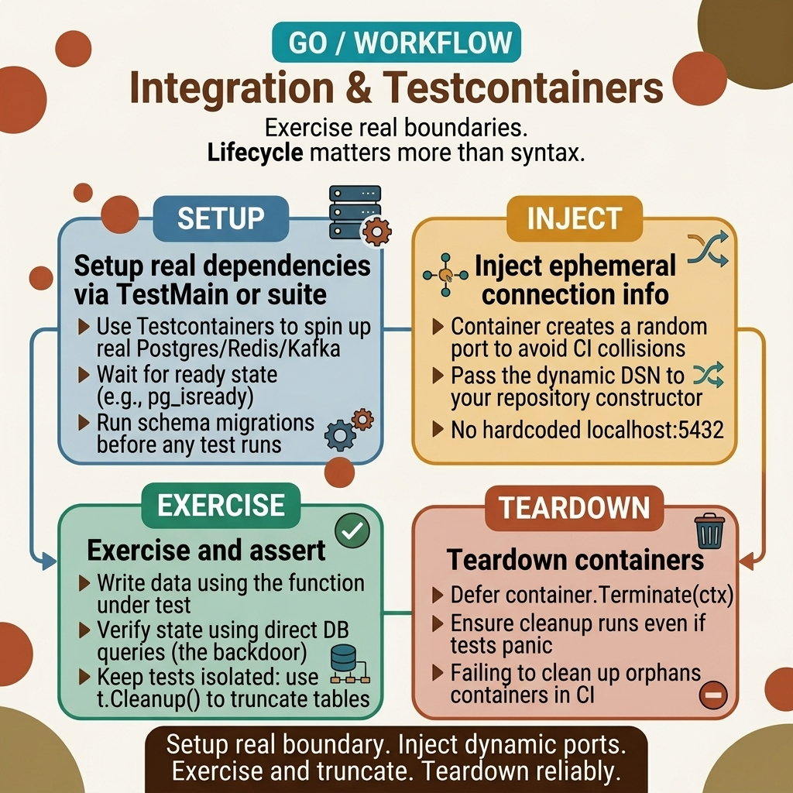

<!-- tags: golang, testing --> # 🐳 Kiểm thử tích hợp — Testcontainers , httptest, sqlmock

> thử nghiệm tích hợp Go : vùng chứa thực ( testcontainers -go), thử nghiệm HTTP (httptest), DB mocking (sqlmock).

📅 Đã tạo: 23-03-2026 · 🔄 Đã cập nhật: 19-04-2026 · ⏱️ 18 phút đọc

| Khía cạnh | Chi tiết |
| --------------- | ------------------------------------------------------------------ |
| **Phạm vi** | Kiểm tra tích hợp - phụ thuộc thực sự (DB, bộ đệm, nhà môi giới) |
| **Công cụ** | `testcontainers-go` , `net/http/httptest` , `sqlmock` |
| **Phân biệt** | Kiểm tra đơn vị = mock ; Tích hợp = container thực |
| ** Go packages ** | `github.com/testcontainers/testcontainers-go` |

---

## 1. ĐỊNH NGHĨA

Đạt bài kiểm tra đơn vị, CI màu xanh lá cây. Triển khai dàn dựng — API trả 500. Lý do: truy vấn sử dụng cú pháp dành riêng cho PostgreSQL mà sqlmock không nắm bắt được, `httptest.Server` không kiểm tra đàm phán TLS và dữ liệu kiểm tra factory không tái tạo sản xuất.

> *Bài kiểm tra đơn vị đã đạt 100%, độ bao phủ 90%. Triển khai theo giai đoạn — dịch vụ gặp sự cố trong lệnh gọi DB đầu tiên. PostgreSQL đưa ra vi phạm ràng buộc duy nhất nhưng mock trả về `nil` . Bạn đã kiểm tra logic nhưng chưa kiểm tra **tích hợp**. Sửa lỗi nóng:
>
> *Thử nghiệm tích hợp giải quyết khoảng trống này: chạy DB, Redis, Kafka thực trong các vùng chứa Docker biệt lập. `testcontainers-go` quay vùng chứa PostgreSQL trong 2-3 giây, chạy SQL thực, sau đó hủy. Mỗi bộ thử nghiệm nhận được database mới —.

**Thử nghiệm tích hợp** Kiểm tra sự tương tác giữa các thành phần thực: dịch vụ gọi DB thực, bộ đệm thực, nhà môi giới thực. Không giống như kiểm thử đơn vị (hoàn toàn mô phỏng), kiểm thử tích hợp **chạy các phần phụ thuộc thực sự** trong vùng chứa Docker riêng biệt cho mỗi bộ kiểm thử.

### Unit Test vs Integration Test vs E2E

| Loại | Phụ thuộc | Tốc độ | Điều gì đã được phát hiện? | Công cụ Go |
| ----------------- | -------------- | ------- | -------------------------------- | -------------------------- |
| ** Unit Test ** | Hoàn toàn bị chế nhạo | ⚡ ms | Lỗi logic trong hàm | `testing` , `testify` |
| **Tích hợp** | Real (Docker) | 🐢s | Lỗi tương tác DB/cache/broker | `testcontainers-go` |
| **E2E** | Toàn bộ hệ thống | 🐌 phút | Luồng người dùng thực tế | `playwright-go` , Người đưa thư |

### Các mẫu chính

| Mẫu | Mô tả | Khi sử dụng |
| ----------------------------- | ------------------------------------------------------------------- | ----------------------------- |
| **httptest.Recorder** | Kiểm tra trình xử lý HTTP mà không cần khởi động máy chủ | Trình xử lý kiểm thử, phần mềm trung gian |
| **httptest.Server** | Kiểm tra mã máy khách HTTP với máy chủ thực | Kiểm tra ứng dụng khách HTTP, webhook |
| ** Testcontainers PostgreSQL** | PostgreSQL thực trong Docker mỗi bài kiểm tra | Kiểm tra lớp kho lưu trữ |
| ** Testcontainers Redis** | Real Redis trong Docker mỗi lần kiểm tra | Kiểm tra lớp bộ đệm |
| **sqlmock** | Mock `database/sql` interface (không cần Docker) | Khi Docker không có sẵn |

### Chế độ lỗi

| Thất bại | Hậu quả | Làm thế nào để tránh |
| ---------------------------- | ----------------------------------------- | ------------------------------------------------- |
| Docker không chạy | Kiểm tra thất bại "Không thể kết nối với daemon" | Thẻ `//go:build integration` để bỏ qua cục bộ |
| Xung đột cảng | Cổng liên kết container bị chiếm | Sử dụng `MappedPort()` — cổng khả dụng ngẫu nhiên |
| Không dọn dẹp container | Rò rỉ container, hết dung lượng ổ đĩa | `t.Cleanup(func() { container.Terminate(ctx) })` |
| Trạng thái DB được chia sẻ giữa các lần kiểm tra | Kiểm tra không ổn định, phụ thuộc đặt hàng | Mỗi thử nghiệm sử dụng database riêng hoặc khôi phục giao dịch |
| CI chậm | CI pipeline > 10 phút | Chạy thử nghiệm đơn vị và tích hợp riêng biệt |

Đơn vị, tích hợp và E2E, kiểu mẫu, chế độ lỗi - lý thuyết là đủ. Hãy cùng xem kim tự tháp thử nghiệm và vòng đời testcontainers trông như thế nào.

---
## 2. HÌNH ẢNH

Trong thử nghiệm tích hợp, hình ảnh phải tuân theo vòng đời và không thể chỉ tóm tắt tên công cụ. Điều người đọc cần nhớ là thứ tự mà ranh giới được đưa lên, thực hiện và sau đó được phá bỏ.  *Hình: Quy trình làm việc map bắt đầu từ việc chọn đúng ranh giới ( `httptest` hoặc phần phụ thuộc được chứa trong vùng chứa), đi đến thiết lập và sẵn sàng, sau đó chạy các tương tác thực và kết thúc bằng việc dọn dẹp để ngăn chặn tình trạng không ổn định.*

Khi vòng đời này được thực hiện, mã bên dưới sẽ có khoản thanh toán. Bạn sẽ thấy mỗi ví dụ là một luồng thực thi hoàn chỉnh chứ không chỉ là một số công thức công cụ riêng biệt.

## 3. MÃ

Với **Thử nghiệm tích hợp — Testcontainers , httptest, sqlmock**, chúng tôi có quyết định map . Bây giờ hãy hạ nó xuống mã để xem từng lựa chọn như thế nào - testcontainer hoặc mock , httptest hoặc máy chủ thực, sqlmock hoặc test database .

### Ví dụ 1: Cơ bản — httptest — Kiểm tra trình xử lý HTTP.
> **Mục tiêu**: Kiểm tra trình xử lý HTTP trong bộ nhớ mà không cần máy chủ hoặc mạng thực stack .
> **Phương pháp tiếp cận**: `httptest.NewRequest` + `httptest.NewRecorder` + `handler.ServeHTTP()` = hoàn thành chu trình yêu cầu/phản hồi trong bộ nhớ.
> **Ví dụ**: `TestCreateUser_HTTP` gửi yêu cầu POST và xác nhận nội dung phản hồi HTTP 201 +.
> **Độ phức tạp**: O(1) cho mỗi yêu cầu; phí TCP bằng không.```go
package handler_test

import (
	"net/http"
	"net/http/httptest"
	"strings"
	"testing"

"github.com/stretchr/testify/assert"
)

func TestCreateUser_HTTP(t *testing.T) {
	app := setupApp() // wire real or mock dependencies

body := `{"name":"Alice","email":"alice@test.com"}`
	req := httptest.NewRequest(http.MethodPost, "/api/users", strings.NewReader(body))
	req.Header.Set("Content-Type", "application/json")

rec := httptest.NewRecorder()
	app.ServeHTTP(rec, req) // or app.Test(req) for Fiber

assert.Equal(t, 201, rec.Code)
	assert.Contains(t, rec.Body.String(), "Alice")
}
```> **Tại sao `httptest` không cần máy chủ thực sự?**
> `httptest.NewRecorder()` thực hiện `http.ResponseWriter` interface — trình xử lý ghi phản hồi vào máy ghi thay vì mạng. Không có chi phí TCP, không xung đột cổng. Kiểm tra logic xử lý trực tiếp, không qua mạng stack .

> **Kết luận**: `httptest` cung cấp thử nghiệm ở cấp độ trình xử lý — nhanh, tách biệt, không cần Docker. `NewRequest` + `NewRecorder` + `handler.ServeHTTP()` = hoàn thành chu kỳ yêu cầu/phản hồi trong bộ nhớ.

Thử nghiệm trình xử lý bìa httptest mà không cần Docker. Nhưng khi nói đến việc kiểm tra các truy vấn SQL thực sự - các ràng buộc duy nhất, khóa ngoại, chỉ mục - mock là không đủ. Cần PostgreSQL thực sự trong Docker.

### Ví dụ 2: Trung cấp — Testcontainers — PostgreSQL thực.
> **Mục tiêu**: Kiểm tra lớp kho lưu trữ dựa trên phiên bản PostgreSQL thực đang chạy trong Docker.
> **Phương pháp tiếp cận**: `testcontainers-go` quay một vùng chứa PostgreSQL, chạy SQL thực, sau đó hủy nó. Mỗi bài kiểm tra nhận được một database mới.
> **Ví dụ**: `TestUserRepo_Create` chèn một người dùng, sau đó đọc lại từ database thực.
> **Độ phức tạp**: ~2-3 giây khi khởi động vùng chứa; O(1) cho mỗi truy vấn.```go
package repo_test

import (
	"context"
	"testing"

"github.com/stretchr/testify/assert"
	"github.com/testcontainers/testcontainers-go"
	"github.com/testcontainers/testcontainers-go/modules/postgres"
	"github.com/testcontainers/testcontainers-go/wait"
	"gorm.io/driver/postgres"
	"gorm.io/gorm"
)

func setupPostgres(t *testing.T) *gorm.DB {
	ctx := context.Background()

// ✅ Real PostgreSQL in Docker
	container, err := postgres.Run(ctx, "postgres:16",
		postgres.WithDatabase("testdb"),
		postgres.WithUsername("test"),
		postgres.WithPassword("test"),
		testcontainers.WithWaitStrategy(
			wait.ForLog("database system is ready to accept connections").
				WithOccurrence(2),
		),
	)
	assert.NoError(t, err)
	t.Cleanup(func() { container.Terminate(ctx) })

connStr, _ := container.ConnectionString(ctx, "sslmode=disable")
	db, err := gorm.Open(postgres.Open(connStr), &gorm.Config{})
	assert.NoError(t, err)

db.AutoMigrate(&User{})
	return db
}

func TestUserRepo_Create(t *testing.T) {
	db := setupPostgres(t)
	repo := NewUserRepo(db)

user := &User{Name: "Alice", Email: "alice@test.com"}
	err := repo.Create(context.Background(), user)

assert.NoError(t, err)
	assert.NotZero(t, user.ID)

// ✅ Verify in real DB
	found, err := repo.FindByID(context.Background(), user.ID)
	assert.NoError(t, err)
	assert.Equal(t, "Alice", found.Name)
}
```> **Tại sao `WithOccurrence(2)` khi chờ PostgreSQL?**
> Nhật ký PostgreSQL " Hệ thống database sẵn sàng chấp nhận kết nối" **hai lần**: lần đầu tiên khi init, lần thứ hai khi sẵn sàng kết nối. Đợi lần xuất hiện đầu tiên → vùng chứa chưa thực sự sẵn sàng → kết nối bị từ chối.

> **Kết luận**: `testcontainers-go` modules (postgres, redis) cung cấp các vùng chứa được định cấu hình sẵn. `t.Cleanup()` đảm bảo container bị phá hủy sau khi thử nghiệm. `MappedPort()` trả về một cổng ngẫu nhiên - không có xung đột cổng.

PostgreSQL bao gồm kiểm tra SQL. Nhưng khi bạn cần kiểm tra lớp bộ nhớ đệm — Redis TTL, trục xuất, truy cập đồng thời — bạn cần Redis thực sự. Mẫu tương tự, nhưng sử dụng `GenericContainer` cho hình ảnh Docker any .

### Ví dụ 3: Nâng cao — Testcontainers — Redis.
> **Mục tiêu**: Kiểm tra lớp bộ đệm dựa trên phiên bản Redis thực bằng cách sử dụng `GenericContainer` .
> **Phương pháp tiếp cận**: `GenericContainer` hoạt động với hình ảnh Docker any . Không cần module chuyên dụng - chỉ định hình ảnh, cổng hiển thị và nhật ký sẵn sàng.
> **Ví dụ**: `setupRedis` khởi động vùng chứa Redis, trích xuất máy chủ/cổng động và trả về `redis.Client` được kết nối.
> **Độ phức tạp**: ~1-2 giây khi khởi động vùng chứa; O(1) cho mỗi thao tác.```go
func setupRedis(t *testing.T) *redis.Client {
	ctx := context.Background()

container, err := testcontainers.GenericContainer(ctx, testcontainers.GenericContainerRequest{
		ContainerRequest: testcontainers.ContainerRequest{
			Image:        "redis:7-alpine",
			ExposedPorts: []string{"6379/tcp"},
			WaitingFor:   wait.ForLog("Ready to accept connections"),
		},
		Started: true,
	})
	assert.NoError(t, err)
	t.Cleanup(func() { container.Terminate(ctx) })

host, _ := container.Host(ctx)
	port, _ := container.MappedPort(ctx, "6379")

return redis.NewClient(&redis.Options{
		Addr: fmt.Sprintf("%s:%s", host, port.Port()),
	})
}
```> **Tại sao Redis sử dụng `GenericContainer` thay vì modules ?**
> `testcontainers-go` có modules cho PostgreSQL, MySQL, MongoDB — nhưng Redis module đơn giản hơn nên hãy sử dụng `GenericContainer` để minh họa mẫu chung. Any Hình ảnh Docker có thể được sử dụng với `GenericContainer` .

> **Kết luận**: `GenericContainer` hoạt động với hình ảnh Docker any . `MappedPort()` xử lý việc phân bổ cổng động. Mẫu tương tự cũng áp dụng cho phần phụ thuộc Kafka, RabbitMQ, Elaticsearch - any với hình ảnh Docker.

Bạn đã biết httptest, PostgreSQL testcontainers và Redis. Bây giờ đến phần nguy hiểm: rò rỉ container và trạng thái DB dùng chung - hai cái bẫy đã được thiết lập từ đầu bài viết.

---

## 4. Cạm bẫy

Cơ chế chính xác của **Thử nghiệm tích hợp — Testcontainers , httptest, sqlmock** rất rõ ràng. Việc còn lại là nhận ra những chỗ dễ viết _xấp xỉ_ rồi đưa ra các bài kiểm tra tích hợp không ổn định hoặc xung đột cổng.

| # | Mức độ nghiêm trọng | Lỗi | Hậu quả | Sửa chữa |
|---|----------|------|----------|------|
| 1 | 🔴 Gây tử vong | Thiếu `t.Cleanup()` cho vùng chứa | Rò rỉ vùng chứa → hết dung lượng ổ đĩa, cạn kiệt cổng | `t.Cleanup(func() { container.Terminate(ctx) })` ngay sau khi bắt đầu |
| 2 | 🔴 Gây tử vong | Trạng thái DB được chia sẻ giữa các lần kiểm tra | Kiểm tra không ổn định, thất bại phụ thuộc vào thứ tự | Mỗi thử nghiệm sử dụng DB mới hoặc khôi phục giao dịch |
| 3 | 🟡 Chung | Docker không chạy | "Không thể kết nối với daemon Docker" | thẻ `//go:build integration` + bỏ qua khi Docker không khả dụng |
| 4 | 🟡 Chung | Cổng được mã hóa cứng thay vì `MappedPort()` | Xung đột cổng trong các thử nghiệm song song | Luôn sử dụng `container.MappedPort()` cho cổng động |
| 5 | 🟡 Chung | Kiểm thử tích hợp chạy cùng với kiểm thử đơn vị | CI chậm gấp 10 lần | Thẻ xây dựng riêng biệt: `go test -tags=integration ./...` |
| 6 | 🔵 Nhỏ | Thời gian chờ khởi động vùng chứa quá ngắn | Không ổn định trên các trình chạy CI chậm | Tăng `WithStartupTimeout(60 * time.Second)` |

### 🔴 Cạm bẫy #1 — Rò rỉ container = cạn kiệt tài nguyên

Quên `t.Cleanup()` → vùng chứa không bị chấm dứt sau khi kiểm tra → tích lũy đĩa, bộ nhớ, cổng. Chạy bộ thử nghiệm 100 lần → 100 vùng chứa. Trình chạy CI hết đĩa và cổng → pipeline không thành công. Luôn gọi `t.Cleanup(func() { container.Terminate(ctx) })` ngay sau khi khởi động vùng chứa.

### 🔴 Cạm bẫy #2 — Trạng thái DB dùng chung = Kiểm tra không ổn định

Kiểm tra A chèn dữ liệu, kiểm tra B đọc dữ liệu của A → đạt. Thay đổi thứ tự → thất bại. Mỗi thử nghiệm cần có trạng thái mới: `t.Cleanup` cắt bớt các bảng hoặc mỗi thử nghiệm sử dụng khôi phục giao dịch ( `go-txdb` ).

Bạn đã gặp phải các cạm bẫy httptest, testcontainers và cạn kiệt tài nguyên. Các tài nguyên dưới đây giúp đi sâu hơn.

---

## 5. GIỚI THIỆU

| Tài nguyên | Loại | Liên kết | Lưu ý |
| ----------------- | -------- | ----------------------------------------------------------------------------------- | ------- |
| testcontainers -go | Thư viện | [golang.testcontainers.org](https://golang.testcontainers.org/) | Bộ chứa Docker cho các bài kiểm tra Go |
| httptest | Chính thức | [pkg.go.dev/net/http/httptest](https://pkg.go.dev/net/http/httptest) | Kiểm tra HTTP trong bộ nhớ |
| sqlmock | Thư viện | [github.com/DATA-DOG/go-sqlmock](https://github.com/DATA-DOG/go-sqlmock) | Mock database /sql không có Docker |
| go-txdb | Thư viện | [github.com/DATA-DOG/go-txdb](https://github.com/DATA-DOG/go-txdb) | Cách ly giao dịch trên mỗi thử nghiệm |

---

## 6. KHUYẾN NGHỊ

Phần cốt lõi của **Thử nghiệm tích hợp — Testcontainers , httptest, sqlmock** rất rõ ràng. Các nhánh tiện ích mở rộng bên dưới giúp bạn đưa thử nghiệm tích hợp vào sản xuất với tính năng cách ly thử nghiệm, Kafka/Mongo modules và tối ưu hóa CI.

| Gia hạn | Khi nào | Lý do | Tệp/Liên kết |
| ------- | ------- | ----- | --------- |
| Điều khiển theo bảng + mocking | Lớp kiểm tra đơn vị | Bổ sung các bài kiểm tra tích hợp | [01-table-driven-mocking.md](./01-table-driven-mocking.md) |
| Benchmark & Lông tơ | Kiểm tra hiệu suất | Đo hiệu suất truy vấn trên DB thực | [02-benchmark-fuzz.md](./02-benchmark-fuzz.md) |
| go-txdb | Kiểm tra cách ly | Mỗi thử nghiệm chạy trong một giao dịch được khôi phục — nhanh hơn một vùng chứa cho mỗi thử nghiệm | [github.com/DATA-DOG/go-txdb](https://github.com/DATA-DOG/go-txdb) |
| Testcontainers modules | Kafka, MongoDB, v.v. | Vùng chứa được cấu hình sẵn cho các dịch vụ phổ biến | [golang.testcontainers.org/modules](https://golang.testcontainers.org/modules/) |

---

**Điều hướng**: [← Benchmark & Fuzz](./02-benchmark-fuzz.md) · [→ Interfaces](../interfaces/01-implicit-io-patterns.md)