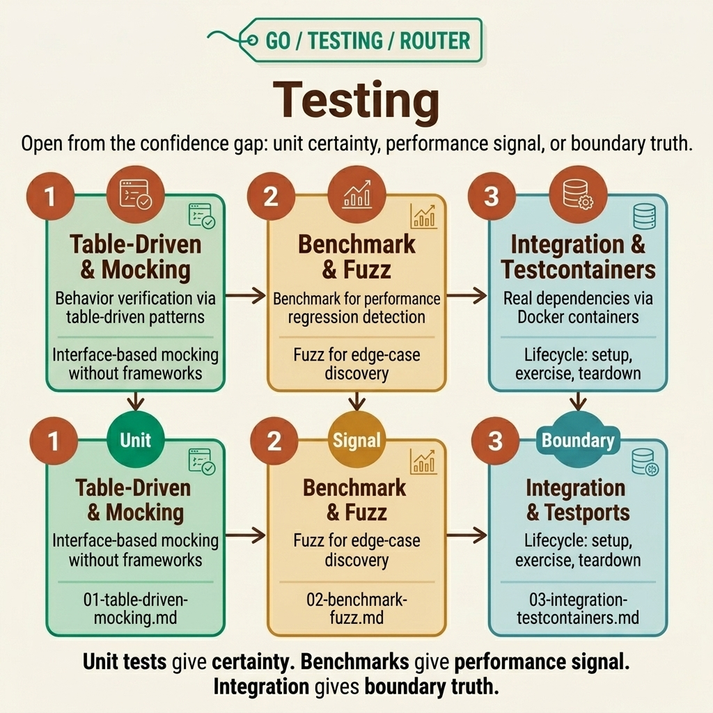

<!-- tags: golang, overview -->
# Testing — Table-driven, benchmark, fuzz, integration

> Go testing: table-driven tests, mocking, benchmarks, fuzz testing, testcontainers.

📅 Updated: 2026-04-19 · ⏱️ 6 min read

## 1. DEFINE

Go testing doesn't require a framework: `go test ./...` runs any `_test.go` file. This cluster covers 3 layers of testing: table-driven unit tests, benchmarks + fuzz, and integration tests with real containers.

This hub does not exist to list files. It exists to help you choose the right entrance to `fundamental/testing`: where to start, which articles to read together, and when you encounter real symptoms, which lane.

### 1.1 Signals & Boundaries

- Open this hub when you know you're in the `fundamental/testing` cluster but aren't sure which article to read first.
- The focus of the hub is to map pain points to the correct document, not to replace each detail.
- If you keep jumping between articles and still feel confused, the issue is usually choosing the wrong opening lane — not a lack of content.

### 1.2 Learning Lanes

- `Testing — Table-driven, Benchmarks, Mocking` is the natural entry point if you want to have a strong grip before diving in.
- `Benchmark & Fuzz Testing — Go Testing Beyond Unit Tests` is more suitable when you need to bridge to the next layer or expand from unit testing to production-level concerns.
- Use this hub as a navigation map: after reading one article, go back to the next point with purpose.

## 2. VISUAL

Lane `testing` is only useful when you open it from a specific confidence gap: lack of unit-level certainty, lack of performance signal, or lack of boundary truth with real dependencies. The router map below divides the cluster into actionable lanes.



*Figure: Router map of `testing` divides the cluster into three main branches: table-driven plus mocking for behavior and seams, benchmark plus fuzz for performance and robustness, and integration plus testcontainers for real dependency lifecycle.*

Once the confidence gap is properly named, the underlying pseudo-router does its job: navigate to the appropriate lane instead of turning the hub into a flat, difficult-to-use tool list.

## 3. CODE

Router map shows directions with pictures. The pseudo-code below compresses that navigation logic into an artifact for the team.

### Example 1: Router artifact — select articles by reading goal

> **Objective**: Turn this hub into a navigation tool instead of a passive link panel.
> **Approach**: Map learning goals or symptoms to the correct opening file.
> **Example**: Choose lanes by concern — fundamentals, performance, or real dependencies.
> **Complexity**: O(1) at navigation level; the important part is choosing the right entrance.

```text
func chooseLane(goal string) string {
    switch goal {
    case "table driven mocking": return "./01-table-driven-mocking.md"
    case "benchmark fuzz": return "./02-benchmark-fuzz.md"
    case "integration testcontainers": return "./03-integration-testcontainers.md"
    default: return "./README.md"
    }
}
```

This pseudo-router is not code to run in the app; it compresses the hub’s navigational spirit into a concise artifact. Reading the hub in this spirit helps you choose effective entry points.

## 4. PITFALLS

The navigation hub is valuable when used correctly — not by skimming and jumping to the hardest lesson.

| # | Severity | Error | Consequence | Fix |
| --- | --- | --- | --- | --- |
| 1 | 🔴 Fatal | Use the hub as a list of links to surf | Learning is fragmentary and choosing the wrong entry point | Always start from a pain point or specific learning goal |
| 2 | 🟡 Common | Jump straight into a deep article without the base lane | Understanding becomes fragmentary and easy to misapply | Choose an entry point first, then follow the cluster rhythm |
| 3 | 🔵 Minor | After reading, do not return to the hub | Lost rhythm and connection between articles | Return to the hub after each lane to choose the next step |

## 5. REF

| Resource | Type | Link | Note |
| --- | --- | --- | --- |
| `testing` package | Official | https://pkg.go.dev/testing | Standard API for unit tests, benchmarks, fuzz, examples |
| TableDrivenTests | Official | https://go.dev/wiki/TableDrivenTests | The most popular Go-idiomatic pattern for data-matrix testing |
| Go Fuzzing | Official | https://go.dev/doc/security/fuzz/ | Official entry point for fuzzing and hardening input |

## 6. RECOMMEND

Have you seen where **Testing — Table-driven, benchmark, fuzz, integration** stands in the larger flow? RECOMMEND below helps connect it to the closest documents.

| Extend | When should I continue reading? | Reason | File/Link |
| --- | --- | --- | --- |
| Testing — Table-driven, Benchmarks, Mocking | When you need a clear entry point | Keep a seamless reading rhythm within the same cluster | [./01-table-driven-mocking.md](./01-table-driven-mocking.md) |
| Benchmark & Fuzz Testing — Go Testing Beyond Unit Tests | When you want to connect to the next lane | Keep a seamless reading rhythm within the same cluster | [./02-benchmark-fuzz.md](./02-benchmark-fuzz.md) |
| Integration Testing — Testcontainers, `httptest`, `sqlmock` | When unit-level confidence is fine but the actual boundary is still risky | This is the reliability step before CI/CD or rollout | [./03-integration-testcontainers.md](./03-integration-testcontainers.md) |
| Go Programming | When you need to change Go cluster | Return to the original router to choose another lane | [../README.md](../README.md) |
