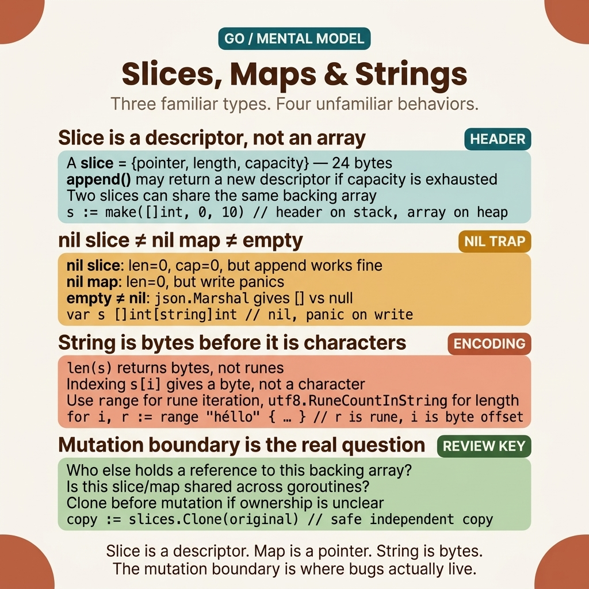

<!-- tags: golang, data-structures -->
# 📦 Type System — Slices, Maps, Strings

> Go type system: built-in types, slices (dynamic arrays), maps (hashmaps), strings (immutable UTF-8)

📅 Created: 2026-03-20 · 🔄 Updated: 2026-04-19 · ⏱️ 15 min read

| Aspect            | Detail                                 |
| ----------------- | -------------------------------------- |
| **Concept**       | Value types vs reference types         |
| **Use case**      | Data structures, collections           |
| **Key insight**   | Slices = reference to underlying array |
| **Go philosophy** | Composition > inheritance              |

---

## 1. DEFINE

`sub := original[1:3]` — looks like a copy, but changing `sub[0]` silently mutates `original[1]`. `var cache map[string]int` followed by `cache["key"] = 1` — panic. `len("Hello, 世界")` returns 13, not 9. These three classic gotchas share the same root cause: Go's type system distinguishes value semantics from reference semantics in ways that contradict most developers' initial intuitions.

> *You write `sub := original[1:3]` — it looks like a copy, but it is an alias. `sub[0] = 99` and `original[1]` becomes 99 too. Then you write `var cache map[string]int` and call `cache["key"] = 1` — instant panic because the map was never initialized.*
>
> *These are the classic gotchas of Go's type system: a slice is a reference to a backing array (not a copy), a map must be initialized before writing, and a string is an immutable UTF-8 byte sequence. Understanding these three facts prevents the majority of bugs newcomers encounter in Go.*

### Built-in Types

| Category    | Types                                            | Zero value |
| ----------- | ------------------------------------------------ | ---------- |
| **Boolean** | `bool`                                           | `false`    |
| **Integer** | `int`, `int8/16/32/64`, `uint`, `uint8/16/32/64` | `0`        |
| **Float**   | `float32`, `float64`                             | `0`        |
| **Complex** | `complex64`, `complex128`                        | `(0+0i)`   |
| **String**  | `string` (immutable UTF-8)                       | `""`       |
| **Byte**    | `byte` (alias `uint8`)                           | `0`        |
| **Rune**    | `rune` (alias `int32`, Unicode)                  | `0`        |

### Composite Types

| Type        | Description          | Mutable | Zero value      |
| ----------- | -------------------- | ------- | --------------- |
| **Array**   | Fixed size `[n]T`    | ✅      | Zeroed elements |
| **Slice**   | Dynamic `[]T`        | ✅      | `nil`           |
| **Map**     | Hash map `map[K]V`   | ✅      | `nil`           |
| **Struct**  | Record `struct{...}` | ✅      | Zeroed fields   |
| **Channel** | `chan T`             | ✅      | `nil`           |

### Slice Internals

| Field | Description                         |
| ----- | ----------------------------------- |
| `ptr` | Pointer to underlying array         |
| `len` | Number of elements                  |
| `cap` | Capacity (can grow before realloc)  |

One classic trap remains: the slice header (ptr, len, cap) is a value type. Pass it into a function, append inside that function, and the caller never sees the new slice. That trap surfaces in PITFALLS.

---
## 2. VISUAL

The hard part is not the type names — it is that these three value groups fail in three distinct ways. The visual below consolidates them into one mental-model card.



*Figure: Four key facts to hold simultaneously — a slice is a descriptor, nil slice differs from nil map, a string is bytes before characters, and the mutation boundary is the critical code-review question.*

With this model locked in, each code example below becomes a semantics test rather than a disconnected API demo.

## 3. CODE

The mental model is set. Now map each decision — sub-slice versus copy, nil map versus make, `+=` versus Builder — to code that reveals the actual behavior.

### Example 1: Basic — Slices — Core Operations
> **Goal**: Demonstrate slice creation, sub-slicing, full slice expression, copy, and deletion.
> **Complexity**: O(1) per operation; append is amortized O(1).

```go
package main

import "fmt"

func main() {
    // ✅ Create slices
    s1 := []int{1, 2, 3, 4, 5}           // Literal
    s2 := make([]int, 5)                   // make(type, len)
    s3 := make([]int, 0, 10)              // make(type, len, cap)

fmt.Println(len(s1), cap(s1))  // 5, 5
    fmt.Println(len(s3), cap(s3))  // 0, 10

// ✅ Append — may allocate new array if cap exceeded
    s3 = append(s3, 1, 2, 3)
    s3 = append(s3, s1...)        // Spread operator

// ✅ Slice expression (sub-slice)
    sub := s1[1:3]    // [2, 3] — shares underlying array!
    sub[0] = 99        // ⚠️ s1[1] is now 99 too!
    fmt.Println(s1)    // [1, 99, 3, 4, 5]

// ✅ Full slice expression — limit capacity
    safe := s1[1:3:3]  // [low:high:max] — cap = max - low
    // Now append to `safe` won't affect s1

// ✅ Copy — detach from original
    dst := make([]int, len(s1))
    copy(dst, s1)
    dst[0] = 999  // s1 unaffected

// ✅ Delete element at index 2
    s := []int{1, 2, 3, 4, 5}
    i := 2
    s = append(s[:i], s[i+1:]...)  // [1, 2, 4, 5]

// ✅ Go 1.21+ slices package
    // slices.Delete(s, i, i+1)
    // slices.Contains(s, 3)
    // slices.Sort(s)

fmt.Println(s2, s3, sub, safe, dst, s)
}
```

> **Takeaway**: Slice sub-slices share memory — use `copy()` or full slice expression `[a:b:b]` to detach. `append` can allocate a new array → always use `s = append(s, ...)`.

Slices cover sequential data. Maps provide O(1) key-value lookup — but a nil map write is an instant panic.

### Example 2: Intermediate — Maps
> **Goal**: CRUD, comma-ok pattern, map-as-set, and nested map initialization.
> **Complexity**: O(1) per lookup/insert/delete.

```go
package main

import "fmt"

func main() {
    // ✅ Create maps
    m := map[string]int{
        "alice": 95,
        "bob":   87,
    }
    m2 := make(map[string][]string)  // map[string]→[]string

// ✅ CRUD
    m["charlie"] = 92               // Create/Update
    score := m["alice"]             // Read (95)
    delete(m, "bob")                // Delete

// ✅ Check existence (comma ok pattern)
    val, ok := m["bob"]
    if !ok {
        fmt.Println("bob not found")  // ← this prints
    }
    _ = val

// ✅ Iterate (random order!)
    for name, score := range m {
        fmt.Printf("%s: %d\n", name, score)
    }

// ✅ Map as set
    seen := make(map[string]struct{})  // struct{} = 0 bytes
    seen["apple"] = struct{}{}
    if _, exists := seen["apple"]; exists {
        fmt.Println("apple exists")
    }

// ✅ Nested map
    m2["fruits"] = []string{"apple", "banana"}
    m2["vegs"] = []string{"carrot"}

fmt.Println(m, m2, score)
}
```

> **Why `struct{}` for map-as-set instead of `bool`?**
> `struct{}` = 0 bytes of memory. `bool` = 1 byte. For a map with 1M entries: that saves 1MB. Additionally, `struct{}{}` signals intent clearly: "only the key's existence matters, the value is irrelevant".

> **Takeaway**: Map iteration order is random — sort keys if deterministic output is needed. Comma-ok pattern checks existence. `struct{}` for the map-as-set pattern.

Slices handle sequences, maps handle lookups. Strings look simple but hide traps: `len()` counts bytes, `+=` in a loop is O(n²).

### Example 3: Advanced — Strings — UTF-8, Runes, Builder
> **Goal**: Demonstrate byte vs rune semantics, `range` iteration, rune conversion, and `strings.Builder`.
> **Complexity**: O(n) for iteration and Builder; O(n²) for naive `+=` concat.

```go
package main

import (
    "fmt"
    "strings"
    "unicode/utf8"
)

func main() {
    // ✅ Strings are immutable UTF-8 byte sequences
    s := "Hello, 世界"
    fmt.Println(len(s))                      // 13 (bytes, NOT characters!)
    fmt.Println(utf8.RuneCountInString(s))   // 9 (runes = characters)

// ✅ Iterate by rune (character)
    for i, r := range s {
        fmt.Printf("byte %2d: %c (U+%04X)\n", i, r, r)
    }
    // byte  7: 世 (U+4E16)  — 3 bytes per CJK character

// ✅ Rune vs Byte
    r := []rune(s)       // Convert to rune slice → can modify
    r[7] = '🌍'
    modified := string(r)
    fmt.Println(modified)

// ✅ String operations
    fmt.Println(strings.Contains(s, "世界"))      // true
    fmt.Println(strings.Split("a,b,c", ","))      // [a b c]
    fmt.Println(strings.TrimSpace("  hello  "))   // "hello"
    fmt.Println(strings.ReplaceAll(s, "Hello", "Hi"))

// ✅ String Builder — efficient concatenation (no allocs)
    var b strings.Builder
    for i := range 100 { // Go 1.22+
        fmt.Fprintf(&b, "item-%d ", i)
    }
    result := b.String()
    _ = result
    // ❌ DON'T: s += "..." in loop (O(n²) allocations)
    // ✅ DO: strings.Builder or strings.Join
}
```

> **Why `strings.Builder` instead of `+=` in a loop?**
> `s += "x"` in a loop: each iteration allocates a new string, copying the entire existing content plus the new part → O(n²) allocations. `strings.Builder`: pre-allocates a buffer, appends in O(1) amortized → O(n) total. With 100 iterations: `+=` produces ~5000 allocs, Builder ~4 allocs.

> **Takeaway**: `len(string)` = bytes, `utf8.RuneCountInString()` = characters. Strings are immutable → convert to `[]rune` to modify. Use `strings.Builder` for concatenation loops.

---

## 4. PITFALLS

The mechanics are clear. What remains is recognizing spots where _almost correct_ code carries wrong assumptions into production.

| # | Severity | Error | Consequence | Fix |
|---|----------|-------|-------------|-----|
| 1 | 🔴 Fatal | nil map write | `m["key"] = 1` panics when `m` was not `make()`d | Always `make(map[K]V)` before writing |
| 2 | 🔴 Fatal | Slice sub-slice shares memory | Modifying the sub-slice → modifies original data | `copy()` or full slice `[a:b:b]` |
| 3 | 🟡 Common | `len(string)` = bytes, not chars | Wrong count for UTF-8 strings | `utf8.RuneCountInString()` |
| 4 | 🟡 Common | Map iteration order is random | Non-deterministic output | Sort keys: `slices.Sort(maps.Keys(m))` |
| 5 | 🟡 Common | String concat `+=` in loop | O(n²) allocations, slow | `strings.Builder` or `strings.Join` |
| 6 | 🔵 Minor | Append without reassignment | `append` can return a new slice, old variable becomes stale | Always `s = append(s, ...)` |

### 🔴 Pitfall #1 — Nil map write = instant panic

`var m map[string]int; m["k"] = 1` → panic. A map must be `make()`d before writing. Reading from a nil map returns the zero value (no panic) — so the bug only appears on write, potentially far from the declaration site.

### 🔴 Pitfall #2 — Sub-slice shares memory

`sub := original[1:3]` does not copy data — `sub` and `original` share the same underlying array. Modifying `sub[0]` → `original[1]` is changed. Full slice expression `original[1:3:3]` caps the sub-slice → `append` must allocate a new array.

The resources below go deeper into internals.

---

## 5. REF

| Resource       | Type     | Link                                                         | Notes |
| -------------- | -------- | ------------------------------------------------------------ | ----- |
| Go Slices      | Official | [go.dev/blog/slices-intro](https://go.dev/blog/slices-intro) | Slice internals deep dive |
| Go Maps        | Official | [go.dev/blog/maps](https://go.dev/blog/maps)                 | Map implementation |
| Go Strings     | Official | [go.dev/blog/strings](https://go.dev/blog/strings)           | UTF-8, rune, byte |
| slices package | Official | [pkg.go.dev/slices](https://pkg.go.dev/slices)               | Go 1.21+ generic helpers |

---

## 6. RECOMMEND

These extensions bridge data-structure knowledge into safe, efficient production code.

| Extension | When | Rationale | File/Link |
| --------- | ---- | --------- | --------- |
| Generics | Type-safe collections | `Filter[T]`, `Map[T,U]`, generic containers | [02-generics.md](./02-generics.md) |
| `sync.Map` | Concurrent map access | Thread-safe map for high-contention scenarios | [../helper/09-set-concurrent-map.md](../helper/09-set-concurrent-map.md) |
| `slices` package | Go 1.21+ helpers | `slices.Sort`, `slices.Contains`, `slices.Delete` | [pkg.go.dev/slices](https://pkg.go.dev/slices) |
| `strings.Builder` | String concat loop | Efficient alternative to `+=` (O(n) vs O(n²)) | [../functions/02-strings.md](../functions/02-strings.md) |

**Navigation**: [← Basics](../basics/README.md) · [→ Generics](./02-generics.md)

