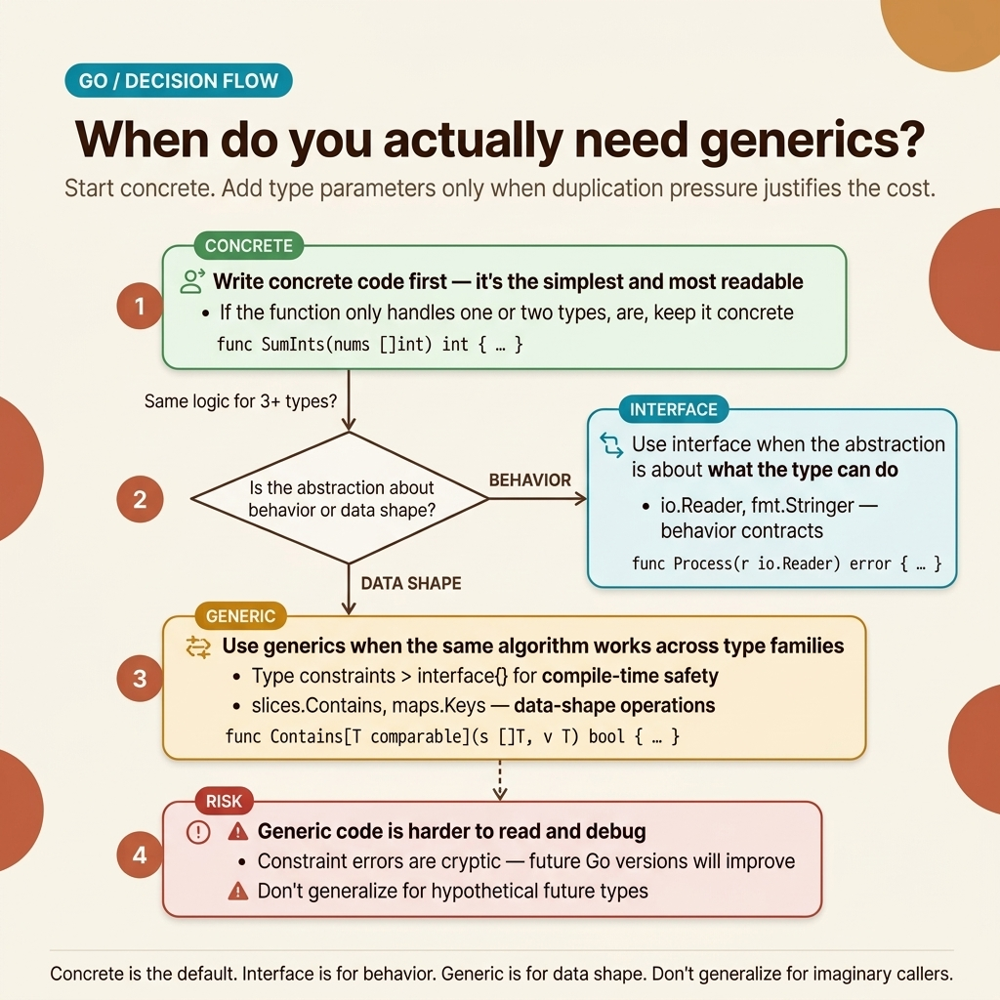

<!-- tags: golang, generics -->
# 🧬 Generics — Type Parameters, Constraints, Generic Patterns

> Go 1.18+ generics: type parameters, constraints, generic data structures

📅 Created: 2026-03-20 · 🔄 Updated: 2026-04-19 · ⏱️ 15 min read

| Aspect            | Detail                                                                              |
| ----------------- | ----------------------------------------------------------------------------------- |
| **Version**       | Go 1.18+                                                                            |
| **Use case**      | Type-safe reusable code, no interface{} boxing                                      |
| **Key insight**   | Generics are resolved at compile-time — zero runtime overhead                       |
| **Go philosophy** | "A little copying is better than a little dependency" — but use generics when needed |

---

## 1. DEFINE

Your first PR using generics: you write `func Map[T any, R any](s []T, f func(T) R) []R` — the reviewer approves but asks: "why not use `comparable` instead of `any`?" You change it, compilation fails because `comparable` does not cover the required constraint.

> *You write `func MinInt(a, b int) int`. Done. Then you need `MinFloat64`, `MinString` — copy-paste, change the type. `Contains([]int, int)` → add `ContainsString`, `ContainsFloat64`. Six functions, identical logic, only the type differs — a DRY violation at the type system level. Add a new type? Fix six places. Bug in the logic? Fix six places. Reviewing the PR? Read six identical functions.*
>
> *Go 1.18 solves this with generics: `Min[T cmp.Ordered](a, b T) T` — one function, all ordered types. Compile-time type checking, zero runtime overhead, no boxing like `interface{}`. But there is a trap: over-generics turns Go into Java — unreadable code, unnecessary abstraction. Rule: if you cannot list at least 3 concrete types that will use the generic, do not make it generic. That trap will appear in PITFALLS.*

### Generics Syntax

| Element          | Syntax                  | Example                   |
| ---------------- | ----------------------- | ------------------------- |
| Type parameter   | `[T any]`               | `func Print[T any](v T)`  |
| Constraint       | `[T Constraint]`        | `[T comparable]`          |
| Multiple params  | `[K comparable, V any]` | Map function              |
| Union constraint | `int \| float64`        | Numeric operations        |
| `~int`           | Underlying type         | Includes `type MyInt int` |

### Built-in Constraints

| Constraint            | Description                    | Package                        |
| --------------------- | ------------------------------ | ------------------------------ |
| `any`                 | Any type (`interface{}`)       | builtin                        |
| `comparable`          | Supports `==`, `!=`            | builtin                        |
| `constraints.Ordered` | Supports `<`, `>`, `<=`, `>=`  | `golang.org/x/exp/constraints` |
| `constraints.Integer` | All integer types              | `golang.org/x/exp/constraints` |
| `constraints.Float`   | `float32`, `float64`           | `golang.org/x/exp/constraints` |
| `cmp.Ordered`         | Go 1.21+ ordered types         | `cmp`                          |

### When to Use Generics

| Use                                     | Don't Use                       |
| --------------------------------------- | ------------------------------- |
| Type-safe containers (stack, queue)     | Simple functions with 1-2 types |
| Utility functions (map, filter, reduce) | When interface{} is fine        |
| Reduce code duplication                 | When it hurts readability       |
| Avoid reflection                        | Small codebase with few types   |

Syntax, constraints, when to use — enough theory. Let us see how generics compare visually against interfaces and reflection.

---
## 2. VISUAL

Generics are only useful when they solve genuine abstraction pressure. Otherwise, they quickly slide into "generalized but unreadable code". The decision map below forces you to lock down that question before writing another type parameter.



*Figure: The generics decision map starts from the default choice — concrete code — and only opens toward interface or generic abstraction when the pressure is clear enough to justify it.*

Once the decision order is correct, the code section below will feel less theoretical. Each example demonstrates precisely when generics reduce duplication, and when interface or concrete code remains the cleaner choice.

## 3. CODE

With **Generics — Type Parameters, Constraints, Generic Patterns**, the decision map is established. Now let us map it to code to see how each decision — concrete versus generic, `any` versus custom constraint, function versus type — actually changes compile-time behavior and code review experience.

### Example 1: Basic — Generic Functions

> **Goal**: Type-safe utility functions replacing interface{} / code duplication
> **Requires**: Go 1.18+
> **Outcome**: Reusable, type-safe utility library

```go
package main

import (
    "cmp"
    "fmt"
)

// ✅ Generic function — works with any comparable type
func Contains[T comparable](slice []T, target T) bool {
    for _, v := range slice {
        if v == target {
            return true
        }
    }
    return false
}

// ✅ Generic with constraint — cmp.Ordered (Go 1.21+)
func Max[T cmp.Ordered](a, b T) T {
    if a > b {
        return a
    }
    return b
}

func Min[T cmp.Ordered](a, b T) T {
    if a < b {
        return a
    }
    return b
}

// ✅ Clamp value to range
func Clamp[T cmp.Ordered](val, min, max T) T {
    if val < min {
        return min
    }
    if val > max {
        return max
    }
    return val
}

// ✅ Map function — transform slice
func Map[T any, U any](slice []T, fn func(T) U) []U {
    result := make([]U, len(slice))
    for i, v := range slice {
        result[i] = fn(v)
    }
    return result
}

// ✅ Filter function
func Filter[T any](slice []T, fn func(T) bool) []T {
    result := make([]T, 0)
    for _, v := range slice {
        if fn(v) {
            result = append(result, v)
        }
    }
    return result
}

// ✅ Reduce function
func Reduce[T any, U any](slice []T, init U, fn func(U, T) U) U {
    acc := init
    for _, v := range slice {
        acc = fn(acc, v)
    }
    return acc
}

func main() {
    // ✅ Works with any type
    fmt.Println(Contains([]int{1, 2, 3}, 2))           // true
    fmt.Println(Contains([]string{"go", "rust"}, "go")) // true

fmt.Println(Max(10, 20))       // 20
    fmt.Println(Max("go", "rust")) // rust (lexicographic)

fmt.Println(Clamp(150, 0, 100)) // 100

// ✅ Map: []int → []string
    nums := []int{1, 2, 3, 4, 5}
    strs := Map(nums, func(n int) string {
        return fmt.Sprintf("#%d", n)
    })
    fmt.Println(strs) // [#1 #2 #3 #4 #5]

// ✅ Filter: even numbers
    evens := Filter(nums, func(n int) bool { return n%2 == 0 })
    fmt.Println(evens) // [2 4]

// ✅ Reduce: sum
    sum := Reduce(nums, 0, func(acc, n int) int { return acc + n })
    fmt.Println(sum) // 15
}
```

> **Takeaway**: Generic functions = one function, all types. `cmp.Ordered` for comparison, `comparable` for `==`. Type inference auto-detects — no need to specify type params in most cases.

Generic functions cover utility operations. But what when you need generic **types** — Stack, Queue, Result — and custom **constraints** for domain types like `Money`, `Temperature`? You must understand `~int` (tilde) and generic struct patterns.

### Example 2: Intermediate — Custom Constraints & Generic Types

> **Goal**: Define custom constraints and generic data structures
> **Requires**: Type parameter syntax
> **Outcome**: Type-safe containers, domain-specific constraints

```go
package main

import (
    "encoding/json"
    "fmt"
)

// ✅ Custom constraint — Numeric types
type Number interface {
    ~int | ~int8 | ~int16 | ~int32 | ~int64 |
    ~uint | ~uint8 | ~uint16 | ~uint32 | ~uint64 |
    ~float32 | ~float64
}

// ✅ ~ (tilde) = underlying type — includes type aliases
type Money int64         // underlying type is int64
type Temperature float64 // underlying type is float64

func Sum[T Number](nums []T) T {
    var total T
    for _, n := range nums {
        total += n
    }
    return total
}

// ✅ Generic Stack
type Stack[T any] struct {
    items []T
}

func NewStack[T any]() *Stack[T] {
    return &Stack[T]{items: make([]T, 0)}
}

func (s *Stack[T]) Push(item T) {
    s.items = append(s.items, item)
}

func (s *Stack[T]) Pop() (T, bool) {
    if len(s.items) == 0 {
        var zero T  // ✅ Zero value of any type
        return zero, false
    }
    item := s.items[len(s.items)-1]
    s.items = s.items[:len(s.items)-1]
    return item, true
}

func (s *Stack[T]) Peek() (T, bool) {
    if len(s.items) == 0 {
        var zero T
        return zero, false
    }
    return s.items[len(s.items)-1], true
}

func (s *Stack[T]) Len() int { return len(s.items) }

// ✅ Generic Pair
type Pair[A, B any] struct {
    First  A
    Second B
}

func NewPair[A, B any](a A, b B) Pair[A, B] {
    return Pair[A, B]{First: a, Second: b}
}

// ✅ Generic Result (like Rust's Result<T, E>)
type Result[T any] struct {
    value T
    err   error
}

func Ok[T any](val T) Result[T]     { return Result[T]{value: val} }
func Err[T any](err error) Result[T] { return Result[T]{err: err} }

func (r Result[T]) Unwrap() (T, error) { return r.value, r.err }
func (r Result[T]) IsOk() bool         { return r.err == nil }

func main() {
    // ✅ Custom Money type works with Sum
    prices := []Money{1990, 2990, 599}
    fmt.Println("Total:", Sum(prices)) // 5579

temps := []Temperature{36.5, 37.2, 38.1}
    fmt.Println("Avg:", Sum(temps)/Temperature(len(temps)))

// ✅ Generic Stack
    stack := NewStack[string]()
    stack.Push("hello")
    stack.Push("world")
    val, _ := stack.Pop()
    fmt.Println(val) // "world"

// ✅ Integer stack
    intStack := NewStack[int]()
    intStack.Push(1)
    intStack.Push(2)

// ✅ Pair
    p := NewPair("user-123", 42)
    fmt.Println(p.First, p.Second)

// ✅ Result
    result := Ok(42)
    if result.IsOk() {
        val, _ := result.Unwrap()
        fmt.Println("Value:", val)
    }
}
```

> **Why `~int` instead of `int` in a constraint?**
> `int` only matches the exact type `int`. `~int` matches any type whose underlying type is `int` — which includes `type Money int64`, `type UserID int`. The tilde (`~`) means "underlying type matches" — this is strictly required for generics to work with custom domain types.

> **Takeaway**: Custom constraints (`Number`, `Entity`) enable domain-specific generics. The `var zero T` pattern safely yields the zero value. Generic types (`Stack[T]`, `Result[T]`) establish type-safe containers.

Generic functions and types cover library-level code. But within DDD — when you specifically need a generic Repository CRUD for all entities — generics become a primary DRY weapon at the architecture level.

### Example 3: Advanced — Generic Repository Pattern

> **Goal**: Generic CRUD repository for any entity
> **Requires**: Database concepts, generics
> **Outcome**: DRY repository layer

```go
package main

import (
    "context"
    "encoding/json"
    "errors"
    "fmt"
    "sync"
    "time"
)

// ✅ Entity constraint — all entities must have ID
type Entity interface {
    GetID() string
}

// ✅ Generic Repository interface
type Repository[T Entity] interface {
    FindByID(ctx context.Context, id string) (T, error)
    FindAll(ctx context.Context) ([]T, error)
    Create(ctx context.Context, entity T) error
    Update(ctx context.Context, entity T) error
    Delete(ctx context.Context, id string) error
}

// ✅ In-memory implementation (for demo/testing)
type InMemoryRepo[T Entity] struct {
    mu    sync.RWMutex
    store map[string]T
}

func NewInMemoryRepo[T Entity]() *InMemoryRepo[T] {
    return &InMemoryRepo[T]{
        store: make(map[string]T),
    }
}

func (r *InMemoryRepo[T]) FindByID(_ context.Context, id string) (T, error) {
    r.mu.RLock()
    defer r.mu.RUnlock()

entity, ok := r.store[id]
    if !ok {
        var zero T
        return zero, fmt.Errorf("entity %s not found", id)
    }
    return entity, nil
}

func (r *InMemoryRepo[T]) FindAll(_ context.Context) ([]T, error) {
    r.mu.RLock()
    defer r.mu.RUnlock()

items := make([]T, 0, len(r.store))
    for _, v := range r.store {
        items = append(items, v)
    }
    return items, nil
}

func (r *InMemoryRepo[T]) Create(_ context.Context, entity T) error {
    r.mu.Lock()
    defer r.mu.Unlock()

if _, exists := r.store[entity.GetID()]; exists {
        return errors.New("entity already exists")
    }
    r.store[entity.GetID()] = entity
    return nil
}

func (r *InMemoryRepo[T]) Update(_ context.Context, entity T) error {
    r.mu.Lock()
    defer r.mu.Unlock()

if _, exists := r.store[entity.GetID()]; !exists {
        return errors.New("entity not found")
    }
    r.store[entity.GetID()] = entity
    return nil
}

func (r *InMemoryRepo[T]) Delete(_ context.Context, id string) error {
    r.mu.Lock()
    defer r.mu.Unlock()

delete(r.store, id)
    return nil
}

// ✅ Concrete entities
type User struct {
    ID    string `json:"id"`
    Name  string `json:"name"`
    Email string `json:"email"`
}

func (u User) GetID() string { return u.ID }

type Product struct {
    ID    string  `json:"id"`
    Name  string  `json:"name"`
    Price float64 `json:"price"`
}

func (p Product) GetID() string { return p.ID }

// ✅ Generic service — reusable business logic
type CRUDService[T Entity] struct {
    repo Repository[T]
}

func NewCRUDService[T Entity](repo Repository[T]) *CRUDService[T] {
    return &CRUDService[T]{repo: repo}
}

func (s *CRUDService[T]) GetAll(ctx context.Context) ([]T, error) {
    ctx, cancel := context.WithTimeout(ctx, 5*time.Second)
    defer cancel()
    return s.repo.FindAll(ctx)
}

func main() {
    ctx := context.Background()

// ✅ Same repository code works for User AND Product
    userRepo := NewInMemoryRepo[User]()
    userSvc := NewCRUDService[User](userRepo)

productRepo := NewInMemoryRepo[Product]()
    productSvc := NewCRUDService[Product](productRepo)

// Create users
    userRepo.Create(ctx, User{ID: "u1", Name: "Alice", Email: "alice@go.dev"})
    userRepo.Create(ctx, User{ID: "u2", Name: "Bob", Email: "bob@go.dev"})

// Create products
    productRepo.Create(ctx, Product{ID: "p1", Name: "Go Book", Price: 29.99})

users, _ := userSvc.GetAll(ctx)
    products, _ := productSvc.GetAll(ctx)

usersJSON, _ := json.MarshalIndent(users, "", "  ")
    productsJSON, _ := json.MarshalIndent(products, "", "  ")
    fmt.Println("Users:", string(usersJSON))
    fmt.Println("Products:", string(productsJSON))
}
```

> **Why an `Entity` interface constraint instead of `any`?**
> A `Repository[T any]` does not know if the entity has a `GetID()` method → it cannot look up by ID. The `Entity` constraint guarantees `GetID() string` exists → the repository is both generic and type-safe. In production: replace `InMemoryRepo` with a `PostgresRepo[T Entity]` backed by `sqlx`/`pgx`.

> **Takeaway**: Generic repository = 1 codebase, N entity types. The `Entity` constraint enforces the contract. `sync.RWMutex` ensures concurrent safety. In production, swap the in-memory store for an RDBMS backend.

You have now learned generic functions, custom constraints, generic types, and the generic repository pattern. Now comes the dangerous part: over-generics — the trap established at the very beginning of this article that turns Go directly into Java.

---

## 4. PITFALLS

The mechanics of **Generics — Type Parameters, Constraints, Generic Patterns** are clear. What remains is recognizing the spots where _almost correct_ code accidentally turns Go into Java.

| # | Severity | Error | Consequence | Fix |
|---|----------|-------|-------------|-----|
| 1 | 🟡 Common | Over-generics (Java style) | Unreadable code, unnecessary complexity | Prefer concrete types first; use generics only when duplication is proven |
| 2 | 🟡 Common | `~int` vs `int` confusion | Custom types (`type Money int`) fail to match the `int` constraint | Use `~int` to include all underlying types |
| 3 | 🟡 Common | Type inference fails | Compile error with an unclear message | Specify type params explicitly: `Fn[int](...)` |
| 4 | 🔵 Minor | Zero value return | `return T{}` does not compile for generics | Use `var zero T; return zero` |
| 5 | 🔵 Minor | Cannot add methods to type params | `T.Method()` does not compile | Define an interface constraint with the required methods |

### 🟡 Pitfall #1 — Over-generics = Java syndrome

Go culture demands concrete types first. Generics enter only when code is **provably duplicated** across 3+ types. Writing `Filter[T]` for collection utilities is sensible. Writing `UserService[T UserRepo]` when only one implementation exists is unnecessary abstraction.

**Rule**: If you cannot list at least 3 concrete types that will use your generic function — do not write it generically.

You have navigated generic functions, types, repositories, and the over-generics trap. The resources below provide deep internals.

---

## 5. REF

| Resource                 | Type     | Link                                                                                       | Notes |
| ------------------------ | -------- | ------------------------------------------------------------------------------------------ | ----- |
| Go Generics Tutorial     | Official | [go.dev/doc/tutorial/generics](https://go.dev/doc/tutorial/generics)                       | Beginner-friendly tutorial |
| Type Parameters Proposal | Official | [go.dev/blog/intro-generics](https://go.dev/blog/intro-generics)                           | Deep architectural design rationale |
| constraints package      | Official | [pkg.go.dev/golang.org/x/exp/constraints](https://pkg.go.dev/golang.org/x/exp/constraints) | Predefined core constraints |
| slices package           | Official | [pkg.go.dev/slices](https://pkg.go.dev/slices)                                             | Generic slice operations |

---

## 6. RECOMMEND

The core of **Generics — Type Parameters, Constraints, Generic Patterns** is clear. The branches below bridge type-safe abstraction into production without sliding into over-engineering.

| Extension | When to Read Next | Rationale | File/Link |
| ------- | ------- | ----- | --------- |
| lo library | When you need Lodash for Go | Map, Filter, Reduce, GroupBy — all generic | [github.com/samber/lo](https://github.com/samber/lo) |
| Iterator pattern | When working with Go 1.23+ | `iter.Seq[T]` — lazy evaluation, composable streams | [go.dev/blog/range-functions](https://go.dev/blog/range-functions) |
| Generic collections | When standard slices/maps fall short | Type-safe queues, sets, and trees | [github.com/emirpasber/gods](https://github.com/emirpasber/gods) |
| Type Assertion | When you need runtime type checking | `x.(T)`, type switches, and the nil interface trap | [03-type-assertion-embedding.md](./03-type-assertion-embedding.md) |

---

**Sequential Navigation**: [← Slices/Maps](./01-slices-maps-strings.md) · [→ Type Assertion & Embedding](./03-type-assertion-embedding.md)
