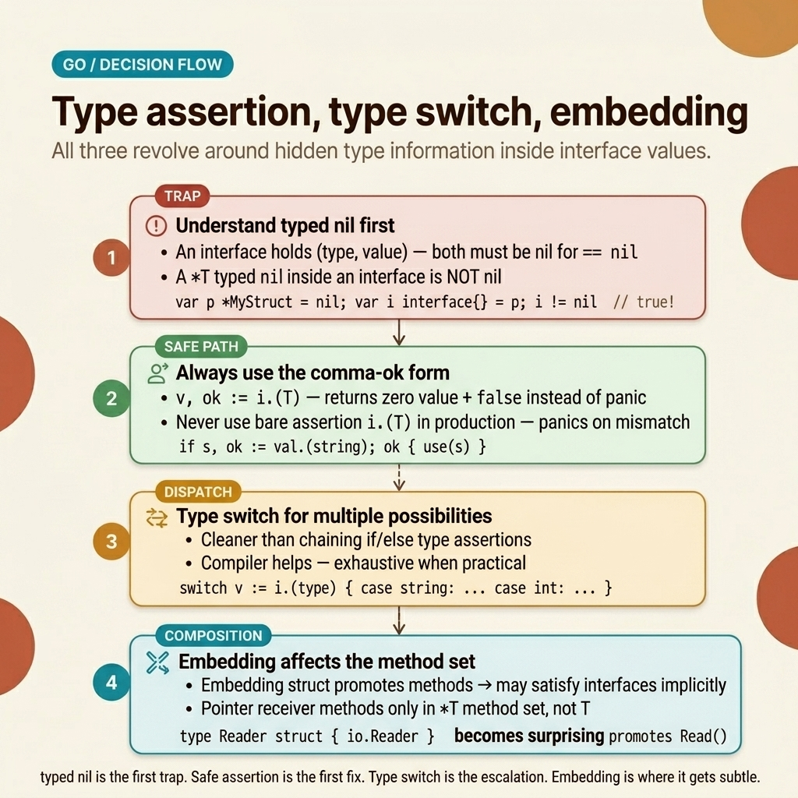

<!-- tags: golang -->
# 🔀 Type Assertion, Embedding & Type Aliases

> Advanced type system: assertions, embedding, aliases, custom types, method sets

📅 Created: 2026-03-20 · 🔄 Updated: 2026-04-19 · ⏱️ 15 min read

| Aspect            | Detail                                         |
| ----------------- | ---------------------------------------------- |
| **Concept**       | Type assertions, composition, type definitions |
| **Use case**      | Polymorphism, code reuse, domain modeling      |
| **Key insight**   | Embedding = composition (NOT inheritance)      |
| **Go philosophy** | "Prefer composition over inheritance"          |

---

## 1. DEFINE

A JSON decode returns `map[string]any`. You cast `data["age"].(int)` — panic. Because JSON numbers decode as `float64`, not `int`. Type assertion failure = crash.

> *You receive an `interface{}` from a JSON decoder — some value, but unknown type. Call `v.ToUpper()` → compile error. Cast it `v.(string)` → runtime panic if the type is incorrect. In production: 3 AM, panic log with 500 entries, because one endpoint received a `float64` instead of a `string` from JSON. Fix: `v, ok := x.(string)` — safe assertion, no panic.*
>
> *But there is a more dangerous trap: the **nil interface**. `var err *MyError = nil; return err` — looks like returning nil, but the interface = `{type=*MyError, value=nil}` → `err != nil` evaluates to true. This is the hardest bug to debug in Go. That trap appears in Example 3 and PITFALLS. Additionally, custom types like `type UserID int64` prevent the compiler from allowing an `OrderID` where a `UserID` is required — type-driven safety, bugs caught at compile time.*

### Type Definitions

| Syntax                    | Description                      | Example                     |
| ------------------------- | -------------------------------- | --------------------------- |
| `type T S`                | New type (own method set)        | `type UserID int64`         |
| `type T = S`              | Alias (same type, share methods) | `type byte = uint8`         |
| `type T struct{ S }`      | Embedding (promotes methods)     | `type Admin struct{ User }` |
| `type T interface{ M() }` | Interface                        | Contract definition         |

### Type Assertion vs Conversion

| Operation          | Syntax                 | Runtime check?                       |
| ------------------ | ---------------------- | ------------------------------------ |
| **Assertion**      | `x.(T)`                | ✅ Runtime — panics if wrong         |
| **Safe assertion** | `v, ok := x.(T)`       | ✅ Runtime — returns bool            |
| **Conversion**     | `T(x)`                 | ❌ Compile-time — must be compatible |
| **Type switch**    | `switch v := x.(type)` | ✅ Runtime — multiple types          |

### Method Set Rules

| Type           | Method set                |
| -------------- | ------------------------- |
| `T` (value)    | Value receivers only      |
| `*T` (pointer) | Value + pointer receivers |
| Embedding `T`  | Promotable value methods  |
| Embedding `*T` | All promoted methods      |

Type definitions, assertion, method sets — theory is covered. Now let us see how the nil interface trap and type assertion play out visually.

---
## 2. VISUAL

This article bundles multiple runtime traps into one place: typed nil, assertion, type switch, and method promotion via embedding. All of them trace back to hidden type information. Miss that root and you memorize isolated tricks that break under new conditions.



*Figure: The decision map runs from the typed nil trap directly to safe assertions, type switches, and resolves at embedding/method sets to emphasize that the runtime shape of an interface value is the root cause of the most irritating bugs.*

With hidden type information mapped out, the code section below becomes actionable. Each example reads as a runtime debug scenario rather than disconnected syntax demos.

## 3. CODE

With **Type Assertion, Embedding & Type Aliases**, we have established a decision map surrounding hidden type information. Now let us map it to code to anchor the rules with concrete examples — from domain modeling, through embedding composition, all the way to the nil interface trap.

### Example 1: Basic — Type Definitions & Domain Modeling

> **Goal**: Employ custom types for strictly type-safe domain objects
> **Requires**: Go basics
> **Outcome**: Compile-time safety, extremely readable code

```go
package main

import (
    "fmt"
    "time"
)

// ✅ Custom types — compiler prevents mixing up IDs!
type UserID int64
type OrderID int64
type ProductID int64

// ✅ Custom string types for enums
type OrderStatus string

const (
    OrderStatusPending   OrderStatus = "pending"
    OrderStatusConfirmed OrderStatus = "confirmed"
    OrderStatusShipped   OrderStatus = "shipped"
    OrderStatusDelivered OrderStatus = "delivered"
)

// ✅ Validate enum
func (s OrderStatus) IsValid() bool {
    switch s {
    case OrderStatusPending, OrderStatusConfirmed,
         OrderStatusShipped, OrderStatusDelivered:
        return true
    }
    return false
}

// ✅ Methods on custom type
func (uid UserID) String() string {
    return fmt.Sprintf("USR-%06d", int64(uid))
}

// ✅ Custom time wrapper
type Timestamp time.Time

func Now() Timestamp {
    return Timestamp(time.Now())
}

func (t Timestamp) ToTime() time.Time {
    return time.Time(t)
}

func (t Timestamp) Format() string {
    return time.Time(t).Format("2006-01-02 15:04:05")
}

func main() {
    uid := UserID(12345)
    oid := OrderID(67890)

fmt.Println(uid)  // USR-012345 (via Stringer)

// ❌ Compile error! Cannot mix types
    // if uid == oid {}  // mismatched types UserID and OrderID

// ✅ Must explicitly convert
    _ = int64(uid) == int64(oid) // OK after conversion

status := OrderStatusPending
    fmt.Println(status.IsValid()) // true

ts := Now()
    fmt.Println(ts.Format()) // 2024-01-15 10:30:00
}
```

> **Why a custom type `UserID int64` instead of a raw `int64`?**
> Given `func GetUser(id int64)` — the compiler permits `GetUser(orderID)` since they share the same primitive type. With `func GetUser(id UserID)`, passing an `OrderID` triggers a compile error. This compile-time safety has zero runtime overhead and prevents logic bugs.

> **Takeaway**: Custom types = compile-time safety, zero overhead. Method sets encapsulate domain behavior. The Enum pattern uses `type Status string` with a `const` block.

Custom types cover domain modeling. But what happens when 5 structs all need the same fields and methods — `BaseModel`, `SoftDelete`, `AuditLog`? Copy-pasting does not scale. Embedding solves this through composition.

### Example 2: Intermediate — Structural Embedding Patterns

> **Goal**: Multi-level embedding, method promotion, embedding interfaces
> **Requires**: Structs, interfaces
> **Outcome**: Powerful composition seamlessly bypassing inheritance

```go
package main

import (
    "encoding/json"
    "fmt"
    "time"
)

// ✅ Base model — reusable timestamp fields
type BaseModel struct {
    ID        int64     `json:"id"`
    CreatedAt time.Time `json:"created_at"`
    UpdatedAt time.Time `json:"updated_at"`
}

func (b *BaseModel) Touch() {
    b.UpdatedAt = time.Now()
}

func (b *BaseModel) Init() {
    now := time.Now()
    b.CreatedAt = now
    b.UpdatedAt = now
}

// ✅ SoftDelete mixin
type SoftDelete struct {
    DeletedAt *time.Time `json:"deleted_at,omitempty"`
}

func (s *SoftDelete) Delete() {
    now := time.Now()
    s.DeletedAt = &now
}

func (s *SoftDelete) IsDeleted() bool {
    return s.DeletedAt != nil
}

func (s *SoftDelete) Restore() {
    s.DeletedAt = nil
}

// ✅ User — composes BaseModel + SoftDelete
type User struct {
    BaseModel             // ✅ Promoted: ID, CreatedAt, UpdatedAt, Touch(), Init()
    SoftDelete            // ✅ Promoted: DeletedAt, Delete(), IsDeleted(), Restore()
    Email    string `json:"email"`
    FullName string `json:"full_name"`
    Role     string `json:"role"`
}

// ✅ Admin — embeds User (multi-level)
type Admin struct {
    User                  // ✅ All User methods + BaseModel methods promoted
    Permissions []string `json:"permissions"`
}

func (a *Admin) HasPermission(perm string) bool {
    for _, p := range a.Permissions {
        if p == perm {
            return true
        }
    }
    return false
}

// ✅ Embed interface — satisfy interface via embedding
type Logger interface {
    Log(msg string)
}

type ConsoleLogger struct{}
func (l *ConsoleLogger) Log(msg string) {
    fmt.Printf("[LOG] %s\n", msg)
}

type Service struct {
    Logger  // ✅ Service now implements Logger interface!
    Name string
}

func main() {
    // ✅ User — promoted fields/methods
    user := User{
        Email:    "alice@go.dev",
        FullName: "Alice",
        Role:     "engineer",
    }
    user.Init()                    // BaseModel.Init() promoted
    user.Touch()                   // BaseModel.Touch() promoted
    user.Delete()                  // SoftDelete.Delete() promoted
    fmt.Println(user.IsDeleted())  // true
    user.Restore()                 // SoftDelete.Restore() promoted
    fmt.Println(user.IsDeleted())  // false

// ✅ Access embedded field directly
    user.ID = 1  // Same as user.BaseModel.ID = 1

data, _ := json.MarshalIndent(user, "", "  ")
    fmt.Println(string(data))

// ✅ Admin — multi-level embedding
    admin := Admin{
        User: User{
            Email:    "admin@go.dev",
            FullName: "Admin",
            Role:     "admin",
        },
        Permissions: []string{"read", "write", "delete"},
    }
    admin.Init()  // 3 levels deep: Admin → User → BaseModel.Init()
    fmt.Println(admin.HasPermission("write")) // true

// ✅ Interface embedding
    svc := Service{
        Logger: &ConsoleLogger{},
        Name:   "OrderService",
    }
    svc.Log("Hello from service") // ConsoleLogger.Log() promoted
}
```

> **Why embed an interface into a struct?**
> With `type Service struct { Logger }` — `Service` implements the `Logger` interface via promotion. Swapping implementations is straightforward: inject `Service{Logger: &ConsoleLogger{}}` for dev, or `Service{Logger: &SentryLogger{}}` for production. This is the Composition + Delegation pattern.

> **Takeaway**: Multi-level embedding is composition. Method promotion traverses through levels. Interface embedding delegates to the injected implementation.

Embedding covers composition. But a dangerous trap remains: the nil interface — where `err != nil` returns true even when the underlying value is nil. Method set rules also govern whether a pointer or value receiver satisfies an interface.

### Example 3: Advanced — Interface Embedding & Method Set Constraints

> **Goal**: Thoroughly understand interface method sets and the severe nil interface trap
> **Requires**: Deep interface understanding
> **Outcome**: Bug-free polymorphism

```go
package main

import (
    "bytes"
    "fmt"
    "io"
)

// ✅ Interface composition — stdlib pattern
type ReadWriteCloser interface {
    io.Reader
    io.Writer
    io.Closer
}

// ✅ Interface with embedded + extra methods
type Storage interface {
    io.ReadWriter
    Sync() error
    Size() int64
}

// ══════════════════════════════════════
// THE NIL INTERFACE TRAP
// ══════════════════════════════════════

type MyError struct {
    Code    int
    Message string
}

func (e *MyError) Error() string {
    return fmt.Sprintf("[%d] %s", e.Code, e.Message)
}

// ❌ THIS IS A BUG!
func doSomethingBAD() error {
    var err *MyError = nil // typed nil pointer
    return err             // ⚠️ returns interface{error} holding (*MyError, nil)
    // The interface is NOT nil! It holds a type but nil value
}

// ✅ FIX: return nil explicitly
func doSomethingGOOD() error {
    var err *MyError = nil
    if err != nil {
        return err
    }
    return nil // ✅ Explicitly return nil interface
}

// ══════════════════════════════════════
// METHOD SET — value vs pointer receiver
// ══════════════════════════════════════

type Sizer interface {
    Size() int
}

type Buffer struct {
    data []byte
}

// Pointer receiver
func (b *Buffer) Size() int {
    return len(b.data)
}

func main() {
    // ✅ Nil interface trap
    err := doSomethingBAD()
    fmt.Println(err == nil) // false! ← THE TRAP
    // The interface contains (*MyError, nil) — NOT a nil interface

err2 := doSomethingGOOD()
    fmt.Println(err2 == nil) // true ✅

// ✅ Method set rules
    buf := Buffer{data: []byte("hello")}
    var s Sizer

// s = buf   // ❌ COMPILE ERROR: Buffer does not implement Sizer
                  // (Size method has pointer receiver)
    s = &buf      // ✅ OK: *Buffer implements Sizer
    fmt.Println(s.Size()) // 5

// ✅ io.Writer example
    var w io.Writer
    w = &bytes.Buffer{}  // bytes.Buffer has pointer receiver Write
    _, _ = w.Write([]byte("hello"))
}
```

> **Why is the nil interface trap so dangerous?**
> `doSomethingBAD()` returns a typed nil `*MyError` disguised as an `error` interface. The interface becomes `{type=*MyError, value=nil}`. So `err != nil` evaluates to true. The fix: always `return nil` when no error exists. This is the hardest bug to debug in Go — it hides in production and unit tests miss it unless the nil case is tested.

> **Takeaway**: Interface = {type, value} — it is nil only when BOTH fields are nil. Use `v, ok := x.(T)` for safe assertions. Pointer receivers limit the method set to pointers. Value receivers cover both.

You have now learned custom types, embedding, and the severe nil interface trap. Now comes the dangerous part: the nil interface trap emerges again immediately in PITFALLS — because it is so critically dangerous that it mandates repetition.

---

## 4. PITFALLS

The mechanics of **Type Assertion, Embedding & Type Aliases** are clear. What remains is recognizing the cases where it is easy to _memorize syntax but misapply behavior_ — especially with nil interfaces and method sets.

| # | Severity | Error | Consequence | Fix |
|---|----------|-------|-------------|-----|
| 1 | 🔴 Fatal | Nil interface trap | `err != nil` returns true even when the value is nil → broken logic | Always `return nil` for the error interface |
| 2 | 🟡 Common | Value receiver ≠ pointer interface | Compile error: `T` does not implement an interface requiring `*T` | Pass a pointer `&x` or switch to a value receiver |
| 3 | 🟡 Common | Embedding field collision | Ambiguous method call → compile error | Use the explicit path: `x.Base.Method()` |
| 4 | 🟡 Common | `type T S` loses methods | `T` has no methods from `S` — only the underlying type converts | Re-define methods on `T` or embed `S` |
| 5 | 🔵 Minor | Embedding exports all methods | Internal methods leak into the public API | Wrap in a private struct behind a public interface |

### 🔴 Pitfall #1 — Nil interface trap (again!)

This trap is so critical it appears in **two** separate core files. An `interface` = `(type, value)`. A typed nil (`(*T)(nil)`) wrapped inside an interface causes `!= nil` to evaluate as true. Calling a method on it triggers a panic. The fix: return the `nil` identifier directly, never a typed nil through an interface boundary.

You now know custom types, embedding, method sets, and the nil interface trap. The resources below cover runtime internals.

---

## 5. REF

| Resource         | Type     | Link                                                                           | Notes |
| ---------------- | -------- | ------------------------------------------------------------------------------ | ----- |
| Go Spec — Types  | Official | [go.dev/ref/spec#Types](https://go.dev/ref/spec#Types)                         | Raw type system reference |
| Type Embedding   | Official | [go.dev/doc/effective_go#embedding](https://go.dev/doc/effective_go#embedding) | Structural embedding patterns |
| Interface Values | Official | [go.dev/tour/methods/11](https://go.dev/tour/methods/11)                       | Deep interface internals |

---

## 6. RECOMMEND

The core of **Type Assertion, Embedding & Type Aliases** is clear. The branches below extend runtime type operations and composition patterns into production.

| Extension | When to Read Next | Rationale | File/Link |
| ------- | ------- | ----- | --------- |
| Composition patterns | Modeling DDD entities | Seamless Mixins (SoftDelete, Timestamps, AuditLog encapsulation) | [../structs/01-composition-embedding.md](../structs/01-composition-embedding.md) |
| Type-safe IDs | Deep domain modeling | Systematically prevent accidental ID type confusion fully at compile-time | `type UserID int64` pattern |
| Enum libraries | Managing complex enum codegen | `enumer`, `stringer` — auto-generate standard String(), internal validation | [github.com/alvaroloes/enumer](https://github.com/alvaroloes/enumer) |
| Functional options | Constructing flexible instances | The standard `WithX()` pattern tailored for complex object instantiation | [../structs/02-tags-options-builder.md](../structs/02-tags-options-builder.md) |

---

**Sequential Navigation**: [← Generics](./02-generics.md) · [→ Functions](../functions/)
