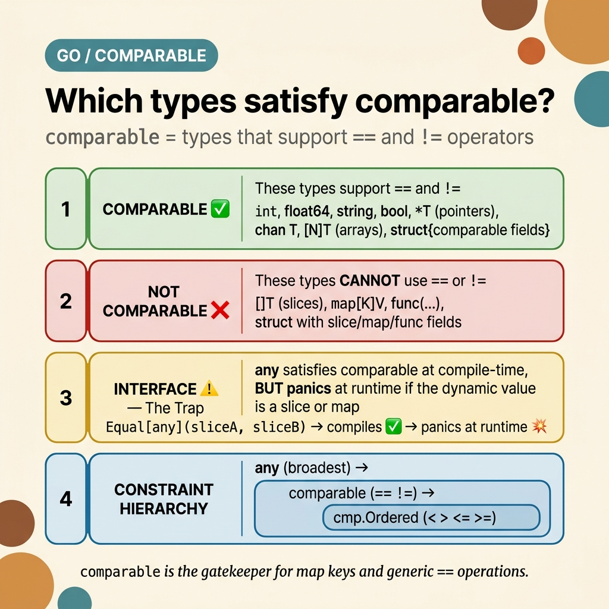

<!-- tags: golang, comparable, generics, constraints --> # 🔑 Comparable — Người gác cổng cho các phím == và Map > Hiểu comparable : loại nào đủ điều kiện, bẫy interface và mẫu generic thực tế

📅 Đã tạo: 23-04-2026 · 🔄 Đã cập nhật: 23-04-2026 · ⏱️ 12 phút đọc

| Khía cạnh | Chi tiết |
| ----------------- | ----------------------------------------------------------------------------- |
| **Phiên bản** | Go 1.18+ (được tinh chỉnh trong Go 1.20) |
| **Trường hợp sử dụng** | Phím Map , thao tác generic `==` , mẫu Set/Cache/Index |
| **Thông tin chi tiết quan trọng** | `comparable` là một cổng biên dịch- time - nhưng interfaces có thể bỏ qua nó và panic |
| ** Go triết lý** | Ràng buộc rõ ràng đối với kiểm tra runtime ngầm định |

---

## 1. ĐỊNH NGHĨA

Hàm generic `Contains[T any]` đầu tiên của bạn — bạn thử `if v == target` và trình biên dịch hét lên: *"không thể so sánh v == target (T không phải là comparable )"*. Bạn thay đổi `any` thành `comparable` và nó sẽ biên dịch. Sau đó, một đồng nghiệp vượt qua `any` đang cầm `[]int` và chương trình hoảng sợ tại runtime . Chào mừng đến với `comparable` .

> *Bạn cần một Bộ generic , một bộ đệm generic , một hàm generic `Contains` — mẫu any yêu cầu `==` trên một tham số loại. Ràng buộc `any` quá rộng: nó chấp nhận slices , maps và các hàm - không có hàm nào hỗ trợ `==` . Ràng buộc `cmp.Ordered` quá hẹp: nó loại trừ `bool` , `struct` , `*T` và `chan` . `comparable` nằm chính xác ở giữa — nó thừa nhận chính xác các loại mà toán tử `==` chấp nhận.*
>
> *Nhưng có một cái bẫy. Vì Go 1.20, `any` (và tất cả interfaces ) thỏa mãn `comparable` khi biên dịch time . Nếu giá trị động bên trong interface là slice hoặc map , thì so sánh `==` sẽ hoảng loạn ở runtime . Nghịch lý này — biên dịch- time an toàn với một cửa thoát hiểm runtime — là điểm tinh tế quan trọng nhất của `comparable` .*

### `comparable` nghĩa là gì `comparable` là **ràng buộc interface tích hợp**. Nó giới hạn tham số loại đối với các loại hỗ trợ `==` và `!=` .

| Ràng buộc | Được phép khai thác | Package | Các loại ví dụ |
| -------------- | -------------- | --------- | ---------------------------------- |
| `any` | Không có (không có toán tử) | dựng sẵn | Mọi thứ bao gồm slices , funcs |
| `comparable` | `==` , `!=` | dựng sẵn | int, chuỗi, struct , *T, [N]T |
| `cmp.Ordered` | `==` , `!=` , `<` , `>` , `<=` , `>=` | `cmp` | int, float64, chuỗi (không có bool, struct ) |

### Comparable Loại Danh sách

| Loại | Comparable ? | Tại sao |
| ----------------------------- | ----------- | ------------------------------------------------ |
| `int` , `int8` ... `int64` | ✅ | Giá trị bình đẳng |
| `uint` , `byte` , `rune` | ✅ | Giá trị bình đẳng |
| `float32` , `float64` | ✅ | ⚠️ `NaN != NaN` (IEEE 754) |
| `complex64` , `complex128` | ✅ | Thực + ảo so sánh |
| `bool` | ✅ | `true == true` , `false == false` |
| `string` | ✅ | So sánh từng byte |
| `*T` ( pointers ) | ✅ | So sánh **địa chỉ**, không phải giá trị trỏ tới |
| `chan T` | ✅ | So sánh danh tính channel |
| `[N]T` ( arrays ) | ✅ | Từng phần tử, chỉ khi `T` là comparable |
| `struct{...}` | ✅ | Theo từng trường, chỉ khi TẤT CẢ các trường là comparable |
| `[]T` ( slices ) | ❌ | Chỉ có thể so sánh với `nil` |
| `map[K]V` | ❌ | Chỉ có thể so sánh với `nil` |
| `func(...)` | ❌ | Chỉ có thể so sánh với `nil` |
| `interface{}` / `any` | ⚠️ Đặc biệt | Biên dịch, nhưng có thể panic tại runtime |

### Hệ thống phân cấp ràng buộc```text
┌─────────────────────────────────────────────────────────┐
│  any                                                     │
│  Accepts everything. Cannot use ==, <, > on T.           │
│                                                          │
│  ┌───────────────────────────────────────────────────┐  │
│  │  comparable                                        │  │
│  │  Accepts == and != types. Map keys live here.      │  │
│  │                                                    │  │
│  │  ┌─────────────────────────────────────────────┐  │  │
│  │  │  cmp.Ordered                                 │  │  │
│  │  │  Accepts <, >, <=, >= as well.               │  │  │
│  │  │  int, float64, string — but NOT bool/struct  │  │  │
│  │  └─────────────────────────────────────────────┘  │  │
│  └───────────────────────────────────────────────────┘  │
└─────────────────────────────────────────────────────────┘
```Các định nghĩa được thiết lập. Hình ảnh trực quan bên dưới maps các quy tắc này thành luồng quyết định nhằm ngăn chặn việc chọn sai ràng buộc.

---

## 2. HÌNH ẢNH

Rủi ro chính với `comparable` không phải là cú pháp - đó là việc chọn `any` khi ý bạn là `comparable` hoặc tin tưởng `comparable` khi giá trị ẩn sau interface . Quyết định map bên dưới buộc phải kiểm tra.  *Hình: Quyết định comparable map phân loại Go thành bốn vùng: an toàn comparable , không bao giờ comparable , bẫy interface và hệ thống phân cấp ràng buộc. Vùng 3 ( Interface Bẫy) là nguồn gốc của hầu hết các cuộc khủng hoảng sản xuất.*

Hình ảnh được thiết lập. Phần mã bên dưới minh họa hoạt động của từng vùng — từ kiểm tra đẳng thức cơ bản đến bẫy interface đến mẫu generic cấp sản xuất.

---

## 3. MÃ

Với ** Comparable — Người gác cổng cho các phím == và Map **, các quy tắc và vùng được xác định. Bây giờ chúng ta hãy xem cách mỗi cái hoạt động trong mã thực tế - bắt đầu từ đẳng thức generic cơ bản, thông qua bẫy interface , đến các mẫu sản xuất đầy đủ.

### Ví dụ 1: Cơ bản — Tại sao `comparable` Tồn tại

> **Mục tiêu**: Chứng minh việc thực thi `comparable` của trình biên dịch 
> **Yêu cầu**: Go 1.18+
> **Kết quả**: Hiểu khi nào `==` được phép trong mã generic```go
package main

import "fmt"

// ✅ comparable constraint — enables == inside generic code
func Contains[T comparable](s []T, target T) bool {
    for _, v := range s {
        if v == target {  // Only compiles because T is comparable
            return true
        }
    }
    return false
}

// ✅ Index — returns position or -1
func Index[T comparable](s []T, target T) int {
    for i, v := range s {
        if v == target {
            return i
        }
    }
    return -1
}

// ❌ This would NOT compile with any:
// func BadContains[T any](s []T, target T) bool {
//     if s[0] == target {}  // ← compile error: operator == not defined for T
// }

func main() {
    // ✅ Works with all comparable types
    fmt.Println(Contains([]int{1, 2, 3}, 2))              // true
    fmt.Println(Contains([]string{"go", "rust"}, "go"))    // true
    fmt.Println(Contains([]float64{1.1, 2.2}, 3.3))       // false
    fmt.Println(Contains([]bool{true, false}, false))      // true

    // ✅ Structs with comparable fields
    type Point struct{ X, Y int }
    fmt.Println(Contains([]Point{{1, 2}, {3, 4}}, Point{3, 4}))  // true

    // ✅ Pointers (compares addresses)
    a := 42
    b := 42
    fmt.Println(Contains([]*int{&a}, &a))  // true  (same address)
    fmt.Println(Contains([]*int{&a}, &b))  // false (different address)

    // ❌ Compile error — slices are not comparable:
    // Contains([][]int{{1}, {2}}, []int{1})
}
```> **Takeaway**: `comparable` là ràng buộc tối thiểu cho `==` . Không có nó, trình biên dịch sẽ từ chối so sánh các tham số kiểu. Với nó, bạn có thể xây dựng mẫu `Contains` , `Index` , `Deduplicate` , `Set` , `Cache` — any yêu cầu kiểm tra sự bằng nhau.

Bình đẳng cơ bản được bảo hiểm. Ví dụ tiếp theo cho thấy khía cạnh nguy hiểm nhất: điều gì xảy ra khi interfaces gặp `comparable` .

### Ví dụ 2: Trung cấp — Bẫy Interface > **Mục tiêu**: Thể hiện khoảng cách biên dịch- time so với runtime > **Yêu cầu**: Hiểu biết về Go interfaces > **Kết quả**: Biết khi nào `comparable` vẫn có thể panic```go
package main

import "fmt"

func Equal[T comparable](a, b T) bool {
    return a == b
}

func main() {
    // ── Zone 1: Concrete types — always safe ──
    fmt.Println(Equal(42, 42))       // true  ✅
    fmt.Println(Equal("go", "go"))   // true  ✅

    // ── Zone 3: The Interface Trap ──
    // Since Go 1.20, `any` satisfies `comparable`

    var x, y any

    // Safe: dynamic type is int (comparable)
    x, y = 42, 42
    fmt.Println(Equal(x, y))  // true  ✅ — int is comparable

    // Safe: dynamic type is string (comparable)
    x, y = "hello", "hello"
    fmt.Println(Equal(x, y))  // true  ✅ — string is comparable

    // 💥 DANGEROUS: dynamic type is []int (NOT comparable)
    x = []int{1, 2, 3}
    y = []int{1, 2, 3}
    // fmt.Println(Equal(x, y))
    // ↑ COMPILES FINE ✅ ... but PANICS at runtime 💥
    // panic: runtime error: comparing uncomparable type []int

    // 💥 Same trap with maps
    x = map[string]int{"a": 1}
    y = map[string]int{"a": 1}
    // fmt.Println(Equal(x, y))  // PANIC 💥

    // ── How to defend against this ──
    // Option 1: Never pass interface values to comparable generics
    // Option 2: Use reflect at the boundary
    fmt.Println(safeEqual([]int{1, 2}, []int{1, 2})) // false (safely)
}

// safeEqual uses recover to prevent panics from interface comparison
func safeEqual[T comparable](a, b T) (result bool) {
    defer func() {
        if r := recover(); r != nil {
            result = false
        }
    }()
    return a == b
}
```> **Tại sao Go cho phép điều này?** Trước Go 1.20, `any` KHÔNG đáp ứng `comparable` — phiên bản này an toàn nhưng quá hạn chế. Bạn không thể sử dụng `map[any]int` trong mã generic . Go 1.20 đã nới lỏng quy tắc vì những lý do thực tế, chấp nhận đánh đổi những cơn hoảng loạn runtime có thể xảy ra.

> **Bài học rút ra**: Ràng buộc `comparable` đảm bảo an toàn biên dịch- time cho các loại bê tông. Nhưng khi loại cụ thể là `any` (hoặc any khác interface ), mức bảo đảm sẽ hạ cấp xuống "biên dịch, nhưng có thể panic ." Phòng thủ bằng các loại cụ thể hoặc `recover` .

Bẫy interface được hiểu rõ. Ví dụ tiếp theo đặt `comparable` hoạt động trong cấu trúc dữ liệu generic cấp sản xuất.

### Ví dụ 3: Nâng cao — Mẫu sản xuất

> **Mục tiêu**: Generic Đặt, Bộ nhớ đệm, Tần suất, Loại bỏ trùng lặp, GroupBy
> **Yêu cầu**: ràng buộc Generics + comparable > **Kết quả**: Thư viện tiện ích an toàn, có thể tái sử dụng```go
package main

import (
    "cmp"
    "fmt"
    "maps"
    "slices"
)

// ────────────────────────────────────────────────────────
// Generic Set
// ────────────────────────────────────────────────────────

type Set[T comparable] struct {
    m map[T]struct{}
}

func NewSet[T comparable](vals ...T) Set[T] {
    s := Set[T]{m: make(map[T]struct{}, len(vals))}
    for _, v := range vals {
        s.m[v] = struct{}{}
    }
    return s
}

func (s Set[T]) Has(v T) bool        { _, ok := s.m[v]; return ok }
func (s Set[T]) Add(v T)             { s.m[v] = struct{}{} }
func (s Set[T]) Remove(v T)          { delete(s.m, v) }
func (s Set[T]) Len() int            { return len(s.m) }

func (s Set[T]) Intersection(other Set[T]) Set[T] {
    result := NewSet[T]()
    for k := range s.m {
        if other.Has(k) {
            result.Add(k)
        }
    }
    return result
}

func (s Set[T]) Union(other Set[T]) Set[T] {
    result := NewSet[T]()
    for k := range s.m { result.Add(k) }
    for k := range other.m { result.Add(k) }
    return result
}

func (s Set[T]) Difference(other Set[T]) Set[T] {
    result := NewSet[T]()
    for k := range s.m {
        if !other.Has(k) {
            result.Add(k)
        }
    }
    return result
}

// ────────────────────────────────────────────────────────
// Generic Deduplicate (preserves order)
// ────────────────────────────────────────────────────────

func Deduplicate[T comparable](s []T) []T {
    seen := make(map[T]struct{}, len(s))
    result := make([]T, 0, len(s))
    for _, v := range s {
        if _, exists := seen[v]; !exists {
            seen[v] = struct{}{}
            result = append(result, v)
        }
    }
    return result
}

// ────────────────────────────────────────────────────────
// Generic Frequency Counter
// ────────────────────────────────────────────────────────

func Frequency[T comparable](s []T) map[T]int {
    freq := make(map[T]int, len(s))
    for _, v := range s {
        freq[v]++
    }
    return freq
}

// ────────────────────────────────────────────────────────
// Generic GroupBy
// ────────────────────────────────────────────────────────

func GroupBy[T any, K comparable](s []T, keyFn func(T) K) map[K][]T {
    groups := make(map[K][]T)
    for _, v := range s {
        k := keyFn(v)
        groups[k] = append(groups[k], v)
    }
    return groups
}

// ────────────────────────────────────────────────────────
// Generic Cache
// ────────────────────────────────────────────────────────

type Cache[K comparable, V any] struct {
    data map[K]V
}

func NewCache[K comparable, V any]() *Cache[K, V] {
    return &Cache[K, V]{data: make(map[K]V)}
}

func (c *Cache[K, V]) Get(key K) (V, bool) {
    v, ok := c.data[key]
    return v, ok
}

func (c *Cache[K, V]) Set(key K, value V) {
    c.data[key] = value
}

func (c *Cache[K, V]) GetOrCompute(key K, compute func() V) V {
    if v, ok := c.data[key]; ok {
        return v
    }
    v := compute()
    c.data[key] = v
    return v
}

// ────────────────────────────────────────────────────────

type User struct {
    Name string
    Role string
    Age  int
}

func main() {
    // ── Set operations ──
    a := NewSet(1, 2, 3, 4, 5)
    b := NewSet(4, 5, 6, 7, 8)
    fmt.Println("Intersection:", a.Intersection(b).Len())  // 2 (4, 5)
    fmt.Println("Union:", a.Union(b).Len())                // 8
    fmt.Println("Difference:", a.Difference(b).Len())      // 3 (1, 2, 3)

    tags := NewSet("go", "rust", "python", "go", "rust")
    fmt.Println("Unique tags:", tags.Len())  // 3

    // ── Deduplicate ──
    nums := []int{5, 3, 5, 1, 3, 8, 1}
    fmt.Println(Deduplicate(nums))  // [5 3 1 8]

    // ── Frequency ──
    words := []string{"go", "is", "go", "great", "go"}
    freq := Frequency(words)
    for _, k := range slices.Sorted(maps.Keys(freq)) {
        fmt.Printf("  %s: %d\n", k, freq[k])
    }
    // go: 3, great: 1, is: 1

    // ── GroupBy ──
    users := []User{
        {"Alice", "admin", 30}, {"Bob", "user", 25},
        {"Charlie", "admin", 35}, {"Diana", "user", 28},
    }
    byRole := GroupBy(users, func(u User) string { return u.Role })
    for role, members := range byRole {
        fmt.Printf("  %s: %d members\n", role, len(members))
    }

    // ── Cache with struct keys ──
    type Coord struct{ X, Y int }
    grid := NewCache[Coord, string]()
    grid.Set(Coord{0, 0}, "origin")
    grid.Set(Coord{1, 2}, "point A")
    label, _ := grid.Get(Coord{1, 2})
    fmt.Println("Grid:", label)  // "point A"
}
```> **Tại sao `Set` yêu cầu `comparable` ?** Bởi vì `Set` được hỗ trợ bởi `map[T]struct{}` , và ** map các phím phải là comparable **. Đây là kết nối cơ bản: `comparable` là ràng buộc cho phép các phím map và các phím map cho phép Đặt, Bộ nhớ đệm, Tần suất và Loại bỏ trùng lặp.

> **Takeaway**: `comparable` là nền tảng cho các mẫu Go phổ biến nhất của generic . Set, Cache, GroupBy, Dedulicate, Frequency - tất cả đều yêu cầu toán tử `==` và do đó có ràng buộc `comparable` . Cặp `K comparable, V any` là cặp generic signature phổ biến nhất trong mã Go sản xuất.

---

## 4. Cạm bẫy

Cơ chế của ** Comparable — Người gác cổng cho các phím == và Map ** rất rõ ràng. Điều còn lại là tránh các bẫy biên dịch thành công nhưng thất bại ở runtime hoặc tạo ra kết quả không chính xác.

| # | Mức độ nghiêm trọng | Lỗi | Hậu quả | Sửa chữa |
|---|----------|-------|-------------|------|
| 1 | 🔴 Gây tử vong | Truyền interface giữ giá trị không phải comparable | Runtime panic : `comparing uncomparable type []int` | Chỉ chuyển các loại bê tông comparable sang `comparable` generics ; sử dụng `recover` tại ranh giới |
| 2 | 🔴 Gây tử vong | `NaN != NaN` trong so sánh float | Set/ Map không thể tìm thấy NaN; tích lũy trùng lặp | Lọc NaN bằng `math.IsNaN()` trước khi chèn vào Set/ Map |
| 3 | 🟡 Chung | Pointer địa chỉ kiểm tra đẳng thức, không phải giá trị | `&Point{1,2} != &Point{1,2}` — cùng một dữ liệu, khác nhau pointers | Dereference và so sánh giá trị hoặc sử dụng trực tiếp loại giá trị |
| 4 | 🟡 Chung | Thêm trường `[]byte` hoặc `map` vào struct | Toàn bộ struct trở thành không- comparable — phá vỡ tất cả các lần sử dụng generic | Thay vào đó, hãy sử dụng `[N]byte` ( array ) hoặc thiết kế lại |
| 5 | 🟡 Chung | Khó hiểu `comparable` với `cmp.Ordered` | `comparable` chỉ cho phép `==` — không `<` , `>` , sắp xếp | Sử dụng `cmp.Ordered` khi bạn cần thao tác đặt hàng |
| 6 | 🔵 Nhỏ | `comparable` không bao gồm `bool` trong `cmp.Ordered` | Không thể sắp xếp booleans | `bool` thỏa mãn `comparable` nhưng không thỏa mãn `cmp.Ordered` - điều này đúng |

### 🔴 Cạm bẫy #1 — Cái bẫy Interface Đây chính là cạm bẫy nguy hiểm nhất. Vì Go 1.20, `any` đáp ứng `comparable` lúc biên dịch time . Nhưng nếu giá trị runtime bên trong interface là một slice , map hoặc hàm — toán tử `==` sẽ hoảng sợ.```go
// This code COMPILES but PANICS:
var a, b any = []int{1, 2}, []int{1, 2}
fmt.Println(a == b)  // 💥 panic: comparing uncomparable type []int

// Defense: never pass interface values to comparable generics
// unless you control the dynamic type.
```**Quy tắc**: Coi `Equal [any](x, y) ` là "biên dịch- time không an toàn" — xem lại mọi trang web cuộc gọi để đảm bảo các loại động là comparable ​​.

### 🔴 Cạm bẫy #2 — NaN phá vỡ mọi thứ```go
nan := math.NaN()
set := NewSet(nan, nan, nan)
fmt.Println(set.Len())   // 3 — each NaN is "different" (NaN != NaN)
fmt.Println(set.Has(nan)) // false — can never find NaN
```**Quy tắc**: Lọc các giá trị `NaN` trước khi chèn vào cấu trúc dữ liệu dựa trên any `comparable` -.

### 🟡 Cạm bẫy #3 — Pointer ​​Bình đẳng ≠ Bình đẳng về giá trị```go
a := &User{Name: "Alice"}
b := &User{Name: "Alice"}
fmt.Println(a == b)  // false — different memory addresses

set := NewSet(a, b)
fmt.Println(set.Len())  // 2 — two entries for "same" user
```**Quy tắc**: Sử dụng loại giá trị (không phải pointers ) làm khóa Set/ Map khi bạn muốn sự bình đẳng dựa trên giá trị. Nếu bạn phải sử dụng pointers , hãy tạo loại khóa tùy chỉnh (ví dụ: `UserID string` ).

---

## 5. GIỚI THIỆU

| Tài nguyên | Loại | Liên kết | Ghi chú |
| --- | --- | --- | --- |
| Go Thông số — Comparable | Chính thức | [go.dev/ref/spec#Comparison_operators](https://go.dev/ref/spec#Comparison_operators) | Nguồn sự thật về loại hỗ trợ `==` |
| Go Bản phát hành 1.20 — Comparable thay đổi | Chính thức | [go.dev/doc/go1.20#language](https://go.dev/doc/go1.20#language) | Sự thay đổi thông số kỹ thuật khiến `any` thỏa mãn `comparable` |
| Go Blog — Giới thiệu về Generics | Chính thức | [go.dev/blog/intro-generics](https://go.dev/blog/intro-generics) | Bao gồm các ràng buộc bao gồm `comparable` |
| cmp package | Chính thức | [pkg.go.dev/cmp](https://pkg.go.dev/cmp) | `cmp.Ordered` — ràng buộc đặt hàng được xây dựng dựa trên `comparable` |

---

## 6. KHUYẾN NGHỊ

Cốt lõi của ** Comparable — Người gác cổng cho các phím == và Map ** rất rõ ràng. Các nhánh bên dưới kết nối `comparable` với các chủ đề liền kề của nó.

| Gia hạn | Khi nào nên đọc tiếp | Cơ sở lý luận | Tệp/Liên kết |
| --- | --- | --- | --- |
| Generics — Tham số loại | Khi bạn cần ảnh generics đầy đủ | `comparable` là một hạn chế trong hệ thống generics rộng hơn | [02-generics.md](./02-generics.md) |
| Type Assertion & Embedding | Khi interfaces tương tác với comparable | Bẫy interface tồn tại ở giao điểm của interfaces và comparable | [03-type-assertion-embedding.md](./03-type-assertion-embedding.md) |
| Slices , Maps , Chuỗi | Khi bạn cần hiểu tại sao slices không comparable | Slice nội bộ giải thích tại sao `==` là không thể đối với slices | [01-slices-maps-strings.md](./01-slices-maps-strings.md) |
| cmp package | Khi bạn cần đặt hàng, không chỉ bình đẳng | `cmp.Ordered` mở rộng `comparable` với các toán tử `<` , `>` | [pkg.go.dev/cmp](https://pkg.go.dev/cmp) |

---

**Điều hướng tuần tự**: [← Type Assertion & Embedding](./03-type-assertion-embedding.md) · [→ Generics](./02-generics.md)