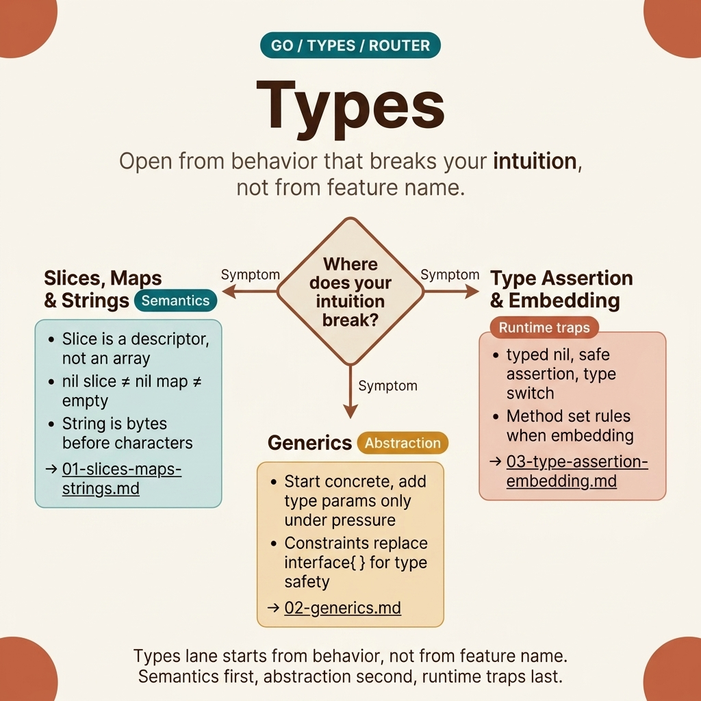

<!-- tags: golang, overview -->
# Types — Slices, maps, generics, type assertions

> Go type system: slices/maps internals, generics (Go 1.18+), type assertion & embedding.

📅 Updated: 2026-04-19 · ⏱️ 6 min read

## 1. DEFINE

The Go type system has no classes and no inheritance. However, slices (reference semantics hidden behind value syntax), generics (Go 1.18+), and type assertions (runtime introspection) form a distinct foundation.

This hub does not exist to merely list files. It exists to help you choose the correct entry point into `fundamental/types`: where to start, which articles to read sequentially, and which lane to take when encountering actual symptoms.

### 1.1 Signals & Boundaries

- Open this hub when you know you are inside the `fundamental/types` cluster but are unsure which article to read first.
- The focus of this hub is mapping pain points to the correct documentation, not replacing detailed articles.
- If you continuously jump between articles and still feel uncertain, it is usually because you chose the wrong starting lane, not because you lack definitions.

### 1.2 Learning Lanes

- `Type System — Slices, Maps, Strings` is the natural entry point if you want a clear foothold before diving deeper.
- `Generics — Type Parameters, Constraints, Generic Patterns` is more appropriate when you need to connect to an adjacent lane or expand from foundations to production concerns.
- Use this hub as a navigation map: after finishing an article, return here to choose the next step purposefully.

## 2. VISUAL

The `types` lane should not be opened based on feature names. It should be opened starting from the behavior that contradicts your intuition. The router map below maintains this pacing: semantics first, abstractions second, runtime traps last.



*Figure: The router map for the `types` lane divides the cluster by the three strongest symptom groups: collection semantics, generic abstraction pressure, and runtime/interface composition traps.*

Once the symptom is identified correctly, the pseudo-router below acts as a summary. Its real value is ensuring you do not confuse articles on slice behavior with articles on generics or nil-interface traps.

## 3. CODE

The router map provides visual directions. The pseudo-code below compresses that navigation logic into an artifact for the team.

### Example 1: Router artifact — selecting an article based on reading goals

> **Goal**: Turn this hub into a navigation tool instead of a passive link list.
> **Approach**: Map the learning goal or symptom to the correct starting file.
> **Example**: Choose a lane based on concerns like fundamentals, framework, concurrency, or production ops.
> **Complexity**: O(1) for navigation; the important part is choosing the right entry point.

```text
func chooseLane(goal string) string {
    switch goal {
    case "slices maps strings": return "./01-slices-maps-strings.md"
    case "generics": return "./02-generics.md"
    case "type assertion embedding": return "./03-type-assertion-embedding.md"
    case "comparable": return "./04-comparable.md"
    default: return "./README.md"
    }
}
```

This pseudo-router is not code to run in an app; it compresses the navigational intent of the hub into a concise artifact. Reading the hub with this intent will keep your learning pace more continuous.

## 4. PITFALLS

A navigation hub is valuable when used correctly — not when skimming through it and then jumping straight into the hardest article.

| # | Severity | Error | Consequence | Fix |
| --- | --- | --- | --- | --- |
| 1 | 🔴 Fatal | Using the hub as a link list to skim | Fragmented learning and selecting wrong entry points | Always start from a specific pain point or learning goal |
| 2 | 🟡 Common | Jumping straight into advanced articles without a foundation | Understanding terms in isolation and misapplying them | Select an entry point and follow the cluster's pace |
| 3 | 🔵 Minor | Not returning to the hub after reading | Losing the connection between articles | Return to the hub after each lane to select the next step |

## 5. REF

| Resource | Type | Link | Notes |
| --- | --- | --- | --- |
| Go Blog — Strings in Go | Official | https://go.dev/blog/strings | Source of truth for string/byte/rune semantics |
| Go Blog — Go Slices: usage and internals | Official | https://go.dev/blog/slices-intro | The classic foundation for slice behavior and internals |
| Go Tutorial — Generics | Official | https://go.dev/doc/tutorial/generics | The official entry point for type parameters and constraints |
| Go Spec — Types | Official | https://go.dev/ref/spec#Types | Source of truth for named types, assignability, and composite types |

## 6. RECOMMEND

This cluster provides a map. Choose the lane matching your current problem:

| Extension | When to Read Next | Rationale | File/Link |
| --- | --- | --- | --- |
| Type System — Slices, Maps, Strings | When you need a clear entry point | Maintains continuous reading pace within the cluster | [./01-slices-maps-strings.md](./01-slices-maps-strings.md) |
| Generics — Type Parameters | When you want to connect to an adjacent lane | Maintains continuous reading pace within the cluster | [./02-generics.md](./02-generics.md) |
| Type Assertions & Embedding | When symptoms hit nil-interface traps, runtime assertions, or behavior promotion | This is the third lane of the `types` cluster and should not be dropped from recommendations | [./03-type-assertion-embedding.md](./03-type-assertion-embedding.md) |
| Comparable — The Gatekeeper | When you need `==` in generic code, Set/Cache patterns, or the interface trap | Bridges generics and interfaces — the `comparable` constraint is where they intersect | [./04-comparable.md](./04-comparable.md) |
| Go Programming | When you need to change Go clusters | Return to the root router to select another lane | [../README.md](../README.md) |
