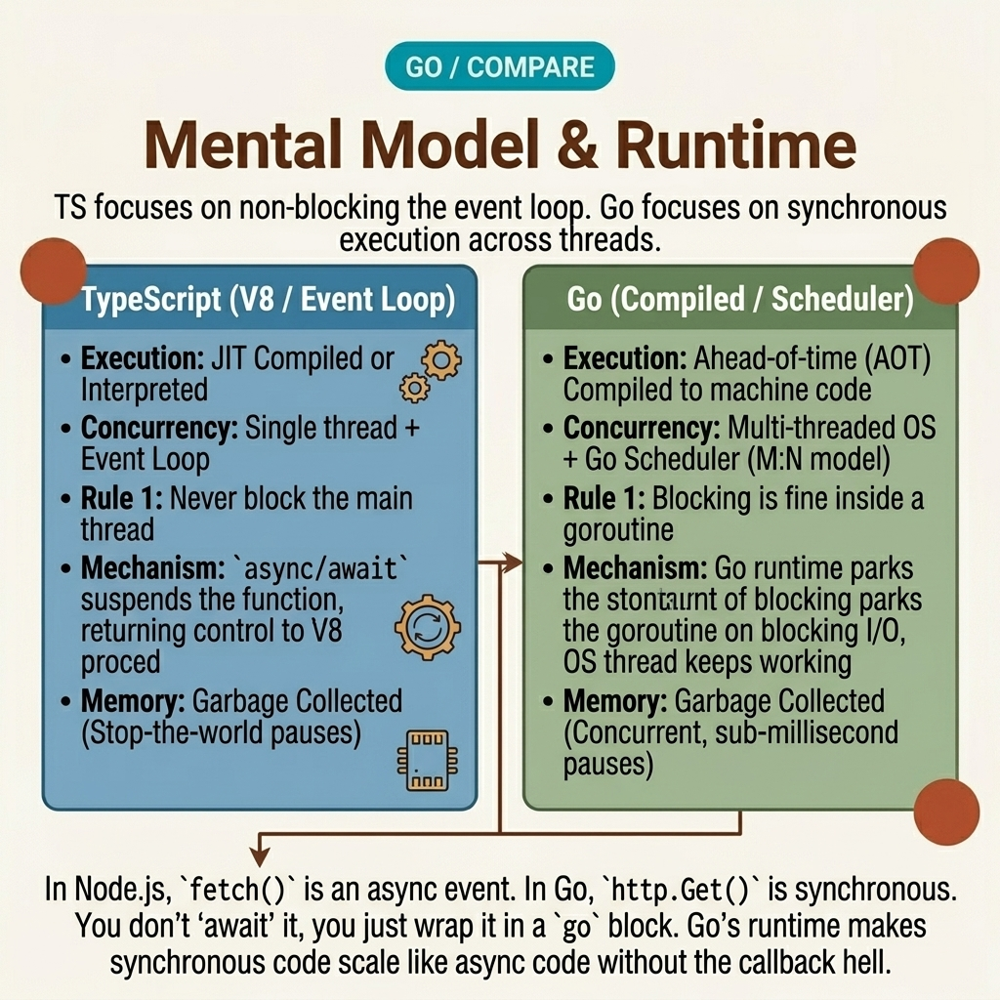

<!-- tags: golang, typescript, runtime --> # 🧭 Mô hình tinh thần & Runtime — Từ lớp loại đến ngôn ngữ biên dịch.

> Bài học đầu tiên dành cho các kỹ sư TypeScript khi chuyển sang Go : những khác biệt chính trong runtime , quyền sở hữu, ranh giới package , giá trị 0 và cách Go muốn bạn thiết kế mã của mình.

📅 Đã tạo: 2026-04-06 · 🔄 Đã cập nhật: 19-04-2026 · ⏱️ 16 phút đọc

| Khía cạnh | Chi tiết |
| --- | --- |
| **Tập trung** | mô hình Runtime , ngữ nghĩa giá trị, ranh giới package |
| **Trường hợp sử dụng** | 1-3 ngày đầu tiên khi bắt đầu viết Go sau nhiều năm sử dụng TypeScript |
| **Khác biệt về phím** | TypeScript là một lớp kiểu trên JavaScript; Go là một ngôn ngữ được biên dịch với runtime |
| ** Go stdlib** | `context` , `fmt` , `net/http` , `sync/atomic` |

## 1. ĐỊNH NGHĨA

Bạn vừa chuyển một trình xử lý từ NestJS sang Go . Tên hàm tương tự, DTO tương tự, trình biên dịch có màu xanh. Nhưng vài giờ sau, bạn gặp phải ba điều bất ngờ.

- Trường không được khởi tạo nhưng vẫn có giá trị hợp lệ vì giá trị bằng 0.
- Một phương thức sửa đổi trạng thái nhưng không có gì thay đổi vì bạn sử dụng value receiver .
- An interface không cần `implements` , nhưng trình biên dịch vẫn coi là thỏa mãn.

Đó là lúc bạn nhận ra: sự khác biệt thực sự không phải ở cú pháp. TypeScript chủ yếu giúp bạn xác minh chương trình JavaScript của mình trước khi chạy nó. Go đưa hệ thống kiểu, ranh giới package , bố cục bộ nhớ và công cụ xây dựng vào một tệp nhị phân được biên dịch duy nhất.

### 1.1 TypeScript và Go bảo vệ bạn ở hai lớp khác nhau.

TypeScript, theo Sổ tay chính thức, là một trình kiểm tra kiểu tĩnh cho các chương trình JavaScript. Sự đảm bảo mạnh mẽ nhất của nó hoạt động trước runtime - sau khi biên dịch, bạn vẫn chạy trên công cụ JavaScript và [[E11]]] của nó.

Điều này kéo theo ba hậu quả:

1. Trong TypeScript, nhiều đảm bảo nằm trong trình biên dịch hoặc khung công tác.
2. Trong Go , các đảm bảo nằm trong ngôn ngữ + package ranh giới + hành vi runtime .
3. Trong TypeScript, bạn thường tối ưu hóa công thái học của nhà phát triển thông qua tính trừu tượng. Trong Go , bạn thường tối ưu hóa khả năng đọc, khả năng dự đoán và tính rõ ràng.

### 1.2 4 rewire bạn phải làm sớm nhé.

** Packages là ranh giới kiến trúc, không phải thư mục trang trí.** 
Trong Go , chữ thường/chữ hoa không chỉ là kiểu dáng - nó quyết định API công khai của package . Bạn ẩn các bất biến đằng sau ranh giới xuất khẩu mà không cần `private/protected` .

**Giá trị 0 là một tính năng, không phải lỗi.** `var cfg Config` là một đối tượng hợp lệ ở cấp độ ngôn ngữ. Nhưng liệu nó có hợp lệ trong kinh doanh hay không vẫn là trách nhiệm của hàm tạo hoặc hàm xác thực.

**Giá trị so với pointer là quyết định hành vi.** 
Trong TypeScript, các đối tượng tuân theo ngữ nghĩa tham chiếu được chia sẻ tại runtime . Trong Go , bạn phải quyết định khi nào nên sao chép giá trị và khi nào nên sử dụng pointers — bộ phương thức sẽ thay đổi tương ứng.

** Interfaces do người tiêu dùng xác định.** Go không muốn bạn xây dựng hệ thống phân cấp lớp và sau đó điền vào `implements` . Nó muốn package sử dụng phần phụ thuộc để nói "Tôi cần chính xác 1-2 phương thức này", sau đó cho phép trình biên dịch kiểm tra ngầm.

### 1.3 Các kiểu bất biến và lỗi

- Giá trị 0 thuận tiện nhưng không tự động mã hóa các biến nghiệp vụ. Việc biên dịch `User{}` không có nghĩa là tên miền hợp lệ.
- Pointer receiver phải là lựa chọn mặc định khi trạng thái đột biến hoặc phương thức struct đủ lớn để việc sao chép là vô nghĩa.
- Không mang các bộ trang trí, bộ chứa DI , mô hình nhà cung cấp theo phạm vi yêu cầu từ NestJS vào Go chỉ vì "nhóm đã quen với việc đó". Hầu hết time bạn đang nhập độ phức tạp của khung mà không nhận được giá trị bổ sung.

## 2. HÌNH ẢNH

Phần khó hiểu nhất không phải là định nghĩa mà là sự đảm bảo thực sự nằm ở đâu. Hai sơ đồ dưới đây cho thấy điểm chính xác đó.

### Cấp 1```text
TypeScript path
source.ts
    -> tsc checks types
        -> output JavaScript
            -> Node.js / browser runtime
                -> framework / library conventions

Go path
source.go
    -> go build / go test
        -> native binary
            -> Go runtime
                -> stdlib + package boundaries
``` *Hình: Cấp độ 1 cho thấy rằng TypeScript và Go đều biên dịch, nhưng nơi triển khai đảm bảo thực tế lại rất khác nhau.*.

### Cấp 2```text
TypeScript
  type safety ........ mostly before runtime
  object model ....... JavaScript semantics
  async model ........ event loop + Promise
  architecture ....... framework shapes a lot of decisions

Go
  type safety ........ compiler + method sets + package exports
  object model ....... structs, pointers, zero values
  async model ........ goroutines + channels + context
  architecture ....... stdlib + simple composition
```*Hình: Cấp độ 2 nhấn mạnh nguồn gốc của hầu hết các lỗi chuyển đổi hệ thống: bạn nghĩ rằng bạn đang thay đổi cú pháp, nhưng thực ra bạn đang thay đổi cơ chế vận hành.*.

## 3. MÃ

Khi mô hình tinh thần không bị khóa, mã Go rất dễ "nhìn đúng". Ba ví dụ dưới đây tóm tắt những vị trí thường đánh lừa các kỹ sư TypeScript nhất.

### Ví dụ 1: Cơ bản — giá trị 0 rất hữu ích, nhưng hàm tạo mới giữ bất biến.

> **Mục tiêu**: Hiểu rằng giá trị 0 trong Go là một tính năng ngôn ngữ, nhưng các bất biến vẫn phải được thực thi một cách rõ ràng.
> **Phương pháp tiếp cận**: Sử dụng struct ​​với các giá trị mặc định hợp lý nhưng thực thi các trường bắt buộc thông qua một hàm tạo.
> **Ví dụ**: `NewServerConfig("billing")` tạo cấu hình hợp lệ; `ServerConfig{}` chỉ là giá trị 0 - nó có thể không hợp lệ trong kinh doanh.

Phiên bản TypeScript bạn thường bắt đầu từ:```typescript
type ServerConfig = {
  serviceName: string;
  timeoutMs: number;
  maxConns: number;
};

function createServerConfig(serviceName: string): ServerConfig {
  if (!serviceName) {
    throw new Error("service name is required");
  }

  return {
    serviceName,
    timeoutMs: 2000,
    maxConns: 100,
  };
}

const cfg = createServerConfig("billing");
console.log(cfg);
```Phiên bản Go tương ứng:```go
package main

import (
	"fmt"
	"time"
)

type ServerConfig struct {
	ServiceName string
	Timeout     time.Duration
	MaxConns    int
}

func NewServerConfig(serviceName string) (ServerConfig, error) {
	if serviceName == "" {
		return ServerConfig{}, fmt.Errorf("service name is required")
	}

	return ServerConfig{
		ServiceName: serviceName,
		Timeout:     2 * time.Second, // zero value will not give you this default
		MaxConns:    100,
	}, nil
}

func main() {
	var zero ServerConfig
	fmt.Printf("zero value: %+v\n", zero)

	cfg, err := NewServerConfig("billing")
	if err != nil {
		panic(err)
	}

	fmt.Printf("constructed: %+v\n", cfg)
}
```> **Takeaway**: Giá trị 0 mang lại cho bạn một đối tượng hợp lệ về ngôn ngữ. Một hàm tạo cung cấp cho bạn một đối tượng hợp lệ theo miền. Đây không phải là điều tương tự.

### Ví dụ 2: Trung cấp — do người tiêu dùng xác định interface , không cần `implements` .

> **Mục tiêu**: Hiểu rằng Go ưu tiên các hợp đồng nhỏ được xác định ở nơi sử dụng các phần phụ thuộc chứ không phải trong nhà cung cấp package .
> **Phương pháp tiếp cận**: Xác định interface trong tiêu dùng package . Hãy để loại bê tông thỏa mãn nó một cách ngầm định.
> **Ví dụ**: `ProfileService` chỉ cần một phương thức `Load` duy nhất.

Phiên bản TypeScript quen thuộc:```typescript
interface Profile {
  id: string;
  name: string;
}

interface ProfileLoader {
  load(id: string): Promise<Profile>;
}

class MemoryStore implements ProfileLoader {
  constructor(private readonly data: Record<string, Profile>) {}

  async load(id: string): Promise<Profile> {
    const profile = this.data[id];
    if (!profile) {
      throw new Error(`profile ${id} not found`);
    }
    return profile;
  }
}

class ProfileService {
  constructor(private readonly loader: ProfileLoader) {}

  async greeting(id: string): Promise<string> {
    const profile = await this.loader.load(id);
    return `hello ${profile.name}`;
  }
}
```Phiên bản Go tương ứng:```go
package main

import (
	"context"
	"fmt"
)

type Profile struct {
	ID   string
	Name string
}

type ProfileLoader interface {
	Load(ctx context.Context, id string) (Profile, error)
}

type MemoryStore struct {
	data map[string]Profile
}

func (s MemoryStore) Load(ctx context.Context, id string) (Profile, error) {
	profile, ok := s.data[id]
	if !ok {
		return Profile{}, fmt.Errorf("profile %s not found", id)
	}
	return profile, nil
}

type ProfileService struct {
	loader ProfileLoader
}

func NewProfileService(loader ProfileLoader) ProfileService {
	return ProfileService{loader: loader}
}

func (s ProfileService) Greeting(ctx context.Context, id string) (string, error) {
	profile, err := s.loader.Load(ctx, id)
	if err != nil {
		return "", err
	}
	return "hello " + profile.Name, nil
}

func main() {
	store := MemoryStore{
		data: map[string]Profile{"u-1": {ID: "u-1", Name: "Mina"}},
	}

	service := NewProfileService(store)
	msg, err := service.Greeting(context.Background(), "u-1")
	if err != nil {
		panic(err)
	}

	fmt.Println(msg)
}
```> **Tại sao?** Các kỹ sư TypeScript đã quen với việc interfaces được xác định trong nhà cung cấp packages hoặc được gắn vào các vùng chứa DI . Go đảo ngược điều này: người tiêu dùng khai báo những gì họ cần và nhà sản xuất chỉ cần có phương pháp phù hợp.

> **Takeaway**: Hãy để package tiêu thụ xác định interface . Đây là một trong những thay đổi tinh thần lớn nhất từ ​​TypeScript nặng về OOP sang Go .

### Ví dụ 3: Nâng cao — pointer receiver ​​vs value receiver thay đổi hoàn toàn kết quả.

> **Mục tiêu**: Tránh nhầm lẫn khi cho rằng bạn đã thay đổi trạng thái khi thực sự chỉnh sửa một bản sao.
> **Phương pháp tiếp cận**: So sánh các phương thức trên value receiver với pointer receiver .
> **Ví dụ**: `Add` trên value receiver không thay đổi bộ đếm ban đầu; `AddInPlace` trên pointer receiver thì có.

Phiên bản TypeScript, trong đó đột biến đối tượng mặc định tuân theo ngữ nghĩa tham chiếu:```typescript
class Counter {
  total = 0;

  add(n: number) {
    this.total += n;
  }
}

const counter = new Counter();
counter.add(5);
console.log("after add:", counter.total); // 5

const alias = counter;
alias.add(10);
console.log("after alias add:", counter.total); // 15
```Phiên bản Go tương ứng:```go
package main

import "fmt"

type Counter struct {
	total int
}

// Value receiver: operates on a copy
func (c Counter) Add(n int) {
	c.total += n
}

// Pointer receiver: modifies the original
func (c *Counter) AddInPlace(n int) {
	c.total += n
}

func main() {
	counter := Counter{}

	counter.Add(5)
	fmt.Println("after Add:", counter.total) // 0

	counter.AddInPlace(5)
	fmt.Println("after AddInPlace:", counter.total) // 5

	copyCounter := counter
	copyCounter.AddInPlace(10)
	fmt.Println("copy:", copyCounter.total)   // 15
	fmt.Println("orig:", counter.total)       // 5
}
```> **Tại sao?** Trong Go , phương thức receivers là một phần của ngữ nghĩa, không chỉ là cú pháp. Các nhà phát triển TypeScript đã quen với việc phản đối các đột biến theo các tham chiếu một cách tự nhiên. Go buộc bạn phải rõ ràng: sao chép là sao chép, pointer là pointer .

> **Bài học rút ra**: Nếu một phương thức cần thay đổi trạng thái hoặc struct đủ lớn khiến việc sao chép trở nên lãng phí, hãy sử dụng pointer receiver . Không trộn lẫn value/ pointer receivers trừ khi bạn hiểu các bộ phương thức và ý nghĩa của chúng.

## 4. Cạm bẫy

| # | Mức độ nghiêm trọng | Lỗi | Hậu quả | Sửa chữa |
| --- | --- | --- | --- | --- |
| 1 | 🔴 Gây tử vong | Xử lý giá trị 0 làm đối tượng kinh doanh mặc định | Thực thể/config biên dịch nhưng vi phạm bất biến | Sử dụng hàm tạo hoặc `Validate()` để phân tách tính hợp lệ của cú pháp khỏi tính hợp lệ của miền |
| 2 | 🟡 Chung | Đưa hệ thống phân cấp lớp hoặc vùng chứa DI từ TypeScript sang Go | Mã nặng về tính trừu tượng, khó đọc, khó gỡ lỗi và không có tính thành ngữ | Bắt đầu với struct + nhỏ interface + hàm tạo rõ ràng |
| 3 | 🔵 Nhỏ | Trộn giá trị và pointer receivers không có chủ ý | Đột biến không hoạt động như mong đợi | Quy ước: các phương thức đột biến và sử dụng structs lớn pointer receivers |

## 5. GIỚI THIỆU

| Tài nguyên | Loại | Liên kết | Lưu ý |
| --- | --- | --- | --- |
| Cẩm nang TypeScript | Chính thức | https://www.typescriptlang.org/docs/handbook/intro.html | Xác nhận TypeScript là trình đánh máy tĩnh cho JavaScript |
| Có hiệu lực Go | Chính thức | https://go.dev/doc/effect_go | Đường cơ sở thành ngữ cho các ranh giới package , interfaces , receivers và composition |
| Go Spec — Bộ phương thức | Chính thức | https://go.dev/ref/spec#Method_sets | Nguồn chân lý phân biệt value receiver vs pointer receiver |

## 6. KHUYẾN NGHỊ

Cốt lõi của **Mô hình tinh thần & Runtime ** rất rõ ràng. Các nhánh mở rộng bên dưới giúp bạn đưa sự hiểu biết về Go runtime vào sản xuất với các loại, xử lý lỗi và concurrency .
| Gia hạn | Khi nào | Cơ sở lý luận | Liên kết |
| --- | --- | --- | --- |
| Các loại & mô hình hóa dữ liệu | Khi bắt đầu chuyển DTO, thực thể và cấu hình | Mô hình tư duy đúng phải đi kèm với hình dạng dữ liệu chính xác | [→ 02-types-data-modeling](./02-types-data-modeling.md) |
| Lớp → Struct | Khi bạn muốn dịch các lớp sang structs một-một | Giúp loại bỏ dần sự trừu tượng hóa OOP không cần thiết | [→ 12-class-struct](../helper/12-class-struct.md) |
| Type Assertion & Embedding | Khi phương thức được đặt, sự hài lòng của interface hoặc embedding vẫn không rõ ràng | Đi sâu hơn vào cơ chế loại đằng sau mô hình tinh thần | [→ 03-type-assertion-embedding](../types/03-type-assertion-embedding.md) |
| Bố cục dự án, Dụng cụ, Kiểm tra | Khi bạn hiểu mã Go nhưng không quen với cách các nhóm Go xây dựng và vận chuyển | Phân biệt quy trình làm việc, không chỉ cú pháp | [→ 04-project-layout-tooling](./04-project-layout-tooling-testing.md) |

**Điều hướng**: [← Previous](./README.md) · [→ Next](./02-types-data-modeling.md)