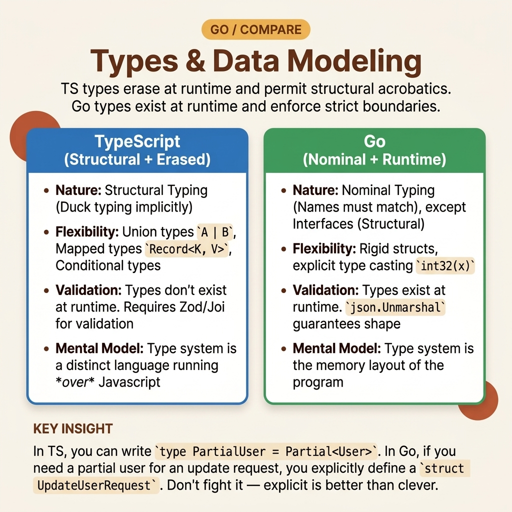

<!-- tags: golang, typescript, data-structures --> # 🧱 Loại & Mô hình hóa dữ liệu - Từ Liên kết, Tùy chọn, Lớp đến Cấu trúc và Các loại được đặt tên.

> Cách map định hình dữ liệu từ TypeScript sang Go mà không bỏ đi các bất biến: tùy chọn, enum, liên kết, interfaces , slices / maps và ranh giới giữa DTO và miền.

📅 Đã tạo: 2026-04-06 · 🔄 Đã cập nhật: 19-04-2026 · ⏱️ 17 phút đọc

| Khía cạnh | Chi tiết |
| --- | --- |
| **Tập trung** | Structs , loại được đặt tên, tùy chọn, loại giống như enum, interfaces |
| **Trường hợp sử dụng** | Cổng DTO, thực thể, cấu hình, hợp đồng yêu cầu/phản hồi từ TypeScript đến Go |
| **Khác biệt về phím** | TypeScript ưu tiên tính linh hoạt của hình dạng; Go ưu tiên các mô hình dữ liệu rõ ràng và dữ liệu gần bất biến |
| ** Go stdlib** | `encoding/json` , `errors` , `fmt` |

## 1. ĐỊNH NGHĨA

Bạn đang chuyển API hợp đồng từ TypeScript:

- `status: "draft" | "paid" | "cancelled"` - `couponCode?: string` - `customer: User | Guest` - `class Order { ... }` Nếu cố gắng dịch từng dòng một thành Go , bạn sẽ nhanh chóng rơi vào ba lỗi quen thuộc:

- Biến tất cả các trường tùy chọn thành pointers , khiến mô hình nặng và khó đọc.
- Sử dụng `interface{}` hoặc `map[string]any` để mô phỏng các đoàn thể một cách nhanh chóng.
- Chèn hành vi miền vào mọi struct như thể bảo toàn mô hình lớp TypeScript. Go không cấm bạn làm như vậy. Nhưng nó cũng không thưởng cho bạn khi làm như vậy. Các mô hình dữ liệu tốt trong Go thường nhỏ, rõ ràng và mã hóa ranh giới rõ ràng: DTO là DTO, miền là miền, tính bền vững là tính bền vững.

### 1.1 Kiểu gõ cấu trúc của TypeScript và kiểu được đặt tên của Go khác nhau như thế nào?

TypeScript rất mạnh trong việc suy ra khả năng tương thích hình dạng giữa các đối tượng. Điều đó cực kỳ hữu ích cho các cơ sở mã nặng về giao diện người dùng và API nặng. Go ưu tiên các loại, bộ phương thức và khả năng hiển thị trường được đặt tên rõ ràng hơn. Interfaces trong Go hoàn toàn được thỏa mãn — struct chỉ cần các phương pháp phù hợp.

Một quy tắc thực dụng:

- Nếu dữ liệu vượt qua ranh giới mạng hoặc tệp: sử dụng struct với thẻ rõ ràng.
- Nếu giá trị có ý nghĩa miền riêng: tạo loại được đặt tên thay vì để trống `string` .
- Nếu trạng thái có tập hữu hạn: sử dụng `type Status string` + hằng số + xác thực.

### 1.2 Tùy chọn, nullable, giá trị 0: ba thứ này không phải là một.

Trong TypeScript, `field?: string` , `field: string | null` và `field: string | undefined` thường được sử dụng khá linh hoạt. Trong Go , bạn nên phân tách rõ ràng:

- **Trường bắt buộc nhưng có giá trị 0 hợp lệ**: sử dụng trực tiếp loại giá trị.
- **Trường thực sự là tùy chọn ở ranh giới**: sử dụng pointer hoặc trình bao bọc tùy chỉnh.
- **Trường bắt buộc trong miền nhưng tùy chọn trong đầu vào**: DTO có thể sử dụng pointer , miền không thể.

Đừng để toàn bộ mô hình biến thành một khu rừng pointer chỉ vì đầu vào JSON cho phép nó để trống.

### 1.3 Các kiểu bất biến và lỗi

- `nil map` có thể đọc được, nhưng viết sẽ panic .
- `nil slice` an toàn hơn `nil map` ; nối thêm, hành vi JSON sẽ khác nhau tùy thuộc vào mục đích của API.
- `map[string]any` và `interface{}` là cách thoát nhanh nhưng cũng là cách nhanh nhất để mang tính năng gõ động trở lại.

Trước khi viết một `struct` khác, hãy xem vấn đề này như một phép chuyển đổi dữ liệu pipeline .

## 2. HÌNH ẢNH

Điểm nguy hiểm nhất của mô hình hóa dữ liệu không nằm ở cú pháp mà nằm ở việc trộn lẫn ranh giới và bất biến. Sơ đồ dưới đây phân tách chúng.

### Cấp 1```text
TypeScript input shape
    -> DTO / schema
        -> domain object
            -> persistence shape

Go input shape
    -> request DTO struct
        -> validation / translation
            -> domain struct with invariants
                -> storage DTO or row model
``` *Hình: Cấp độ 1 nhấn mạnh rằng Go khuyến khích bạn dịch dữ liệu qua các ranh giới thay vì giữ nguyên hình dạng "sử dụng ở mọi nơi".*.

### Cấp 2```text
TS concept                Go mapping
------------------------------------------------------------
optional field            pointer field or separate DTO layer
string literal union      named string type + const + Validate
class with methods        struct + methods or service around struct
discriminated union       interface + concrete structs + type switch
Record<string, T>         map[string]T
readonly domain field     unexported field + constructor/getter
```*Hình ảnh: Cấp độ 2 không phải là bảng dịch một-một tuyệt đối; đây là điểm khởi đầu an toàn để tránh chuyển quá mức cú pháp.*.

## 3. MÃ

Nếu mô hình tinh thần đúng nhưng mô hình dữ liệu sai, bạn vẫn sẽ gặp lỗi. Ba ví dụ dưới đây khóa các ánh xạ quan trọng nhất.

### Ví dụ 1: Cơ bản - DTO tùy chọn ở ranh giới, miền rõ ràng.

> **Mục tiêu**: Tách yêu cầu DTO khỏi đối tượng miền thay vì sử dụng một struct cho mọi thứ.
> **Phương pháp tiếp cận**: Yêu cầu struct sử dụng pointers ​​cho các trường tùy chọn; đối tượng miền thực thi các bất biến thông qua hàm tạo của nó.
> **Ví dụ**: `couponCode` có thể vắng mặt trong JSON, nhưng miền `Order` không cần phải bao gồm tất cả các tùy chọn đó.

Phiên bản TypeScript của bạn thường có sẵn ở ranh giới API:```typescript
type CreateOrderRequest = {
  id: string;
  amount: number;
  couponCode?: string;
};

class Order {
  constructor(
    readonly id: string,
    readonly amount: number,
    readonly couponCode: string = "",
  ) {
    if (!id) throw new Error("id is required");
    if (amount <= 0) throw new Error("amount must be positive");
  }
}

const req: CreateOrderRequest = { id: "ord-1", amount: 1200 };
const order = new Order(req.id, req.amount, req.couponCode ?? "");
console.log(order);
```Phiên bản Go tương ứng:```go
package main

import (
	"encoding/json"
	"fmt"
)

type CreateOrderRequest struct {
	ID         string  `json:"id"`
	Amount     int64   `json:"amount"`
	CouponCode *string `json:"couponCode,omitempty"`
}

type Order struct {
	ID         string
	Amount     int64
	CouponCode string
}

func NewOrder(req CreateOrderRequest) (Order, error) {
	if req.ID == "" {
		return Order{}, fmt.Errorf("id is required")
	}
	if req.Amount <= 0 {
		return Order{}, fmt.Errorf("amount must be positive")
	}

	order := Order{ID: req.ID, Amount: req.Amount}
	if req.CouponCode != nil {
		order.CouponCode = *req.CouponCode
	}
	return order, nil
}

func main() {
	raw := []byte(`{"id":"ord-1","amount":1200}`)

	var req CreateOrderRequest
	if err := json.Unmarshal(raw, &req); err != nil {
		panic(err)
	}

	order, err := NewOrder(req)
	if err != nil {
		panic(err)
	}

	fmt.Printf("%+v\n", order)
}
```> **Takeaway**: Tính tùy chọn là mối quan tâm về ranh giới. Các đối tượng miền phải bất biến hơn các đối tượng ranh giới.

Ranh giới đã tách xong. Nhưng nếu trạng thái vẫn còn trống `string` , thì bất biến vẫn bị rò rỉ ở một nơi khác.

### Ví dụ 2: Trung cấp — liên kết chuỗi trong TypeScript phải là loại được đặt tên có xác thực.

> **Mục tiêu**: Tránh `string` trống đối với các giá trị trạng thái có tập hợp hữu hạn các tùy chọn hợp lệ.
> **Phương pháp tiếp cận**: Sử dụng loại chuỗi được đặt tên với các hằng số và phương thức `Validate()` .
> **Ví dụ**: `OrderStatus` thay vì `"draft" | "paid" | "cancelled"` .

Các phiên bản TypeScript thường bắt đầu từ một sự kết hợp theo nghĩa đen:```typescript
type OrderStatus = "draft" | "paid" | "cancelled";

type Order = {
  id: string;
  status: OrderStatus;
};

function createOrder(id: string, status: OrderStatus): Order {
  if (!id) {
    throw new Error("id is required");
  }
  return { id, status };
}

console.log(createOrder("ord-2", "paid"));
```Phiên bản Go tương ứng:```go
package main

import "fmt"

type OrderStatus string

const (
	StatusDraft     OrderStatus = "draft"
	StatusPaid      OrderStatus = "paid"
	StatusCancelled OrderStatus = "cancelled"
)

func (s OrderStatus) Validate() error {
	switch s {
	case StatusDraft, StatusPaid, StatusCancelled:
		return nil
	default:
		return fmt.Errorf("invalid order status %q", s)
	}
}

type Order struct {
	ID     string
	Status OrderStatus
}

func NewOrder(id string, status OrderStatus) (Order, error) {
	if id == "" {
		return Order{}, fmt.Errorf("id is required")
	}
	if err := status.Validate(); err != nil {
		return Order{}, err
	}
	return Order{ID: id, Status: status}, nil
}

func main() {
	order, err := NewOrder("ord-2", StatusPaid)
	if err != nil {
		panic(err)
	}
	fmt.Printf("%+v\n", order)
}
```> **Tại sao?** Các kết hợp theo nghĩa đen của TypeScript cung cấp cho bạn các ràng buộc biên dịch- time một cách rất tự nhiên. Trong Go , loại được đặt tên + hằng số + xác thực là cách đơn giản nhất để duy trì cùng một mục đích mà không cần kỹ thuật quá mức. Nó rõ ràng hơn và có quy mô tốt.

> **Bài học rút ra**: Nếu một giá trị có ý nghĩa miền riêng, hãy đặt loại riêng cho giá trị đó. Bare `string` là một trách nhiệm đắt đỏ khi cơ sở mã phát triển.

Tại thời điểm này, hình dạng dữ liệu nhiều hơn solid . Phần còn lại là khi một giá trị có nhiều biến thể hành vi chứ không chỉ nhiều trường.

### Ví dụ 3: Nâng cao — hành vi kết hợp phải là một loại công tắc được điều khiển interface + nhỏ.

> **Mục tiêu**: Xem cách Go xử lý "một trong nhiều biến thể" mà không rơi vào `map[string]any` .
> **Phương pháp tiếp cận**: Sử dụng interfaces nhỏ cho hành vi thông thường, sau đó nhập công tắc khi cần các nhánh cụ thể.
> **Ví dụ**: `Customer` có thể là khách hoặc người dùng đã đăng ký.

Phiên bản TypeScript với sự kết hợp phân biệt đối xử:```typescript
type GuestCustomer = {
  kind: "guest";
  email: string;
};

type RegisteredCustomer = {
  kind: "registered";
  id: string;
  email: string;
};

type Customer = GuestCustomer | RegisteredCustomer;

function shippingRule(customer: Customer): string {
  switch (customer.kind) {
    case "guest":
      return `guest checkout for ${customer.email}`;
    case "registered":
      return `saved profile checkout for ${customer.email}`;
  }
}
```Phiên bản Go tương ứng:```go
package main

import "fmt"

type Customer interface {
	Label() string
	IsGuest() bool
}

type GuestCustomer struct {
	Email string
}

func (g GuestCustomer) Label() string { return "guest:" + g.Email }
func (g GuestCustomer) IsGuest() bool { return true }

type RegisteredCustomer struct {
	ID    string
	Email string
}

func (r RegisteredCustomer) Label() string { return "user:" + r.ID }
func (r RegisteredCustomer) IsGuest() bool { return false }

func shippingRule(c Customer) string {
	switch v := c.(type) {
	case GuestCustomer:
		return "guest checkout for " + v.Email
	case RegisteredCustomer:
		return "saved profile checkout for " + v.Email
	default:
		return "unsupported customer"
	}
}

func main() {
	customers := []Customer{
		GuestCustomer{Email: "guest@example.com"},
		RegisteredCustomer{ID: "u-1", Email: "mina@example.com"},
	}

	for _, c := range customers {
		fmt.Println(c.Label(), "->", shippingRule(c))
	}
}
```> **Tại sao?** Các kết hợp phân biệt đối xử của TypeScript rất mạnh mẽ nhờ việc thu hẹp luồng điều khiển. Go không có cùng cơ chế, do đó, mẫu thực tế nhất là một interface nhỏ dành cho hành vi phổ biến và chuyển đổi loại tại chính xác các điểm mà bạn cần logic dành riêng cho biến thể.

> **Bài học rút ra**: Khi bạn cần lập mô hình giống liên kết, hãy bắt đầu từ hành vi chung và phân nhánh ở ranh giới. Đừng nhảy thẳng tới động maps .

## 4. Cạm bẫy

Đây là lúc nhiều cổng vẫn có vẻ tốt trên PR nhưng bắt đầu bị lỗi sau một vài lần chạy nước rút.

Lỗi không đến từ cú pháp. Nó xuất phát từ một mô hình không chính xác về mặt ngữ nghĩa.

| # | Mức độ nghiêm trọng | Lỗi | Hậu quả | Sửa chữa |
| --- | --- | --- | --- | --- |
| 1 | 🔴 Gây tử vong | Sử dụng `map[string]any` để mô phỏng nhanh các đoàn thể/đối tượng linh hoạt | Mất bảo đảm biên dịch- time , lỗi type assertion gia tăng | Chỉ sử dụng maps động tại các ranh giới khử lưu huỳnh; tạo các loại được đặt tên ở mọi nơi khác |
| 2 | 🟡 Chung | Biến mọi trường tùy chọn thành pointer | Mô hình nặng, kiểm tra mã nil ở mọi nơi | Chỉ sử dụng pointers cho tùy chọn có ý nghĩa ở ranh giới; miền chứa các trường bắt buộc một cách rõ ràng |
| 3 | 🔵 Nhỏ | Sử dụng `string` trần cho trạng thái, vai trò, loại | Trạng thái không hợp lệ xâm nhập sâu vào hệ thống, phát hiện lỗi muộn | Tạo loại được đặt tên + hằng số + xác thực |

## 5. GIỚI THIỆU

| Tài nguyên | Loại | Liên kết | Lưu ý |
| --- | --- | --- | --- |
| Khả năng tương thích loại | Chính thức | https://www.typescriptlang.org/docs/handbook/type-compatibility.html | Nền tảng gõ cấu trúc của TypeScript |
| Go Spec — Loại | Chính thức | https://go.dev/ref/spec#Types | Nguồn đáng tin cậy cho các loại được đặt tên, trường struct , khả năng gán và loại tổng hợp |
| Go Blog — JSON và Go | Chính thức | https://go.dev/blog/json | Tài liệu tham khảo tốt về ranh giới DTO, thẻ, tùy chọn và hành vi tuần tự hóa |

## 6. KHUYẾN NGHỊ

Phần cốt lõi của **Loại & mô hình hóa dữ liệu** rất rõ ràng. Các nhánh mở rộng bên dưới giúp bạn đưa hệ thống loại Go vào sản xuất khi có lỗi, concurrency và bố cục dự án.

Ở đó, các mô hình dữ liệu tốt hay xấu bắt đầu hiển thị dưới tải thực.

| Gia hạn | Khi nào | Cơ sở lý luận | Liên kết |
| --- | --- | --- | --- |
| Slices , Maps , Chuỗi | Khi bạn cần hiểu ngữ nghĩa bộ sưu tập của Go ở cấp độ runtime | Nền tảng cho sự tăng trưởng slice , hành vi map và nội bộ chuỗi | [→ 01-slices-maps-strings](../types/01-slices-maps-strings.md) |
| Các loại Enum & Union | Khi mô hình có máy trạng thái, enum hoặc phân biệt đối xử | Giúp chọn loại, hằng số được đặt tên hoặc interface + type switch | [→ 06-enum-union-types](../helper/06-enum-union-types.md) |
| Tùy chọn & Nullable | Khi đầu vào có `undefined` , `null` , cập nhật một phần hoặc các trường DB có thể rỗng | Giúp chọn pointer , giá trị 0 hoặc loại trình bao bọc có chủ ý | [→ 11-optional-nullable](../helper/11-optional-nullable.md) |
| Xử lý lỗi | Sau khi mô hình dữ liệu bị khóa và bạn bắt đầu viết luồng miền | Bất biến tốt phải có mô hình lỗi rõ ràng | [→ 07-error-handling](../helper/07-error-handling.md) |
| Lỗi, Concurrency , Ngữ cảnh | Khi DTO/domain là solid và dịch vụ bắt đầu gọi I/O song song | Trường hợp mô hình dữ liệu đáp ứng ngữ nghĩa runtime | [→ 03-errors-concurrency-context](./03-errors-concurrency-context.md) |
| Lớp → Struct | Khi mô hình dữ liệu vẫn còn quá nặng nề | Giúp giảm sự trừu tượng không cần thiết | [→ 12-class-struct](../helper/12-class-struct.md) |

**Điều hướng**: [← Previous](./01-mental-model-runtime.md) · [→ Next](./03-errors-concurrency-context.md)