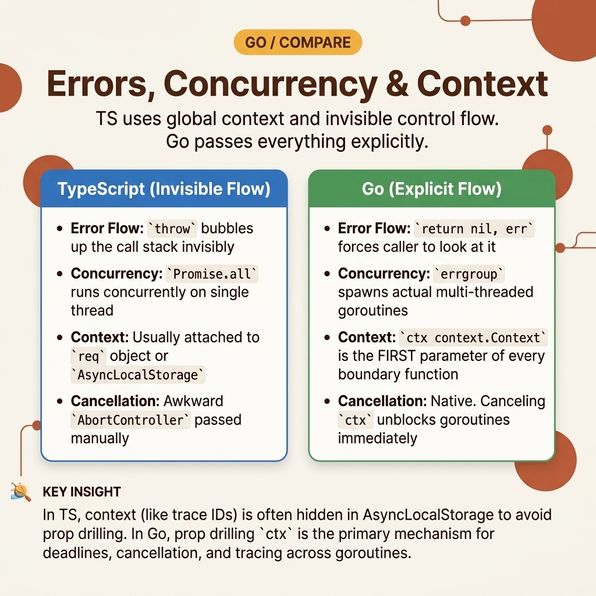

<!-- tags: golang, typescript, concurrency --> # ⚙️ Lỗi, Concurrency , Ngữ cảnh — Từ `throw` và `await` đến `err` , goroutine , context.

> Các bài viết quan trọng nhất khi chuyển dịch vụ từ TypeScript sang Go : luồng lỗi rõ ràng, phân xuất an toàn, hủy, hết thời gian chờ và giới hạn concurrency .

📅 Đã tạo: 2026-04-06 · 🔄 Đã cập nhật: 19-04-2026 · ⏱️ 18 phút đọc

| Khía cạnh | Chi tiết |
| --- | --- |
| **Tập trung** | Lỗi trả về, gói, goroutines , `context` , `errgroup` |
| **Trường hợp sử dụng** | Dịch vụ cổng đang sử dụng `async/await` , `Promise.all` , hết thời gian chờ, hủy bỏ logic |
| **Khác biệt về phím** | TypeScript async chạy trên event loop ; Go concurrency là ngôn ngữ nguyên thủy ở cấp độ ngôn ngữ với khả năng kiểm soát vòng đời rõ ràng |
| ** Go stdlib** | `context` , `errors` , `fmt` , `time` |

## 1. ĐỊNH NGHĨA

Bạn có một dịch vụ TypeScript thực hiện chính xác những gì bạn muốn:

- Gọi 3 API cùng lúc bằng `Promise.all` .
- Hết thời gian chờ với `AbortController` - `throw` khi hạ lưu bị lỗi
- `catch` ở lớp bên ngoài và sau đó map thành phản hồi HTTP.

Khi chuyển sang Go , hầu hết các kỹ sư nghĩ rằng họ chỉ cần:

- `await` -> `<-ch` - `Promise.all` -> vài goroutines - `throw` -> `panic` Đó là cú trượt nguy hiểm nhất. Trong Go , lỗi không phải là một luồng ngoại lệ. Việc hủy bỏ không tự lan truyền trừ khi bạn vượt qua `context.Context` . Goroutines không tự giới hạn, không tự dọn dẹp và không dừng lại trừ khi bạn thiết kế một lối thoát rõ ràng.

### 1.1 Lỗi trong Go là dữ liệu, không phải runtime tác dụng phụ.

TypeScript có thể sử dụng `throw` hoặc từ chối Promise làm đường dẫn luồng điều khiển hợp lệ. Go ưu tiên trả về `error` một cách rõ ràng tại mỗi ranh giới. Điều này có vẻ dài dòng hơn nhưng nó làm cho đường dẫn lỗi và siêu dữ liệu liên quan dễ dàng theo dõi hơn nhiều.

Quy tắc thực dụng:

- Lỗi kinh doanh hoặc I/O: `return err` .
- Bất biến bị người gọi phá vỡ và không thể tiếp tục: xét panic ở ranh giới rất hẹp.
- Mã thư viện: hầu như luôn luôn là `return err` , rất hiếm khi `panic` .

### 1.2 Concurrency trong Go mạnh hơn Promise , nhưng cũng dễ tạo rò rỉ hơn.

TypeScript async về cơ bản là sự phối hợp I/O không chặn trên event loop . Go mang lại cho bạn goroutines rất rẻ, nhưng rẻ không có nghĩa là miễn phí. Any goroutine không có đường dừng rõ ràng có thể trở thành rò rỉ.

Do đó, khi chuyển mã từ TypeScript:

- `Promise.all` thường là maps để `errgroup` .
- `AbortController` thường là maps đến `context.WithCancel` hoặc `WithTimeout` .
- `Promise.race` thường là maps đến `select` .
- Bắn và quên hầu như luôn cần được xem xét lại.

### 1.3 Các kiểu bất biến và lỗi

- Không chuyển `context` xuống phần phụ thuộc có nghĩa là thời gian chờ/hủy ở lớp trên gần như vô dụng.
- Goroutine gửi tới channel mà không có người tiêu dùng sẽ bị chặn vĩnh viễn.
- Sử dụng `panic` thay vì lan truyền lỗi trong mã dịch vụ sẽ khiến việc gỡ lỗi sự cố trở nên tồi tệ hơn chứ không tốt hơn.

Tóm lại: cổng cú pháp nhanh. Cổng vòng đời chậm.

Và chính cái phần chậm chạp đó mới quyết định sự việc.

## 2. HÌNH ẢNH

Bạn chỉ thấy sự khác biệt giữa TypeScript và Go khi xem xét vòng đời yêu cầu song song. Hai sơ đồ này cho góc chính xác đó.

### Cấp 1```text
TypeScript request
request
  -> async function
      -> Promise.all([...])
          -> await results
              -> catch error

Go request
request
  -> context.WithTimeout(...)
      -> errgroup.WithContext(ctx)
          -> g.Go(...) x N
              -> g.Wait()
``` *Hình: Cấp 1 cho thấy rằng fan-out Go không chỉ "chạy song song" mà còn là một vòng đời với ngữ cảnh rõ ràng và lỗi fan-in.*.

### Cấp 2```text
request starts
  -> spawn goroutines
      -> one downstream fails
          -> cancel shared context
              -> siblings must observe ctx.Done()
                  -> return early
                      -> g.Wait() closes the loop
```*Hình: Cấp độ 2 nhấn mạnh những yếu tố quyết định chất lượng sản xuất: một lỗi ở một nhánh phải cố ý dừng các nhánh còn lại chứ không phải do may mắn.*.

## 3. MÃ

Hầu hết các lỗi di chuyển nằm ở luồng lỗi và việc hủy được viết "tương tự". Ba ví dụ bên dưới khóa phiên bản an toàn hơn trong sản xuất.

### Ví dụ 1: Cơ bản - gói lỗi bằng ngữ cảnh thay vì đưa ra các ngoại lệ mơ hồ.

> **Mục tiêu**: Xây dựng mẫu bao bọc `return err` + với ngữ cảnh ở mỗi ranh giới.
> **Phương pháp tiếp cận**: Phân tích cú pháp riêng biệt, xác thực và duy trì. Mỗi lớp thêm ngữ cảnh vào lỗi.
> **Ví dụ**: Tạo người dùng có thông tin nhập không hợp lệ hoặc lỗi lưu trữ.

Các phiên bản TypeScript phổ biến:```typescript
type User = { email: string };

function parseEmail(rawEmail: string): string {
  if (!rawEmail) {
    throw new Error("email is empty");
  }
  return rawEmail;
}

async function saveUser(email: string): Promise<void> {
  if (email === "downstream@fail.local") {
    throw new Error("storage unavailable");
  }
}

async function createUser(rawEmail: string): Promise<User> {
  try {
    const email = parseEmail(rawEmail);
    await saveUser(email);
    return { email };
  } catch (error) {
    throw new Error(`create user failed: ${String(error)}`);
  }
}
```Phiên bản Go tương ứng:```go
package main

import "fmt"

type User struct {
	Email string
}

func parseEmail(raw string) (string, error) {
	if raw == "" {
		return "", fmt.Errorf("email is empty")
	}
	return raw, nil
}

func saveUser(email string) error {
	if email == "downstream@fail.local" {
		return fmt.Errorf("storage unavailable")
	}
	return nil
}

func createUser(rawEmail string) (User, error) {
	email, err := parseEmail(rawEmail)
	if err != nil {
		return User{}, fmt.Errorf("create user: parse email: %w", err)
	}

	if err := saveUser(email); err != nil {
		return User{}, fmt.Errorf("create user: save user %q: %w", email, err)
	}

	return User{Email: email}, nil
}

func main() {
	user, err := createUser("mina@example.com")
	if err != nil {
		panic(err)
	}
	fmt.Println(user.Email)
}
```> **Takeaway**: Trong Go , mức độ chi tiết phù hợp mang lại cho bạn khả năng gỡ lỗi với chi phí thấp vào lúc 3 giờ sáng.

Việc gói lỗi đúng cách sẽ giúp bạn biết chuyện gì đang xảy ra. Việc sản xuất cũng yêu cầu bạn phải dừng những nhánh không nên tiếp tục.

### Ví dụ 2: Trung cấp — `Promise.all` nên map đến `errgroup` + ngữ cảnh chung.

> **Mục tiêu**: Tách ra 3 cuộc gọi xuôi dòng có thời gian chờ và an toàn không nhanh.
> **Phương pháp tiếp cận**: Sử dụng `errgroup.WithContext` để thu thập lỗi và tuyên truyền việc hủy bỏ.
> **Ví dụ**: Tải song song hồ sơ, số dư và hóa đơn trong vòng 500ms.

Phiên bản TypeScript quen thuộc:```typescript
async function fetchPart(name: string, delayMs: number, signal: AbortSignal): Promise<string> {
  await new Promise((resolve, reject) => {
    const timer = setTimeout(resolve, delayMs);
    signal.addEventListener("abort", () => {
      clearTimeout(timer);
      reject(signal.reason ?? new Error("aborted"));
    });
  });

  if (name === "balance") {
    throw new Error(`${name} service timeout`);
  }
  return `${name}:ok`;
}

async function loadDashboard(): Promise<Record<string, string>> {
  const controller = new AbortController();
  const timeout = setTimeout(() => controller.abort(new Error("timeout")), 500);

  try {
    const [profile, balance, invoices] = await Promise.all([
      fetchPart("profile", 200, controller.signal),
      fetchPart("balance", 200, controller.signal),
      fetchPart("invoices", 200, controller.signal),
    ]);

    return { profile, balance, invoices };
  } finally {
    clearTimeout(timeout);
  }
}
```Phiên bản Go tương ứng:```go
package main

import (
	"context"
	"fmt"
	"sync"
	"time"

	"golang.org/x/sync/errgroup"
)

func fetch(ctx context.Context, name string, d time.Duration) (string, error) {
	select {
	case <-time.After(d):
		if name == "balance" {
			return "", fmt.Errorf("%s service timeout", name)
		}
		return name + ":ok", nil
	case <-ctx.Done():
		return "", ctx.Err()
	}
}

func loadDashboard(ctx context.Context) (map[string]string, error) {
	ctx, cancel := context.WithTimeout(ctx, 500*time.Millisecond)
	defer cancel()

	results := map[string]string{}
	var mu sync.Mutex
	g, ctx := errgroup.WithContext(ctx)

	for _, name := range []string{"profile", "balance", "invoices"} {
		name := name
		g.Go(func() error {
			val, err := fetch(ctx, name, 200*time.Millisecond)
			if err != nil {
				return fmt.Errorf("fetch %s: %w", name, err)
			}
			mu.Lock()
			results[name] = val
			mu.Unlock()
			return nil
		})
	}

	if err := g.Wait(); err != nil {
		return nil, err
	}
	return results, nil
}

func main() {
	out, err := loadDashboard(context.Background())
	fmt.Println("results:", out)
	fmt.Println("error:", err)
}
```> **Tại sao?** Đây là cách tương đương gần nhất với `Promise.all` , nhưng có một điểm khác biệt quan trọng về mặt sản xuất: `errgroup` liên kết fan-out với bối cảnh được chia sẻ. Nếu một nhánh bị lỗi, các nhánh còn lại có thể bị hủy và dừng sớm thay vì tiếp tục một cách vô nghĩa.

> **Takeaway**: Khi chuyển `Promise.all` , hãy nghĩ ngay đến `errgroup + context` , chứ không phải "3 goroutines và hy vọng điều tốt nhất".

Fail-fast có sẵn. Nhưng nếu lô tăng lên 1.000 công việc, câu hỏi sẽ thay đổi thành: bạn cho phép chạy bao nhiêu công việc cùng một lúc?

### Ví dụ 3: Nâng cao — giới hạn concurrency + hủy là phiên bản sản xuất của "sa thải nhiều tác vụ".

> **Mục tiêu**: Tránh sinh ra vô hạn goroutines khi xử lý lô lớn.
> **Phương pháp tiếp cận**: Giới hạn số lượng nhân viên, tôn trọng `ctx.Done()` và đóng channels bằng kỷ luật.
> **Ví dụ**: Xử lý 6 công việc với tối đa 2 công nhân.

Phiên bản TypeScript với nhóm giới hạn rõ ràng:```typescript
async function runWorkerPool(jobs: number[], workerCount: number): Promise<string[]> {
  const results: string[] = [];
  let nextIndex = 0;

  async function worker(id: number) {
    while (nextIndex < jobs.length) {
      const job = jobs[nextIndex++];
      await new Promise((resolve) => setTimeout(resolve, 50));
      results.push(`worker-${id} handled job-${job}`);
    }
  }

  await Promise.all(
    Array.from({ length: workerCount }, (_, index) => worker(index + 1)),
  );

  return results;
}
```Phiên bản Go tương ứng:```go
package main

import (
	"context"
	"fmt"
	"sync"
	"time"
)

func worker(ctx context.Context, id int, jobs <-chan int, results chan<- string, wg *sync.WaitGroup) {
	defer wg.Done()

	for {
		select {
		case <-ctx.Done():
			return
		case job, ok := <-jobs:
			if !ok {
				return
			}

			time.Sleep(50 * time.Millisecond)
			results <- fmt.Sprintf("worker-%d handled job-%d", id, job)
		}
	}
}

func main() {
	ctx, cancel := context.WithTimeout(context.Background(), 300*time.Millisecond)
	defer cancel()

	jobs := make(chan int)
	results := make(chan string)

	var wg sync.WaitGroup
	for workerID := 1; workerID <= 2; workerID++ {
		wg.Add(1)
		go worker(ctx, workerID, jobs, results, &wg)
	}

	go func() {
		defer close(jobs)
		for i := 1; i <= 6; i++ {
			jobs <- i
		}
	}()

	go func() {
		wg.Wait()
		close(results)
	}()

	for result := range results {
		fmt.Println(result)
	}
}
```> **Tại sao?** Các nhóm TypeScript đã quen với I/O async rất rẻ, vì vậy họ thường vô thức coi "more concurrency " là một mặc định tốt. Go cho phép bạn tiến xa hơn nhưng cũng yêu cầu bạn quản lý vòng đời của mọi goroutine .

> **Bài học rút ra**: Khi số lượng lô lớn hoặc quá trình hạ nguồn tốn kém, việc giới hạn concurrency là một yêu cầu vận hành chứ không phải tối ưu hóa tùy ý.

## 4. Cạm bẫy

Ba lỗi dưới đây đều có một điểm chung: đánh giá có vẻ hợp lý bằng mắt thường.

Chúng chỉ hiển thị khi hết thời gian chờ, thử lại và lưu lượng truy cập đến cùng một time .

| # | Mức độ nghiêm trọng | Lỗi | Hậu quả | Sửa chữa |
| --- | --- | --- | --- | --- |
| 1 | 🔴 Gây tử vong | Sử dụng `panic` làm `throw` trong dịch vụ luồng thông thường | Sự cố goroutine hoặc xử lý, mất ranh giới ngữ cảnh bên phải | Trả về `error` , lỗi gói, panic chỉ trong bất biến hẹp hoặc khởi động quy trình |
| 2 | 🟡 Chung | Sinh sản goroutine không có `context` hoặc điều kiện dừng | Goroutine bị rò rỉ, khiến kết nối/mở tệp không còn tác dụng | Vượt `ctx` xuyên suốt và luôn thiết kế lối thoát hiểm |
| 3 | 🔵 Nhỏ | Sử dụng channel khi `errgroup` hoặc giá trị trả về là đủ | Mã khó đọc và khó suy luận hơn mức cần thiết | Bắt đầu từ nguyên thủy đơn giản nhất; Chỉ thêm channels khi có nhu cầu phát trực tuyến/điều phối thực sự |

## 5. GIỚI THIỆU

| Tài nguyên | Loại | Liên kết | Lưu ý |
| --- | --- | --- | --- |
| Go cho Dịch vụ Mạng & Đám mây | Chính thức | https://go.dev/solutions/cloud | Nguồn chính thức cho Go concurrency , dịch vụ, dụng cụ |
| `context` package | Chính thức | https://pkg.go.dev/context | Nguồn sự thật về việc hủy, hết thời gian và thời hạn |
| Hiệu lực Go — Lỗi | Chính thức | https://go.dev/doc/effect_go#errors | Quy ước tiêu chuẩn cho việc xử lý lỗi trả về, bao bọc và xử lý ranh giới `error` |

## 6. KHUYẾN NGHỊ

Cốt lõi của **Lỗi, Concurrency & Ngữ cảnh** rất rõ ràng. Các nhánh tiện ích mở rộng bên dưới giúp bạn đưa việc xử lý lỗi và concurrency vào sản xuất với bố cục, công cụ và thử nghiệm dự án.

Phần tiếp theo là biến sự phản ánh đó thành mô hình nhóm có thể được sử dụng hàng ngày.

| Gia hạn | Khi nào | Cơ sở lý luận | Liên kết |
| --- | --- | --- | --- |
| Promise & Async | Khi nhóm vẫn còn suy nghĩ về các tổ hợp `Promise.all` , `AbortController` hoặc async | Công thức ánh xạ gần nhất sau khi hiểu kiểm soát vòng đời của Go | [→ 04-promise-async](../helper/04-promise-async.md) |
| Xử lý lỗi | Khi `throw` , `try/catch` và gói strategy vẫn còn khó hiểu | Kết nối trực tiếp từ mô hình lỗi TypeScript tới chuỗi lỗi Go | [→ 07-error-handling](../helper/07-error-handling.md) |
| Kiểm tra dựa trên bảng & Mocking | Khi luồng async là solid và bạn cần làm cứng nó bằng các bài kiểm tra | Nhịp điệu thử nghiệm Go khác biệt đáng kể so với TS/Jest | [→ 01-table-driven-mocking](../testing/01-table-driven-mocking.md) |
| Bố cục dự án, Dụng cụ, Kiểm tra | Khi nhóm bắt đầu chuẩn hóa cơ sở mã mới | Lỗi đúng/ concurrency phải đi kèm với quy trình làm việc đúng | [→ 04-project-layout-tooling](./04-project-layout-tooling-testing.md) |
| Go Concurrency Tổng quan | Khi bạn muốn đi sâu hơn vào các mẫu goroutine / channel | Bước tiếp theo sau khi ánh xạ TS-to- Go | [→ Concurrency README](../../concurrency/README.md) |

**Điều hướng**: [← Previous](./02-types-data-modeling.md) · [→ Next](./04-project-layout-tooling-testing.md)