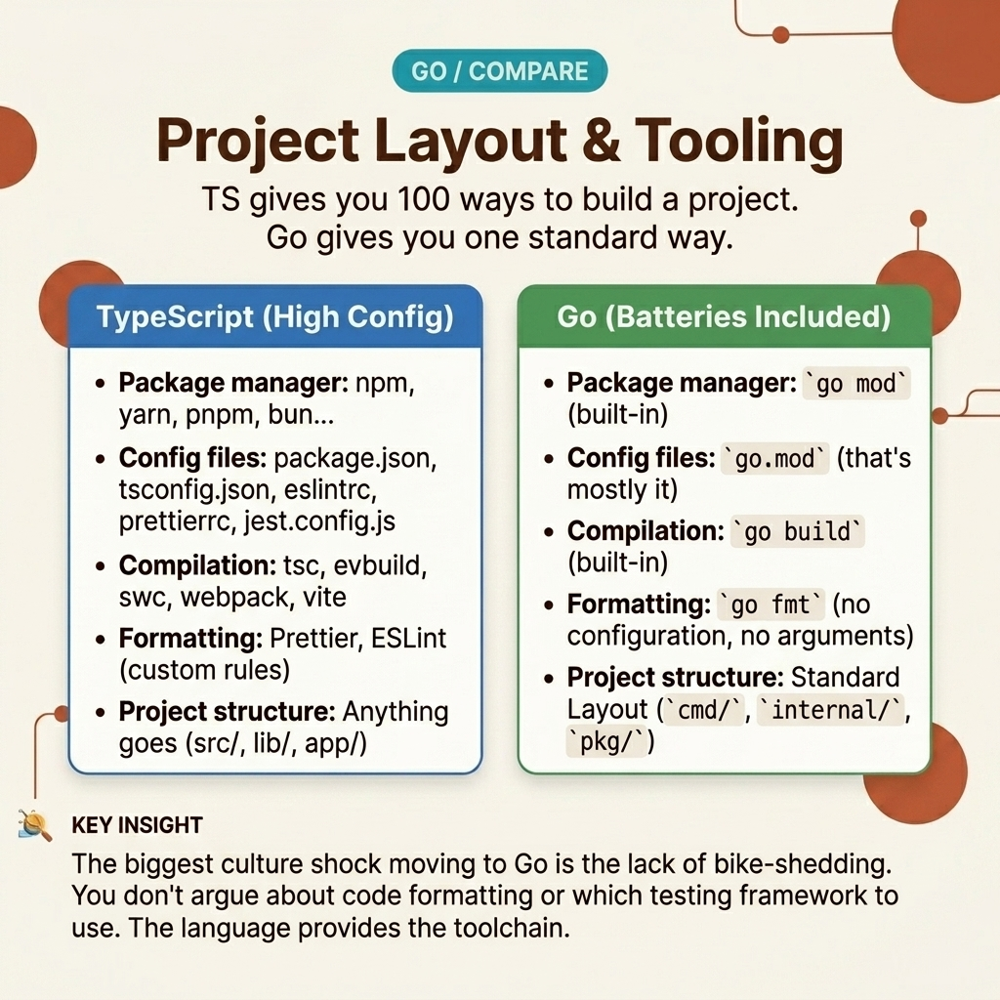

<!-- tags: golang, typescript, testing --> # 🛠️ Bố cục dự án, công cụ, thử nghiệm - Cách Go Các nhóm xây dựng và vận chuyển các TypeScript khác nhau.

> Nếu mô hình tinh thần đúng nhưng quy trình làm việc vẫn tuân theo Node.js/NestJS, bạn sẽ nghĩ Go "thiếu khung". Go thực sự đặt phần lớn sức mạnh của nó vào chuỗi công cụ tiêu chuẩn, ranh giới và quy ước package .

📅 Đã tạo: 2026-04-06 · 🔄 Đã cập nhật: 19-04-2026 · ⏱️ 15 phút đọc

| Khía cạnh | Chi tiết |
| --- | --- |
| **Tập trung** | `go.mod` , package bố cục, `go test` , `gofmt` , `httptest` |
| **Trường hợp sử dụng** | Nhóm TypeScript bắt đầu xây dựng dịch vụ Go đầu tiên và cần một quy trình làm việc có thể duy trì |
| **Khác biệt về phím** | TypeScript thường ghép nối ngôn ngữ với các công cụ của hệ sinh thái; Go bao gồm hầu hết mọi thứ trong chuỗi công cụ mặc định |
| ** Go stdlib** | `testing` , `httptest` , `net/http` , `os` , `time` |

## 1. ĐỊNH NGHĨA

Nhóm phụ trợ TypeScript hiếm khi nghĩ về ngôn ngữ. Họ nghĩ về mặt:

- `package.json` - `tsconfig.json` - khung CLI
- Jest/Vitest
- ESLint/Đẹp hơn
- runtime trình tải env

Khi chuyển sang Go , cảm giác đầu tiên thường là “thiếu quá nhiều tiện nghi”. Không có DI decorator , không có CLI framework mặc định, không có trình chạy thử nghiệm kiểu Jest với hàng tá trình so khớp, không có hệ thống cấu hình tích hợp như NestJS.

Nhưng đó chỉ là quan điểm của hệ thống cũ. Go đặt cược vào một nguyên tắc khác: chuỗi công cụ tiêu chuẩn + ranh giới package rõ ràng + stdlib đủ rộng. Bạn không cần phải lắp ráp nhiều bộ phận để có dịch vụ sẵn sàng sản xuất.

### 1.1 Package là đơn vị thiết kế đầu tiên.

Trong TypeScript, cấu trúc thư mục thường bị ảnh hưởng mạnh mẽ bởi framework hoặc công cụ monorepo. Trong các ranh giới Go , package quản lý bề mặt API, khả năng kiểm tra, khả năng hiển thị và khớp nối. Nếu packages được thiết kế tốt thì cơ sở mã vẫn có thể duy trì được.

Quy tắc thực dụng:

- `cmd/` cho điểm vào
- `internal/` biểu thị một triển khai không muốn được xuất bên ngoài module .
- Packages nên nhỏ gọn, đặt tên rõ ràng, tránh mơ hồ `utils` , `common` , `helpers` .

### 1.2 Toolchain là một phần của ngôn ngữ.

Đây là điểm mà nhiều kỹ sư TypeScript đánh giá thấp Go :

- `go fmt` / `gofmt` : định dạng chuẩn gần như là bắt buộc.
- `go test` : unit test , benchmark , fuzz trong một công cụ.
- `go mod` : quản lý phụ thuộc tích hợp.
- `go vet` : kiểm tra tĩnh mặc định.

Bạn tốn ít time tranh luận về kiểu dáng và cách kết hợp công cụ hơn và time nhiều hơn cho logic thực.

### 1.3 Các kiểu bất biến và lỗi

- Nếu bạn xây dựng vùng chứa DI quá sớm, đó thường là dấu hiệu cho thấy bạn đang đưa các hình dạng phụ thuộc khung cũ vào Go .
- Nếu bạn nhóm quá nhiều packages vào `internal/common` , bạn vừa tạo một "ngăn kéo rác chung" mới.
- Nếu bạn chống lại `gofmt` , đội của bạn đang chiến đấu trong một cuộc chiến không đáng để chiến thắng.

Ít công cụ hơn không có nghĩa là ít kỷ luật hơn.

Nó chỉ đẩy kỷ luật đến mức mặc định.

## 2. HÌNH ẢNH

Sự khác biệt lớn nhất giữa quy trình làm việc Go và quy trình làm việc TypeScript không nằm ở số lượng công cụ mà ở việc quyết định các giá trị mặc định tốt. Biểu đồ dưới đây cho thấy điều đó.

### Cấp 1```text
TypeScript backend workflow
source
  -> tsconfig
  -> framework conventions
  -> test runner
  -> lint + format stack
  -> node runtime

Go backend workflow
source
  -> gofmt
  -> go test
  -> go build
  -> native binary
  -> stdlib-first deployment
``` *Hình: Cấp 1 cho thấy rằng Go gộp nhiều quyết định vào chuỗi công cụ mặc định hơn là phần phụ trợ TypeScript điển hình stack .*.

### Cấp 2```text
good Go project
  -> package boundaries clear
  -> entrypoints explicit
  -> constructors explicit
  -> tests live next to code
  -> formatting non-negotiable
```*Hình: Cấp độ 2 nhấn mạnh rằng khả năng bảo trì trong Go đến từ cấu trúc và kỷ luật mặc định nhiều hơn là từ sự trừu tượng hóa khung.*.

## 3. MÃ

Quy trình làm việc chính xác sẽ xuất hiện rất rõ ràng khi bạn viết, kiểm tra và sau đó gửi một module nhỏ.

### Ví dụ 1: Cơ bản — hệ thống dây của hàm tạo thường đủ thay cho các thùng chứa DI .

> **Mục tiêu**: Hãy thấy rằng hầu hết dependency injection trong Go đều có thể được giải bằng các hàm tạo rõ ràng.
> **Phương pháp tiếp cận**: Tạo một `Clock` interface nhỏ và đưa nó vào dịch vụ bằng cách sử dụng `NewService` .
> **Ví dụ**: `BillingService` cần time hiện tại để đóng hóa đơn.

Phiên bản TypeScript được nhiều nhóm quen thuộc:```typescript
interface Clock {
  now(): Date;
}

class RealClock implements Clock {
  now(): Date {
    return new Date();
  }
}

class BillingService {
  constructor(private readonly clock: Clock) {}

  closeInvoice(id: string): string {
    return `invoice ${id} closed at ${this.clock.now().toISOString()}`;
  }
}

const service = new BillingService(new RealClock());
console.log(service.closeInvoice("inv-1"));
```Phiên bản Go tương ứng:```go
package main

import (
	"fmt"
	"time"
)

type Clock interface {
	Now() time.Time
}

type RealClock struct{}

func (RealClock) Now() time.Time { return time.Now() }

type BillingService struct {
	clock Clock
}

func NewBillingService(clock Clock) BillingService {
	return BillingService{clock: clock}
}

func (s BillingService) CloseInvoice(id string) string {
	return fmt.Sprintf("invoice %s closed at %s", id, s.clock.Now().Format(time.RFC3339))
}

func main() {
	service := NewBillingService(RealClock{})
	fmt.Println(service.CloseInvoice("inv-1"))
}
```> **Takeaway**: Trong Go , hàm tạo rõ ràng thường đủ cho 80% trường hợp sử dụng. Các vùng chứa DI phải được cân nhắc lại, không phải là mặc định vào ngày đầu tiên.

Hệ thống dây điện xây dựng giải quyết bề mặt phụ thuộc. Chất lượng quy trình làm việc chỉ hiển thị khi quá trình kiểm tra bắt đầu chồng chất.

### Ví dụ 2: Trung cấp - các bài kiểm tra dựa trên bảng thay thế các bài kiểm tra kiểu so khớp của TypeScript.

> **Mục tiêu**: Làm quen với nhịp điệu thử nghiệm độc đáo của Go .
> **Phương pháp tiếp cận**: Sử dụng các thử nghiệm dựa trên bảng để bao quát nhiều trường hợp trong một chức năng thử nghiệm duy nhất.
> **Ví dụ**: Phân tích thời gian chờ từ biến môi trường.

Phiên bản TypeScript với ma trận thử nghiệm:```typescript
import { describe, expect, it } from "vitest";

function parseTimeout(raw: string): number {
  const seconds = Number.parseInt(raw, 10);
  if (Number.isNaN(seconds)) {
    throw new Error("invalid timeout");
  }
  return seconds * 1000;
}

describe("parseTimeout", () => {
  const cases = [
    { name: "valid", input: "5", want: 5000 },
    { name: "zero", input: "0", want: 0 },
    { name: "invalid", input: "abc", wantError: true },
  ];

  it.each(cases)("$name", ({ input, want, wantError }) => {
    if (wantError) {
      expect(() => parseTimeout(input)).toThrowError();
      return;
    }
    expect(parseTimeout(input)).toBe(want);
  });
});
```Phiên bản Go tương ứng:```go
package config

import (
	"strconv"
	"testing"
	"time"
)

func parseTimeout(raw string) (time.Duration, error) {
	seconds, err := strconv.Atoi(raw)
	if err != nil {
		return 0, err
	}
	return time.Duration(seconds) * time.Second, nil
}

func TestParseTimeout(t *testing.T) {
	tests := []struct {
		name    string
		input   string
		want    time.Duration
		wantErr bool
	}{
		{name: "valid", input: "5", want: 5 * time.Second},
		{name: "zero", input: "0", want: 0},
		{name: "invalid", input: "abc", wantErr: true},
	}

	for _, tc := range tests {
		tc := tc
		t.Run(tc.name, func(t *testing.T) {
			got, err := parseTimeout(tc.input)
			if tc.wantErr && err == nil {
				t.Fatalf("expected error, got nil")
			}
			if !tc.wantErr && err != nil {
				t.Fatalf("unexpected error: %v", err)
			}
			if got != tc.want {
				t.Fatalf("got %v, want %v", got, tc.want)
			}
		})
	}
}
```> **Tại sao?** Các bài kiểm tra TypeScript thường dựa vào DSL đối sánh và công thái học của khung. Các bài kiểm tra Go tối giản hơn, nhưng bù lại rất gần với logic thực và dễ đọc. Các bài kiểm tra dựa trên bảng có quy mô tốt cho các nhóm.

> **Takeaway**: Nếu bạn cảm thấy các bài kiểm tra Go có "kém ma thuật hơn", đó là do thiết kế. Nó làm cho ý định và kết quả thất bại gần nhau hơn.

Kiểm tra đơn vị làm rõ logic. Nhưng nhóm chỉ tin tưởng vào quy trình làm việc mới khi lớp HTTP cũng có thể được kiểm tra mà không cần thêm một nửa khung.

### Ví dụ 3: Nâng cao — `httptest` dành cho các thử nghiệm giống như tích hợp mà không cần framework nặng nề.

> **Mục tiêu**: Thấy rằng Go stdlib là đủ cho phần lớn thử nghiệm dịch vụ.
> **Phương pháp tiếp cận**: Sử dụng `httptest.NewServer` để kiểm tra các trình xử lý toàn diện trong quá trình xử lý.
> **Ví dụ**: Trả về điểm cuối sức khỏe `200 ok` .

Phiên bản TypeScript thường đi kèm với framework stack test:```typescript
import express from "express";
import request from "supertest";
import { describe, expect, it } from "vitest";

const app = express();
app.get("/health", (_req, res) => {
  res.status(200).send("ok");
});

describe("GET /health", () => {
  it("returns ok", async () => {
    const response = await request(app).get("/health");
    expect(response.status).toBe(200);
    expect(response.text).toBe("ok");
  });
});
```Phiên bản Go tương ứng:```go
package main

import (
	"io"
	"net/http"
	"net/http/httptest"
	"testing"
)

func healthHandler(w http.ResponseWriter, r *http.Request) {
	w.WriteHeader(http.StatusOK)
	_, _ = w.Write([]byte("ok"))
}

func TestHealthHandler(t *testing.T) {
	server := httptest.NewServer(http.HandlerFunc(healthHandler))
	defer server.Close()

	resp, err := http.Get(server.URL)
	if err != nil {
		t.Fatalf("http get: %v", err)
	}
	defer resp.Body.Close()

	body, err := io.ReadAll(resp.Body)
	if err != nil {
		t.Fatalf("read body: %v", err)
	}

	if resp.StatusCode != http.StatusOK {
		t.Fatalf("got status %d, want %d", resp.StatusCode, http.StatusOK)
	}
	if string(body) != "ok" {
		t.Fatalf("got body %q, want %q", body, "ok")
	}
}
```> **Tại sao?** Các nhóm TypeScript thường tiếp cận Supertest, framework test modules và mock server packages từ rất sớm. Go stdlib đã có hầu hết những gì bạn cần. Đây là lý do tại sao nhiều dịch vụ Go có cây phụ thuộc nhỏ hơn đáng kể.

> **Takeaway**: Đừng cho rằng Go thiếu hệ sinh thái chỉ vì bạn chưa khám phá stdlib.

## 4. Cạm bẫy

Sai lầm của các đội mới tham gia Go hiếm khi đến từ việc thiếu packages .

Nó thường xuất phát từ việc cố gắng tái tạo lại hệ sinh thái cũ bằng một cái tên mới.

| # | Mức độ nghiêm trọng | Lỗi | Hậu quả | Sửa chữa |
| --- | --- | --- | --- | --- |
| 1 | 🔴 Gây tử vong | Đưa kiến ​​trúc khung cũ vào Go ngay từ ngày đầu tiên | Dự án nặng về tính trừu tượng, khó gỡ lỗi và mất đi lợi thế đơn giản của Go | Bắt đầu với stdlib + xây dựng hệ thống dây + xóa ranh giới package |
| 2 | 🟡 Chung | Tạo packages có tên `utils` , `helpers` , `common` | Sự ghép nối tăng lên và trách nhiệm không rõ ràng | Đặt tên packages theo miền hoặc khả năng cụ thể |
| 3 | 🔵 Nhỏ | Chiến đấu theo phong cách chuẩn của `gofmt` hoặc Go | Lãng phí băng thông khi xem xét các vấn đề định dạng | Chấp nhận trình định dạng tiêu chuẩn như một phần của hợp đồng xã hội của nhóm |

## 5. GIỚI THIỆU

| Tài nguyên | Loại | Liên kết | Lưu ý |
| --- | --- | --- | --- |
| Go Hướng dẫn sử dụng | Chính thức | https://go.dev/doc/ | Lối vào chính cho xây dựng, thử nghiệm, modules , dụng cụ |
| Go Modules Tham khảo | Chính thức | https://go.dev/ref/mod | Nguồn sự thật cho các ranh giới module , thay thế, vendoring và các dep riêng tư |
| `testing` package | Chính thức | https://pkg.go.dev/testing | Điểm vào tiêu chuẩn cho unit test , benchmark , fuzz, ví dụ kiểm tra |

## 6. KHUYẾN NGHỊ

Phần cốt lõi của **Bố cục, Công cụ & Kiểm tra Dự án** rất rõ ràng. Các nhánh tiện ích mở rộng bên dưới giúp bạn đưa các thực tiễn dự án Go vào sản xuất với các quyết định công nghệ và sách hướng dẫn di chuyển.

| Gia hạn | Khi nào | Cơ sở lý luận | Liên kết |
| --- | --- | --- | --- |
| Modules & Bố cục | Khi repo bắt đầu có nhiều packages | Tránh trôi dạt kiến ​​trúc ngay từ đầu | [→ 01-modules-layout](../packages/01-modules-layout.md) |
| Kiểm tra dựa trên bảng & Mocking | Khi nhóm đã viết xong quy trình cơ bản và cần thêm công thái học thử nghiệm | Cầu nối quan trọng từ quy trình làm việc đến chất lượng thực thi | [→ 01-table-driven-mocking](../testing/01-table-driven-mocking.md) |
| Benchmark & Lông tơ | Khi thử nghiệm đơn vị là solid và nhóm muốn củng cố hành vi hoặc đo lường hồi quy | Bước tiếp theo tự nhiên sau khi kiểm tra kiến ​​thức cơ bản | [→ 02-benchmark-fuzz](../testing/02-benchmark-fuzz.md) |
| Interfaces — Hợp đồng ngầm | Khi nhóm bắt đầu mocking thêm phụ thuộc | Khả năng kiểm tra Go gắn chặt với thiết kế interface | [→ 01-implicit-io-patterns](../interfaces/01-implicit-io-patterns.md) |
| Khi nào nên chọn Go so với TypeScript | Sau khi nhóm hiểu được quy trình làm việc Go và cần quyết định chọn greenfield/hybrid | Nhận thức về quy trình làm việc phải đi kèm với việc lựa chọn ngôn ngữ | [→ 05-when-to-choose](./05-when-to-choose-go-vs-typescript.md) |

**Điều hướng**: [← Previous](./03-errors-concurrency-context.md) · [→ Next](./05-when-to-choose-go-vs-typescript.md)