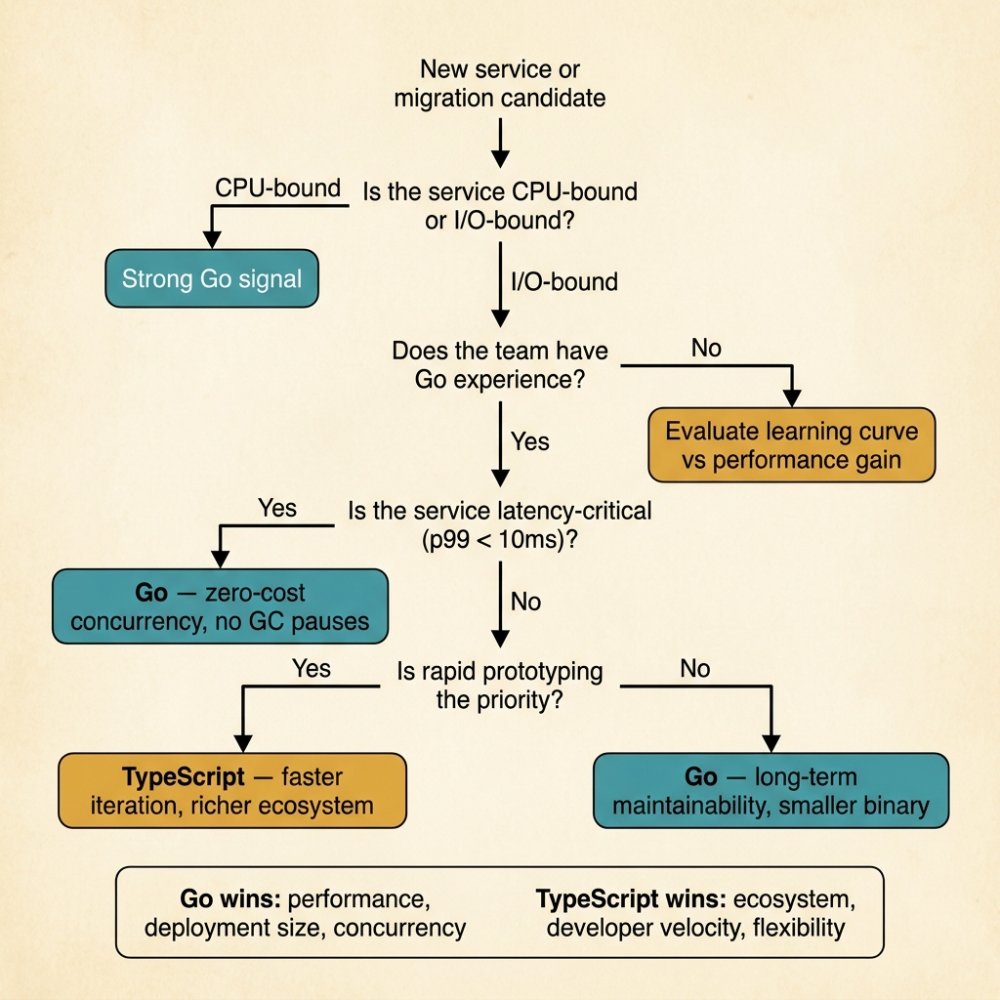

<!-- tags: golang, typescript, architecture -->
# ⚖️ When to Choose Go, When to Keep TypeScript.

> A guide to senior/principal decision-making: appropriate use cases, pragmatic pros/cons, hybrid architecture, and current trend signals of the two languages.

📅 Created: 2026-04-06 · 🔄 Updated: 2026-04-19 · ⏱️ 19 min read

| Aspect | Detail |
| --- | --- |
| **Focus** | Language choice, workload fit, long-term trade-offs |
| **Use case** | Greenfield service, team split, scale-up rewrite, hybrid stack decisions |
| **Key diff** | TypeScript optimized for full-stack/product velocity; Go is optimized for operational simplicity and targeted throughput |
| **Go stdlib** | `net/http`, `encoding/json`, `bufio`, `os` |

## 1. DEFINE

The most difficult problem is not "How much faster is Go than TypeScript". The hardest problem is: **Which language will help your team make better decisions in the next 12-24 months?**.

If you choose based on short-term benchmarks, you can easily rewrite things that are not worth rewriting. If you choose based on personal preference, you can overlook team composition, hiring pipeline, frontend sharing, and real operational cost.

For TypeScript engineers, the most common trap is thinking Go is only worth using for "super fast services". The reality is broader than that:

- Go is strong when you need clear concurrency, simple binary deployment, predictable resource usage, and consistent tooling.
- TypeScript is strong when you need full-stack type sharing, ecosystem breadth, product iteration speed, and a JS-heavy team that can move fast.

This is not an article about choosing language to win an argument.

This is an article on choosing a language to reduce regret.

### 1.1 Pragmatic use cases: when Go is often the better choice.

- API/service has stable load, many parallel I/O calls, needs P95/P99 latency control, and easy-to-reason concurrency.
- Worker, queue consumer, ingestion pipeline, streaming transform
- CLI, developer tooling, infra automation, sidecar, control plane
- Service runs for a long time, requiring more predictable memory/CPU usage than equivalent Node.js workloads.

### 1.2 When keeping TypeScript is usually the better decision.

- The product/full-stack team wants to share types, validation schema, DTO, client contracts.
- Business domains change quickly, feature churn is high, web ecosystem is the focus.
- You need to leverage a deep web framework/Node ecosystem like Next.js, NestJS, tRPC, Prisma, Zod.
- Strong team in JS/TS but no real bandwidth to build Go capacity.

### 1.3 Current trends and the near future.

According to GitHub Octoverse announced at the end of 2025, **August 2025** was the first time TypeScript surpassed Python and JavaScript to become the most used language on GitHub. GitHub also states that this trend reflects the maturation of TypeScript as a full-stack default.

That doesn't mean TypeScript "wins completely". It means:

- TypeScript is the clear default of the modern web/full-stack.
- Go is still not the most popular language, but it holds a very strong position in cloud, infrastructure, services, and tooling — and is growing steadily in areas where operational reliability matters.

About the future of technology:

- On **March 11, 2025**, the TypeScript team announced a native port of compiler/tooling in Go with the goal of improving build times by about 10x and paving the way for TypeScript 7.
- On **August 1, 2025**, TypeScript 5.9 was released and the team described TypeScript 6 as a transition to prepare for TypeScript 7 native.
- On **August 2025**, Go 1.25 was released. Release notes show that Go continues to keep a very conservative evolution on the language surface but invests heavily in the toolchain/runtime instead of adding new syntax.

**Inference from the above sources**: in the next 2-3 years, TypeScript is likely to get even stronger in developer experience for large codebases and AI-assisted coding; Go will continue to win in operational simplicity, binary deployment, and performance-sensitive workloads.

## 2. VISUAL

This is a decision document, so static visual assets help scan faster than ASCII: one look and you can see both the decision question series and the boundary hybrid production.



*Figure: The left panel is the decision tree to lean towards TypeScript, Go, or hybrid. The right panel shows a typical split production where both occupy a reasonable position.*

## 3. CODE

Language choice cannot be discussed only in tables. The three Go examples below illustrate the use cases where Go often creates the clearest leverage; The comparison with TypeScript is in the accompanying prose.

### Example 1: Basic — Small HTTP JSON service with stdlib-first mindset.

> **Goal**: Illustrate why Go is suitable for small services with few dependencies that need simple deployment.
> **Approach**: Use `net/http` and `encoding/json` directly.
> **Example**: `/health` and `/version`.

The TypeScript version is often a reasonable starting point for the web app/API layer:

```typescript
import express from "express";

const app = express();

app.get("/health", (_req, res) => {
  res.json({
    status: "ok",
    version: "1.0.0",
  });
});

app.listen(8080, () => {
  console.log("listening on :8080");
});
```

Corresponding Go version:

```go
package main

import (
	"encoding/json"
	"net/http"
)

type response struct {
	Status  string `json:"status"`
	Version string `json:"version"`
}

func main() {
	http.HandleFunc("/health", func(w http.ResponseWriter, r *http.Request) {
		w.Header().Set("Content-Type", "application/json")
		_ = json.NewEncoder(w).Encode(response{
			Status:  "ok",
			Version: "1.0.0",
		})
	})

	if err := http.ListenAndServe(":8080", nil); err != nil {
		panic(err)
	}
}
```

> **Takeaway**: If your service is primarily an internal API or infra-facing endpoint, Go often provides a very compact baseline. TypeScript is still better suited if you need the web ecosystem or deep frontend integration.

A small HTTP service that exposes the baseline. But Go's big leverage only becomes more apparent when workloads start to have concurrency and back-pressure.

### Example 2: Intermediate — bounded worker pool for batch/queue workloads.

> **Goal**: Illustrate the workload where Go often clearly outperforms Node/TypeScript in operability.
> **Approach**: Process jobs with a fixed worker pool.
> **Example**: 8 jobs, maximum 3 workers.

The TypeScript version can do it, but usually needs to keep its own concurrency discipline:

```typescript
async function worker(id: number, jobs: number[]): Promise<void> {
  while (jobs.length > 0) {
    const job = jobs.shift();
    if (job === undefined) {
      return;
    }
    await new Promise((resolve) => setTimeout(resolve, 40));
    console.log(`worker-${id} processed job-${job}`);
  }
}

async function main() {
  const jobs = Array.from({ length: 8 }, (_, index) => index + 1);
  await Promise.all([
    worker(1, jobs),
    worker(2, jobs),
    worker(3, jobs),
  ]);
}

void main();
```

Corresponding Go version:

```go
package main

import (
	"fmt"
	"sync"
	"time"
)

func worker(id int, jobs <-chan int, wg *sync.WaitGroup) {
	defer wg.Done()
	for job := range jobs {
		time.Sleep(40 * time.Millisecond)
		fmt.Printf("worker-%d processed job-%d\n", id, job)
	}
}

func main() {
	jobs := make(chan int)

	var wg sync.WaitGroup
	for i := 1; i <= 3; i++ {
		wg.Add(1)
		go worker(i, jobs, &wg)
	}

	for job := 1; job <= 8; job++ {
		jobs <- job
	}
	close(jobs)

	wg.Wait()
}
```

> **Why?** This type of workload is possible in TypeScript, but Go is often simpler when you need to control concurrency, back-pressure, cancellation, and deployment footprint simultaneously. This is where Go's advantage becomes most visible.

> **Takeaway**: Queue consumers, stream transforms, and cron/batch services are Go's natural territory.

If workers and consumers are where Go wins in terms of operability, CLI and tooling are where that advantage becomes very difficult to ignore.

### Example 3: Advanced — CLI handles large files, one binary is enough.

> **Goal**: Illustrate a use case where Go typically excels in developer experience.
> **Approach**: Stream files line-by-line instead of loading the entire file into memory.
> **Example**: Count error log lines from an input file.

The TypeScript version usually still depends on the Node runtime:

```typescript
import * as fs from "node:fs";
import * as readline from "node:readline";

async function main() {
  const filePath = process.argv[2];
  if (!filePath) {
    console.error("usage: logcount <file>");
    process.exit(1);
  }

  const stream = fs.createReadStream(filePath);
  const reader = readline.createInterface({ input: stream });

  let count = 0;
  for await (const line of reader) {
    if (line.includes("ERROR")) {
      count++;
    }
  }

  console.log("error lines:", count);
}

void main();
```

Corresponding Go version:

```go
package main

import (
	"bufio"
	"fmt"
	"os"
	"strings"
)

func main() {
	if len(os.Args) != 2 {
		fmt.Println("usage: logcount <file>")
		os.Exit(1)
	}

	file, err := os.Open(os.Args[1])
	if err != nil {
		panic(err)
	}
	defer file.Close()

	var count int
	scanner := bufio.NewScanner(file)
	for scanner.Scan() {
		if strings.Contains(scanner.Text(), "ERROR") {
			count++
		}
	}
	if err := scanner.Err(); err != nil {
		panic(err)
	}

	fmt.Println("error lines:", count)
}
```

> **Why?** CLI tooling, sidecars, automation, and platform utilities are problem categories where Go is particularly well-suited: build a single binary, ship easily, run efficiently, and memory footprint is straightforward to reason about. TypeScript can still work, but the runtime dependency adds friction.

> **Takeaway**: If your problem is more about platform/tooling than web-product iteration, Go is worth considering.

## 4. PITFALLS

The biggest mistake with language choice is turning it into identity choice.

A good architectural decision is colder than that.

| # | Severity | Error | Consequence | Fix |
| --- | --- | --- | --- | --- |
| 1 | 🔴 Fatal | Choose a language just because of micro benchmarks or community hype | Rewrite the wrong problem, team velocity drops, worse ops | Choose by workload, team skill, deployment model, and coupling with frontend |
| 2 | 🟡 Common | Choose Go for the service whose greatest value is shared full-stack types and web ecosystem | Losing TS's biggest leverage but not getting enough benefits from Go | Keep TypeScript or choose hybrid boundary |
| 3 | 🔵 Minor | See TypeScript as "frontend only" or Go as "high-performance only" | Poor decision matrix, missing good use cases of both | Use workload fit tables instead of stereotypes |

## 5. REF

| Resource | Type | Link | Note |
| --- | --- | --- | --- |
| Go for Cloud & Network Services | Official | https://go.dev/solutions/cloud | Official source for Go's strong position in services/cloud |
| Go 1.25 Release Notes | Official | https://go.dev/doc/go1.25 | The basis for seeing Go continues to prioritize toolchain/runtime stability |
| The TypeScript Handbook | Official | https://www.typescriptlang.org/docs/handbook/intro.html | The formal basis for TypeScript's value proposition |
| A 10x Faster TypeScript | Official | https://devblogs.microsoft.com/typescript/typescript-native-port/ | Native toolchain announcement in Go on 11-03-25 |
| Announcing TypeScript 5.9 | Official | https://devblogs.microsoft.com/typescript/announcing-typescript-5-9/ | Updated roadmap towards TypeScript 6/7 on 2025-08-01 |
| GitHub Octoverse 2025 | Official | https://github.blog/news-insights/octoverse/octoverse-a-new-developer-joins-github-every-second-as-ai-leads-typescript-to-1/ | TypeScript data is #1 on GitHub in August 2025 |
| Stack Overflow Developer Survey 2025 — Technology | Official | https://survey.stackoverflow.co/2025/technology/ | Professional developers data: TypeScript 48.8%, Go 17.4% |

## 6. RECOMMEND

The core of **When to Choose Go vs TypeScript** is clear. The extensions below help you put technology decisions into action with the migration playbook and translation atlas.

The next step is not to read more slogans, but to convert this decision into specific rollout or readiness.

| Extension | When | Rationale | Link |
| --- | --- | --- | --- |
| Migration Playbook | Once you have finalized the language or hybrid strategy | Good decisions must come with good rollout | [→ 06-migration-playbook](./06-migration-playbook.md) |
| Project Layout, Tooling, Testing | When leaning towards Go and need to check team readiness | After choosing the language, you need to know if the team can ship it | [→ 04-project-layout-tooling](./04-project-layout-tooling-testing.md) |
| Helper — TS/JS → Go Utilities | Once you have decided to use Go for part of the system | Go down to the specific API-level mapping | [→ Helper README](../helper/README.md) |

**Navigation**: [← Previous](./04-project-layout-tooling-testing.md) · [→ Next](./06-migration-playbook.md)
