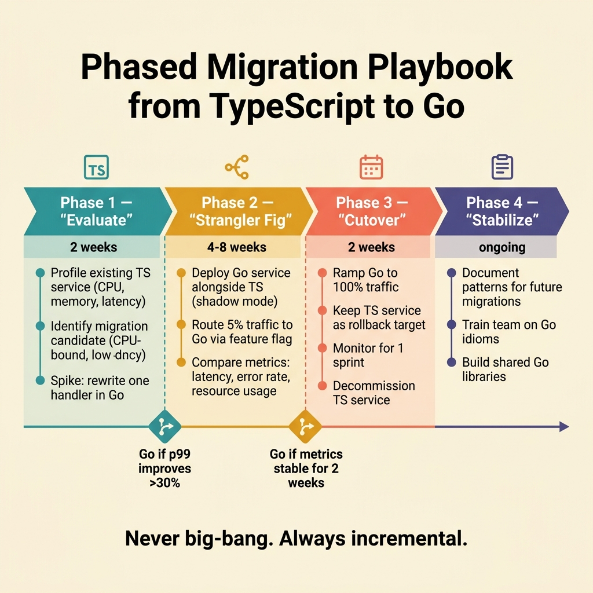

<!-- tags: golang, typescript, migration -->
# 🚚 Migration Playbook — Convert Service from TypeScript to Go Without Creating Your Own Incident.

> How to migrate intentionally: choose the right strategy, keep the contract stable, measure the baseline before rewriting, and train the team according to the 30/60/90 day roadmap.

📅 Created: 2026-04-06 · 🔄 Updated: 2026-04-19 · ⏱️ 18 min read

| Aspect | Detail |
| --- | --- |
| **Focus** | Migration strategy, contract-first rollout, team enablement |
| **Use case** | Rewrite service, split critical path, introduce Go into the JS/TS-heavy organization |
| **Key diff** | Good migration is a boundary + operations + team learning problem, not just code translation |
| **Go stdlib** | `context`, `encoding/json`, `net/http`, `sync/atomic` |

## 1. DEFINE

The biggest temptation when the team decides to "rewrite in Go" is to start from a new repo. That almost always gives the feeling of moving very quickly in the first 2 weeks, then stalling when real-world complexity hits.

Why? Because migration is not just about code:

- Does the current system have any contracts that are implicitly dependent on the client?
- Have you measured latency, memory, error rate baseline?
- Does the team understand Go enough to keep the old behavior without introducing new bugs?
- Where is the rollback plan if the Go version goes into production and has an issue?

Good migration doesn't start with rewrite. It starts with clear boundaries, adequate measurement, and the right rollout strategy.

The new repo is the easy part.

Rollback is the hard part.

### 1.1 The 3 most pragmatic strategies.

**Strangler**  
Keep the old TypeScript service, gradually route some endpoints/use cases to Go. This is the safest default when the system is having real traffic.

**Sidecar / worker extraction**  
Split the concurrency-heavy, CPU-heavy, batch-heavy or infra-heavy part into Go first. Suitable when you don't want to touch a large API contract.

**Full rewrite**  
Only reasonable when the service is small, the contract is simple, or the old code is so rotten that it can no longer be saved. Even with a full rewrite, you should still contract-first and measure the baseline.

### 1.2 Roadmap 30/60/90 days for TypeScript-first team.

**Days 0-30** 
Lock the mental model, data model, error/concurrency/context, toolchain, and write 1-2 small non-critical services.

**Days 31-60** 
Start decoupling workers, sidecars, internal tools, or one-way consumers to Go. Set up a separate review checklist for pointer/value/context/errors.

**Days 61-90** 
Touch a more critical path: a small API route, a large downstream service fan-out, or a job that handles high throughput. Only do this if you have a clear baseline and rollback plan.

### 1.3 Invariants & Failure Modes

- If contract testing is not kept, the rewrite will be "correct according to the new code" but incorrect according to the old behavior that the customer is using.
- If you don't measure the baseline first, you won't know if rewrite actually improves anything other than feel.
- If the team does not have a review discipline for Go, bug pointer/context/goroutine leaks will enter production very quickly.

## 2. VISUAL

Migration is a multi-phase rollout problem, so static visual assets help you see the validation cycle and 30/60/90 span much more clearly than diagram-as-code.



*Figure: The panel above is the safe rollout loop from baseline to expand or rollback; The panel below is the appropriate learning rhythm and intervention scope for the TypeScript-first team in the first 30/60/90 days.*.

## 3. CODE

Good migration often wins in boundary design rather than algorithms. The three examples below illustrate that spirit.

### Example 1: Basic — lock contract with interface before changing implementation.

> **Goal**: Avoid making the rollout strategy directly dependent on the old concrete client.
> **Approach**: Define the interface at the point of use, then gradually swap the adapter.
> **Example**: Service reads invoices from the old TS system today, from the Go adapter tomorrow.

Multi-team versions of TypeScript are available:

```typescript
type Invoice = {
  id: string;
  amount: number;
};

interface InvoiceReader {
  findById(id: string): Promise<Invoice>;
}

class LegacyTsClient implements InvoiceReader {
  async findById(id: string): Promise<Invoice> {
    return { id, amount: 1500 };
  }
}

class BillingService {
  constructor(private readonly reader: InvoiceReader) {}

  async printInvoice(id: string): Promise<void> {
    const invoice = await this.reader.findById(id);
    console.log(`invoice=${invoice.id} amount=${invoice.amount}`);
  }
}
```

Corresponding Go version:

```go
package main

import (
	"context"
	"fmt"
)

type Invoice struct {
	ID     string
	Amount int64
}

type InvoiceReader interface {
	FindByID(ctx context.Context, id string) (Invoice, error)
}

type LegacyTSClient struct{}

func (LegacyTSClient) FindByID(ctx context.Context, id string) (Invoice, error) {
	return Invoice{ID: id, Amount: 1500}, nil
}

type BillingService struct {
	reader InvoiceReader
}

func NewBillingService(reader InvoiceReader) BillingService {
	return BillingService{reader: reader}
}

func (s BillingService) PrintInvoice(ctx context.Context, id string) error {
	invoice, err := s.reader.FindByID(ctx, id)
	if err != nil {
		return fmt.Errorf("print invoice %s: %w", id, err)
	}
	fmt.Printf("invoice=%s amount=%d\n", invoice.ID, invoice.Amount)
	return nil
}

func main() {
	service := NewBillingService(LegacyTSClient{})
	_ = service.PrintInvoice(context.Background(), "inv-10")
}
```

> **Takeaway**: Sustainable migration starts at the seam. If you do not have seams yet, the rewrite will be very difficult to roll out piece by piece.

Seam is there, but seam is not enough. If the legacy contract still spills over into the new domain, you have only changed the language but not the risk.

### Example 2: Intermediate — translate DTO at the boundary instead of letting the domain embrace the legacy contract.

> **Goal**: Allow the Go service to keep the domain model clean while still communicating with the old JSON shape.
> **Approach**: Own the legacy DTO, keep a separate domain, and use clear translation functions.
> **Example**: Legacy TS endpoint returns `customerId` and `totalCents`; the Go domain uses `Order`.

TypeScript version at adapter layer:

```typescript
type LegacyOrderDTO = {
  id: string;
  customerId: string;
  totalCents: number;
};

type Order = {
  id: string;
  customerId: string;
  total: number;
};

function translateLegacyOrder(dto: LegacyOrderDTO): Order {
  if (!dto.id || !dto.customerId || dto.totalCents <= 0) {
    throw new Error("legacy order contract invalid");
  }

  return {
    id: dto.id,
    customerId: dto.customerId,
    total: dto.totalCents,
  };
}
```

Corresponding Go version:

```go
package main

import (
	"encoding/json"
	"fmt"
)

type legacyOrderDTO struct {
	ID         string `json:"id"`
	CustomerID string `json:"customerId"`
	TotalCents int64  `json:"totalCents"`
}

type Order struct {
	ID         string
	CustomerID string
	Total      int64
}

func translateLegacyOrder(raw []byte) (Order, error) {
	var dto legacyOrderDTO
	if err := json.Unmarshal(raw, &dto); err != nil {
		return Order{}, fmt.Errorf("decode legacy order: %w", err)
	}
	if dto.ID == "" || dto.CustomerID == "" || dto.TotalCents <= 0 {
		return Order{}, fmt.Errorf("legacy order contract invalid")
	}
	return Order{
		ID:         dto.ID,
		CustomerID: dto.CustomerID,
		Total:      dto.TotalCents,
	}, nil
}

func main() {
	raw := []byte(`{"id":"ord-9","customerId":"u-1","totalCents":4200}`)
	order, err := translateLegacyOrder(raw)
	if err != nil {
		panic(err)
	}
	fmt.Printf("%+v\n", order)
}
```

> **Why?** Teams often try to keep a common model for old contracts, new domains, databases, events, and responses. That is the fastest way to leak migration logic across the codebase. Boundary translation looks like extra work, but it pays off immediately.

> **Takeaway**: Legacy shape is a concern of the adapter layer. The new domain should not carry old syntax for long.

Boundary translation preserves shape. The remaining problem is rollout: where does traffic go, how to observe, how to turn around.

### Example 3: Advanced — strangler router with feature flag and simple rollback.

> **Goal**: Route traffic gradually to the Go handler while still keeping a return path.
> **Approach**: Use atomic flags to choose between legacy and new handler.
> **Example**: `/invoice` can run through the legacy or Go path.

TypeScript/Node versions usually start like this:

```typescript
import express from "express";

const app = express();
let goPathEnabled = false;

function legacyHandler(_req: express.Request, res: express.Response) {
  res.status(200).send("legacy-ts-response");
}

function goHandler(_req: express.Request, res: express.Response) {
  res.status(200).send("new-go-response");
}

app.get("/invoice", (req, res) => {
  if (goPathEnabled) {
    return goHandler(req, res);
  }
  return legacyHandler(req, res);
});
```

Corresponding Go version:

```go
package main

import (
	"fmt"
	"net/http"
	"sync/atomic"
)

var goPathEnabled atomic.Bool

func legacyHandler(w http.ResponseWriter, r *http.Request) {
	w.WriteHeader(http.StatusOK)
	_, _ = w.Write([]byte("legacy-ts-response"))
}

func goHandler(w http.ResponseWriter, r *http.Request) {
	w.WriteHeader(http.StatusOK)
	_, _ = w.Write([]byte("new-go-response"))
}

func stranglerHandler(w http.ResponseWriter, r *http.Request) {
	if goPathEnabled.Load() {
		goHandler(w, r)
		return
	}
	legacyHandler(w, r)
}

func main() {
	goPathEnabled.Store(false) // flip when canary passes

	http.HandleFunc("/invoice", stranglerHandler)
	fmt.Println("listening on :8080")
	_ = http.ListenAndServe(":8080", nil)
}
```

> **Why?** The strangler pattern succeeds when rollback is cheaper than rollout. If you have to redeploy or roll back the entire service every time there is an error, you have not really built a safe migration.

> **Takeaway**: Migrating small slices with cheap rollback almost always beats big-bang rewrite.

## 4. PITFALLS

The three errors below rarely appear in kickoff slides.

They appeared later, when the timeline was locked and production started to have bad signals.

| # | Severity | Error | Consequence | Fix |
| --- | --- | --- | --- | --- |
| 1 | 🔴 Fatal | Big-bang rewrite without measuring baseline and without rollback | Timeline burns, difficult to verify value, easy production incident | Choose the strangler or sidecar first; Measure latency/error/cost baseline from the beginning |
| 2 | 🟡 Common | Port the original NestJS/Express architecture into Go | Rewrite is complete but the old complexity is still intact | Redesign boundary according to package, small interface, explicit constructor |
| 3 | 🔵 Minor | Train the team with a single doc and then dive into the critical path | Review quality is weak, semantic bugs slip through | Follow the 30/60/90 day roadmap and use a separate review checklist for Go |

## 5. REF

| Resource | Type | Link | Note |
| --- | --- | --- | --- |
| The TypeScript Handbook | Official | https://www.typescriptlang.org/docs/handbook/intro.html | Baseline of source runtime/type model before migration |
| Go User Manual | Official | https://go.dev/doc/ | Baseline of toolchain, modules, testing, and target-side workflow |
| Go for Cloud & Network Services | Official | https://go.dev/solutions/cloud | Basis for evaluating suitable use cases for Go sidecar/service extraction |

## 6. RECOMMEND

The core of the **Migration Playbook** is clear. The extensions below help you put your migration strategy into action with translation atlas and team onboarding.

It has a small, measurable, and rollback decision chain.

| Extension | When | Rationale | Link |
| --- | --- | --- | --- |
| Mental Model & Runtime | When the team still views Go as "TypeScript compiled to binary" | A correct migration strategy requires a correct mental model first | [→ 01-mental-model-runtime](./01-mental-model-runtime.md) |
| When to Choose Go vs TypeScript | When debating whether to migrate at all, or migrate incrementally first | Decision framework before committing to the roadmap | [→ 05-when-to-choose](./05-when-to-choose-go-vs-typescript.md) |
| Project Layout, Tooling, Testing | When the migration plan is clear but repo organization and shipping is still undecided | Moving the language without changing the workflow makes rollout less durable | [→ 04-project-layout-tooling](./04-project-layout-tooling-testing.md) |
| Types & Data Modeling | When legacy contracts start getting complicated | Correct translation layer requires correct data model | [→ 02-types-data-modeling](./02-types-data-modeling.md) |
| Errors, Concurrency, Context | When the migrated slice starts calling multiple downstreams | Migration failures are most common in lifecycle control | [→ 03-errors-concurrency-context](./03-errors-concurrency-context.md) |
| Translation Atlas | When the team is migrating but keeps asking "What is this TS/Node idiom in Go?" | Quick lookup while maintaining idiomatic direction | [→ 07-translation-atlas](./07-translation-atlas.md) |
| Helper — TS/JS → Go Utilities | When the team needs quick mapping syntax during migration execution | Strategy cluster handles strategy; helper handles recipes | [→ Helper README](../helper/README.md) |

**Navigation**: [← Previous](./05-when-to-choose-go-vs-typescript.md) · [→ Next](./07-translation-atlas.md)
