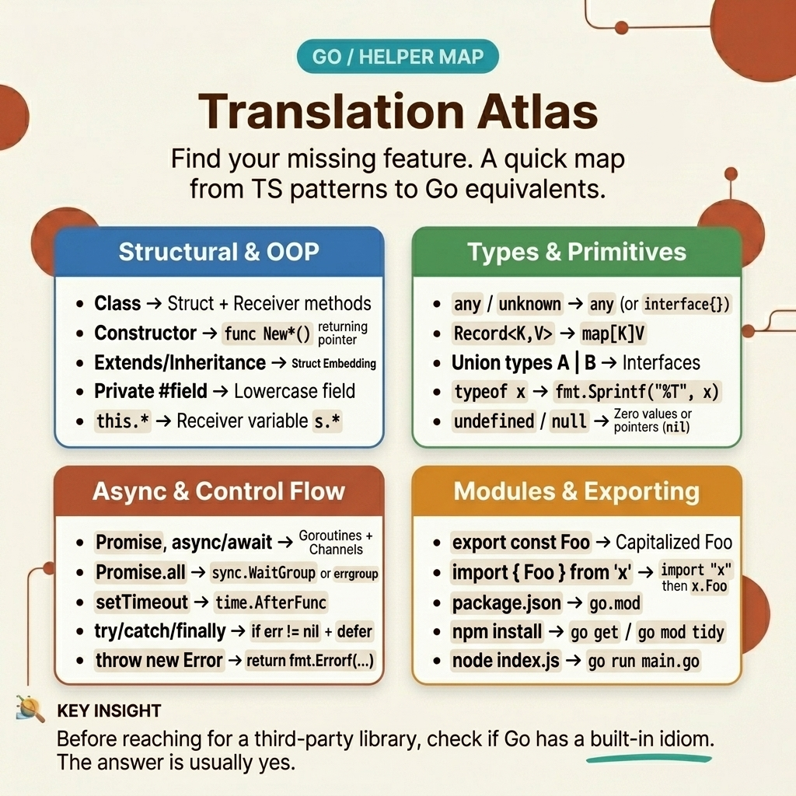

<!-- tags: golang, typescript, nodejs, migration -->
# 🗺️ Translation Atlas — Idiom Translation Map from TypeScript/Node.js to Go.

> A practical crosswalk for TypeScript backend programmers: instead of translating line by line, this article maps each familiar "intent" of TS/Node to primitives, packages, and idiomatic workflows in Go.

📅 Created: 2026-04-06 · 🔄 Updated: 2026-04-19 · ⏱️ 15 min read

| Aspect | Detail |
| --- | --- |
| **Focus** | Syntax crosswalk, stdlib mapping, runtime-first translation |
| **Use case** | First week porting services or tools from TypeScript/Node.js to Go |
| **Key diff** | TS/Node assembles many capabilities around runtime objects and ecosystem; Go separates intent into distinct packages |
| **Go stdlib** | `os`, `io`, `bufio`, `encoding/json`, `net/http`, `flag`, `regexp`, `context` |

## 1. DEFINE

You are porting a small utility backend from TypeScript to Go. In your head you have a very familiar list:

- `console.log`
- `JSON.parse`
- `fs.readFileSync`
- `Promise.all`
- `AbortController`
- `class`, `constructor`, `this`
- `process.argv`, `process.env`

The problem is that when you switch to Go, you do not find a "copy" of `process`, `fs`, or `Promise`. Everything seems split into more places: `fmt`, `os`, `bufio`, `encoding/json`, `net/http`, `context`, `flag`, `struct`, and more.

The guide from `miguelmota/golang-for-nodejs-developers` is very useful right there: it gives you an atlas like "X in Node.js is Y in Go". But if you bring that atlas into modern Go without adjusting for idiomatic patterns, you risk line-by-line translation that misses the point.

### 1.1 Don't translate based on keywords; Please translate according to intent.

Some mappings are almost direct:

- `JSON.parse` -> `json.Unmarshal`
- `JSON.stringify` -> `json.Marshal`
- `process.env.FOO` -> `os.Getenv("FOO")`
- `console.log` -> `fmt.Println`

But many mappings are only correct if viewed from the intent:

- `Promise.all` should not be mechanically mapped to "a bunch of channels"; With request fan-out, more idiomatic is `errgroup + context`.
- `class` does not map to "simulator class"; usually `struct + constructor + methods + small interface`.
- `fs` does not map to a central object; Go separates file I/O into `os`, `io`, `bufio`, sometimes adding `filepath`.

### 1.2 When is this map used correctly?

Use this atlas when:

- You know the problem you want to do in TS/Node, but don't know which package Go primitive is in.
- You are reviewing code port from TypeScript and want to detect "literal translation but semantic deviation".
- The team needs a quick entry point before digging into the `helper/` lane.

Don't use this atlas as the final rulebook. When the mapping starts to touch the domain model, lifecycle control, or architectural boundary, you have to go back to the core lessons in this cluster.

### 1.3 Invariants & Failure Modes

- This Atlas is a navigational tool, not a license for line-by-line rewrite.
- The original guide uses many original Node.js examples; In modern Go production, some patterns should be enhanced to `context`, `errgroup`, explicit constructors, and boundary translation to be clearer.
- If a mapping causes you to add too many `any`, `interface{}`, or goroutines "to look like Promise", it's usually a sign you're mistranslating the abstract class.

The real difference is not in memorizing the package name. It lies in recognizing the same intention "packaged" very differently between the two systems. The diagram below pulls that exact point into the light.

## 2. VISUAL

### Level 1

```text
What are you looking to do in TS/Node?

syntax + printing
    -> Go language + fmt + log

objects + classes + JSON
    -> struct + methods + encoding/json

files + streams + cli
    -> os + io + bufio + flag

HTTP + URL + request lifecycle
    -> net/http + net/url + context

Promise + async/await + cancellation
    -> goroutine + channel/select + errgroup + context

tooling + package workflow
    -> go mod + go test + gofmt + go doc
```



*Figure: Level 1 shows that the correct question is not "Is there an object like `fs` in Go?", but "in which package in Go does this intent live?".*.

### Level 2

```text
TS/Node runtime-shaped thinking
  -> process / fs / Buffer / Promise / class
-> find equivalent object
-> easy to translate according to the words but with different semantics.

Go intent-shaped thinking
  -> data modeling?       -> struct + constructor + json tags
  -> async orchestration? -> errgroup + context
  -> stream file?         -> os.Open + bufio.Scanner
  -> cli input?           -> flag + os.Args
  -> output/logging?      -> fmt / log / os.Stderr
```

*Figure: Level 2 emphasizes the most important rewire: from object-centric lookup to intent-centric lookup.*.

Visual is enough to locate the package. The rest is to see how this atlas saves you from line-by-line translation when dealing with real code.

## 3. CODE

### Example 1: Basic — `fs` + `JSON.parse` + defaults should be a clear boundary decode.

> **Goal**: Map a script that reads config from a JSON file to Go without mixing the optional DTO with the domain config.
> **Approach**: Decode raw input at the boundary, then apply explicit defaults when creating the actual config.
> **Example**: `./config.json` → `ServiceConfig{ServiceName, Port, Debug}`.
> **Complexity**: O(n) by file size; the important part is correct boundary design, not performance.

Familiar TypeScript version:

```typescript
import { readFileSync } from "node:fs";

type ServiceConfigInput = {
  serviceName: string;
  port?: number;
  debug?: boolean;
};

type ServiceConfig = {
  serviceName: string;
  port: number;
  debug: boolean;
};

function loadConfig(path: string): ServiceConfig {
  const raw = readFileSync(path, "utf8");
  const parsed = JSON.parse(raw) as ServiceConfigInput;

  if (!parsed.serviceName) {
    throw new Error("serviceName is required");
  }

  return {
    serviceName: parsed.serviceName,
    port: parsed.port ?? 8080,
    debug: parsed.debug ?? false,
  };
}

const cfg = loadConfig("./config.json");
console.log(`service=${cfg.serviceName} port=${cfg.port} debug=${cfg.debug}`);
```

Corresponding Go version:

```go
package main

import (
	"encoding/json"
	"fmt"
	"os"
)

type rawConfig struct {
	ServiceName string `json:"serviceName"`
	Port        *int   `json:"port"`
	Debug       *bool  `json:"debug"`
}

type ServiceConfig struct {
	ServiceName string
	Port        int
	Debug       bool
}

func loadConfig(path string) (ServiceConfig, error) {
	raw, err := os.ReadFile(path)
	if err != nil {
		return ServiceConfig{}, fmt.Errorf("read config %s: %w", path, err)
	}

	var input rawConfig
	if err := json.Unmarshal(raw, &input); err != nil {
		return ServiceConfig{}, fmt.Errorf("decode config %s: %w", path, err)
	}
	if input.ServiceName == "" {
		return ServiceConfig{}, fmt.Errorf("serviceName is required")
	}

	cfg := ServiceConfig{
		ServiceName: input.ServiceName,
		Port:        8080,
		Debug:       false,
	}

		// Pointer only lives at the boundary to distinguish "no field" from "field with zero value"
	if input.Port != nil {
		cfg.Port = *input.Port
	}
	if input.Debug != nil {
		cfg.Debug = *input.Debug
	}

	return cfg, nil
}

func main() {
	cfg, err := loadConfig("./config.json")
	if err != nil {
		panic(err)
	}

	fmt.Printf("service=%s port=%d debug=%t\n", cfg.ServiceName, cfg.Port, cfg.Debug)
}
```

> **Why?** In Node/TypeScript, `undefined`, `null`, optional fields, and default object merging often go together quite naturally. Go forces you to separate them more clearly. It is not superfluous ceremony — it helps the JSON boundary remain explicit and debuggable.

> **Takeaway**: Map `fs + JSON.parse` to `os.ReadFile + json.Unmarshal`, but keep defaults and invariants in the actual object creation step. Do not stuff them into the raw DTO.

Basic case is fine. But most teams don't switch languages ​​just to read JSON files; They switch when requests fan-out, timeouts, and cancellations start to hurt. That's when the atlas had to change from syntax.

### Example 2: Intermediate — `Promise.all` should be translated according to lifecycle, not form.

> **Goal**: Map a fan-out request using `Promise.all` to Go in a way that preserves global timeouts and cancellation.
> **Approach**: Use `fetch` + `AbortController` in TS, then `errgroup + context` in Go.
> **Example**: Call three endpoints `profile`, `billing`, `invoices` in parallel.
> **Complexity**: O(k) by number of downstreams; the real cost lies in network I/O.

TypeScript version with familiar lifecycle control:

```typescript
type Dashboard = {
  profile: unknown;
  billing: unknown;
  invoices: unknown;
};

async function fetchJSON<T>(url: string, signal: AbortSignal): Promise<T> {
  const response = await fetch(url, { signal });
  if (!response.ok) {
    throw new Error(`request failed: ${response.status}`);
  }
  return response.json() as Promise<T>;
}

async function loadDashboard(baseURL: string): Promise<Dashboard> {
  const controller = new AbortController();
  const timeout = setTimeout(() => controller.abort(), 800);

  try {
    const [profile, billing, invoices] = await Promise.all([
      fetchJSON(`${baseURL}/profile`, controller.signal),
      fetchJSON(`${baseURL}/billing`, controller.signal),
      fetchJSON(`${baseURL}/invoices`, controller.signal),
    ]);

    return { profile, billing, invoices };
  } finally {
    clearTimeout(timeout);
  }
}
```

Corresponding Go version:

```go
package dashboard

import (
	"context"
	"encoding/json"
	"fmt"
	"net/http"
	"time"

	"golang.org/x/sync/errgroup"
)

type Dashboard struct {
	Profile  map[string]any
	Billing  map[string]any
	Invoices map[string]any
}

func fetchJSON(ctx context.Context, client *http.Client, url string) (map[string]any, error) {
	req, err := http.NewRequestWithContext(ctx, http.MethodGet, url, nil)
	if err != nil {
		return nil, fmt.Errorf("build request %s: %w", url, err)
	}

	resp, err := client.Do(req)
	if err != nil {
		return nil, fmt.Errorf("do request %s: %w", url, err)
	}
	defer resp.Body.Close()

	if resp.StatusCode >= http.StatusBadRequest {
		return nil, fmt.Errorf("request %s failed: %s", url, resp.Status)
	}

	var out map[string]any
	if err := json.NewDecoder(resp.Body).Decode(&out); err != nil {
		return nil, fmt.Errorf("decode %s: %w", url, err)
	}
	return out, nil
}

func LoadDashboard(ctx context.Context, baseURL string) (Dashboard, error) {
	ctx, cancel := context.WithTimeout(ctx, 800*time.Millisecond)
	defer cancel()

	client := &http.Client{}
	g, ctx := errgroup.WithContext(ctx)

	var profile map[string]any
	var billing map[string]any
	var invoices map[string]any

	g.Go(func() error {
		value, err := fetchJSON(ctx, client, baseURL+"/profile")
		if err != nil {
			return err
		}
		profile = value
		return nil
	})

	g.Go(func() error {
		value, err := fetchJSON(ctx, client, baseURL+"/billing")
		if err != nil {
			return err
		}
		billing = value
		return nil
	})

	g.Go(func() error {
		value, err := fetchJSON(ctx, client, baseURL+"/invoices")
		if err != nil {
			return err
		}
		invoices = value
		return nil
	})

	if err := g.Wait(); err != nil {
		return Dashboard{}, err
	}

	return Dashboard{
		Profile:  profile,
		Billing:  billing,
		Invoices: invoices,
	}, nil
}
```

> **Why?** The original guide mapping `Promise` to channel is a good entry point for understanding Go's concurrency primitives. But with modern request-scoped fan-out, `errgroup + context` is a translation closer to production: if a branch fails, the shared context cancels siblings automatically.

> **Takeaway**: When encountering `Promise.all`, do not ask "which channel does each Promise belong to?". Ask "where does this fan-out need error fan-in, timeout, and cancellation?".

Once the fan-out request has passed, the next shock often comes from small scripts and CLIs. Node puts `process`, `fs`, `readline`, `stdout` very close together; Go spreads them out into many smaller packages. That's the.

### Example 3: Advanced — command line scripts often have to separate `process` into many small Go packages.

> **Goal**: Port a utility that counts log lines by regex from Node.js to Go while keeping the streaming flow, CLI args, and stdout/stderr handling clear.
> **Approach**: TS uses `process.argv`, `fs.createReadStream`, `readline`; Go uses `flag`, `os.Open`, `bufio.Scanner`, `regexp`.
> **Example**: `errorcount -pattern 'WARN|ERROR' ./app.log`.
> **Complexity**: O(n) by number of lines; memory stays close to O(1) because of streaming processing.

TypeScript/Node versions usually start like this:

```typescript
import { createReadStream } from "node:fs";
import * as readline from "node:readline";

async function main(): Promise<void> {
  const filePath = process.argv[2];
  const pattern = process.argv[3] ?? "ERROR";

  if (!filePath) {
    throw new Error("usage: errorcount <file> [pattern]");
  }

  const re = new RegExp(pattern);
  const reader = readline.createInterface({
    input: createReadStream(filePath),
    crlfDelay: Infinity,
  });

  let count = 0;
  for await (const line of reader) {
    if (re.test(line)) {
      count++;
    }
  }

  process.stdout.write(`${count}\n`);
}

void main().catch((err) => {
  console.error(err.message);
  process.exit(1);
});
```

Corresponding Go version:

```go
package main

import (
	"bufio"
	"flag"
	"fmt"
	"os"
	"regexp"
)

func main() {
	pattern := flag.String("pattern", "ERROR", "regular expression to count")
	flag.Parse()

	if flag.NArg() != 1 {
		fmt.Fprintln(os.Stderr, "usage: errorcount [-pattern REGEX] <file>")
		os.Exit(2)
	}

	re, err := regexp.Compile(*pattern)
	if err != nil {
		fmt.Fprintf(os.Stderr, "compile regex: %v\n", err)
		os.Exit(1)
	}

	file, err := os.Open(flag.Arg(0))
	if err != nil {
		fmt.Fprintf(os.Stderr, "open file: %v\n", err)
		os.Exit(1)
	}
	defer file.Close()

	scanner := bufio.NewScanner(file)
	count := 0
	for scanner.Scan() {
		if re.MatchString(scanner.Text()) {
			count++
		}
	}

	if err := scanner.Err(); err != nil {
		fmt.Fprintf(os.Stderr, "scan file: %v\n", err)
		os.Exit(1)
	}

	fmt.Fprintln(os.Stdout, count)
}
```

> **Why?** This is where the atlas is especially useful: in Node, many capabilities reside around `process`, `fs`, and `readline`. In Go, there is no equivalent "one central object". In return, each intent has a clearer, smaller package.

> **Takeaway**: Do not look for a Go `process`. Accept that CLI/runtime concerns are spread across many small packages — that is how Go keeps code less magical.

Knowing where primitives live is half the story. The other half are easy slip-ups when using an atlas as a bilingual dictionary instead of as a navigational tool.

## 4. PITFALLS

| # | Severity | Error | Consequence | Fix |
| --- | --- | --- | --- | --- |
| 1 | 🔴 Fatal | Using the atlas as a line-by-line translation table and mapping `Promise` to raw channels | Code looks "right Go" on the surface but lacks timeouts, cancellation, and error fan-in | Translate according to lifecycle: request fan-out → `errgroup + context`, low-level signaling uses channel |
| 2 | 🔴 Fatal | Trying to find a Go object equivalent to `process` or `fs` | Stuck feeling Go is disjointed, creating meaningless helper packages to imitate Node | Separate by intent: file → `os/io/bufio`, CLI → `flag`, output → `fmt`/`os.Stderr` |
| 3 | 🟡 Common | Porting `class` to struct and exporting all fields for "ease of use" | Loss of invariant, API surface bloat, mutation is difficult to control | Keep fields unexported when needed, use explicit constructors and methods |
| 4 | 🔵 Minor | Using the atlas while skipping the mental model and data modeling lessons | Translated the syntax but still made wrong design decisions | Use the atlas for quick navigation, then return to the corresponding core article for depth |

## 5. REF

| Resource | Type | Link | Note |
| --- | --- | --- | --- |
| Golang for Node.js Developers | Community | https://github.com/miguelmota/golang-for-nodejs-developers?tab=readme-ov-file#examples | The original guide serves as the basis for this atlas; The current article chooses mappings |
| Go Standard Library | Official | https://pkg.go.dev/std | Standard index to look up the destination package instead of guessing by namespace like Node |
| A Tour of Go | Official | https://go.dev/tour/ | Needed if you are still unfamiliar with Go's basic syntax and package model |
| Effective Go | Official | https://go.dev/doc/effective_go | Source of truth for idiomatic Go after knowing the syntax |

## 6. RECOMMEND

The core of **Translation Atlas** is clear. The extension branches below help you make this atlas a natural Go writing habit instead of translating from TypeScript.

It ends with knowing when to leave the atlas and return to the core to make better decisions.

| Extension | When | Rationale | Link |
| --- | --- | --- | --- |
| Mental Model & Runtime | When you keep asking "why doesn't Go have X like Node?" | The root problem is usually the mental model, not a missing API | [→ 01-mental-model-runtime](./01-mental-model-runtime.md) |
| Types & Data Modeling | When porting DTOs, unions, optionals, and classes starts to hurt | Atlas shows the direction; this article locks data boundaries and invariants | [→ 02-types-data-modeling](./02-types-data-modeling.md) |
| Errors, Concurrency, Context | When translation hits `Promise.all`, timeout, abort, or retry | Where syntax mapping must give way to lifecycle control | [→ 03-errors-concurrency-context](./03-errors-concurrency-context.md) |
| Project Layout, Tooling, Testing | When the team asks "If Go lacks a framework/tooling, how can we ship?" | Connects the atlas with the real build-test-ship workflow | [→ 04-project-layout-tooling](./04-project-layout-tooling-testing.md) |
| Promise & Async | When you need deeper recipes for `Promise.all`, `Promise.race`, `AbortController` | Pattern-by-pattern mapping at the helper level | [→ 04-promise-async](../helper/04-promise-async.md) |
| Class → Struct | When the codebase is too heavy in class hierarchy | Helps cut one-to-one OOP port habits | [→ 12-class-struct](../helper/12-class-struct.md) |
| Helper — TS/JS → Go Utilities | When you need multiple recipe-level mappings in a row | Use the helper cluster as a quick lookup, while the atlas serves as navigator | [→ Helper README](../helper/README.md) |

## 7. QUICK REF

The table below is the reward at the end of the lesson: used to rescan in 20-30 seconds without having to reread the entire arc above.

| # | TS/Node idiom | Go equivalent | Note |
| --- | --- | --- | --- |
| 1 | `console.log`, `console.error` | `fmt.Println`, `fmt.Fprintf(os.Stderr, ...)`, `log.Println` | `fmt` for direct output; `log` when timestamp/prefix is needed |
| 2 | `JSON.parse`, `JSON.stringify` | `json.Unmarshal`, `json.Marshal`, `json.NewDecoder` | Boundary JSON almost always goes through `encoding/json` |
| 3 | `Buffer` | `[]byte`, `bytes.Buffer`, `encoding/hex`, `encoding/binary` | `[]byte` is the most important primitive, not the object wrapper |
| 4 | `fs.readFileSync`, `createReadStream` | `os.ReadFile`, `os.Open`, `bufio.Scanner`, `io.Reader` | Files/streams are split according to intent instead of being grouped into one namespace |
| 5 | `Promise.all` | `errgroup.WithContext` | Request fan-out should think in terms of lifecycle instead of raw channel |
| 6 | `AbortController` | `context.WithCancel`, `context.WithTimeout` | Cancellation is an explicit contract in Go |
| 7 | `class`, `constructor`, `this` | `struct`, `NewXxx`, methods, small interfaces | Start from composition, do not simulate inheritance |
| 8 | `process.argv`, `process.env` | `flag`, `os.Args`, `os.Getenv` | CLI args and env are separate, not passing through a common object |
| 9 | `EventEmitter` | explicit interfaces, callbacks, sometimes channel | Channel is not a one-to-one copy of the emitter |
| 10 | `npm install`, `package.json scripts`, `jest`, `bench` | `go mod`, `go test`, `go test -bench`, `go doc` | Collect multiple workflows into a more standard toolchain |

**Navigation**: [← Previous](./06-migration-playbook.md) · [→ Next](./README.md)
