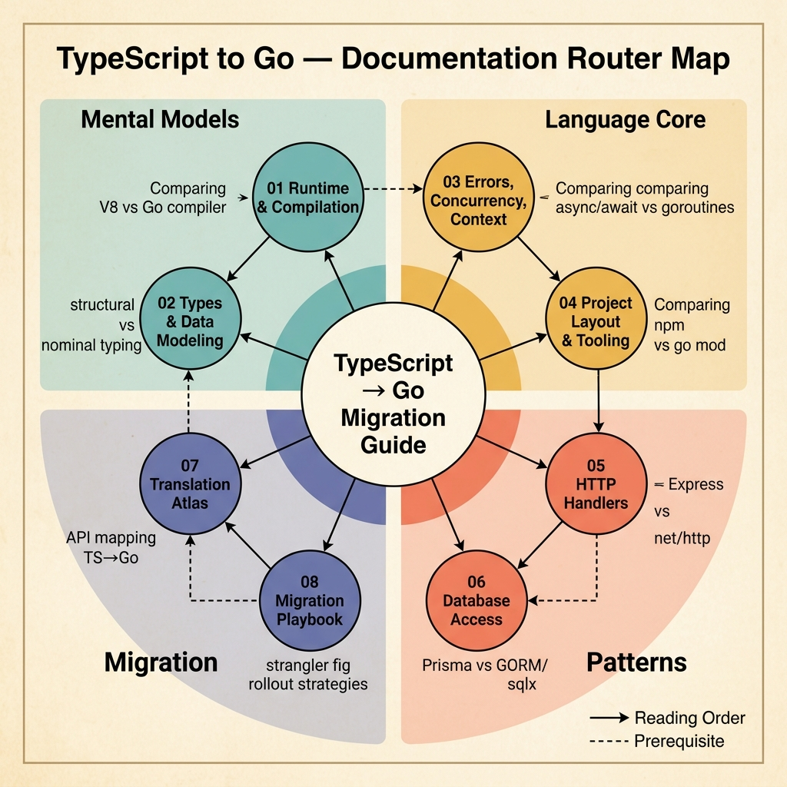

<!-- tags: golang, typescript, migration -->
# TypeScript → Go

> Roadmap to move from TypeScript to Go for backend and platform engineers: mental model, data modeling, concurrency, tooling, migration strategy, decision-making, and a translation atlas to map TS/Node idioms to Go quickly but not superficially.

📅 Updated: 2026-04-19 · ⏱️ 7 min read

## 1. DEFINE

You just got a service running fine using TypeScript. Traffic increases, latency begins to show, memory spikes during peak hours, and the team wants to write the critical path part in Go. It sounds simple:

But as soon as you start, you realize the problem isn't syntax. TypeScript is a type layer running on the JavaScript event-loop runtime; Go is a compiled language with goroutine-based concurrency, value semantics, and explicit error handling. Porting line-by-line produces code that is technically Go but architecturally still Node.js.

This cluster exists to help you avoid that wrong port. It does not echo the entire `helper/`; it collects what a TypeScript engineer really needs when migrating systems: runtime model, data modeling, error/concurrency/context, tooling, and migration strategy.

### 1.1 Signals & Boundaries

- Open this cluster when you already know TypeScript well, but Go still gives the feeling of "it's the same typed backend but the decision is completely different".
- The focus here is on changing mindsets and decision making, not just looking up APIs.
- If you need a very specific recipe like `Promise.all`, `enum`, `optional`, `class`, read the `fundamental/helper/` lane in parallel.

### 1.2 Learning Lanes

- `Mental Model & Runtime` locks in the biggest differences: type layer vs compiled language, event loop vs goroutine scheduler, zero value, value semantics, package boundaries.
- `Types & Data Modeling` helps map unions, optionals, classes, enums, interfaces to named types, structs, tags, interfaces, constructors and Go-style validation.
- `Errors, Concurrency, Context` is where TypeScript engineers fail the most because of the `throw`, `Promise.all`, and fire-and-forget reflexes.
- `Project Layout, Tooling, Testing` explains why Go teams need less framework-heavy scaffolding but still maintain delivery speed.
- `Translation Atlas` is a companion file to quickly look up "which Go package this TS/Node is located in", based on guide examples of `golang-for-nodejs-developers` but rewritten in a more production-oriented way.
- `When to Choose Go vs TypeScript` is for greenfield problems, split services, or needs hybrid architecture.
- `Migration Playbook` brings together strangler, sidecar, contract-first strategies, and a 30/60/90 day roadmap.

## 2. VISUAL

This is a cluster router and learning path, so a static visual is much clearer than a diagram-as-code when it comes to simultaneously scanning symptoms, preamble files, and learning order.



*Figure: Upper panel maps symptoms to the correct starting article; lower panel shows the recommended learning order to avoid porting syntax before locking the mental model and lifecycle control.*

## 3. CODE

Flow is clear at the navigation level. Now let's compress it into a short artifact so the reader knows where to turn first.

### Example 1: Router artifact — select the correct document according to pain point.

> **Goal**: Make this cluster a navigation tool, not just another folder.
> **Approach**: Map actual symptoms to the correct opening article.
> **Example**: Select lane by migration pain point.
> **Complexity**: O(1) at navigation level; the real value lies in avoiding the wrong entry point.

```text
func chooseTS2GoLane(signal string) string {
    switch signal {
    case "runtime":
        return "./01-mental-model-runtime.md"
    case "types":
        return "./02-types-data-modeling.md"
    case "async":
        return "./03-errors-concurrency-context.md"
    case "tooling":
        return "./04-project-layout-tooling-testing.md"
    case "atlas":
        return "./07-translation-atlas.md"
    case "language-choice":
        return "./05-when-to-choose-go-vs-typescript.md"
    case "migration":
        return "./06-migration-playbook.md"
    default:
        return "./README.md"
    }
}
```

This pseudo-router is not code to run in your application; it keeps the whole cluster reading as one intentional learning path.

## 4. PITFALLS

| # | Severity | Error | Consequence | Fix |
| --- | --- | --- | --- | --- |
| 1 | 🔴 Fatal | Learn Go by porting TypeScript line-by-line | There is new syntax but still keeps the old mental model | Start from `01-mental-model-runtime.md` before touching migration strategy |
| 2 | 🟡 Common | Use this cluster as a replacement for `helper/` | Missing specific recipe when touching enum/optional/promise mapping | Read this cluster in parallel with `fundamental/helper/` when API-level mapping is needed |
| 3 | 🔵 Minor | Jump straight into the language or migration decision doc | The decision is correct on the surface but wrong in implementation detail | Follow the rhythm `mental model -> types -> concurrency -> tooling -> strategy` |

## 5. REF

| Resource | Type | Link | Note |
| --- | --- | --- | --- |
| The TypeScript Handbook | Official | https://www.typescriptlang.org/docs/handbook/intro.html | Official baseline for the TypeScript mental model |
| Golang for Node.js Developers | Community | https://github.com/miguelmota/golang-for-nodejs-developers?tab=readme-ov-file#examples | Nearest crosswalk for idiom TS/Node -> Go |
| A Tour of Go | Official | https://go.dev/tour/ | Official entry point if you need to reset the syntax and package model |
| Effective Go | Official | https://go.dev/doc/effective_go | Source of truth for idiomatic Go after locking the basics |

## 6. RECOMMEND

You don't need to read the entire cluster in absolute order. Please choose the correct entry point for your symptom, then follow the sequence below.

| Extend | When should I continue reading? | Reason | File/Link |
| --- | --- | --- | --- |
| Mental Model & Runtime | When just starting to change your thinking system | Key the root differences between TypeScript and Go | [./01-mental-model-runtime.md](./01-mental-model-runtime.md) |
| Types & Data Modeling | When starting port DTO, entity, config | Avoid mapping data that is "similar" but is invariant | [./02-types-data-modeling.md](./02-types-data-modeling.md) |
| Errors, Concurrency, Context | When the old TypeScript service used a lot of async I/O | This is where most migration bugs are revealed first | [./03-errors-concurrency-context.md](./03-errors-concurrency-context.md) |
| Project Layout, Tooling, Testing | When the team has read Go but is not familiar with building-test-ship following the Go | This is the step that locks the workflow, not just the syntax | [./04-project-layout-tooling-testing.md](./04-project-layout-tooling-testing.md) |
| Translation Atlas | When you need to quickly find "Where is this idiom TS/Node located in Go?" | Is a bridge between the mental model and recipe-level helper docs | [./07-translation-atlas.md](./07-translation-atlas.md) |
| When to Choose Go vs TypeScript | When the problem is greenfield, split service, or hybrid stack | Need decision framework before touching migration strategy | [./05-when-to-choose-go-vs-typescript.md](./05-when-to-choose-go-vs-typescript.md) |
| Migration Playbook | Once you have a technical baseline and prepare for rollout | Helps choose the right migration instead of big-bang rewrite | [./06-migration-playbook.md](./06-migration-playbook.md) |
| Helper — TS/JS → Go Conversion & Utilities | When you need more specific recipe-level mapping than `Promise`, `enum`, `class`, `optional` | This cluster takes care of strategy; helper takes care of primitives and detailed patterns | [../helper/README.md](../helper/README.md) |
| Go Fundamental | When you need to turn to pure Go fundamentals outside the migration context | Return to the parent router to change the cluster in the Go system | [../README.md](../README.md) |
