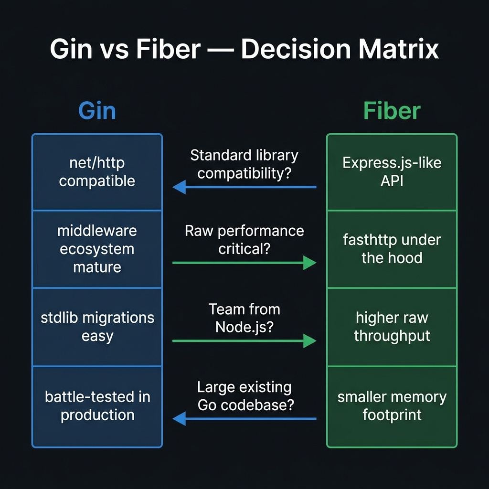

<!-- tags: golang, gin, fiber, framework, comparison -->
# Gin vs Fiber: Framework Comparison & Decision Guide

> Two Go web frameworks dominate the ecosystem in 2026. Gin wraps `net/http` and gives you the entire stdlib ecosystem. Fiber replaces `net/http` with `fasthttp` and gives you raw throughput. Choosing wrong means either fighting ecosystem friction or leaving performance on the table.

📅 Created: 2026-03-23 · 🔄 Updated: 2026-04-21 · ⏱️ 20 min read

| Aspect             | Gin                          | Fiber v3                        |
| ------------------ | ---------------------------- | ------------------------------- |
| **HTTP Engine**    | `net/http` (standard lib)    | `fasthttp` (custom)             |
| **GitHub Stars**   | ~80k ⭐                      | ~35k ⭐                         |
| **First release**  | 2014                         | 2020                            |
| **Handler type**   | `func(c *gin.Context)`       | `func(c fiber.Ctx) error`       |
| **Philosophy**     | Explicit, composable         | Batteries-included, Express-like |

---

## 1. DEFINE

You are starting a new Go backend. The team agrees on Go for the language, but the framework question splits the room. One engineer insists on Gin because "it's the standard." Another pushes Fiber because "benchmarks show 2x throughput." Both are right — and both are wrong — because the question is not which framework is faster. The question is which trade-off your project can afford.

The split between Gin and Fiber is not a feature list comparison. It is an **engine-level architectural decision** that determines which parts of the Go ecosystem you can use directly and which parts you must adapt.

### Architectural Distinction

**Gin** wraps Go's standard `net/http` library. Every handler receives a `*gin.Context` that extends `http.Request` and `http.ResponseWriter`. Any middleware, library, or tool built for `net/http` works with Gin out of the box — no adapters, no conversion layers.

**Fiber v3** replaces `net/http` entirely with `fasthttp`, a custom HTTP engine optimized for zero-allocation request handling. Fiber's `fiber.Ctx` is not compatible with `http.Request` or `http.ResponseWriter`. Using any `net/http`-based library requires an explicit adapter import, and some libraries cannot be adapted at all.

This distinction is invisible in small projects. It becomes the dominant constraint when your codebase grows past 20 packages and you start pulling in authentication libraries, observability middleware, and gRPC gateways that assume `net/http` types.

### Comparative Overview

| Dimension | Gin | Fiber v3 |
| --- | --- | --- |
| **HTTP Engine** | `net/http` — full stdlib compatibility | `fasthttp` — zero-allocation, custom types |
| **Allocation Model** | Allocates per request (stdlib behavior) | Object pooling, minimized heap allocations |
| **Handler Signature** | `func(c *gin.Context)` — void return | `func(c fiber.Ctx) error` — explicit error returns |
| **Error Handling** | Manual status checks, `c.AbortWithStatusJSON` | Centralized `ErrorHandler` in app config |
| **Ecosystem Access** | Direct — any `net/http` middleware works | Requires `adaptor` package for stdlib middleware |
| **Built-in Middleware** | Minimal (Logger, Recovery) | 20+ built-in (CORS, Helmet, CSRF, Limiter, Cache) |
| **Testing** | `httptest.NewServer` — standard approach | `app.Test(req)` — no server needed |
| **Route Constraints** | Grouped paths | Typed params (`:id<int>`) |
| **Graceful Shutdown** | Manual signal trapping | Built-in lifecycle hooks |

### Feature Matrix

| Feature | Gin | Fiber v3 | Note |
| --- | --- | --- | --- |
| Built-in CORS | ❌ | ✅ | Gin needs `gin-contrib/cors` |
| Security headers | ❌ | ✅ | Gin needs `gin-contrib/secure` |
| CSRF protection | ❌ | ✅ | Fiber bundles `middleware/csrf` |
| Rate limiting | ❌ | ✅ | Gin needs third-party packages |
| Response caching | ❌ | ✅ | Fiber bundles `middleware/cache` |
| Session management | ❌ | ✅ | Gin needs `gin-contrib/sessions` |
| Compression (Brotli) | Partial | ✅ | Fiber supports Brotli natively |
| WebSocket | Upgrade via stdlib | Adapter-based | Both need external websocket libs |
| Server-Sent Events | Manual implementation | Built-in helpers | Fiber has SSE helpers in core |
| Route grouping | ✅ | ✅ | Both support grouped routes |
| Graceful shutdown | Manual signal handling | Lifecycle hooks | Fiber's hooks reduce boilerplate |
| stdlib compatibility | ✅ Native | Via `adaptor` package | Critical differentiator |

### Performance Reality

| Scenario | Gin | Fiber v3 | Context |
| --- | --- | --- | --- |
| Hello World JSON | ~130k RPS | ~300k RPS | Measures HTTP engine overhead only |
| JSON parsing | ~90k RPS | ~200k RPS | `fasthttp` avoids `io.ReadAll` allocations |
| Middleware chain (5 layers) | ~80k RPS | ~170k RPS | Object pooling gives Fiber the edge |
| Memory per request | Baseline | ~40% less | Fiber reuses request objects from pool |
| p99 latency | ~0.3ms | ~0.15ms | Matters for tail latency-sensitive services |
| **Real production** | **≈ equal** | **≈ equal** | DB, cache, and network I/O dominate |

The last row is the most important. In production, your database query takes 5-50ms. Your external API call takes 20-200ms. The 0.15ms difference between Gin and Fiber's HTTP layer is noise. Performance only matters for Fiber when your service is genuinely CPU-bound at the HTTP layer — high-frequency proxies, edge gateways, or API aggregators with no heavy I/O.

### When to Choose Each

**Choose Gin when:**
- Your codebase already uses `net/http`-based libraries (auth, tracing, gRPC gateway)
- Team values explicit control over configuration and prefers composing from small packages
- You want the largest Go web framework ecosystem and the most Stack Overflow answers
- The project is a long-lived API that will integrate with many third-party Go packages

**Choose Fiber when:**
- Your team comes from Node.js/Express and wants a familiar API surface
- You need batteries-included middleware (CORS, Helmet, CSRF, Limiter) without extra dependencies
- The service is a high-throughput proxy or gateway where HTTP-layer overhead matters
- You prefer centralized error handling via `ErrorHandler` over manual `Abort` patterns

The fatal mistake is mixing both ecosystems in the same project — importing `net/http` middleware into a Fiber app without adapters, or expecting Fiber's `fiber.Ctx` to satisfy `http.Handler` interfaces. That path leads to compilation failures, subtle runtime bugs, and a painful migration later. The PITFALLS section covers this in detail.

## 2. VISUAL

The distinction above gives you the raw data. This decision matrix turns it into a routing question you can answer in 30 seconds — follow the question that matters most to your team, and the arrow points to the framework.



*Image: Four decision questions separate Gin from Fiber. Stdlib compatibility and existing Go codebase point to Gin. Raw performance needs and Node.js team background point to Fiber. The arrows make the trade-off explicit: you cannot have both full stdlib compatibility and fasthttp performance.*

```text
Decision Matrix
├── Standard library compatibility needed? → Gin
├── Raw performance is primary requirement? → Fiber
├── Team from Node.js / Express background? → Fiber
└── Large existing Go codebase with net/http? → Gin
```
*Figure: Text fallback — the four routing questions that determine framework choice.*

The middleware architecture reveals the second major difference: what you get out of the box versus what you assemble from packages.

```text
Gin Middleware Stack                     Fiber Middleware Stack
─────────────────────────────            ─────────────────────────────
r := gin.New()                           app := fiber.New()
r.Use(                                   app.Use(
  gin.Logger(),           ┐                middleware.Logger(),      ┐
  gin.Recovery(),         ┘ built-in       middleware.Recover(),     │
  cors.Default(),         ← external       middleware.CORS(),        ├ built-in
  helmet.Default(),       ← external       middleware.Helmet(),      ┤
  rateLimiter.New(...),   ← external       middleware.Limiter(...),  ┘
)                                        )

stdlib compatibility:                    stdlib compatibility:
✅ Any net/http middleware works           ❌ Needs adaptor package
```

*Figure: Gin ships minimal and composes from external packages. Fiber bundles 20+ middleware but requires adapters for any net/http-based library. The trade-off is convenience vs ecosystem reach.*

## 3. CODE

The code examples below escalate from basic routing to testing patterns to a full API translation cheatsheet. All examples are Go-only — both Gin and Fiber live in the Go ecosystem, so side-by-side Go comparison is the most useful format.

### Example 1: Basic — Routing and Parameter Extraction

> **Goal**: Compare the simplest possible handler — route params, query strings, JSON response.
> **Approach**: Side-by-side minimal servers showing how each framework handles the same request.
> **Complexity**: Basic

```go
// ─────────────── GIN ───────────────
package main

import "github.com/gin-gonic/gin"

func main() {
    r := gin.Default()

    r.GET("/users/:id", func(c *gin.Context) {
        id := c.Param("id")
        page := c.Query("page")

        c.JSON(200, gin.H{
            "id":   id,
            "page": page,
        })
    })

    r.Run(":3000")
}
```

```go
// ─────────────── FIBER v3 ───────────────
package main

import "github.com/gofiber/fiber/v3"

func main() {
    app := fiber.New()

    app.Get("/users/:id", func(c fiber.Ctx) error {
        id := c.Params("id")
        page := c.Query("page")

        return c.JSON(fiber.Map{
            "id":   id,
            "page": page,
        })
    })

    app.Listen(":3000")
}
```

**Results**:

Both produce identical JSON output for `GET /users/42?page=3`. The structural differences are:
- **Method naming**: `c.Param()` vs `c.Params()` — one letter, easy to miss when switching
- **Return type**: Gin handlers return nothing; Fiber handlers return `error` — Fiber's approach enables centralized error handling
- **Server start**: `r.Run()` vs `app.Listen()` — cosmetic difference, same behavior

**Takeaway**:

At the basic level, Gin and Fiber are nearly identical in developer experience. The Express-like naming in Fiber (`app.Get`, `app.Listen`) is intentional — it reduces the learning curve for Node.js developers. The real differences emerge when you add middleware, error handling, and testing, which is where Example 2 picks up.

### Example 2: Intermediate — Middleware Stack and Error Handling

> **Goal**: Compare how each framework handles CORS, authentication middleware, route grouping, and error responses.
> **Approach**: Production-realistic API setup with auth middleware, grouped routes, and proper error responses.
> **Complexity**: Intermediate

```go
// ─────────────── GIN ───────────────
package main

import (
    "github.com/gin-gonic/gin"
    "github.com/gin-contrib/cors"
    "net/http"
)

func main() {
    r := gin.New()
    r.Use(gin.Logger(), gin.Recovery())

    // ⚠️ CORS requires external packages
    r.Use(cors.New(cors.Config{
        AllowOrigins:     []string{"https://myapp.com"},
        AllowMethods:     []string{"GET", "POST", "PUT", "DELETE"},
        AllowHeaders:     []string{"Authorization", "Content-Type"},
        AllowCredentials: true,
    }))

    authMiddleware := func(c *gin.Context) {
        token := c.GetHeader("Authorization")
        if token == "" {
            c.AbortWithStatusJSON(http.StatusUnauthorized, gin.H{"error": "unauthorized"})
            return
        }
        c.Next()
    }

    api := r.Group("/api/v1")
    api.Use(authMiddleware)
    {
        api.GET("/orders", func(c *gin.Context) {
            c.JSON(200, gin.H{"orders": []string{}})
        })
    }

    r.Run(":3000")
}
```

```go
// ─────────────── FIBER v3 ───────────────
package main

import (
    "github.com/gofiber/fiber/v3"
    "github.com/gofiber/fiber/v3/middleware/cors"
    "github.com/gofiber/fiber/v3/middleware/helmet"
    "github.com/gofiber/fiber/v3/middleware/limiter"
)

func main() {
    app := fiber.New(fiber.Config{
        ErrorHandler: func(c fiber.Ctx, err error) error {
            code := fiber.StatusInternalServerError
            if e, ok := err.(*fiber.Error); ok {
                code = e.Code
            }
            return c.Status(code).JSON(fiber.Map{"error": err.Error()})
        },
    })

    // ✅ Built-in integrations define components
    app.Use(cors.New(cors.Config{
        AllowOrigins:     []string{"https://myapp.com"},
        AllowCredentials: true,
    }))
    app.Use(helmet.New())
    app.Use(limiter.New(limiter.Config{Max: 100}))

    authMiddleware := func(c fiber.Ctx) error {
        token := c.Get("Authorization")
        if token == "" {
            return fiber.NewError(fiber.StatusUnauthorized, "unauthorized")
        }
        return c.Next()
    }

    api := app.Group("/api/v1", authMiddleware)
    api.Get("/orders", func(c fiber.Ctx) error {
        return c.JSON(fiber.Map{"orders": []string{}})
    })

    app.Listen(":3000")
}
```

> **Why does this matter?**
> The middleware example reveals the core ecosystem trade-off. Gin's CORS, Helmet, and rate limiting each require a separate third-party package — `gin-contrib/cors`, `gin-contrib/secure`, plus a rate limiter of your choice. Fiber bundles all three as first-party middleware with consistent configuration APIs.
>
> But look at the error handling: Gin's `c.AbortWithStatusJSON` is imperative — you manually set the status and stop the chain. Fiber's `return fiber.NewError()` is declarative — the centralized `ErrorHandler` catches it. Fiber's approach is cleaner for large codebases where you want consistent error formatting, but Gin's approach gives you explicit control at the call site.
>
> The hidden cost: Fiber's 20+ built-in middlewares mean fewer `go get` commands, but they also mean you're locked into Fiber's API for those features. Gin's external package approach means you can swap CORS libraries without changing your framework.

**Takeaway**:

Middleware architecture is where the two frameworks diverge most. Gin composes from external packages — more `go.mod` entries, more flexibility. Fiber bundles everything — less setup, less choice. Neither is wrong. The question is whether your team prefers a curated toolkit or an assembled one.

### Example 3: Advanced — Testing Patterns

> **Goal**: Compare testing approaches — Gin's stdlib-based testing vs Fiber's built-in test helper.
> **Approach**: Same handler, two testing patterns, highlighting the ergonomic difference.
> **Complexity**: Advanced

```go
// ─────────────── GIN TESTING ───────────────
package handler_test

import (
    "encoding/json"
    "net/http"
    "net/http/httptest"
    "testing"

    "github.com/gin-gonic/gin"
    "github.com/stretchr/testify/assert"
)

func TestGetOrder_Gin(t *testing.T) {
    gin.SetMode(gin.TestMode)
    r := gin.New()
    r.GET("/orders/:id", GetOrderHandler)

    // ⚠️ Gin requires explicit test servers generating HTTP constraints
    req := httptest.NewRequest(http.MethodGet, "/orders/123", nil)
    rec := httptest.NewRecorder()

    r.ServeHTTP(rec, req)

    assert.Equal(t, 200, rec.Code)
    var body map[string]any
    json.Unmarshal(rec.Body.Bytes(), &body)
    assert.Equal(t, "123", body["id"])
}
```

```go
// ─────────────── FIBER TESTING ───────────────
package handler_test

import (
    "encoding/json"
    "net/http"
    "testing"

    "github.com/gofiber/fiber/v3"
    "github.com/stretchr/testify/assert"
)

func TestGetOrder_Fiber(t *testing.T) {
    app := fiber.New()
    app.Get("/orders/:id", GetOrderHandler)

    // ✅ Fiber's Test() eliminates httptest boilerplate
    req, _ := http.NewRequest(http.MethodGet, "/orders/123", nil)
    resp, err := app.Test(req, fiber.TestConfig{Timeout: 3000})

    assert.NoError(t, err)
    assert.Equal(t, 200, resp.StatusCode)
    var body map[string]any
    json.NewDecoder(resp.Body).Decode(&body)
    assert.Equal(t, "123", body["id"])
}
```

> **Why do the testing patterns differ?**
> Gin uses Go's standard `httptest` package — `httptest.NewRequest`, `httptest.NewRecorder`, then `r.ServeHTTP(rec, req)`. This is the same pattern you'd use for any `net/http` handler, which means Gin tests are portable to other frameworks or raw `net/http` handlers.
>
> Fiber's `app.Test(req)` skips the recorder entirely. It builds the request internally, runs it through the full middleware chain, and returns an `*http.Response`. The ergonomics are better — fewer lines, no manual recorder management. But the test is now coupled to Fiber's internal test infrastructure.
>
> The trade-off: Gin tests are **portable** across the Go HTTP ecosystem. Fiber tests are **more concise** but Fiber-specific. If you later migrate from Fiber to another framework, every test that uses `app.Test()` needs rewriting. With Gin's `httptest` pattern, only handler signatures change.

**Takeaway**:

Testing reveals a recurring theme: Gin trades ergonomics for stdlib compatibility, Fiber trades compatibility for developer convenience. For teams that write hundreds of handler tests, Fiber's `app.Test()` saves meaningful boilerplate. For teams that might switch frameworks or share test utilities across services, Gin's `httptest` pattern is safer.

### Example 4: Expert — API Translation Cheatsheet

> **Goal**: Provide a side-by-side translation reference for the most common operations — the four patterns you reach for daily.
> **Approach**: Four micro-comparisons covering signatures, binding, middleware termination, and stdlib adaptation.
> **Complexity**: Expert

```go
// ── 1. SIGNATURE TRANSLATIONS ──────────────────────────────────────────
// Gin:
func GetUser(c *gin.Context) {
    id := c.Param("id")
    c.JSON(200, gin.H{"id": id})
}

// Fiber:
func GetUser(c fiber.Ctx) error {
    id := c.Params("id")
    return c.JSON(fiber.Map{"id": id})
}

// ── 2. BINDING MAPPINGS ────────────────────────────────────────────────────
// Gin:
var dto CreateUserDTO
if err := c.ShouldBindJSON(&dto); err != nil {
    c.JSON(400, gin.H{"error": err.Error()})
    return
}

// Fiber:
var dto CreateUserDTO
if err := c.Bind().JSON(&dto); err != nil {
    return fiber.NewError(400, err.Error())
}

// ── 3. TERMINATION LOGIC ───────────────────────────────────────────────
// Gin middleware:
func AuthMiddleware(c *gin.Context) {
    if !valid {
        c.AbortWithStatusJSON(401, gin.H{"error": "unauthorized"})
        return
    }
    c.Next()
}

// Fiber middleware:
func AuthMiddleware(c fiber.Ctx) error {
    if !valid {
        return fiber.NewError(401, "unauthorized")
    }
    return c.Next()
}

// ── 4. NATIVE LIBRARY TRANSLATIONS ───────────────────────────────
// ⚠️ Fiber requires adapter wrappers for any net/http middleware:
// import "github.com/gofiber/adaptor/v2"
// app.Use(adaptor.HTTPMiddleware(existingNetHTTPMiddleware))
```

> **Why is the adapter pattern the most dangerous translation?**
> Sections 1-3 above are mechanical — rename methods, adjust return types, done. Section 4 is where migrations break. When you wrap a `net/http` middleware with `adaptor.HTTPMiddleware`, the adapter creates a compatibility shim that translates between `fasthttp` and `net/http` types on every request. This works for stateless middleware (logging, metrics) but can fail silently for middleware that modifies `http.Request` body or reads `http.ResponseWriter` headers — the adapter may not fully replicate every `net/http` behavior.
>
> The rule of thumb: if a middleware reads or writes request/response bodies, test it extensively after wrapping. If it only inspects headers or writes logs, the adapter is safe.

**Takeaway**:

This cheatsheet covers the four daily translation patterns. Sections 1-3 are mechanical and safe. Section 4 — the adapter pattern — is where both performance overhead and correctness risks live. Before migrating a `net/http` codebase to Fiber, audit every middleware to determine if the adapter path is safe or if a native Fiber replacement exists.

## 4. PITFALLS

The code above shows how both frameworks work. The table below shows how they break — and more importantly, why the break is hard to detect until production.

| # | Severity | Pitfall | Consequence | Fix |
|---|----------|---------|-------------|-----|
| 1 | 🔴 Fatal | Importing `net/http` middleware into Fiber without `adaptor` | Compilation fails, or worse — compiles but silently drops headers/body modifications | Always use `adaptor.HTTPMiddleware()` for `net/http` middleware in Fiber; prefer native Fiber middleware when available |
| 2 | 🔴 Fatal | Reading Fiber's `c.Body()` after middleware already consumed it | `fasthttp` reuses request objects from a pool — body may be overwritten by the next request if not copied | Copy the body with `c.BodyRaw()` or `make([]byte, len(body))` before passing to async goroutines |
| 3 | 🟡 Common | Middleware ordering differs between Gin and Fiber | Auth middleware placed after CORS in Fiber still runs before CORS due to internal ordering rules | Test middleware chain order explicitly; do not assume declaration order equals execution order |
| 4 | 🟡 Common | Using `httptest.NewRecorder()` pattern to test Fiber handlers | Test compiles but fails silently because Fiber does not implement `http.Handler` interface | Use `app.Test(req)` for Fiber; reserve `httptest` for Gin and stdlib handlers |

### 🔴 Pitfall #2 — The Body Reuse Trap

This bug only appears under load. Your local tests pass because `fasthttp` only reuses request objects when the pool is under pressure.

```go
// ⚠️ This handler looks correct but breaks under concurrency
app.Post("/webhook", func(c fiber.Ctx) error {
    body := c.Body() // ← returns a slice backed by the pooled request buffer

    go processWebhook(body) // ← by the time this runs, the buffer may hold a DIFFERENT request

    return c.SendStatus(202)
})
```

The fix is simple but non-obvious: copy the body before spawning any goroutine.

```go
// ✅ Copy body before async processing
app.Post("/webhook", func(c fiber.Ctx) error {
    body := make([]byte, len(c.Body()))
    copy(body, c.Body()) // ← independent copy, safe to pass across goroutines

    go processWebhook(body)

    return c.SendStatus(202)
})
```

This pitfall does not exist in Gin because `net/http` allocates a new request object per request. It is the direct consequence of `fasthttp`'s zero-allocation design — the same optimization that gives Fiber its speed advantage is also the source of its most dangerous bug category.

## 5. REF

| Resource | Type | Link | Note |
| --- | --- | --- | --- |
| Gin Official Docs | Framework docs | https://gin-gonic.com/en/docs/ | API reference and guides |
| Fiber Official Docs | Framework docs | https://docs.gofiber.io/ | v3 API reference |
| fasthttp Repository | HTTP engine | https://github.com/valyala/fasthttp | Fiber's underlying HTTP engine |
| Fiber Adaptor Package | Compatibility | https://github.com/gofiber/adaptor | Wraps net/http middleware for Fiber |
| TechEmpower Benchmarks | Performance | https://www.techempower.com/benchmarks/ | Framework-agnostic benchmarks |

## 6. RECOMMEND

You now understand the core trade-off: Gin gives you stdlib compatibility at the cost of more manual setup, while Fiber gives you convenience and speed at the cost of ecosystem reach. The next step depends on which framework you chose — and what production concerns you need to address first.

| Expansion | When | Rationale | Link |
| --- | --- | --- | --- |
| Gin Basics | Chose Gin, need to build your first API | Covers routing, middleware, binding, responses | [gin/basics/](./gin/basics/) |
| Gin Advanced Patterns | Gin API works but needs production hardening | Graceful shutdown, custom validators, middleware chains | [gin/advanced/](./gin/advanced/) |
| Fiber Basics | Chose Fiber, need to build your first API | Covers routing, middleware, error handling | [fiber/](./fiber/) |
| Go Concurrency | Either framework, handlers need goroutines | Worker pools, channels, context cancellation | [concurrency/](./concurrency/) |
| Microservices Architecture | Either framework, service is growing | gRPC, service mesh, distributed tracing | [microservices/](./microservices/) |

---
